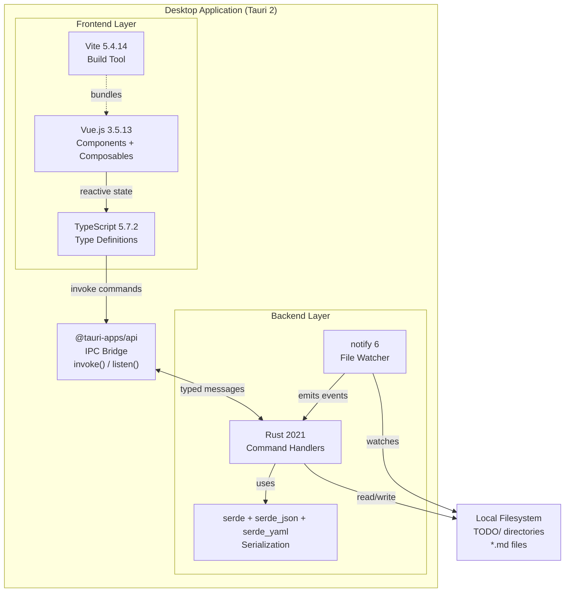
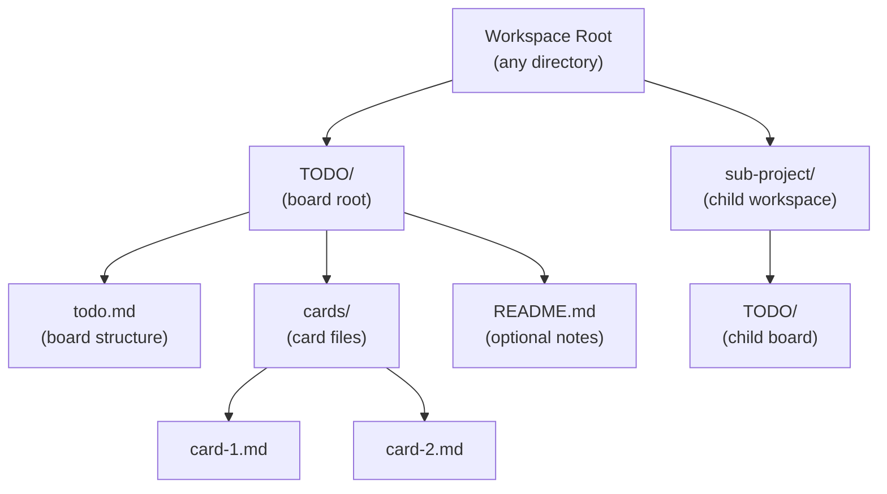
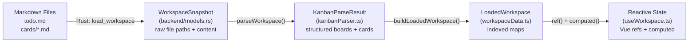
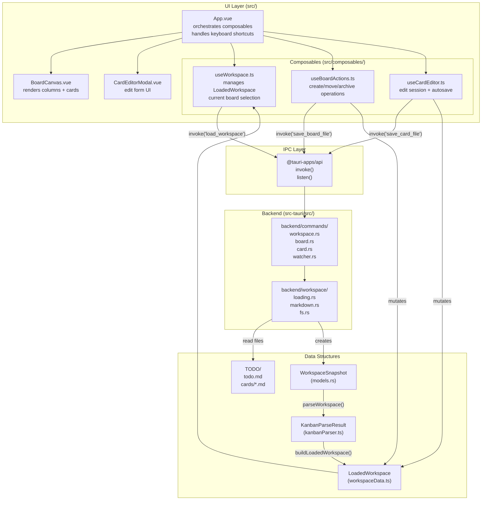

# Overview

Relevant source files

The following files were used as context for generating this wiki page:

- [README.md](../README.md)
- [package.json](../package.json)
- [src-tauri/Cargo.toml](../src-tauri/Cargo.toml)

## Purpose and Scope

This document introduces KanStack, a local-first markdown-based Kanban board desktop application. It explains the application's core purpose, design philosophy, technology stack, and key capabilities. For installation and usage instructions, see [Getting Started](2-getting-started.md). For detailed architectural information, see [Architecture Overview](3-architecture-overview.md).

## What is KanStack?

KanStack is a desktop application for managing Kanban boards stored as markdown files. It reads and writes a `TODO/` directory structure containing `todo.md` board files and individual card files in markdown format. The application provides a graphical interface for viewing and editing these files while maintaining the markdown files as the single source of truth.

The application is built as a desktop-native program using Tauri 2, combining a Vue.js 3 frontend with a Rust backend. All board and card data exists as plain markdown files on the local filesystem—there is no database, no cloud sync, and no proprietary data formats.

**Sources:** [README.md:1-13](../README.md), [package.json:1-29](../package.json), [src-tauri/Cargo.toml:1-27](../src-tauri/Cargo.toml)

## Core Design Philosophy

KanStack follows three fundamental principles:

### Local-First Architecture

All data resides on the user's local filesystem. The application reads from and writes to markdown files in a `TODO/` directory structure. No network requests are made, no external services are required, and the user maintains complete ownership of their data.

### Markdown as Source of Truth

Board structure and card content are stored in human-readable markdown files that follow specific conventions. These files can be edited in any text editor, versioned with git, or processed by other tools. The application parses markdown to build its internal data model and serializes changes back to markdown for persistence.

### Zero Database Dependency

The application maintains no database, cache files, or binary data stores. Application state is derived on-demand from markdown files. The only persistent state outside the workspace is user preferences stored in a `config.md` file in the application's data directory.

**Sources:** [README.md:1-13](../README.md), [README.md:34-56](../README.md)

## Technology Stack

The following table summarizes the core technologies used in KanStack:

| Layer | Technology | Version | Purpose |
|-------|-----------|---------|---------|
| Desktop Framework | Tauri | 2.x | Native desktop application shell |
| Frontend Framework | Vue.js | 3.5.13 | Reactive UI components and state management |
| Frontend Language | TypeScript | 5.7.2 | Type-safe frontend code |
| Frontend Build | Vite | 5.4.14 | Fast development server and bundler |
| Backend Language | Rust | 2021 edition | File I/O, workspace operations, system integration |
| File Watching | notify | 6.x | Filesystem change detection |
| Serialization | serde, serde_json, serde_yaml | 1.x / 0.9 | Data structure serialization |

**KanStack Technology Stack and Communication Flow**

**Sources:** [package.json:15-28](../package.json), [src-tauri/Cargo.toml:8-18](../src-tauri/Cargo.toml)

## Workspace Structure and File Organization

KanStack workspaces follow a conventional directory structure. Each board is represented by a `TODO/` directory containing a `todo.md` file, a `cards/` subdirectory, and an optional `README.md` file.

**Workspace Directory Structure**

### File Responsibilities

| File | Purpose | Content |
|------|---------|---------|
| `todo.md` | Board structure definition | Column definitions, card placement, section organization, sub-board links |
| `cards/*.md` | Individual card content | Card metadata (frontmatter), full description, checklists, notes |
| `README.md` | Board-level documentation | Notes about the board itself (optional) |
| Sub-board `TODO/` | Hierarchical organization | Nested workspaces for project decomposition |

### Key Data Flow: Markdown to Application State

The application transforms markdown files through several stages to build its runtime state:

The reverse flow occurs when the user makes changes: the frontend serializes updated boards back to markdown, invokes Rust commands to write files, and receives an updated `WorkspaceSnapshot` to refresh the UI.

**Sources:** [README.md:34-56](../README.md)

## Core Features

### Board Management

- **Multi-board workspaces**: Open a root `TODO/` directory and navigate to any discovered sub-boards
- **Hierarchical structure**: Organize projects with parent-child board relationships
- **Column and section organization**: Define custom columns with optional sections for grouping cards
- **Sub-board discovery**: Automatically detect nested `TODO/` directories and build board lineage

### Card Operations

- **Full-text editing**: Edit card content in a dedicated modal with live autosave
- **Metadata management**: Track card properties via frontmatter (tags, priorities, timestamps)
- **Wikilink references**: Link cards using `[[card-slug]]` syntax
- **Card movement**: Drag cards between columns and sections, archive to hidden archive column
- **Multi-select operations**: Select multiple cards for batch archiving or movement

### Workspace Features

- **File watching**: Automatic UI updates when markdown files change externally
- **Undo/redo**: Full operation history with snapshot-based rollback
- **Keyboard shortcuts**: Navigate and manipulate boards without mouse interaction
- **No lock-in**: All data remains in standard markdown format, editable in any text editor

**Sources:** [README.md:7-13](../README.md)

## High-Level Application Architecture

The following diagram maps the conceptual system to actual code modules and data structures:

### Component Responsibilities

| Component/Module | Responsibility | Key Types/Functions |
|-----------------|----------------|---------------------|
| `App.vue` | Application orchestrator, keyboard shortcuts, menu integration | Coordinates all composables |
| `useWorkspace.ts` | Workspace state management, board/card selection | `LoadedWorkspace`, `applyWorkspaceMutation()` |
| `useBoardActions.ts` | Board and card mutations | `moveCard()`, `createBoard()`, `archiveCard()` |
| `useCardEditor.ts` | Card editing session management | `openEditor()`, `saveCardContent()` |
| `kanbanParser.ts` | Markdown parsing | `parseWorkspace()`, `KanbanParseResult` |
| `workspace.rs` | Backend workspace operations | `load_workspace()`, `save_board_file()` |
| `loading.rs` | File system snapshot collection | `collect_workspace_snapshot()` |

**Sources:** [README.md:67-75](../README.md)

## Application Lifecycle

A typical user session follows this flow:

1. **Initialization**: User launches the application
2. **Workspace Selection**: User opens a `TODO/` directory via file dialog
3. **Loading**: Backend reads all markdown files and creates `WorkspaceSnapshot`
4. **Parsing**: Frontend parses markdown into structured `KanbanParseResult`
5. **Indexing**: Parser output is indexed into `LoadedWorkspace` with efficient lookup maps
6. **Rendering**: Vue components render the current board based on reactive state
7. **Interaction**: User performs operations (move cards, edit content, create boards)
8. **Persistence**: Operations serialize changes to markdown and invoke backend to write files
9. **Synchronization**: File watcher detects changes and triggers workspace reload

**Sources:** [README.md:14-32](../README.md)

## Relationship to Other Documentation

This overview provides a conceptual introduction to KanStack. For more specific information:

- **Installation and usage**: See [Getting Started](2-getting-started.md)
- **Technical architecture details**: See [Architecture Overview](3-architecture-overview.md)
- **Workspace directory structure**: See [Workspaces and TODO/ Structure](4.1-workspaces-and-todo-structure.md)
- **Markdown format conventions**: See [Markdown Format](4.4-markdown-format.md)
- **Frontend implementation**: See [Frontend Guide](5-frontend-guide.md)
- **Backend implementation**: See [Backend Guide](6-backend-guide.md)
- **Data structure reference**: See [Data Schemas and Types](7-data-schemas-and-types.md)
- **Development setup**: See [Development Guide](8-development-guide.md)
