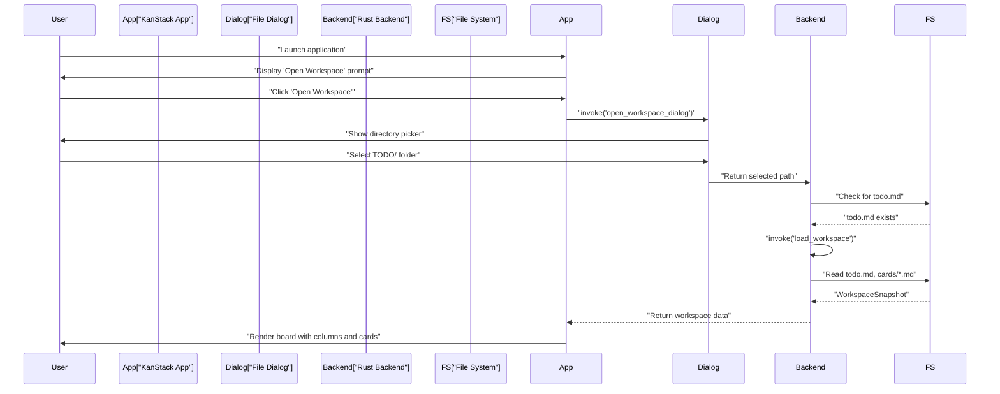
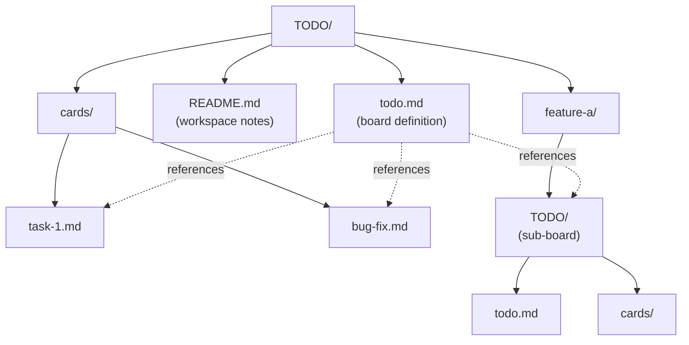
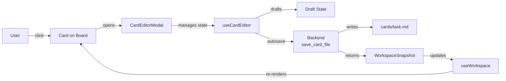

# Getting Started

<details>
<summary>Relevant source files</summary>

The following files were used as context for generating this wiki page:

- [README.md](../README.md)
- [TODO/README.md](../TODO/README.md)
- [package.json](../package.json)

</details>


This guide walks you through installing KanStack, running it for the first time, opening a workspace, and performing basic board and card operations. For architectural details about how the system works internally, see [Architecture Overview](3-architecture-overview.md). For in-depth information about the markdown format and conventions, see [Markdown Format](4.4-markdown-format.md).

---

## Prerequisites

KanStack is a Tauri-based desktop application that requires the following tools installed on your system:

| Tool | Purpose | Minimum Version |
|------|---------|----------------|
| Node.js | Frontend build toolchain | 16.x or higher |
| npm | Package management | 8.x or higher |
| Rust | Backend compilation | Latest stable |
| Tauri CLI | Desktop app framework | 2.x |

The Rust toolchain must include the platform-specific dependencies for Tauri 2. Refer to the [Tauri prerequisites guide](https://tauri.app/v1/guides/getting-started/prerequisites) for platform-specific setup (e.g., WebView2 on Windows, webkit2gtk on Linux).

**Sources:** [README.md:16](../README.md), [package.json:15-28](../package.json)

---

## Installation

Clone the repository and install dependencies:

```bash
git clone https://github.com/KanStack/KanStack.git
cd KanStack
npm install
```

The `npm install` command installs both frontend dependencies (Vue, Vite, TypeScript) and the Tauri CLI. No separate Rust package installation is required—Cargo will fetch Rust dependencies during the first build.

**Sources:** [README.md:18-22](../README.md), [package.json:1-29](../package.json)

---

## Starting the Application

Launch the development build:

```bash
npm run tauri:dev
```

This command:
1. Compiles the Rust backend in `src-tauri/`
2. Starts the Vite dev server for the Vue frontend in `src/`
3. Opens the Tauri window with hot-reload enabled

The first run takes longer as Cargo downloads and compiles Rust dependencies. Subsequent runs are faster due to incremental compilation.

For production builds, use:

```bash
npm run tauri:build
```

This generates platform-specific installers in `src-tauri/target/release/bundle/`.

**Sources:** [package.json:6-13](../package.json), [README.md:24-28](../README.md)

---

## Opening Your First Workspace



### First Launch

When you first launch KanStack, the application checks for a previously opened workspace in its local configuration. If none exists, it displays a prompt to open a workspace.

### Selecting a Workspace

Click **"Open Workspace"** to launch the directory picker. Navigate to a folder containing:

- A `TODO/` directory
- A `todo.md` file inside `TODO/`
- Optionally, a `cards/` subdirectory for card files

The repository includes a sample workspace at `TODO/` that you can use to explore the application:

```bash
# From the repository root
# The app expects you to select the TODO/ folder itself
```

When opening a workspace, KanStack invokes the `load_workspace` command which:
1. Scans the `TODO/` directory for `todo.md` (the root board)
2. Recursively discovers sub-boards by scanning for nested `TODO/` directories
3. Collects all `cards/*.md` files
4. Returns a `WorkspaceSnapshot` to the frontend

**Sources:** [README.md:30-32](../README.md), [README.md:38-54](../README.md)

---

## Understanding the Workspace Structure

Every KanStack workspace follows a specific directory structure:

```
project-root/
  TODO/
    todo.md           # Root board definition
    README.md         # Optional workspace notes
    cards/
      task-1.md       # Individual card files
      task-2.md
      bug-fix.md
    feature-a/
      TODO/           # Sub-board
        todo.md
        cards/
```

### Root Board (`todo.md`)

The `todo.md` file defines the board structure using markdown conventions:

| Element | Syntax | Purpose |
|---------|--------|---------|
| Frontmatter | `---\ntitle: My Board\n---` | Board metadata |
| Settings Block | `%% kanban:settings\n{...}\n%%` | Board configuration (show-archive, show-sub-boards) |
| Columns | `## Backlog`, `## In Progress` | Top-level column headings |
| Sections | `### High Priority` | Optional subdivisions within columns |
| Card Links | `- [[cards/task-1]]` | Wikilink references to card files |
| Sub-Boards | `## Sub Boards\n- [[feature-a/TODO]]` | Links to nested TODO/ directories |

### Card Files (`cards/*.md`)

Each card is a separate markdown file with:

```markdown
---
title: Task Name
type: feature
priority: high
tags: [ui, polish]
assignee: Developer Name
estimate: 3
---

# Task Name

Brief description of the task.

## Spec

Detailed specification...

## Checklist

- [ ] Step 1
- [ ] Step 2
```

Cards support frontmatter metadata (type, priority, tags, etc.) and freeform markdown sections for context, checklists, and notes.

**Sources:** [README.md:36-53](../README.md), [TODO/README.md:29-95](../TODO/README.md), [TODO/README.md:106-178](../TODO/README.md)

---

## Workspace Structure Diagram



**Sources:** [README.md:36-53](../README.md), [TODO/README.md:1-27](../TODO/README.md)

---

## Basic Operations

### Creating a New Card

```mermaid
sequenceDiagram
    participant User
    participant BoardCanvas["BoardCanvas Component"]
    participant useBoardActions["useBoardActions"]
    participant Serialize["serializeBoard"]
    participant Backend["Rust Backend<br/>save_board_file"]
    participant FS["File System"]
    
    User->>BoardCanvas: "Click '+' in column"
    BoardCanvas->>useBoardActions: "createCard(boardSlug, columnSlug)"
    useBoardActions->>useBoardActions: "Generate card slug"
    useBoardActions->>Serialize: "Generate updated todo.md"
    Serialize-->>useBoardActions: "Markdown content"
    useBoardActions->>Backend: "invoke('save_board_file')"
    Backend->>FS: "Write TODO/todo.md"
    FS-->>Backend: "Success"
    Backend->>Backend: "invoke('create_card_file')"
    Backend->>FS: "Write TODO/cards/new-card.md"
    FS-->>Backend: "WorkspaceSnapshot"
    Backend-->>useBoardActions: "Updated snapshot"
    useBoardActions->>BoardCanvas: "Trigger workspace reload"
    BoardCanvas-->>User: "Display new card"
```

To create a card:

1. Navigate to the desired column on the board
2. Click the **"+ New Card"** button or use the keyboard shortcut
3. The application:
   - Generates a unique slug for the card (e.g., `new-card-123`)
   - Updates `todo.md` to add the wikilink in the appropriate column
   - Creates `cards/new-card-123.md` with default frontmatter
   - Reloads the workspace to display the new card

The card is immediately editable—click it to open the card editor modal.

**Sources:** [README.md:42-49](../README.md)

### Moving Cards Between Columns

To move a card:

1. **Drag and drop**: Click and drag a card from one column to another
2. **Keyboard**: Select a card and use keyboard shortcuts to move it

The `useBoardActions` composable handles the move operation:
- Removes the card wikilink from the source column/section
- Inserts it into the target column/section
- Serializes the updated board structure to markdown
- Invokes `save_board_file` to persist changes

The backend writes the updated `todo.md` and returns a fresh `WorkspaceSnapshot`. The frontend applies this snapshot to reactive state, triggering a UI update.

**Sources:** Implied from system architecture diagrams

### Editing Card Content



To edit a card:

1. Click on any card in the board view
2. The `CardEditorModal` component opens, displaying:
   - Title field
   - Type dropdown (task, bug, feature, research, chore)
   - Priority dropdown (low, medium, high)
   - Tags input
   - Assignee field
   - Estimate field
   - Body text area (markdown)
3. Make changes—the editor tracks draft state separately from saved state
4. Click **"Save"** or press `Cmd+S` (macOS) / `Ctrl+S` (Windows/Linux)
5. The `useCardEditor` composable:
   - Serializes the card content to markdown
   - Invokes `save_card_file` on the backend
   - Receives an updated `WorkspaceSnapshot`
   - Updates the workspace state

Changes are persisted immediately to `cards/<slug>.md`. The card file preserves all frontmatter fields and markdown structure.

**Sources:** [TODO/README.md:106-178](../TODO/README.md)

### Managing Columns

Columns are defined by `##` headings in `todo.md`. To add a column:

1. Use the board actions menu
2. Select **"Add Column"**
3. Enter the column name
4. The application:
   - Inserts a new `## Column Name` heading in `todo.md`
   - Serializes the updated board
   - Persists via `save_board_file`

To rename or delete columns, use the column context menu (three-dot icon in the column header). These operations update `todo.md` and preserve all existing card references.

**Sources:** [TODO/README.md:29-38](../TODO/README.md)

### Working with Sub-Boards

Sub-boards are linked in a special `## Sub Boards` section:

```markdown
## Sub Boards

- [[feature-a/TODO|Feature A Board]]
- [[release-planning/TODO|Release Planning]]
```

To attach an existing sub-board:

1. Click **"Attach Existing Board"** in the board actions menu
2. Navigate to the sub-board's `TODO/` directory
3. The application:
   - Adds the relative path as a wikilink in `## Sub Boards`
   - Auto-discovers the parent-child relationship for known boards

Sub-boards inherit the same structure as the root board—each contains its own `todo.md` and `cards/` directory.

**Sources:** [README.md:50-53](../README.md), [TODO/README.md:82-94](../TODO/README.md)

---

## File Structure Example

Here's a minimal working workspace to help you create your own:

```
my-project/
  TODO/
    todo.md
    cards/
      setup-environment.md
```

**`todo.md`:**
```markdown
---
title: My Project Board
---

%% kanban:settings
```json
{
  "show-archive-column": false
}
```
%%

## Backlog

- [[cards/setup-environment]]

## In Progress

## Done
```

**`cards/setup-environment.md`:**
```markdown
---
title: Setup Development Environment
type: task
priority: high
---

# Setup Development Environment

Install all required dependencies.

## Checklist

- [ ] Install Node.js
- [ ] Install Rust
- [ ] Clone repository
- [ ] Run npm install
```

Save these files, then open `my-project/TODO/` in KanStack to see your board.

**Sources:** [TODO/README.md:39-85](../TODO/README.md), [TODO/README.md:114-160](../TODO/README.md)

---

## Next Steps

After completing these basic operations, you can:

- Explore the **board settings** to customize column visibility and sub-board display
- Add **sections within columns** using `###` headings for better organization
- Use **keyboard shortcuts** for rapid card navigation and editing
- Set up **file watching** to sync changes made by external editors

For detailed information on the markdown format and all supported features, see [Markdown Format](4.4-markdown-format.md). To understand how the application architecture enables these operations, see [Architecture Overview](3-architecture-overview.md).

**Sources:** [README.md:1-75](../README.md), [TODO/README.md:1-179](../TODO/README.md)
