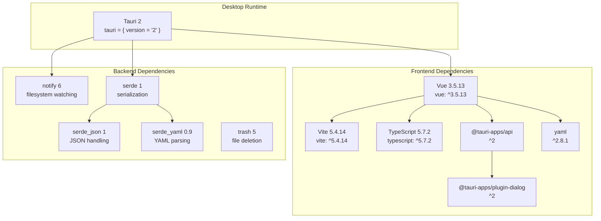
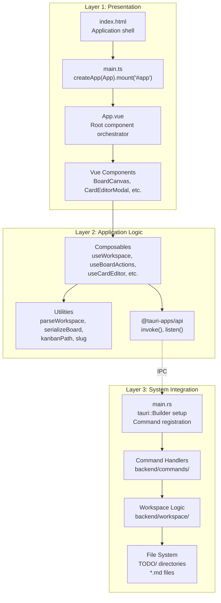
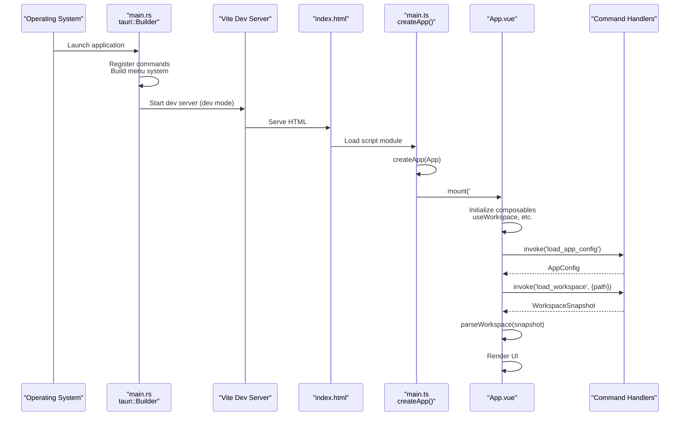
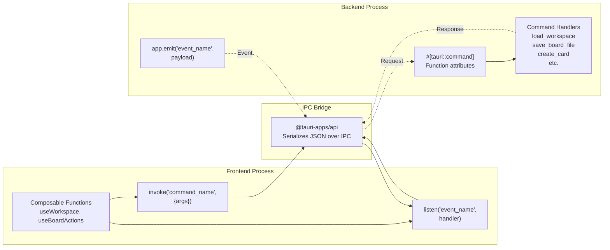
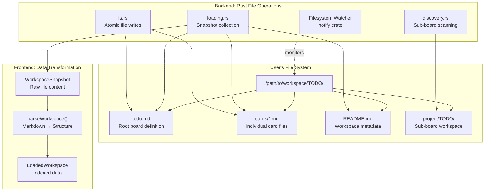
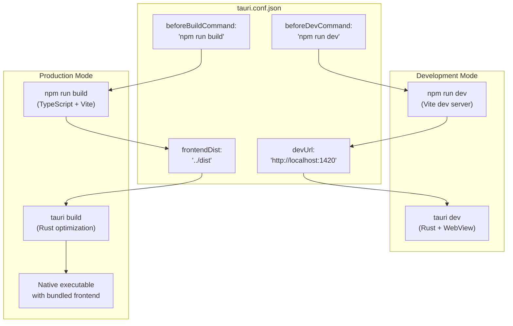

# Architecture Overview

Relevant source files

The following files were used as context for generating this wiki page:

- [index.html](../index.html)
- [package.json](../package.json)
- [src-tauri/Cargo.toml](../src-tauri/Cargo.toml)
- [src-tauri/tauri.conf.json](../src-tauri/tauri.conf.json)
- [src/main.ts](../src/main.ts)

This document provides a high-level overview of KanStack's architecture, explaining how the Tauri desktop application framework combines a Vue.js frontend with a Rust backend to create a local-first, markdown-based Kanban board application. This page covers the core architectural layers, technology stack, inter-process communication patterns, and data flow principles that underpin the entire system.

For detailed information about specific architectural layers, see:
- **Application Structure**: [Application Structure](3.1-application-structure.md) for Tauri configuration and build process
- **Data Model**: [Data Model](3.2-data-model.md) for core data structures and their relationships
- **Frontend Architecture**: [Frontend Architecture](3.3-frontend-architecture.md) for Vue.js component and composable design
- **Backend Architecture**: [Backend Architecture](3.4-backend-architecture.md) for Rust module organization and command handlers

---

## Technology Stack

KanStack is built on a carefully selected set of technologies that enable both rapid development and native desktop performance.

### Dependency Overview

**Technology Stack Dependencies**

| Layer | Technology | Version | Purpose |
|-------|-----------|---------|---------|
| **Framework** | Tauri | 2.x | Desktop application framework |
| **Frontend** | Vue.js | 3.5.13 | Reactive UI framework |
| **Build Tool** | Vite | 5.4.14 | Frontend bundler and dev server |
| **Language** | TypeScript | 5.7.2 | Type-safe frontend code |
| **Backend** | Rust | 2021 Edition | Native backend logic |
| **IPC** | @tauri-apps/api | 2.x | Frontend-backend communication |
| **File Watch** | notify | 6.x | Filesystem change detection |
| **Serialization** | serde | 1.x | Data serialization/deserialization |
| **Data Formats** | serde_json, serde_yaml, yaml | - | JSON and YAML parsing |

**Sources:** [package.json:1-29](../package.json), [src-tauri/Cargo.toml:1-27](../src-tauri/Cargo.toml)

---

## Architectural Layers

KanStack follows a clean three-layer architecture with clear separation of concerns between presentation, application logic, and system integration.

**Layer Responsibilities**

| Layer | Primary Files | Responsibilities |
|-------|--------------|------------------|
| **Presentation** | `index.html`, `src/main.ts`, `src/App.vue`, `src/components/` | UI rendering, user interaction, visual state |
| **Application Logic** | `src/composables/`, `src/utils/` | State management, business logic, data transformation |
| **System Integration** | `src-tauri/src/main.rs`, `src-tauri/src/backend/` | File I/O, OS integration, command handling |

**Sources:** [index.html:1-12](../index.html), [src/main.ts:1-6](../src/main.ts), [src-tauri/tauri.conf.json:1-36](../src-tauri/tauri.conf.json)

---

## Application Lifecycle

The application lifecycle begins with separate initialization sequences for the frontend and backend, which then coordinate through the Tauri IPC bridge.

**Initialization Sequence**

1. **Backend Startup** (src-tauri/src/main.rs): Tauri builder creates application context, registers command handlers, constructs native menu system
2. **Frontend Build** ([src-tauri/tauri.conf.json:6-10](../src-tauri/tauri.conf.json)): Vite bundles TypeScript/Vue code and serves at `http://localhost:1420` (dev) or loads from `dist/` (production)
3. **Vue Bootstrap** ([src/main.ts:1-6](../src/main.ts)): Creates Vue app instance and mounts root component to `#app` element
4. **App Initialization** (src/App.vue): Root component initializes composables, loads persisted config, and establishes workspace state

**Sources:** [src-tauri/tauri.conf.json:1-36](../src-tauri/tauri.conf.json), [index.html:1-12](../index.html), [src/main.ts:1-6](../src/main.ts)

---

## Inter-Process Communication

KanStack uses Tauri's IPC mechanism to enable bidirectional communication between the Vue.js frontend and Rust backend.

### Command Invocation Pattern

All state-mutating operations follow the same invocation pattern:

1. **Frontend Call**: Composable calls `invoke('command_name', { args })`
2. **Serialization**: Arguments serialized to JSON by `@tauri-apps/api`
3. **Backend Execution**: Rust command handler executes with deserialized arguments
4. **Response**: Result serialized back to JSON and returned to frontend
5. **State Update**: Frontend updates reactive state with returned data

### Event Listening Pattern

The backend can push updates to the frontend through events:

1. **Backend Event**: File watcher detects change, calls `app.emit('workspace-changed', snapshot)`
2. **Event Propagation**: Event serialized and sent to frontend
3. **Frontend Handler**: `listen('workspace-changed', handler)` receives event
4. **State Sync**: Handler updates workspace state to reflect changes

**Common Commands and Events**

| Type | Name | Purpose |
|------|------|---------|
| Command | `load_workspace` | Load workspace snapshot from filesystem |
| Command | `save_board_file` | Write board markdown to file |
| Command | `create_card` | Create new card file |
| Command | `watch_workspace` | Start filesystem watcher |
| Event | `workspace-changed` | Notify frontend of external file changes |

**Sources:** [package.json:16](../package.json), [src-tauri/Cargo.toml:16](../src-tauri/Cargo.toml)

---

## Local-First Design

KanStack's architecture is built around the principle of local-first software: all data lives in local markdown files, with no cloud services or databases required.

### File System as Database

### Data Persistence Strategy

**Read Path**:
1. Backend reads all `.md` files in workspace (`backend/workspace/loading.rs`)
2. Files bundled into `WorkspaceSnapshot` with paths and raw content
3. Frontend parses markdown into structured objects (`parseWorkspace`)
4. Parsed data indexed into `LoadedWorkspace` for efficient access

**Write Path**:
1. User action triggers composable function (e.g., `moveCard`)
2. Composable serializes new state to markdown (`serializeBoard`)
3. Backend writes markdown atomically to filesystem (`backend/workspace/fs.rs`)
4. Backend returns updated `WorkspaceSnapshot`
5. Frontend re-parses and updates reactive state

**Synchronization**:
- File watcher (`notify` crate) monitors `TODO/` directory
- External changes trigger `workspace-changed` event
- Frontend reloads workspace to stay synchronized
- No conflict resolution needed (single user, single workspace)

### Benefits of Local-First Architecture

| Benefit | Implementation |
|---------|----------------|
| **No Network Dependency** | All operations execute locally; app works offline |
| **User Data Ownership** | Files live on user's filesystem; can be versioned with Git |
| **Text Editor Compatible** | Users can edit boards/cards in any text editor |
| **Simple Backup** | Standard file backup tools work; no database dumps |
| **Performance** | No network latency; instant reads from local disk |
| **Privacy** | No data sent to external servers; user controls access |

**Sources:** [src-tauri/Cargo.toml:12](../src-tauri/Cargo.toml) (notify dependency), [src-tauri/tauri.conf.json:30-34](../src-tauri/tauri.conf.json) (no network capabilities)

---

## Build and Distribution Configuration

The application build process coordinates both frontend compilation and Rust binary creation through Tauri's build system.

### Build Configuration

**Build Modes**

| Mode | Command | Frontend | Backend | Output |
|------|---------|----------|---------|--------|
| **Development** | `npm run tauri:dev` | Vite dev server at `:1420` | Debug Rust binary | Hot-reloading app |
| **Production** | `npm run tauri:build` | Optimized bundle in `dist/` | Optimized Rust with LTO | Native executable |

**Optimization Settings** ([src-tauri/Cargo.toml:20-26](../src-tauri/Cargo.toml)):
- **Development**: Incremental compilation enabled for faster rebuilds
- **Production**: Optimization level 3, symbol stripping, link-time optimization

**Sources:** [src-tauri/tauri.conf.json:6-10](../src-tauri/tauri.conf.json), [src-tauri/Cargo.toml:20-26](../src-tauri/Cargo.toml), [package.json:6-13](../package.json)

---

## Summary

KanStack's architecture achieves a clean separation between presentation (Vue.js), application logic (composables and utilities), and system integration (Rust backend). The Tauri framework bridges these layers through type-safe IPC, while the local-first design ensures all data lives in markdown files on the user's filesystem. This architecture provides:

- **Simplicity**: No database, no server, just markdown files
- **Performance**: Native Rust backend with reactive Vue frontend
- **Maintainability**: Clear layer boundaries with focused responsibilities
- **Extensibility**: Modular composable architecture for new features

The following child pages provide detailed exploration of each architectural layer:
- [Application Structure](3.1-application-structure.md) - Tauri configuration and integration
- [Data Model](3.2-data-model.md) - Core type system and data structures
- [Frontend Architecture](3.3-frontend-architecture.md) - Vue components and state management
- [Backend Architecture](3.4-backend-architecture.md) - Rust modules and command handlers
