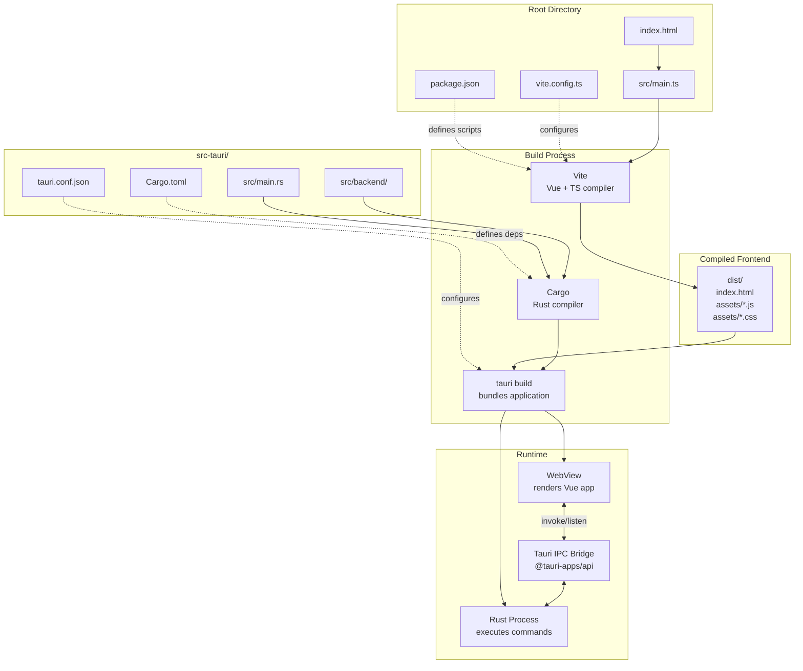
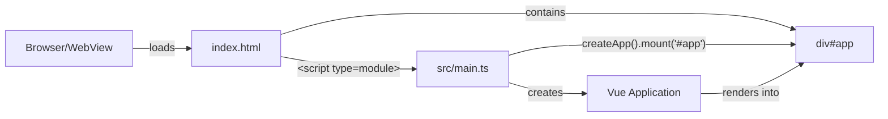
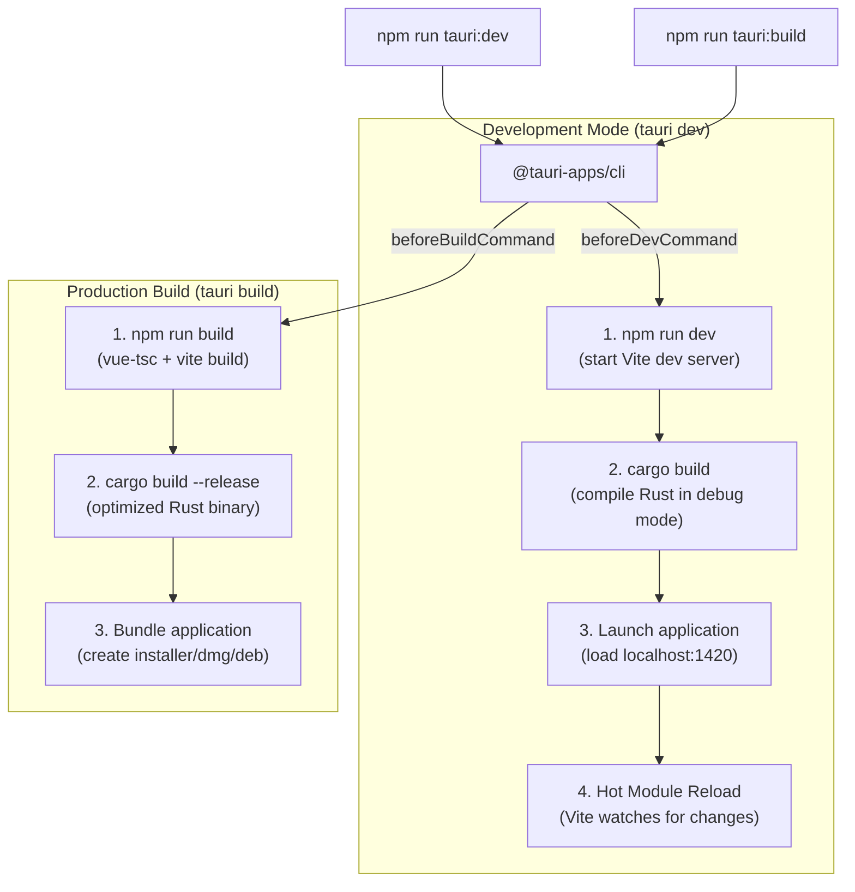

# Application Structure

<details>
<summary>Relevant source files</summary>

The following files were used as context for generating this wiki page:

- [index.html](../index.html)
- [package.json](../package.json)
- [src-tauri/Cargo.toml](../src-tauri/Cargo.toml)
- [src-tauri/tauri.conf.json](../src-tauri/tauri.conf.json)
- [src/main.ts](../src/main.ts)

</details>


This page describes the Tauri application setup, configuration files, build process, and how the frontend and backend integrate. It covers the project structure, dependency management, and the mechanics of how Vue.js and Rust components are unified into a single desktop application.

For details about the data structures used throughout the application, see [Data Model](3.2-data-model.md). For frontend-specific architecture patterns, see [Frontend Architecture](3.3-frontend-architecture.md). For backend module organization, see [Backend Architecture](3.4-backend-architecture.md).

## Tauri Application Model

KanStack is built on Tauri 2, which provides a desktop application shell that embeds a web view for the frontend and executes Rust code for the backend. The two layers communicate through an IPC (Inter-Process Communication) bridge.

### Application Integration Architecture



**Sources:** [package.json:1-29](../package.json), [src-tauri/Cargo.toml:1-27](../src-tauri/Cargo.toml), [src-tauri/tauri.conf.json:1-36](../src-tauri/tauri.conf.json), [index.html:1-12](../index.html), [src/main.ts:1-6](../src/main.ts)

The build process compiles the frontend and backend separately, then Tauri bundles them into a single executable. At runtime, the Rust process creates a window with a web view that loads the compiled Vue application. The `@tauri-apps/api` package provides JavaScript functions that send messages to the Rust backend via IPC.

## Project Configuration Files

KanStack's configuration is split across multiple files that define dependencies, build behavior, and application settings.

| File | Purpose | Key Sections |
|------|---------|--------------|
| `package.json` | Frontend dependencies and npm scripts | `dependencies`, `devDependencies`, `scripts` |
| `src-tauri/Cargo.toml` | Backend dependencies and Rust configuration | `[dependencies]`, `[profile.release]` |
| `src-tauri/tauri.conf.json` | Tauri application settings | `build`, `app`, `bundle` |
| `vite.config.ts` | Vite build configuration (not shown) | TypeScript compilation, asset handling |

### Package Configuration

The `package.json` file defines the frontend as a Vue 3 application with TypeScript support:

```json
{
  "name": "kanstack",
  "version": "0.6.0",
  "type": "module",
  "dependencies": {
    "@tauri-apps/api": "^2",
    "@tauri-apps/plugin-dialog": "^2",
    "vue": "^3.5.13",
    "yaml": "^2.8.1"
  },
  "devDependencies": {
    "@tauri-apps/cli": "^2",
    "@vitejs/plugin-vue": "^5.2.1",
    "typescript": "^5.7.2",
    "vite": "^5.4.14",
    "vitest": "^3.2.4",
    "vue-tsc": "^2.1.10"
  }
}
```

**Key Dependencies:**
- **`@tauri-apps/api`** - Provides `invoke()` and event listener functions for IPC communication
- **`@tauri-apps/plugin-dialog`** - Native file/folder picker dialogs
- **`vue`** - Core Vue 3 framework for reactive UI
- **`yaml`** - YAML parsing for frontmatter in markdown files

**Sources:** [package.json:1-29](../package.json)

### Rust Cargo Configuration

The `Cargo.toml` file defines the backend as a Rust application with Tauri integration:

```toml
[package]
name = "KanStack"
version = "0.6.0"
edition = "2021"

[dependencies]
notify = "6"
serde = { version = "1", features = ["derive"] }
serde_json = "1"
serde_yaml = "0.9"
tauri = { version = "2", features = [] }
tauri-plugin-dialog = "2"
trash = "5"

[profile.release]
opt-level = 3
strip = true
lto = true
```

**Key Dependencies:**
- **`notify`** - File system watcher for detecting external changes to markdown files
- **`serde`** - Serialization framework for converting Rust structs to/from JSON
- **`serde_yaml`** - YAML parsing for card frontmatter
- **`tauri`** - Core Tauri framework for desktop app functionality
- **`trash`** - Cross-platform file deletion (moves to system trash)

The release profile is optimized for production builds with level 3 optimization, stripped symbols, and link-time optimization (LTO).

**Sources:** [src-tauri/Cargo.toml:1-27](../src-tauri/Cargo.toml)

### Tauri Application Configuration

The `tauri.conf.json` file configures application metadata, build behavior, and window settings:

| Section | Configuration | Description |
|---------|---------------|-------------|
| **`productName`** | `"KanStack"` | Application name shown in system |
| **`version`** | `"0.6.0"` | Application version (must match package.json) |
| **`identifier`** | `"com.kanstack.app"` | Unique bundle identifier |
| **`build.beforeDevCommand`** | `"npm run dev"` | Starts Vite dev server before launching Tauri |
| **`build.beforeBuildCommand`** | `"npm run build"` | Compiles frontend before bundling |
| **`build.devUrl`** | `"http://localhost:1420"` | URL Tauri loads in development mode |
| **`build.frontendDist`** | `"../dist"` | Path to compiled frontend assets |
| **`app.windows[0].width`** | `1440` | Default window width |
| **`app.windows[0].height`** | `920` | Default window height |
| **`app.windows[0].maximized`** | `true` | Window starts maximized |
| **`bundle.resources`** | `{"./Credits.html": ...}` | Additional files to bundle |

The window configuration at [src-tauri/tauri.conf.json:13-23](../src-tauri/tauri.conf.json) defines a single main window labeled `"main"` with no title (title is set programmatically from workspace name).

**Sources:** [src-tauri/tauri.conf.json:1-36](../src-tauri/tauri.conf.json)

## Frontend Entry Points

The frontend consists of a standard HTML entry point that loads the Vue application via TypeScript.

### HTML Entry Point



The `index.html` file at [index.html:1-12](../index.html) is minimal, containing only:
- A `<div id="app"></div>` mount point
- A module script tag loading `src/main.ts`
- Basic meta tags for charset and viewport

**Sources:** [index.html:1-12](../index.html)

### Vue Application Bootstrap

The `src/main.ts` file at [src/main.ts:1-6](../src/main.ts) is the JavaScript entry point:

```typescript
import { createApp } from 'vue'
import App from './App.vue'
import './style.css'

createApp(App).mount('#app')
```

This file:
1. Imports Vue's `createApp` factory function
2. Imports the root `App.vue` component
3. Imports global CSS styles
4. Creates a Vue application instance with `App.vue` as the root component
5. Mounts the application to the `#app` div

The `App.vue` component (not shown in provided files) serves as the orchestrator for all composables and components. See [Main Application Component](5.1-main-application-component.md) for details.

**Sources:** [src/main.ts:1-6](../src/main.ts)

## Build Process and Scripts

The application uses npm scripts to coordinate frontend and backend builds through Tauri's CLI.

### Build Script Flow



**Sources:** [package.json:6-13](../package.json), [src-tauri/tauri.conf.json:6-10](../src-tauri/tauri.conf.json)

### Available Scripts

| Script | Command | Purpose |
|--------|---------|---------|
| `npm run dev` | `vite` | Start Vite dev server (frontend only) |
| `npm run build` | `vue-tsc --noEmit && vite build` | Type-check and compile frontend to `dist/` |
| `npm run test` | `vitest run` | Run frontend unit tests |
| `npm run preview` | `vite preview` | Preview production build locally |
| `npm run tauri:dev` | `tauri dev` | Launch full application in development mode |
| `npm run tauri:build` | `tauri build` | Build production application bundle |

The `tauri dev` command at [package.json:12](../package.json) automatically executes `beforeDevCommand` from [src-tauri/tauri.conf.json:7](../src-tauri/tauri.conf.json), which starts the Vite dev server. Similarly, `tauri build` at [package.json:13](../package.json) executes `beforeBuildCommand` at [src-tauri/tauri.conf.json:8](../src-tauri/tauri.conf.json), which compiles the frontend before bundling.

**Sources:** [package.json:6-13](../package.json)

### TypeScript Compilation

The frontend uses TypeScript 5.7.2 with `vue-tsc` for type checking. The `vite build` command at [package.json:8](../package.json) performs two steps:

1. **Type Checking**: `vue-tsc --noEmit` validates TypeScript types without emitting files
2. **Bundling**: `vite build` compiles and bundles all Vue components, TypeScript files, and assets into the `dist/` directory

Vite handles:
- Vue Single File Component (`.vue`) compilation
- TypeScript to JavaScript transpilation
- CSS processing and extraction
- Asset optimization and hashing
- Code splitting and tree shaking

**Sources:** [package.json:8](../package.json), [package.json:24-27](../package.json)

## Development vs Production Modes

### Development Mode

In development mode (`npm run tauri:dev`):

1. Vite runs a dev server on `http://localhost:1420` with hot module reload
2. Rust is compiled in debug mode with `incremental = true` ([src-tauri/Cargo.toml:21](../src-tauri/Cargo.toml))
3. The Tauri window loads from the dev server URL
4. Frontend changes trigger instant HMR updates
5. Backend changes trigger Rust recompilation and app restart
6. Source maps are included for debugging

### Production Mode

In production mode (`npm run tauri:build`):

1. Vue components are compiled to optimized JavaScript bundles
2. Rust is compiled in release mode with optimizations ([src-tauri/Cargo.toml:23-26](../src-tauri/Cargo.toml)):
   - `opt-level = 3` - Maximum optimization
   - `strip = true` - Remove debug symbols
   - `lto = true` - Link-time optimization
3. The Tauri window loads from the `dist/` directory
4. All assets are minified and tree-shaken
5. The final binary is significantly smaller and faster

**Sources:** [src-tauri/tauri.conf.json:6-10](../src-tauri/tauri.conf.json), [src-tauri/Cargo.toml:20-26](../src-tauri/Cargo.toml)

## Backend Entry Point

While `src-tauri/src/main.rs` is not included in the provided files, it serves as the Rust application entry point. Based on the Tauri architecture, this file:

1. Defines all Tauri command handlers (functions callable from frontend)
2. Registers commands with the Tauri runtime
3. Constructs the application menu system
4. Initializes the main window
5. Sets up event handlers for menu actions

For detailed information about the backend entry point and menu system, see [Main Entry Point and Menu System](6.1-main-entry-point-and-menu-system.md). For command handler organization, see [Command Handlers](6.2-command-handlers.md).

## IPC Bridge Integration

The frontend communicates with the backend through the `@tauri-apps/api` package, which provides:

### Command Invocation

```typescript
import { invoke } from '@tauri-apps/api/core'

// Call a Rust command handler
const result = await invoke('command_name', { arg1: value1, arg2: value2 })
```

Commands are registered in `main.rs` and can be called from any Vue component or composable. All command arguments and return values are serialized via `serde_json`.

### Event Listening

```typescript
import { listen } from '@tauri-apps/api/event'

// Listen for events emitted by the backend
const unlisten = await listen('event-name', (event) => {
  console.log('Received:', event.payload)
})
```

The backend can emit events (e.g., `workspace-changed` when files are modified externally) that the frontend listens for to update its state.

### Plugin APIs

```typescript
import { open } from '@tauri-apps/plugin-dialog'

// Use native dialog plugin
const selected = await open({
  directory: true,
  multiple: false
})
```

The `@tauri-apps/plugin-dialog` dependency at [package.json:17](../package.json) provides access to native file picker dialogs, used for workspace selection.

**Sources:** [package.json:15-19](../package.json)

## Version Synchronization

The application version is maintained in three locations and must be kept synchronized:

| File | Location | Current Version |
|------|----------|-----------------|
| `package.json` | [package.json:4](../package.json) | `0.6.0` |
| `Cargo.toml` | [src-tauri/Cargo.toml:3](../src-tauri/Cargo.toml) | `0.6.0` |
| `tauri.conf.json` | [src-tauri/tauri.conf.json:4](../src-tauri/tauri.conf.json) | `0.6.0` |

All three files currently specify version `0.6.0`. When releasing a new version, all three must be updated together to maintain consistency across the frontend package, backend binary, and bundled application.

**Sources:** [package.json:4](../package.json), [src-tauri/Cargo.toml:3](../src-tauri/Cargo.toml), [src-tauri/tauri.conf.json:4](../src-tauri/tauri.conf.json)
