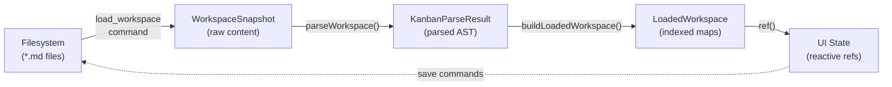
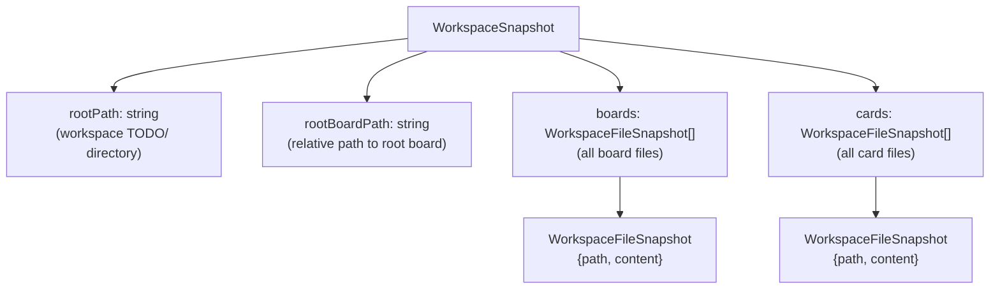
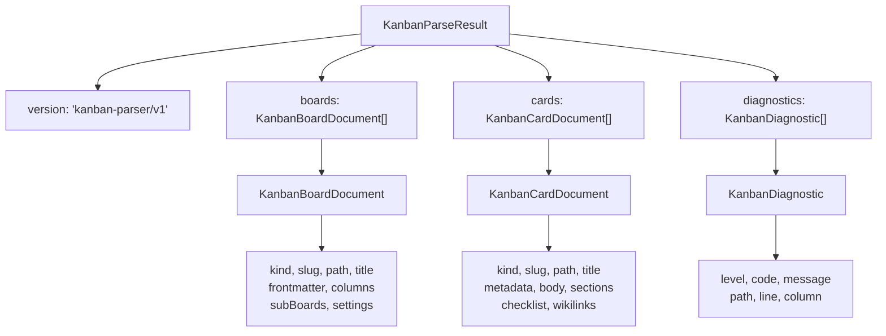
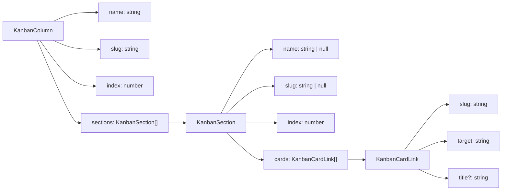
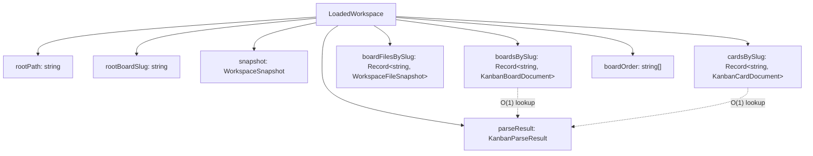
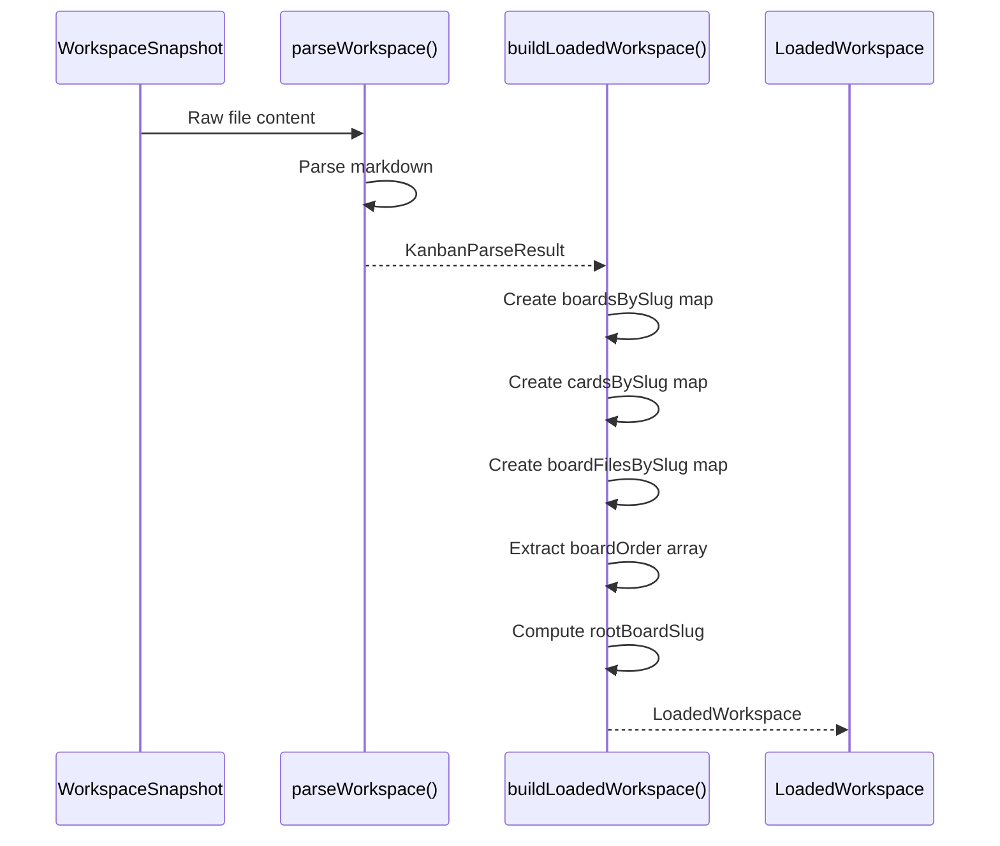
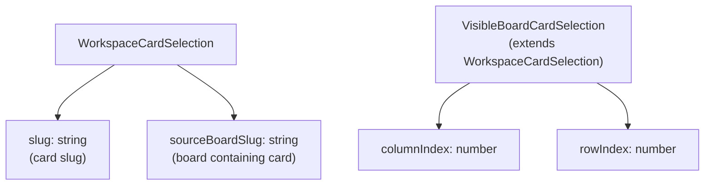
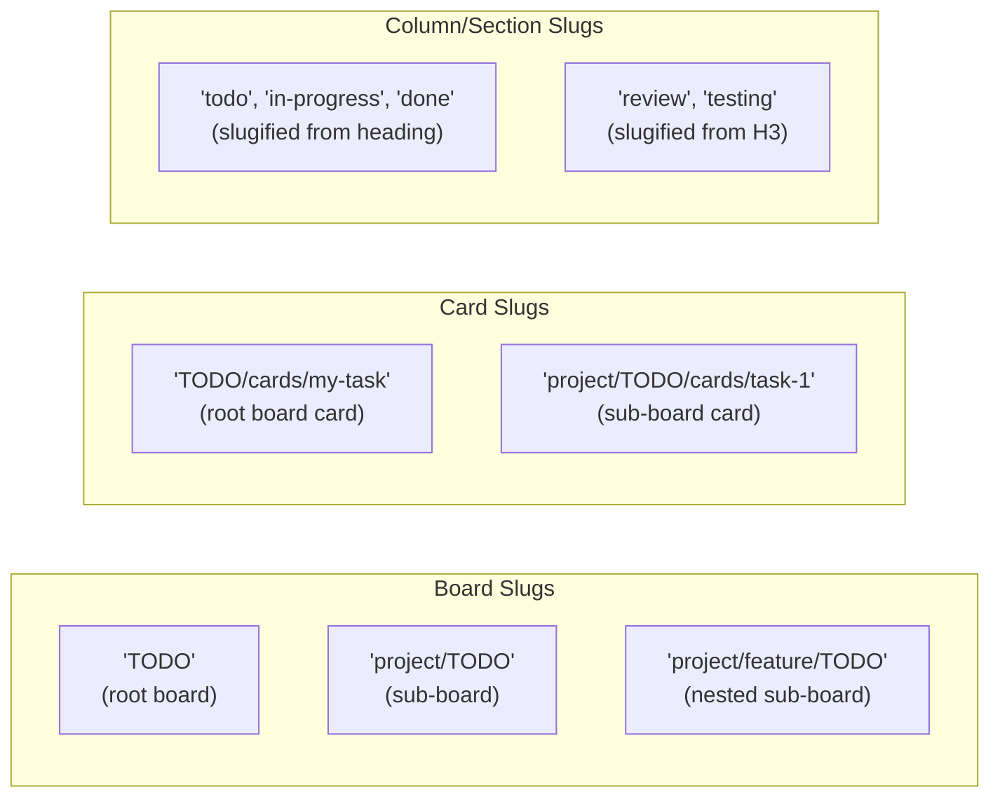
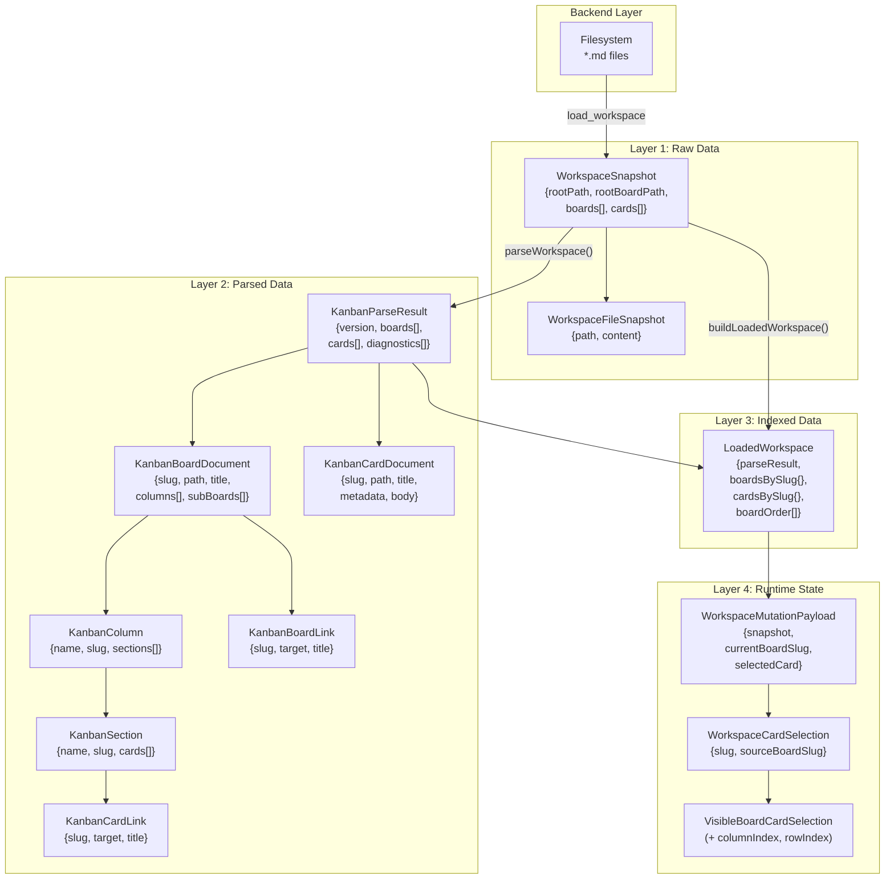
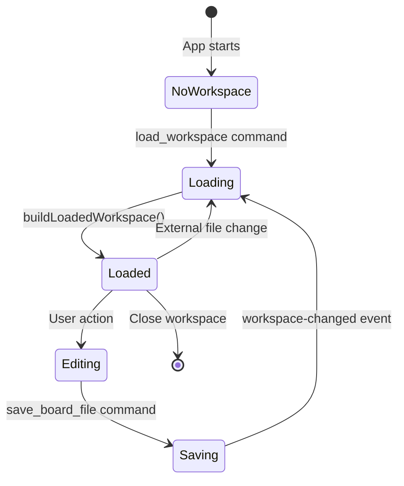

# Data Model

<details>
<summary>Relevant source files</summary>

The following files were used as context for generating this wiki page:

- [docs/schemas/kanban-parser-schema.ts](../docs/schemas/kanban-parser-schema.ts)
- [src/types/workspace.ts](../src/types/workspace.ts)
- [src/utils/boardMarkdown.test.ts](../src/utils/boardMarkdown.test.ts)
- [src/utils/kanbanPath.ts](../src/utils/kanbanPath.ts)
- [src/utils/workspaceSnapshot.ts](../src/utils/workspaceSnapshot.ts)

</details>


This document describes the core data structures used throughout KanStack and how they relate to each other. The data model is organized into four distinct layers, each serving a specific purpose in the data transformation pipeline from filesystem to UI.

For information about how this data is parsed from markdown, see [Workspace Parsing](#5.4.1). For details on how data is serialized back to markdown, see [Board and Card Serialization](#5.4.2). For backend data handling, see [Workspace Operations](6.3-workspace-operations.md).

---

## Data Model Overview

KanStack's data model follows a layered architecture where each layer transforms and enriches data from the previous layer. This separation ensures clear responsibilities and makes the codebase maintainable and testable.

### The Four Layers

| Layer | Primary Type | Purpose | Location |
|-------|-------------|---------|----------|
| **Raw Data** | `WorkspaceSnapshot` | File content from backend | Rust → TypeScript boundary |
| **Parsed Data** | `KanbanParseResult` | Structured markdown AST | Frontend parsing utilities |
| **Indexed Data** | `LoadedWorkspace` | Fast lookup maps and caches | Frontend workspace state |
| **Runtime State** | Various UI types | Selection, mutations, transient UI state | Frontend composables |

**Data Flow Pipeline:**



**Sources:** [src/types/workspace.ts:1-41](../src/types/workspace.ts), [docs/schemas/kanban-parser-schema.ts:12-17](../docs/schemas/kanban-parser-schema.ts), [src/utils/workspaceSnapshot.ts:5-27](../src/utils/workspaceSnapshot.ts)

---

## Layer 1: WorkspaceSnapshot (Raw Data)

`WorkspaceSnapshot` represents the raw file content returned from the Rust backend. This is the unprocessed data layer that serves as input to the parsing pipeline.

### WorkspaceSnapshot Structure



### Type Definitions

The `WorkspaceFileSnapshot` interface is a simple container for file data:

```typescript
WorkspaceFileSnapshot {
  path: string      // Relative path from rootPath
  content: string   // Raw markdown content
}
```

The complete `WorkspaceSnapshot` interface:

```typescript
WorkspaceSnapshot {
  rootPath: string              // Absolute workspace root
  rootBoardPath: string         // Root board file path
  boards: WorkspaceFileSnapshot[]   // All board files
  cards: WorkspaceFileSnapshot[]    // All card files
}
```

### Key Characteristics

- **No parsing**: Content is stored as raw strings
- **Complete snapshot**: Contains all files in the workspace at a point in time
- **Backend-produced**: Created by Rust file system operations
- **Serializable**: Can be stringified for undo/redo snapshots
- **Immutable**: Once created, snapshots are never modified in-place

**Sources:** [src/types/workspace.ts:3-13](../src/types/workspace.ts), [src/utils/workspaceSnapshot.ts:29-35](../src/utils/workspaceSnapshot.ts)

---

## Layer 2: KanbanParseResult (Parsed Data)

`KanbanParseResult` is the output of parsing markdown files into structured TypeScript objects. This layer understands the markdown format conventions and produces a typed AST representation.

### KanbanParseResult Structure



### KanbanBoardDocument

A `KanbanBoardDocument` represents a parsed board file with its complete structure:

| Field | Type | Description |
|-------|------|-------------|
| `kind` | `"board"` | Discriminator for union types |
| `slug` | `string` | Unique board identifier (e.g., `"TODO"`, `"project/TODO"`) |
| `path` | `string` | Relative path to board file |
| `title` | `string` | Board title from frontmatter or H1 |
| `frontmatter` | `MarkdownRecord` | YAML frontmatter as key-value pairs |
| `columns` | `KanbanColumn[]` | Board columns (H2 headings) |
| `subBoards` | `KanbanBoardLink[]` | Sub-board links from "Sub Boards" section |
| `settings` | `KanbanBoardSettings \| null` | Parsed settings from `%% kanban:settings %%` |
| `diagnostics` | `KanbanDiagnostic[]` | Parsing warnings/errors for this board |

**Column Structure:**



A `KanbanColumn` represents a column (H2 heading) in the board. Each column contains one or more `KanbanSection` objects (H3 headings or null for default section). Sections contain `KanbanCardLink` objects representing wikilinks to cards.

### KanbanCardDocument

A `KanbanCardDocument` represents a parsed card file:

| Field | Type | Description |
|-------|------|-------------|
| `kind` | `"card"` | Discriminator for union types |
| `slug` | `string` | Unique card identifier (e.g., `"TODO/cards/my-task"`) |
| `path` | `string` | Relative path to card file |
| `title` | `string` | Card title from frontmatter or H1 |
| `metadata` | `KanbanCardMetadata` | Structured metadata fields |
| `body` | `string` | Main card content (markdown) |
| `sections` | `KanbanCardSection[]` | Additional sections (H2+ headings) |
| `checklist` | `KanbanChecklistItem[]` | All checklist items in the card |
| `wikilinks` | `string[]` | All wikilink targets in the card |
| `diagnostics` | `KanbanDiagnostic[]` | Parsing warnings/errors for this card |

**Card Metadata Fields:**

| Field | Type | Description |
|-------|------|-------------|
| `type` | `"task" \| "bug" \| "feature" \| "research" \| "chore"` | Card type classification |
| `priority` | `"low" \| "medium" \| "high"` | Priority level |
| `tags` | `string[]` | Arbitrary tags |
| `assignee` | `string` | Primary assignee |
| `owners` | `string[]` | Card owners |
| `due` | `string` | Due date (ISO format) |
| `estimate` | `number` | Time estimate |
| `blocked_by` | `string[]` | Blocking card slugs |
| `blocks` | `string[]` | Blocked card slugs |
| `related` | `string[]` | Related card slugs |
| `scheduled` | `string` | Scheduled start date |
| `started` | `string` | Actual start date |
| `completed` | `string` | Completion date |
| `template` | `string` | Template to use when creating card |

**Sources:** [docs/schemas/kanban-parser-schema.ts:12-127](../docs/schemas/kanban-parser-schema.ts)

---

## Layer 3: LoadedWorkspace (Indexed Data)

`LoadedWorkspace` wraps a `KanbanParseResult` with indexed maps for efficient lookups. This layer optimizes data access patterns used by the UI.

### LoadedWorkspace Structure



### Type Definition

```typescript
LoadedWorkspace {
  rootPath: string
  rootBoardSlug: string
  snapshot: WorkspaceSnapshot
  parseResult: KanbanParseResult
  boardsBySlug: Record<string, KanbanBoardDocument>
  boardFilesBySlug: Record<string, WorkspaceFileSnapshot>
  cardsBySlug: Record<string, KanbanCardDocument>
  boardOrder: string[]
}
```

### Construction Process

The `buildLoadedWorkspace()` function creates a `LoadedWorkspace` from a `WorkspaceSnapshot`:



### Key Benefits

- **Fast lookups**: O(1) access to boards and cards by slug
- **Preserves raw data**: Retains both snapshot and parseResult
- **Maintains order**: `boardOrder` array preserves board sequence
- **File access**: `boardFilesBySlug` provides raw content access
- **Root identification**: `rootBoardSlug` identifies the workspace root board

**Sources:** [src/types/workspace.ts:31-40](../src/types/workspace.ts), [src/utils/workspaceSnapshot.ts:5-27](../src/utils/workspaceSnapshot.ts)

---

## Layer 4: Runtime State and Mutations

The runtime layer consists of transient UI state that is not persisted. This includes selection state, edit sessions, and mutation payloads.

### WorkspaceMutationPayload

Used to update workspace state after backend operations:

```typescript
WorkspaceMutationPayload {
  currentBoardSlug?: string | null
  selectedCard?: WorkspaceCardSelection | null
  snapshot: WorkspaceSnapshot
}
```

This payload contains:
- **Updated snapshot**: The new workspace state from backend
- **Navigation intent**: Optional board to navigate to
- **Selection intent**: Optional card to select

### Selection Types



**WorkspaceCardSelection:**
- Identifies a card within a board
- Used for backend operations and state persistence
- Fields: `slug`, `sourceBoardSlug`

**VisibleBoardCardSelection:**
- Extends `WorkspaceCardSelection` with visual position
- Used for keyboard navigation and multi-select
- Additional fields: `columnIndex`, `rowIndex`

**Sources:** [src/types/workspace.ts:15-29](../src/types/workspace.ts)

---

## Slug and Path Resolution System

Slugs and paths are the primary identifiers in KanStack's data model. Understanding their structure is essential for working with the codebase.

### Slug Types



### Path to Slug Conversion

| Input | Function | Output |
|-------|----------|--------|
| `TODO/todo.md` | `boardIdFromBoardPath()` | `"TODO"` |
| `project/TODO/todo.md` | `boardIdFromBoardPath()` | `"project/TODO"` |
| `TODO/cards/task.md` | `cardIdFromCardPath()` | `"TODO/cards/task"` |
| `"In Progress"` | `slugifySegment()` | `"in-progress"` |

### Slug Structure Rules

1. **Board slugs** are derived from their TODO directory path (without `todo.md`)
2. **Card slugs** include the board slug prefix and cards directory
3. **Column/section slugs** are generated by lowercasing and replacing non-alphanumeric characters with hyphens
4. **Relative paths** are normalized to prevent directory traversal

### Key Functions

| Function | Purpose | Example |
|----------|---------|---------|
| `boardIdFromBoardPath(path)` | Extract board slug from file path | `"project/TODO/todo.md"` → `"project/TODO"` |
| `cardIdFromCardPath(path)` | Extract card slug from file path | `"TODO/cards/task.md"` → `"TODO/cards/task"` |
| `slugifySegment(text)` | Convert text to URL-safe slug | `"In Progress"` → `"in-progress"` |
| `normalizeRelativePath(path)` | Normalize path, resolve `..` | `"a/./b/../c"` → `"a/c"` |
| `resolveBoardTargetPath(board, target)` | Resolve sub-board wikilink | Resolves relative sub-board paths |
| `resolveCardTargetId(board, target)` | Resolve card wikilink | Resolves card references to full slugs |

**Sources:** [src/utils/kanbanPath.ts:1-164](../src/utils/kanbanPath.ts)

---

## Complete Type Hierarchy

This diagram shows how all major types relate to each other in the complete data model:



### Data Model State Machine



**Sources:** [src/types/workspace.ts:1-41](../src/types/workspace.ts), [docs/schemas/kanban-parser-schema.ts:1-127](../docs/schemas/kanban-parser-schema.ts), [src/utils/workspaceSnapshot.ts:1-36](../src/utils/workspaceSnapshot.ts)

---

## Example Data Flow

This example shows how data transforms through all layers when opening a workspace:

### Stage 1: Backend Returns Raw Data

```typescript
WorkspaceSnapshot {
  rootPath: "/Users/alice/projects/TODO",
  rootBoardPath: "TODO/todo.md",
  boards: [
    {
      path: "TODO/todo.md",
      content: "---\ntitle: Main\n---\n\n## Todo\n\n- [[cards/task-1]]"
    }
  ],
  cards: [
    {
      path: "TODO/cards/task-1.md",
      content: "---\ntitle: Fix bug\ntype: bug\n---\n\nDescription here"
    }
  ]
}
```

### Stage 2: Parser Produces Structured Data

```typescript
KanbanParseResult {
  version: "kanban-parser/v1",
  boards: [
    {
      kind: "board",
      slug: "TODO",
      path: "TODO/todo.md",
      title: "Main",
      columns: [
        {
          name: "Todo",
          slug: "todo",
          index: 0,
          sections: [
            {
              name: null,
              slug: null,
              index: 0,
              cards: [
                { slug: "TODO/cards/task-1", target: "cards/task-1" }
              ]
            }
          ]
        }
      ],
      ...
    }
  ],
  cards: [
    {
      kind: "card",
      slug: "TODO/cards/task-1",
      path: "TODO/cards/task-1.md",
      title: "Fix bug",
      metadata: { type: "bug", title: "Fix bug" },
      body: "Description here",
      ...
    }
  ],
  diagnostics: []
}
```

### Stage 3: Workspace Indexing

```typescript
LoadedWorkspace {
  rootPath: "/Users/alice/projects/TODO",
  rootBoardSlug: "TODO",
  snapshot: { /* WorkspaceSnapshot from Stage 1 */ },
  parseResult: { /* KanbanParseResult from Stage 2 */ },
  boardsBySlug: {
    "TODO": { /* KanbanBoardDocument */ }
  },
  cardsBySlug: {
    "TODO/cards/task-1": { /* KanbanCardDocument */ }
  },
  boardOrder: ["TODO"]
}
```

### Stage 4: UI Access

```typescript
// Fast O(1) lookups
const board = workspace.boardsBySlug["TODO"]
const card = workspace.cardsBySlug["TODO/cards/task-1"]
const column = board.columns[0]
const section = column.sections[0]
```

**Sources:** [src/utils/workspaceSnapshot.ts:5-27](../src/utils/workspaceSnapshot.ts), src/utils/parseWorkspace.ts (referenced but not provided), [src/types/workspace.ts:31-40](../src/types/workspace.ts)

---

## Summary

The KanStack data model is designed as a four-layer transformation pipeline:

1. **WorkspaceSnapshot**: Raw file content from the Rust backend
2. **KanbanParseResult**: Structured markdown AST with type safety
3. **LoadedWorkspace**: Indexed maps for efficient UI access
4. **Runtime State**: Transient selection and mutation state

This architecture provides:
- **Clear separation of concerns**: Each layer has a single responsibility
- **Type safety**: TypeScript types throughout the stack
- **Testability**: Pure functions for transformation between layers
- **Performance**: O(1) lookups via indexed maps
- **Debuggability**: Each layer can be inspected independently
- **Undo/redo support**: Snapshot-based state management

The slug-based identification system provides a consistent way to reference boards and cards across the application, while the layered architecture ensures data flows predictably from filesystem to UI and back.
