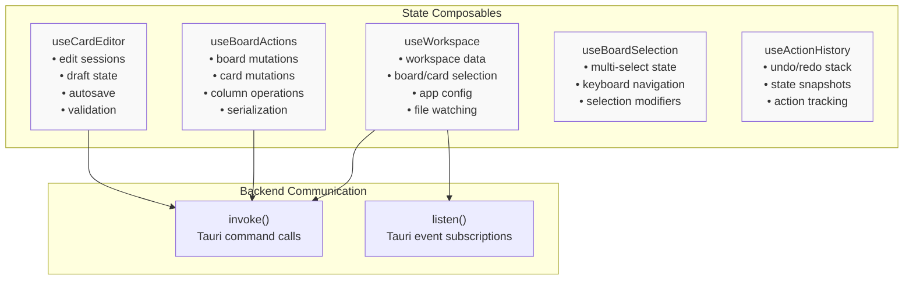
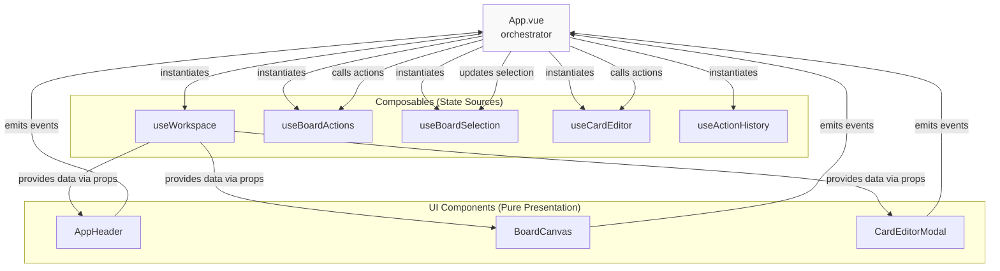
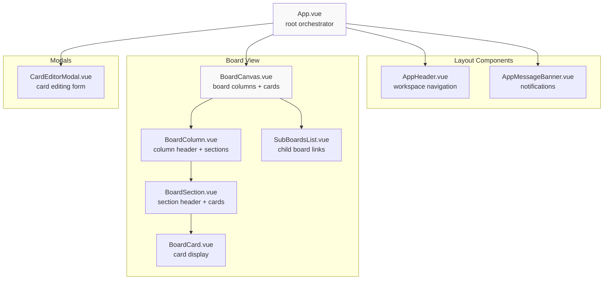
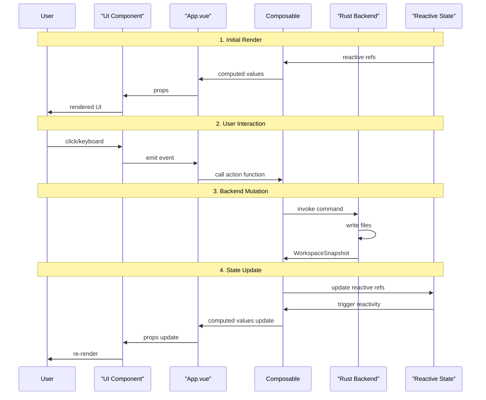
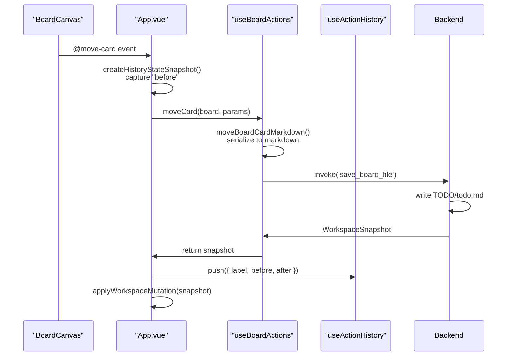
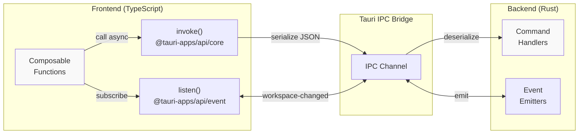

# Frontend Architecture

<details>
<summary>Relevant source files</summary>

The following files were used as context for generating this wiki page:

- [src/App.vue](../src/App.vue)
- [src/composables/useBoardActions.ts](../src/composables/useBoardActions.ts)
- [src/composables/useWorkspace.ts](../src/composables/useWorkspace.ts)

</details>


This document describes the high-level architecture of the Vue.js frontend, including its composable-based state management approach, component organization, and data flow patterns. For detailed information about the Tauri application setup and build configuration, see [Application Structure](3.1-application-structure.md). For reference documentation on core data structures, see [Data Model](3.2-data-model.md). For comprehensive guides to individual composables and components, see [Frontend Guide](5-frontend-guide.md).

## Technology Stack

The frontend is built with the following core technologies:

| Technology | Version | Purpose |
|------------|---------|---------|
| Vue.js | 3.5.13 | Reactive UI framework |
| TypeScript | 5.7.2 | Type-safe application code |
| Vite | 5.4.14 | Build tool and dev server |
| Tauri API | 2.x | IPC bridge to Rust backend |

The frontend follows Vue 3's Composition API exclusively, using `<script setup>` syntax throughout. All state is managed through composable functions that encapsulate specific domains of application logic.

**Sources:** package.json, Diagram 1 from high-level architecture

## Composable-Based State Management

### Architecture Overview

KanStack's frontend state is managed entirely through composable functions, avoiding centralized state stores like Vuex or Pinia. This architecture separates concerns by domain, with each composable responsible for a specific aspect of the application.

**Composable Functions and Responsibilities**



**Sources:** [src/App.vue:10-16](../src/App.vue), [src/App.vue:29-52](../src/App.vue), [src/App.vue:54-59](../src/App.vue), [src/App.vue:60](../src/App.vue), [src/App.vue:64](../src/App.vue)

### Composable Responsibilities

| Composable | Primary Responsibility | Key State | File |
|------------|----------------------|-----------|------|
| `useWorkspace` | Workspace lifecycle, board/card selection, app config | `workspace`, `currentBoard`, `selectedCard`, `appConfig` | src/composables/useWorkspace.ts |
| `useBoardActions` | Board and card mutations, column management | Loading states for operations | src/composables/useBoardActions.ts |
| `useCardEditor` | Card editing sessions, autosave, validation | `editSession`, `draftContent`, `saveStatus` | src/composables/useCardEditor.ts |
| `useBoardSelection` | Multi-card selection, keyboard navigation | `selectedCards`, `selectedKeys`, `visibleCards` | src/composables/useBoardSelection.ts |
| `useActionHistory` | Undo/redo functionality, snapshot management | `undoStack`, `redoStack` | src/history/useActionHistory.ts |

**Sources:** [src/composables/useWorkspace.ts:41-555](../src/composables/useWorkspace.ts), [src/composables/useBoardActions.ts:50-434](../src/composables/useBoardActions.ts)

## App.vue as Orchestrator

The root `App.vue` component serves as the application orchestrator, coordinating interactions between composables and UI components. It does not implement business logic directly—instead, it delegates to composables and passes data to child components through props.

**App.vue State Orchestration**



**Key Orchestration Patterns:**

1. **Composable Instantiation**: App.vue instantiates all composables at the top level ([src/App.vue:29-64](../src/App.vue))
2. **Data Flow**: State flows from composables → App.vue → child components via props ([src/App.vue:1542-1580](../src/App.vue))
3. **Event Handling**: UI events flow from components → App.vue → composable actions ([src/App.vue:229-262](../src/App.vue), [src/App.vue:531-541](../src/App.vue))
4. **Global Events**: Keyboard shortcuts and menu actions are handled centrally ([src/App.vue:912-1108](../src/App.vue), [src/App.vue:1135-1201](../src/App.vue))

**Sources:** [src/App.vue:1-1537](../src/App.vue)

## Component Hierarchy

The frontend uses a shallow component hierarchy, with most components being direct children of `App.vue`. This simplifies data flow and avoids prop drilling.

**Component Tree Structure**



**Component Responsibilities:**

- **App.vue**: State orchestration, event handling, keyboard shortcuts, menu actions
- **AppHeader**: Board navigation breadcrumbs, workspace controls
- **BoardCanvas**: Board layout, column management, drag-and-drop coordination
- **BoardColumn**: Column header, column settings, section containers
- **BoardSection**: Section header, card list, card reordering
- **BoardCard**: Card display, selection state, context menu
- **CardEditorModal**: Card editing UI, form validation, save/delete actions
- **SubBoardsList**: Child board navigation

**Sources:** [src/App.vue:6-9](../src/App.vue), [src/App.vue:1540-1625](../src/App.vue), src/components/

## Data Flow Patterns

### Unidirectional Data Flow

KanStack follows a strict unidirectional data flow pattern: state flows down through props, events flow up through emits, and mutations are applied through composables.

**Data Flow Sequence**



**Sources:** Diagram 4 from high-level architecture, [src/App.vue:531-610](../src/App.vue)

### Mutation Pattern with History Tracking

All state-changing operations follow a consistent mutation pattern that supports undo/redo:

1. **Capture "before" snapshot**: Create snapshot of current state ([src/App.vue:99-116](../src/App.vue))
2. **Execute mutation**: Call backend command to persist changes ([src/App.vue:134-155](../src/App.vue))
3. **Receive updated snapshot**: Backend returns complete workspace state
4. **Capture "after" snapshot**: Store result in history stack ([src/App.vue:148-152](../src/App.vue))
5. **Apply to UI**: Update reactive state with new snapshot ([src/App.vue:126-132](../src/App.vue))

**Mutation Example: Moving a Card**



**Sources:** [src/App.vue:99-155](../src/App.vue), [src/App.vue:531-610](../src/App.vue), [src/composables/useBoardActions.ts:60-81](../src/composables/useBoardActions.ts)

## Frontend-Backend Communication

The frontend communicates with the Rust backend exclusively through Tauri's IPC bridge. This boundary is the only place where asynchronous backend communication occurs.

**IPC Communication Patterns**



**Command Invocation Pattern:**

Commands are invoked using `invoke<ReturnType>(commandName, params)`:

```typescript
// Loading workspace
const snapshot = await invoke<WorkspaceSnapshot>('load_workspace', { path })

// Saving board
const snapshot = await invoke<WorkspaceSnapshot>('save_board_file', {
  root: workspaceRoot,
  path: board.path,
  content: nextContent,
})

// Creating card
const snapshot = await invoke<WorkspaceSnapshot>('create_card_in_board', {
  root: workspaceRoot,
  cardPath,
  cardContent,
  boardPath: board.path,
  boardContent,
})
```

**Event Subscription Pattern:**

File system changes are communicated through events:

```typescript
// Subscribe to workspace changes
const unlisten = await listen<WorkspaceChangedPayload>(
  'workspace-changed',
  (event) => {
    if (event.payload.rootPath === workspacePath.value) {
      void refreshWorkspace()
    }
  }
)
```

**Sources:** [src/composables/useWorkspace.ts:2-4](../src/composables/useWorkspace.ts), [src/composables/useWorkspace.ts:294-295](../src/composables/useWorkspace.ts), [src/composables/useWorkspace.ts:497-509](../src/composables/useWorkspace.ts), [src/composables/useBoardActions.ts:2](../src/composables/useBoardActions.ts), [src/composables/useBoardActions.ts:70-74](../src/composables/useBoardActions.ts), [src/composables/useBoardActions.ts:135-141](../src/composables/useBoardActions.ts)

### Common Backend Commands

| Command | Purpose | Returns | Composable |
|---------|---------|---------|------------|
| `load_workspace` | Load workspace snapshot | `WorkspaceSnapshot` | `useWorkspace` |
| `save_board_file` | Persist board changes | `WorkspaceSnapshot` | `useBoardActions` |
| `create_card_in_board` | Create new card | `WorkspaceSnapshot` | `useBoardActions` |
| `delete_card_file` | Delete card file | `WorkspaceSnapshot` | `App.vue` |
| `save_workspace_boards` | Update multiple boards | `WorkspaceSnapshot` | `useBoardActions` |
| `watch_workspace` | Start file watcher | `void` | `useWorkspace` |
| `apply_workspace_snapshot` | Restore snapshot (undo/redo) | `WorkspaceSnapshot` | `App.vue` |
| `load_app_config` | Load app configuration | `AppConfig` | `useWorkspace` |
| `save_app_config` | Persist app configuration | `AppConfig` | `useWorkspace` |

**Sources:** [src/composables/useWorkspace.ts:294-295](../src/composables/useWorkspace.ts), [src/composables/useBoardActions.ts:70-74](../src/composables/useBoardActions.ts), [src/composables/useBoardActions.ts:135-141](../src/composables/useBoardActions.ts), [src/App.vue:710-718](../src/App.vue), [src/composables/useBoardActions.ts:328-331](../src/composables/useBoardActions.ts), [src/composables/useWorkspace.ts:484](../src/composables/useWorkspace.ts), [src/App.vue:119-124](../src/App.vue), [src/composables/useWorkspace.ts:138](../src/composables/useWorkspace.ts), [src/composables/useWorkspace.ts:145](../src/composables/useWorkspace.ts)

## Reactive State Management

Vue's reactivity system is used exclusively through `ref`, `shallowRef`, and `computed` from the Composition API. No global reactive stores are used.

**State Reference Types:**

| Ref Type | Use Case | Example |
|----------|----------|---------|
| `shallowRef` | Large immutable objects that are replaced atomically | `workspace`, `appConfig`, `currentBoardSlug` |
| `ref` | Primitive values that change frequently | `isLoading`, `errorMessage`, `selectedCardSlug` |
| `computed` | Derived state from other refs | `currentBoard`, `selectedCard`, `boardLineage` |

**State Ownership:**

- **useWorkspace**: Owns all workspace data, current selections, and app config
- **useBoardActions**: Owns loading states for in-flight operations
- **useBoardSelection**: Owns multi-select state and visible card registry
- **useCardEditor**: Owns edit session state and draft content
- **App.vue**: Owns ephemeral UI state (keyboard mode, selected column, app messages)

**Sources:** [src/composables/useWorkspace.ts:42-51](../src/composables/useWorkspace.ts), [src/composables/useWorkspace.ts:57-80](../src/composables/useWorkspace.ts), [src/composables/useBoardActions.ts:51-58](../src/composables/useBoardActions.ts), [src/App.vue:61-79](../src/App.vue)

## Utility Layer

The frontend includes a utility layer that provides pure functions for data transformation, serialization, and path manipulation. These utilities are stateless and can be used from any component or composable.

**Utility Categories:**

| Category | Purpose | Key Files |
|----------|---------|-----------|
| Parsing | Transform markdown → structured data | `parseWorkspace.ts` |
| Serialization | Transform structured data → markdown | `serializeBoard.ts`, `serializeCard.ts` |
| Path Management | Resolve file paths and slugs | `kanbanPath.ts`, `slug.ts` |
| Workspace Operations | Derive columns, build loaded workspace | `workspaceColumns.ts`, `workspaceSnapshot.ts` |
| Configuration | Manage app settings | `appConfig.ts` |

**Sources:** src/utils/

## Summary

The frontend architecture follows these key principles:

1. **Composable-First**: All state management through domain-specific composables
2. **Unidirectional Flow**: Props down, events up, mutations through composables
3. **Single Orchestrator**: App.vue coordinates all composables and components
4. **Shallow Hierarchy**: Most components are direct children of App.vue
5. **IPC Boundary**: Backend communication only through Tauri invoke/listen
6. **Immutable Snapshots**: State changes through complete workspace snapshot replacement
7. **History Tracking**: All mutations captured in undo/redo stack

This architecture provides clear separation of concerns, predictable data flow, and straightforward undo/redo functionality without complex state diffing.
