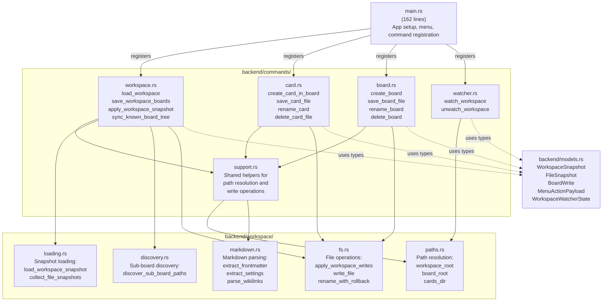
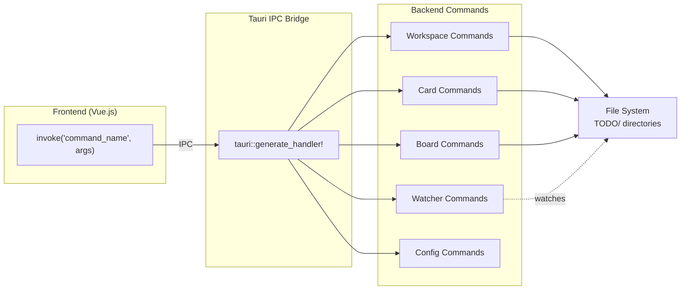
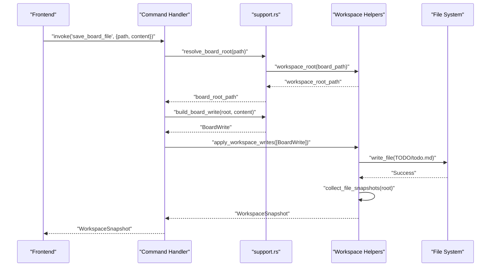
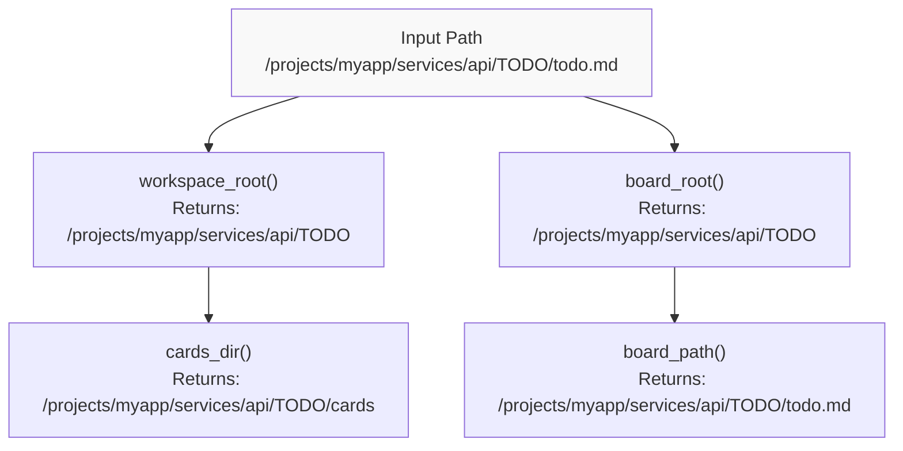
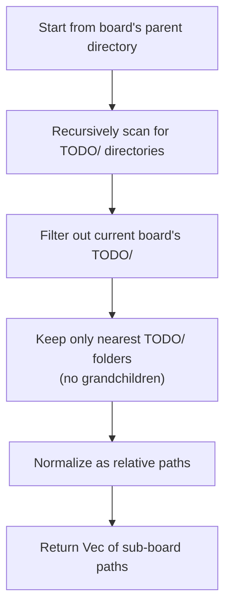
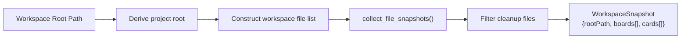
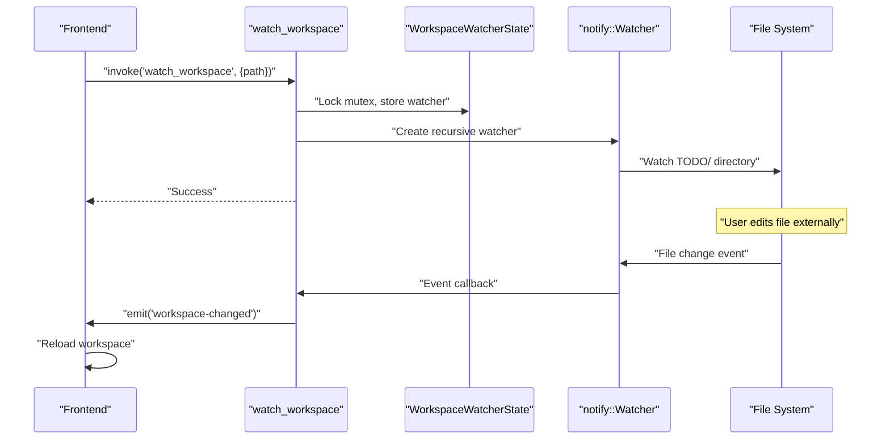
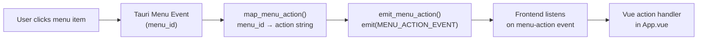
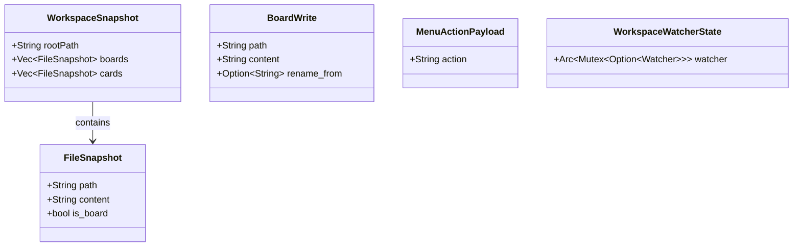

# Backend Architecture

Relevant source files

The following files were used as context for generating this wiki page:

- [TODO/cards/cross-workspace-boards.md](../TODO/cards/cross-workspace-boards.md)
- [TODO/cards/tauri-backend-module-split.md](../TODO/cards/tauri-backend-module-split.md)
- [TODO/todo.md](../TODO/todo.md)
- [docs/plans/2026-03-11-example-workspace-refresh-design.md](../docs/plans/2026-03-11-example-workspace-refresh-design.md)
- [docs/plans/2026-03-12-cross-workspace-boards-design.md](../docs/plans/2026-03-12-cross-workspace-boards-design.md)
- [src-tauri/Cargo.toml](../src-tauri/Cargo.toml)
- [src-tauri/src/main.rs](../src-tauri/src/main.rs)

## Purpose and Scope

This document describes the Rust backend architecture of KanStack, including its module organization, command handlers, workspace operations, and file system management. The backend is built with Tauri 2 and provides the file I/O layer that supports the frontend's markdown-based workspace model.

For information about frontend architecture and state management, see [Frontend Architecture](3.3-frontend-architecture.md). For details about the data structures passed between backend and frontend, see [Data Model](3.2-data-model.md).

---

## Module Organization

The backend code is organized into focused modules that separate command handling from pure workspace logic. After the refactor described in the `tauri-backend-module-split` task, `main.rs` now handles only application bootstrap, while domain logic lives in dedicated modules.

**Sources:** [src-tauri/src/main.rs:1-192](../src-tauri/src/main.rs), [TODO/cards/tauri-backend-module-split.md:1-55](../TODO/cards/tauri-backend-module-split.md)

### Key Design Principles

| Principle | Implementation |
|-----------|----------------|
| **Separation of Concerns** | Commands handle Tauri integration; workspace modules contain pure logic |
| **Path-based Identity** | Boards and cards are identified by normalized filesystem paths |
| **Atomic Operations** | File writes include rollback support for error recovery |
| **No Database** | All data persists as markdown files in `TODO/` directories |
| **Minimal Dependencies** | Only essential crates: Tauri, notify, serde, trash |

**Sources:** [src-tauri/Cargo.toml:1-27](../src-tauri/Cargo.toml), [TODO/cards/tauri-backend-module-split.md:36-46](../TODO/cards/tauri-backend-module-split.md)

---

## Command Layer

The backend exposes 15 Tauri commands that the frontend invokes via IPC. Commands are registered in `main.rs` and implemented across four domain-specific modules.

### Registered Commands

**Sources:** [src-tauri/src/main.rs:32-49](../src-tauri/src/main.rs)

### Command Reference

| Command | Module | Purpose |
|---------|--------|---------|
| `load_workspace` | workspace.rs | Load all boards and cards from a workspace root path |
| `save_board_file` | board.rs | Write updated board markdown to `TODO/todo.md` |
| `save_card_file` | card.rs | Write updated card markdown to `TODO/cards/*.md` |
| `save_workspace_boards` | workspace.rs | Batch save multiple board files atomically |
| `apply_workspace_snapshot` | workspace.rs | Restore workspace to a previous snapshot state (for undo) |
| `create_card_in_board` | card.rs | Create a new card file in a board's cards directory |
| `create_board` | board.rs | Create a new board with its `TODO/` directory structure |
| `rename_card` | card.rs | Rename a card file and update all referencing board links |
| `rename_board` | board.rs | Update a board's title in its frontmatter |
| `delete_card_file` | card.rs | Move card file to trash |
| `delete_board` | board.rs | Move entire board `TODO/` directory to trash |
| `sync_known_board_tree` | workspace.rs | Discover sub-boards and persist paths to markdown |
| `watch_workspace` | watcher.rs | Start file system watcher for workspace changes |
| `unwatch_workspace` | watcher.rs | Stop file system watcher |
| `load_app_config` / `save_app_config` | workspace.rs | Persist app preferences to JSON file |

**Sources:** [src-tauri/src/main.rs:32-49](../src-tauri/src/main.rs)

---

## Command Implementation Pattern

All commands follow a consistent pattern enabled by the shared support module:

**Sources:** The pattern is described in [TODO/cards/tauri-backend-module-split.md:42-44](../TODO/cards/tauri-backend-module-split.md)

### Support Module Helpers

The `backend/commands/support.rs` module provides shared functionality to eliminate duplication across command handlers:

| Helper | Purpose |
|--------|---------|
| `resolve_board_root()` | Extract board root path from any board-related file path |
| `resolve_workspace_root()` | Extract workspace root path from board or card path |
| `build_board_write()` | Construct a `BoardWrite` for `TODO/todo.md` |
| `build_card_write()` | Construct a `BoardWrite` for `TODO/cards/*.md` |
| `parse_local_card_slug()` | Extract card slug from `cards/slug.md` path |

**Sources:** [TODO/cards/tauri-backend-module-split.md:42-44](../TODO/cards/tauri-backend-module-split.md)

---

## Workspace Operations

The `backend/workspace/` modules provide the core file system and markdown operations that power the workspace model.

### Path Resolution (`paths.rs`)

Path resolution functions normalize and validate file paths according to KanStack's `TODO/` structure:

**Sources:** Described in module organization from [TODO/cards/tauri-backend-module-split.md:40-41](../TODO/cards/tauri-backend-module-split.md)

### Markdown Parsing (`markdown.rs`)

The markdown parser extracts structured data from board and card files:

| Function | Purpose |
|----------|---------|
| `extract_frontmatter()` | Parse YAML frontmatter between `---` delimiters |
| `extract_settings()` | Parse JSON settings block from `%% kanban:settings %%` |
| `parse_wikilinks()` | Extract `[[target\|label]]` references from markdown |
| `parse_headings()` | Identify `##` columns and `###` sections |

The parser is used during workspace loading but lives in the backend for testing. The frontend has its own richer TypeScript parser (`parseWorkspace`) that produces the full `KanbanParseResult`.

**Sources:** [TODO/cards/cross-workspace-boards.md:48](../TODO/cards/cross-workspace-boards.md), [TODO/cards/tauri-backend-module-split.md:41](../TODO/cards/tauri-backend-module-split.md)

### Sub-Board Discovery (`discovery.rs`)

The `discover_sub_board_paths()` function implements the manual sub-board discovery algorithm:

Discovery is triggered by the `sync_known_board_tree` command, which writes discovered paths into the `## Sub Boards` section of `TODO/todo.md`.

**Sources:** [docs/plans/2026-03-12-cross-workspace-boards-design.md:15-31](../docs/plans/2026-03-12-cross-workspace-boards-design.md), [TODO/cards/cross-workspace-boards.md:42-47](../TODO/cards/cross-workspace-boards.md)

### Snapshot Loading (`loading.rs`)

The workspace loading pipeline transforms a root path into a `WorkspaceSnapshot`:

Each `FileSnapshot` contains:
- `path`: Absolute file path
- `content`: File content as string
- `is_board`: Boolean indicating if this is `todo.md`

The snapshot is returned to the frontend, which parses it into structured `LoadedWorkspace`.

**Sources:** [TODO/cards/tauri-backend-module-split.md:44](../TODO/cards/tauri-backend-module-split.md)

### File Operations (`fs.rs`)

The file system module provides write operations with rollback support:

| Function | Purpose |
|----------|---------|
| `apply_workspace_writes()` | Execute multiple writes atomically with rollback on failure |
| `write_file()` | Write content to file, creating parent directories as needed |
| `rename_with_rollback()` | Rename file/directory with automatic rollback on error |
| `move_to_trash()` | Move file/directory to OS trash (using `trash` crate) |

All write operations ensure parent directories exist and normalize paths before writing.

**Sources:** [TODO/cards/tauri-backend-module-split.md:45-46](../TODO/cards/tauri-backend-module-split.md), [src-tauri/Cargo.toml:18](../src-tauri/Cargo.toml)

---

## File System Watching

KanStack uses the `notify` crate to watch for external file changes and emit `workspace-changed` events to the frontend.

### Watcher Architecture

**Sources:** [src-tauri/Cargo.toml:12](../src-tauri/Cargo.toml), command registration in [src-tauri/src/main.rs:32-49](../src-tauri/src/main.rs)

### Watcher State Management

The watcher state is managed through Tauri's state management system:

- `WorkspaceWatcherState` is registered in `main.rs` using `.manage()`
- It contains an `Arc<Mutex<Option<notify::Watcher>>>` for thread-safe access
- `watch_workspace` creates a new watcher and stores it in the state
- `unwatch_workspace` removes and drops the watcher, stopping notifications
- The watcher automatically cleans up when the state is dropped

**Sources:** [src-tauri/src/main.rs:21](../src-tauri/src/main.rs)

---

## Menu System Integration

The backend provides menu action event bridging between Tauri's native menu system and the frontend's action handlers.

### Menu Action Flow

**Sources:** [src-tauri/src/main.rs:161-191](../src-tauri/src/main.rs)

### Menu Construction

The `build_menu()` function in `main.rs` constructs the application menu with keyboard shortcuts:

| Menu | Items | Accelerators |
|------|-------|--------------|
| File | Open Folder, Close Folder | Cmd+O, Cmd+W |
| Edit | Undo, Redo | Cmd+Z, Cmd+Shift+Z |
| Board | New Board, Attach Existing, Toggle Archive, Toggle Sub Boards, Delete Board | Cmd+Shift+N, -, Cmd+Shift+A, -, - |
| Column | New Column, Rename Column, Delete Column | -, -, - |
| Card | New Card, Archive Selected, Delete Selected | Cmd+N, Delete, Shift+Delete |

Menu events are mapped to action strings and emitted as `menu-action` events for the frontend to handle.

**Sources:** [src-tauri/src/main.rs:54-159](../src-tauri/src/main.rs)

---

## Data Models

The `backend/models.rs` module defines the data structures shared between commands and passed across the IPC boundary.

### Core Types

**Sources:** Command usage patterns from [src-tauri/src/main.rs:10-17](../src-tauri/src/main.rs)

### Type Purpose

| Type | Purpose | Serialization |
|------|---------|---------------|
| `WorkspaceSnapshot` | Complete workspace state returned from `load_workspace` | JSON via serde |
| `FileSnapshot` | Individual file content and metadata | JSON via serde |
| `BoardWrite` | Pending write operation with optional rename | JSON via serde |
| `MenuActionPayload` | Menu action event payload | JSON via serde |
| `WorkspaceWatcherState` | Managed state for file system watcher | Not serialized |

All serializable types use `#[derive(Serialize, Deserialize)]` from the `serde` crate.

**Sources:** [src-tauri/Cargo.toml:13-14](../src-tauri/Cargo.toml)

---

## Error Handling

Backend commands return `Result<T, String>` where the error string is returned to the frontend. Common error patterns:

| Error Source | Handling |
|-------------|----------|
| File I/O errors | Converted to descriptive strings with file path context |
| Path validation errors | Early return with clear message about path expectations |
| Watcher setup errors | Returned with notify crate error details |
| Serialization errors | JSON/YAML parse errors returned with source location |

Write operations use rollback to maintain consistency when errors occur mid-operation.

**Sources:** Pattern described in [TODO/cards/tauri-backend-module-split.md:43](../TODO/cards/tauri-backend-module-split.md)

---

## Testing Strategy

The backend includes unit tests for pure functions in the markdown parsing module. Tests validate frontmatter extraction, settings parsing, and wikilink resolution.

Command handlers are tested indirectly through frontend integration tests and manual verification during development. The modular architecture allows workspace helpers to be tested independently from Tauri command infrastructure.

**Sources:** [TODO/cards/cross-workspace-boards.md:48](../TODO/cards/cross-workspace-boards.md), [TODO/cards/tauri-backend-module-split.md:32](../TODO/cards/tauri-backend-module-split.md)
