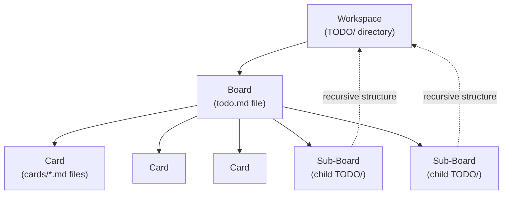
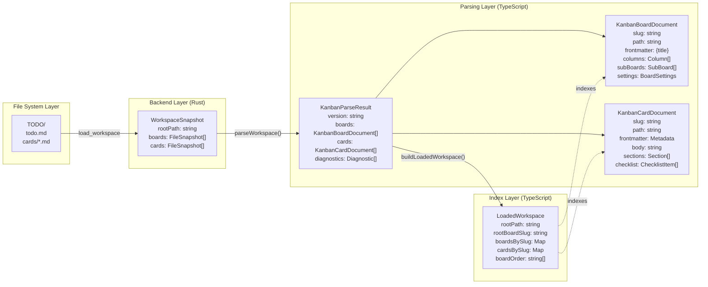
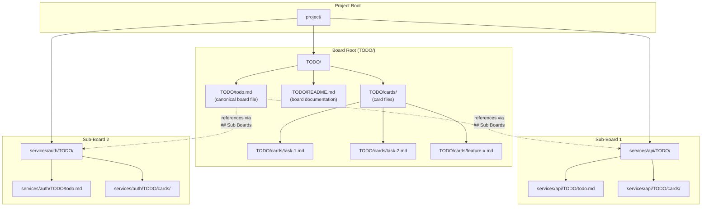
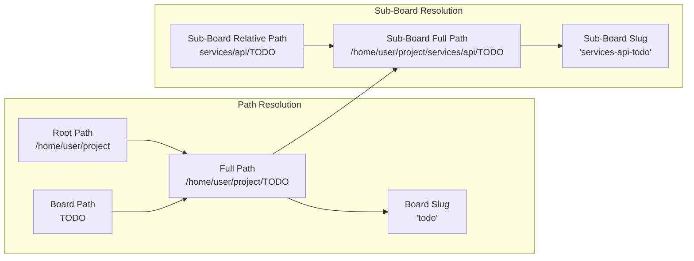
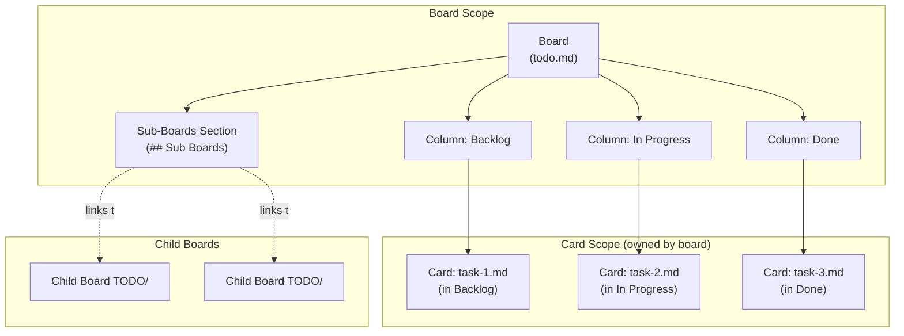
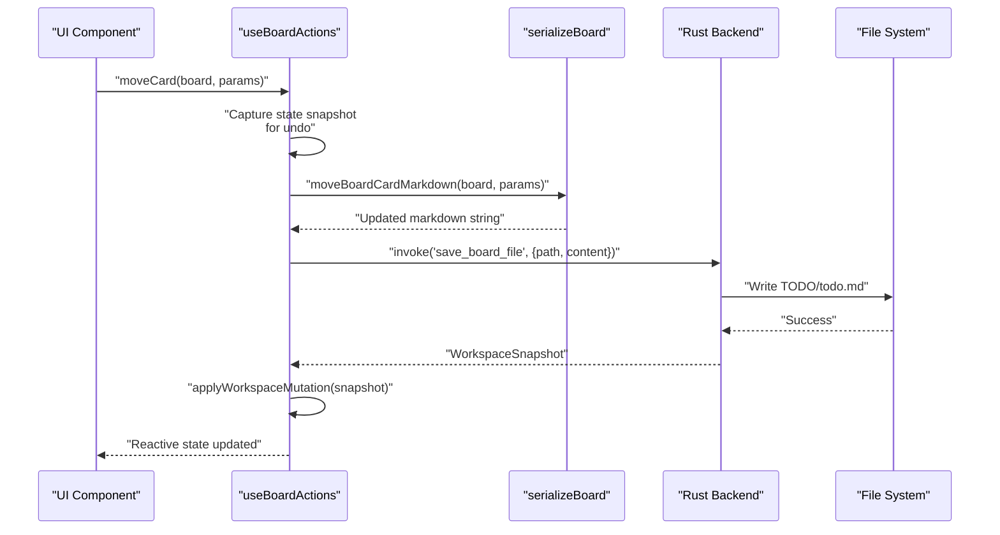
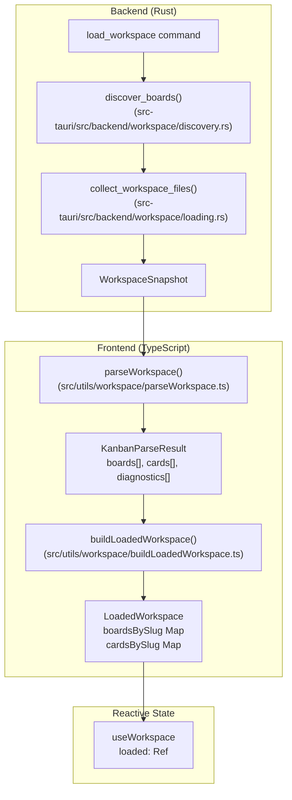
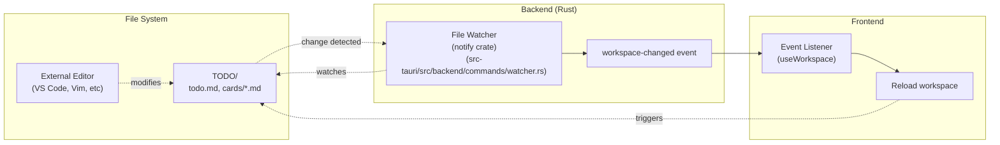

# Core Concepts

Relevant source files

The following files were used as context for generating this wiki page:

- [README.md](../README.md)
- [TODO/README.md](../TODO/README.md)
- [TODO/cards/cross-workspace-boards.md](../TODO/cards/cross-workspace-boards.md)
- [TODO/cards/tauri-backend-module-split.md](../TODO/cards/tauri-backend-module-split.md)
- [TODO/todo.md](../TODO/todo.md)
- [docs/plans/2026-03-11-example-workspace-refresh-design.md](../docs/plans/2026-03-11-example-workspace-refresh-design.md)
- [docs/plans/2026-03-12-cross-workspace-boards-design.md](../docs/plans/2026-03-12-cross-workspace-boards-design.md)

This page introduces the fundamental concepts needed to understand how KanStack works: workspaces, boards, cards, and the markdown format that ties them together. These concepts form the foundation of KanStack's local-first, file-based architecture.

For detailed information about specific topics, see:
- [4.1 Workspaces and TODO/ Structure](4.1-workspaces-and-todo-structure.md) for directory organization and workspace discovery
- [4.2 Boards and Sub-Boards](4.2-boards-and-sub-boards.md) for board structure, columns, and hierarchies
- [4.3 Cards](4.3-cards.md) for card metadata and content organization
- [4.4 Markdown Format](4.4-markdown-format.md) for the detailed markdown syntax and conventions

## The KanStack Mental Model

KanStack organizes work using a three-level hierarchy: **workspaces**, **boards**, and **cards**. Each level corresponds to a specific directory and file structure on disk, with markdown files serving as the single source of truth.

**Sources:** [README.md:34-54](../README.md), [TODO/README.md:1-27](../TODO/README.md)

### Local-First Architecture

KanStack is a **local-first** application that stores all data in markdown files. There is no database, no server, and no proprietary file format. This design provides several benefits:

| Aspect | Implementation |
|--------|---------------|
| **Data ownership** | All files live on your local filesystem |
| **Portability** | Markdown files can be read/edited by any text editor |
| **Version control** | Boards and cards work seamlessly with Git |
| **Tool independence** | Your data remains accessible even without KanStack |
| **Human readability** | Board structure and card content are plain text |

The application reads markdown files from disk, parses them into structured data, and presents a visual kanban interface. When you make changes through the UI, KanStack updates the markdown files directly.

**Sources:** [README.md:3-12](../README.md), [docs/plans/2026-03-12-cross-workspace-boards-design.md:1-61](../docs/plans/2026-03-12-cross-workspace-boards-design.md)

## Fundamental Data Structures

KanStack transforms markdown files through multiple stages, each represented by specific TypeScript types. Understanding these structures is essential for working with the codebase.

**Sources:** docs/schemas/kanban-parser-schema.ts (referenced in [README.md:55](../README.md)), Diagram 2 and Diagram 7 from high-level architecture

### Data Transformation Pipeline

The data flows through four distinct layers:

1. **File System Layer**: Raw markdown files in `TODO/` directories
2. **Backend Layer**: `WorkspaceSnapshot` containing file paths and content, produced by Rust backend commands
3. **Parsing Layer**: `KanbanParseResult` with structured `KanbanBoardDocument` and `KanbanCardDocument` objects, created by `parseWorkspace()`
4. **Index Layer**: `LoadedWorkspace` with maps for efficient lookup by slug, created by `buildLoadedWorkspace()`

Each layer serves a specific purpose:

| Layer | Purpose | Key Functions |
|-------|---------|---------------|
| **WorkspaceSnapshot** | Raw file data from backend | Created by `load_workspace` command |
| **KanbanParseResult** | Structured, validated documents | Created by `parseWorkspace()` utility |
| **LoadedWorkspace** | Indexed, ready-to-use state | Created by `buildLoadedWorkspace()` |

**Sources:** Diagram 2 (Workspace Data Flow Pipeline), src-tauri/src/backend/commands/workspace.rs (for `load_workspace`), frontend parsing utilities

## File System Organization

Every board in KanStack has its own `TODO/` directory containing all related files. This structure enables boards to be self-contained and portable.

**Sources:** [README.md:34-54](../README.md), [TODO/README.md:28-38](../TODO/README.md), [docs/plans/2026-03-12-cross-workspace-boards-design.md:8-14](../docs/plans/2026-03-12-cross-workspace-boards-design.md)

### Board Root Structure

Each `TODO/` directory follows this layout:

| File/Directory | Purpose | Required |
|----------------|---------|----------|
| `todo.md` | Canonical board definition with columns and card placement | Yes |
| `cards/*.md` | Individual card files with metadata and content | No |
| `README.md` | Board-specific documentation and notes | No |

The `todo.md` file controls:
- Board title (via frontmatter)
- Column order and names
- Card placement within columns
- Section organization within columns
- Sub-board references
- Board settings (via `%% kanban:settings %%` block)

**Sources:** [README.md:46-52](../README.md), [TODO/README.md:28-38](../TODO/README.md)

### Board Identity and Paths

Board identity in KanStack is **path-based**, not filename-based. The normalized path to a board's `TODO/` directory serves as its stable identifier.

This path-based model ensures:
- Cards from different boards never collide (even with identical filenames)
- Sub-boards can be reorganized without breaking references
- Board identity remains stable during renames (only title changes)

**Sources:** [docs/plans/2026-03-12-cross-workspace-boards-design.md:33-38](../docs/plans/2026-03-12-cross-workspace-boards-design.md), src-tauri/src/backend/workspace/paths.rs

## Data Ownership and Relationships

KanStack maintains clear ownership boundaries between boards and cards.

**Sources:** [TODO/README.md:28-95](../TODO/README.md), [docs/plans/2026-03-12-cross-workspace-boards-design.md:47-53](../docs/plans/2026-03-12-cross-workspace-boards-design.md)

### Ownership Rules

| Entity | Owned By | Stored In |
|--------|----------|-----------|
| **Card files** | The board in whose `TODO/cards/` they reside | `TODO/cards/*.md` |
| **Card placement** | The board's `todo.md` file | Column/section in `todo.md` |
| **Column structure** | The board | `## ` headings in `todo.md` |
| **Board settings** | The board | `%% kanban:settings %%` in `todo.md` |
| **Sub-board links** | The parent board | `## Sub Boards` in `todo.md` |

When you edit a card through the KanStack UI, the changes are written to the card file in the owning board's `TODO/cards/` directory. When you move a card between columns, only the board's `todo.md` file is updated—the card file itself remains unchanged.

**Sources:** [docs/plans/2026-03-12-cross-workspace-boards-design.md:47-53](../docs/plans/2026-03-12-cross-workspace-boards-design.md)

## Board Operations and Serialization

KanStack maintains a consistent pattern for all board and card operations: parse markdown, modify structure, serialize to markdown, persist to disk.

**Sources:** Diagram 4 (Board and Card Operations Flow), src/composables/useBoardActions.ts (inferred), serialization utilities

### Key Operations

The `useBoardActions` composable provides functions for manipulating boards and cards:

| Operation | Function | Markdown Target | Updates |
|-----------|----------|-----------------|---------|
| Move card | `moveCard()` | `todo.md` | Card's column/section placement |
| Create card | `createCard()` | `cards/*.md` + `todo.md` | New card file + board placement |
| Archive card | `archiveCard()` | `todo.md` | Moves card to Archive column |
| Rename column | `renameColumn()` | `todo.md` | Column heading |
| Create board | `createBoard()` | New `TODO/todo.md` | New board file |
| Add sub-board | Manual discovery | `todo.md` | `## Sub Boards` section |

All operations follow the serialization → persistence → mutation pattern shown in the diagram above.

**Sources:** Diagram 4, src/composables/useBoardActions.ts (inferred)

## Workspace Loading and Parsing

When KanStack opens a workspace, it loads all boards and cards in the hierarchy, starting from the root `TODO/` directory.

**Sources:** src-tauri/src/backend/workspace/discovery.rs, src-tauri/src/backend/workspace/loading.rs, Diagram 2

### Loading Sequence

1. **Backend Discovery**: The `load_workspace` command resolves the root `TODO/` path
2. **Board Scanning**: `discover_boards()` recursively finds all sub-boards via `## Sub Boards` links
3. **File Collection**: `collect_workspace_files()` reads `todo.md` and `cards/*.md` for all discovered boards
4. **Snapshot Creation**: All file paths and content are packaged into a `WorkspaceSnapshot`
5. **Parsing**: `parseWorkspace()` transforms markdown into typed `KanbanBoardDocument` and `KanbanCardDocument` objects
6. **Indexing**: `buildLoadedWorkspace()` creates maps for efficient slug-based lookup
7. **Reactive Wrapping**: `useWorkspace` wraps the `LoadedWorkspace` in Vue reactive state

**Sources:** src-tauri/src/backend/commands/workspace.rs, src-tauri/src/backend/workspace/, Diagram 2

## Real-Time Synchronization

KanStack watches the filesystem for external changes and automatically reloads when files are modified outside the application.

**Sources:** src-tauri/src/backend/commands/watcher.rs, Diagram 2

The watcher enables a **two-way editing model**: you can edit markdown files in your favorite text editor while KanStack is running, and changes will appear in the UI immediately. Conversely, changes made through the KanStack UI are written to disk and can be seen in external editors.

**Sources:** src-tauri/src/backend/commands/watcher.rs, [README.md:8-12](../README.md)

---

This mental model—workspaces as `TODO/` directories, boards as `todo.md` files, cards as `cards/*.md` files, with markdown as the single source of truth—forms the foundation of everything else in KanStack. Understanding these core concepts is essential before diving into the specific details of workspace structure, board organization, card metadata, or markdown syntax covered in the following pages.
