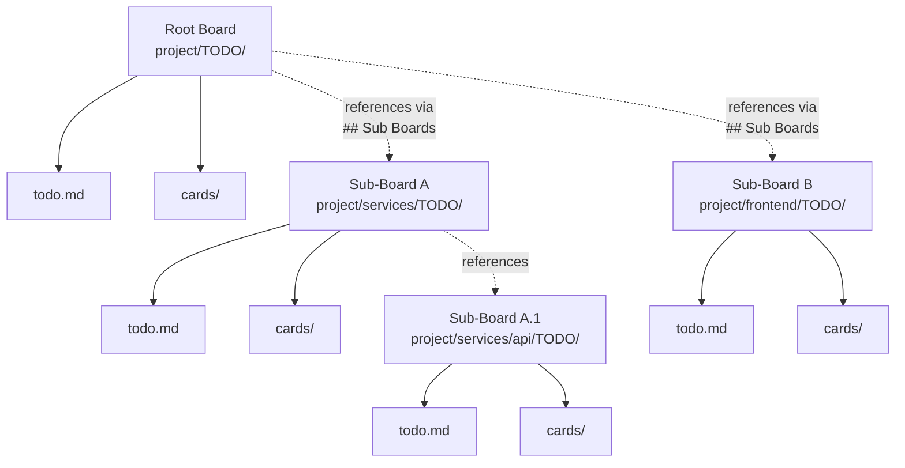
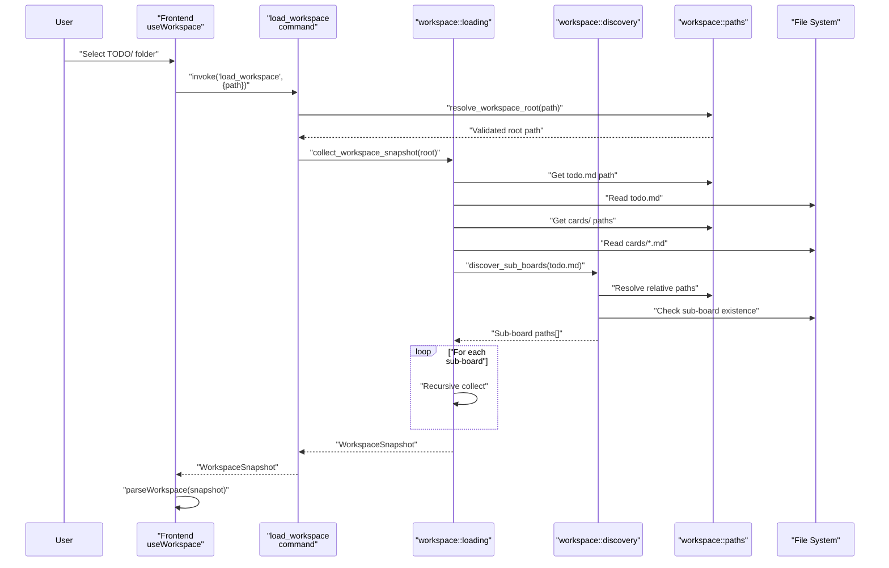
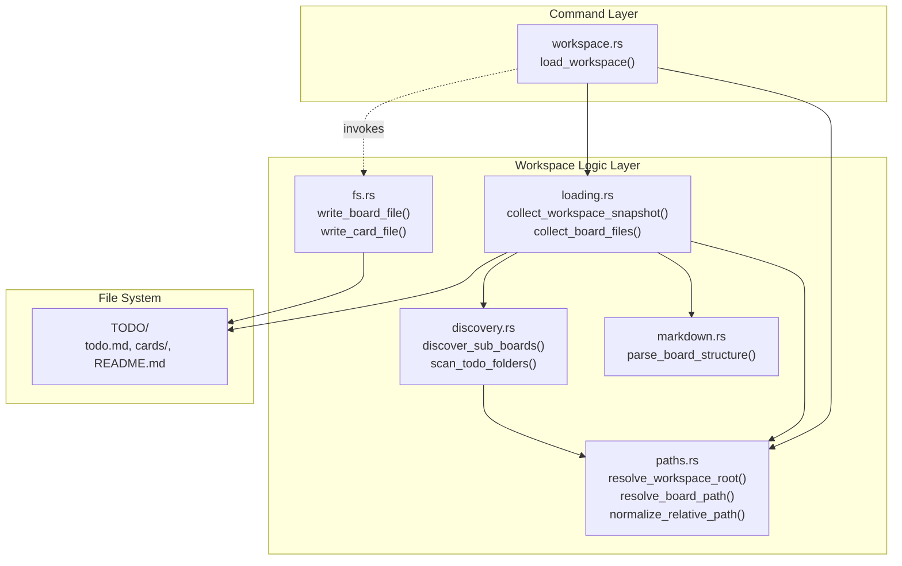

# Workspaces and TODO/ Structure

<details>
<summary>Relevant source files</summary>

The following files were used as context for generating this wiki page:

- [README.md](../README.md)
- [TODO/README.md](../TODO/README.md)
- [TODO/cards/cross-workspace-boards.md](../TODO/cards/cross-workspace-boards.md)
- [TODO/cards/tauri-backend-module-split.md](../TODO/cards/tauri-backend-module-split.md)
- [TODO/todo.md](../TODO/todo.md)
- [docs/plans/2026-03-11-example-workspace-refresh-design.md](../docs/plans/2026-03-11-example-workspace-refresh-design.md)
- [docs/plans/2026-03-12-cross-workspace-boards-design.md](../docs/plans/2026-03-12-cross-workspace-boards-design.md)

</details>


## Purpose and Scope

This page explains the workspace model and file system structure that KanStack uses to organize boards and cards. It covers the per-board `TODO/` directory layout, how board roots relate to sub-boards, and how the system resolves paths and identifies boards.

For information about how markdown files within the `TODO/` structure are formatted and parsed, see [Markdown Format](4.4-markdown-format.md). For details about board structure and sub-board relationships, see [Boards and Sub-Boards](4.2-boards-and-sub-boards.md). For card file contents, see [Cards](4.3-cards.md).

---

## The Workspace Model

KanStack operates on a **per-board `TODO/` workspace model**. Unlike traditional Kanban tools that centralize all boards in a single database, KanStack treats each board as an independent `TODO/` folder that contains its own board file (`todo.md`), card files (`cards/*.md`), and optional documentation (`README.md`).

When you open KanStack, you select a `TODO/` folder. This becomes the **workspace root** or **board root** for the current session. The application loads the board structure from `todo.md`, resolves card references from `cards/`, and discovers any sub-boards declared in the `## Sub Boards` section.

**Key characteristics:**

| Aspect | Description |
|--------|-------------|
| **Storage** | Local markdown files, no database |
| **Identity** | Path-based (not filename or slug-based) |
| **Scope** | Each `TODO/` folder is an independent board root |
| **Hierarchy** | Sub-boards live in descendant `TODO/` folders |
| **Portability** | Move or rename board roots by moving directories |

Sources: [README.md:1-75](../README.md), [docs/plans/2026-03-12-cross-workspace-boards-design.md:1-61](../docs/plans/2026-03-12-cross-workspace-boards-design.md)

---

## Per-Board TODO/ Structure

Each board exists as a `TODO/` directory containing three core elements:

```
project-name/
  TODO/
    todo.md          # Board structure: columns, sections, card links
    cards/           # Card content files
      task-1.md
      task-2.md
      feature-x.md
    README.md        # Optional: board-specific documentation
```

### Core Files and Directories

| File/Directory | Purpose | Required |
|----------------|---------|----------|
| `TODO/todo.md` | Canonical board file: defines columns, card placement, sub-board links | Yes |
| `TODO/cards/` | Directory containing all card markdown files for this board | Yes |
| `TODO/README.md` | Board-specific notes, onboarding, or documentation | No |

The canonical board file is always named `todo.md`, not based on the board's title or slug. This convention simplifies loading logic and makes board roots easily identifiable in the file system.

Sources: [README.md:36-54](../README.md), [TODO/README.md:1-27](../TODO/README.md), [docs/plans/2026-03-12-cross-workspace-boards-design.md:8-14](../docs/plans/2026-03-12-cross-workspace-boards-design.md)

---

## Board Root Components

### todo.md: The Board File

`todo.md` serves as the **source of truth** for board structure. It defines:

- **Column order**: `## Backlog`, `## In Progress`, `## Done`, etc.
- **Card placement**: Wikilinks to card files under each column
- **Sections**: Optional `### Section Name` headings within columns
- **Sub-board links**: `## Sub Boards` section with relative paths
- **Settings**: JSON configuration block for board display options

Example structure from a real board file:

```markdown
---
title: Project Board
---

%% kanban:settings
```json
{
  "show-sub-boards": false,
  "show-archive-column": false
}
```
%%

## Backlog

- [[cards/plan-next-feature]]

### High Priority

- [[cards/fix-critical-bug]]

## In Progress

- [[cards/implement-feature-x]]

## Sub Boards

- [[services/api/TODO|API Service]]
- [[frontend/TODO|Frontend]]
```

The board file controls what appears on the board and in what order. Card files can exist in `cards/` without being linked, making them "orphaned" but not lost.

Sources: [TODO/README.md:28-95](../TODO/README.md), [TODO/todo.md:1-80](../TODO/todo.md), [README.md:47-50](../README.md)

---

### cards/: Card Content Directory

The `cards/` directory contains one markdown file per card. Card filenames use slugified versions of their titles:

```
TODO/cards/
  implement-user-authentication.md
  refactor-board-parser.md
  add-keyboard-shortcuts.md
```

Card files contain:
- Frontmatter with metadata (type, priority, assignee, etc.)
- Title heading
- Body content
- Optional sections for spec, context, checklist, review notes

Card identity is derived from **board path + card slug**, preventing collisions when multiple boards have cards with the same filename.

Sources: [README.md:48](../README.md), [TODO/README.md:106-168](../TODO/README.md), [docs/plans/2026-03-12-cross-workspace-boards-design.md:35-38](../docs/plans/2026-03-12-cross-workspace-boards-design.md)

---

### README.md: Board Documentation

`TODO/README.md` is an optional file for board-specific documentation. It's not parsed as board or card data—it's purely for human readers. Common uses:

- Onboarding instructions for team members
- Workflow conventions for this board
- Notes about the project this board tracks
- References to external documentation

The application doesn't display or edit `README.md` in the UI, but it's preserved during file operations.

Sources: [README.md:49](../README.md), [TODO/README.md:1-10](../TODO/README.md), [docs/plans/2026-03-12-cross-workspace-boards-design.md:12](../docs/plans/2026-03-12-cross-workspace-boards-design.md)

---

## Workspace Hierarchy and Sub-Boards

### Hierarchical Board Model



**Diagram: Workspace hierarchy showing nested TODO/ folders and their references**

Sources: [docs/plans/2026-03-12-cross-workspace-boards-design.md:15-46](../docs/plans/2026-03-12-cross-workspace-boards-design.md), [README.md:50-53](../README.md)

---

### Sub-Board Discovery and Persistence

Sub-boards must exist within the **filesystem tree** under the current board's parent directory. They cannot reference arbitrary external paths.

**Discovery Process:**

1. User triggers `Find Sub Boards` from the system menu
2. Backend scans descendant directories for `TODO/` folders
3. Scanner starts from the parent of the current board's `TODO/` folder
4. Each discovered `TODO/` becomes a potential sub-board
5. Discovered paths are written as relative wikilinks to `## Sub Boards`
6. Subsequent loads read paths from markdown instead of re-scanning

**Example discovery:**

```
/Users/dev/my-project/              # Scan starts here
  TODO/                             # Current board root
    todo.md                         # Contains ## Sub Boards section
  services/
    api/
      TODO/                         # Discovered: [[services/api/TODO]]
        todo.md
        cards/
    worker/
      TODO/                         # Discovered: [[services/worker/TODO]]
        todo.md
        cards/
```

The `## Sub Boards` section in `/Users/dev/my-project/TODO/todo.md` would be updated to:

```markdown
## Sub Boards

- [[services/api/TODO|API Service]]
- [[services/worker/TODO|Worker Service]]
```

Sources: [docs/plans/2026-03-12-cross-workspace-boards-design.md:15-33](../docs/plans/2026-03-12-cross-workspace-boards-design.md), [TODO/cards/cross-workspace-boards.md:1-55](../TODO/cards/cross-workspace-boards.md)

---

## Path-Based Identity Model

### Board Identity

Boards are identified by their **normalized `TODO/` path** within the filesystem tree, not by title or slug. This ensures:

- **Stability**: Renaming a board's title doesn't change its identity
- **Uniqueness**: No collisions between boards in different projects
- **Simplicity**: Path resolution is unambiguous

**Example board identities:**

```
/Users/dev/project-a/TODO               # Board 1
/Users/dev/project-b/TODO               # Board 2
/Users/dev/project-a/services/api/TODO  # Board 3 (sub-board of Board 1)
```

Sources: [docs/plans/2026-03-12-cross-workspace-boards-design.md:34-38](../docs/plans/2026-03-12-cross-workspace-boards-design.md)

---

### Card Identity

Cards are identified by combining **board path + card slug**:

```
Board Path: /Users/dev/project/TODO
Card Slug: implement-feature-x
Full Card ID: /Users/dev/project/TODO::cards/implement-feature-x
```

This prevents collisions when two boards have cards with identical filenames:

```
/project-a/TODO/cards/refactor.md    # Card ID: project-a/TODO::cards/refactor
/project-b/TODO/cards/refactor.md    # Card ID: project-b/TODO::cards/refactor
```

Sources: [docs/plans/2026-03-12-cross-workspace-boards-design.md:35-38](../docs/plans/2026-03-12-cross-workspace-boards-design.md), [TODO/cards/cross-workspace-boards.md:40-41](../TODO/cards/cross-workspace-boards.md)

---

## File System Structure Examples

### Single Board Workspace

```
my-kanban-project/
  TODO/
    todo.md                          # Main board file
    cards/
      add-login-page.md
      fix-navbar-bug.md
      research-new-framework.md
    README.md                        # "How to use this board"
```

This is the simplest case: one board with no sub-boards.

---

### Multi-Board Workspace with Sub-Boards

```
web-app/
  TODO/                              # Root board: "Web App Project"
    todo.md
    cards/
      project-kickoff.md
      define-architecture.md
    README.md
  
  frontend/
    TODO/                            # Sub-board: "Frontend"
      todo.md
      cards/
        setup-vue-project.md
        create-login-component.md
      README.md
    src/
      components/
      ...
  
  backend/
    TODO/                            # Sub-board: "Backend"
      todo.md
      cards/
        setup-database.md
        create-api-endpoints.md
      README.md
    api/
      TODO/                          # Sub-sub-board: "API Service"
        todo.md
        cards/
          implement-auth.md
        README.md
      src/
        ...
```

The root board's `todo.md` declares sub-boards:

```markdown
## Sub Boards

- [[frontend/TODO|Frontend]]
- [[backend/TODO|Backend]]
```

The backend board's `todo.md` declares its own sub-board:

```markdown
## Sub Boards

- [[api/TODO|API Service]]
```

Sources: [README.md:36-54](../README.md), [docs/plans/2026-03-12-cross-workspace-boards-design.md:8-31](../docs/plans/2026-03-12-cross-workspace-boards-design.md)

---

## Backend Path Resolution

### Workspace Loading Flow



**Diagram: Backend workspace loading and path resolution flow**

Sources: [docs/plans/2026-03-12-cross-workspace-boards-design.md:40-46](../docs/plans/2026-03-12-cross-workspace-boards-design.md), [TODO/cards/tauri-backend-module-split.md:38-46](../TODO/cards/tauri-backend-module-split.md)

---

### Backend Modules Involved

The following Rust modules handle workspace path operations:

| Module | Responsibility |
|--------|----------------|
| `backend/commands/workspace.rs` | `load_workspace` command handler |
| `backend/workspace/paths.rs` | Path normalization, validation, resolution |
| `backend/workspace/discovery.rs` | Sub-board scanning and path collection |
| `backend/workspace/loading.rs` | Snapshot construction, recursive loading |
| `backend/workspace/markdown.rs` | Markdown parsing (board structure extraction) |
| `backend/workspace/fs.rs` | File write operations, path validation |



**Diagram: Backend module organization for workspace path operations**

Sources: [TODO/cards/tauri-backend-module-split.md:38-46](../TODO/cards/tauri-backend-module-split.md)

---

### Path Resolution Examples

The `backend/workspace/paths.rs` module provides path resolution utilities:

**Resolving workspace root:**

```
Input: "/Users/dev/my-project/TODO"
Output: Validated absolute path "/Users/dev/my-project/TODO"
```

**Resolving board file:**

```
Board Root: "/Users/dev/my-project/TODO"
Board File: "/Users/dev/my-project/TODO/todo.md"
```

**Resolving card file:**

```
Board Root: "/Users/dev/my-project/TODO"
Card Slug: "implement-feature"
Card File: "/Users/dev/my-project/TODO/cards/implement-feature.md"
```

**Resolving sub-board relative path:**

```
Current Board: "/Users/dev/my-project/TODO"
Sub-Board Link: "[[services/api/TODO]]"
Resolved Path: "/Users/dev/my-project/services/api/TODO"
```

Sources: [docs/plans/2026-03-12-cross-workspace-boards-design.md:26-31](../docs/plans/2026-03-12-cross-workspace-boards-design.md), [TODO/cards/tauri-backend-module-split.md:42-43](../TODO/cards/tauri-backend-module-split.md)

---

## Machine-Local Configuration

KanStack stores machine-specific configuration (not project-specific) in a `config.md` file in the application's local data directory:

| OS | Typical Path |
|----|-------------|
| macOS | `~/Library/Application Support/com.kanstack.app/config.md` |
| Linux | `~/.config/kanstack/config.md` |
| Windows | `C:\Users\<user>\AppData\Roaming\kanstack\config.md` |

This file stores:

- **Known boards**: Index of discovered board paths across all workspaces
- **View preferences**: Global UI settings (not per-board)
- **Recent workspaces**: Last opened board roots

The `config.md` file is **not** stored in `TODO/` folders because it's machine-specific. A team sharing a `TODO/` workspace would each have their own `config.md` on their respective machines.

Sources: [README.md:53](../README.md), [TODO/README.md:99](../TODO/README.md)

---

## Summary

The workspace model in KanStack is built around:

1. **Per-board `TODO/` structure**: Each board is an independent folder with `todo.md`, `cards/`, and optional `README.md`
2. **Path-based identity**: Boards and cards are identified by filesystem paths, not slugs or titles
3. **Hierarchical sub-boards**: Sub-boards exist as descendant `TODO/` folders and are referenced via relative paths in `## Sub Boards`
4. **Manual discovery**: Sub-board scanning is user-triggered and results are persisted to markdown
5. **Local-first design**: All data lives in markdown files; no central database

This structure enables:
- **Portability**: Move board roots by moving directories
- **Collaboration**: Share `TODO/` folders via git, Dropbox, etc.
- **Flexibility**: Each project can have its own board hierarchy
- **Simplicity**: Readable, editable markdown files that work with any text editor

Sources: [README.md:1-75](../README.md), [docs/plans/2026-03-12-cross-workspace-boards-design.md:1-61](../docs/plans/2026-03-12-cross-workspace-boards-design.md), [TODO/README.md:1-179](../TODO/README.md)
