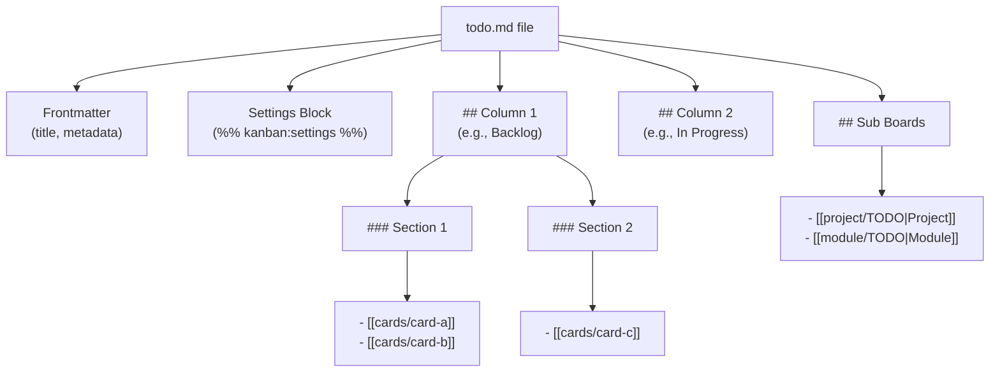
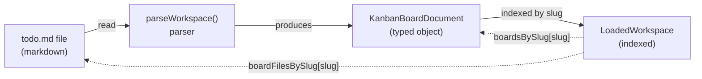
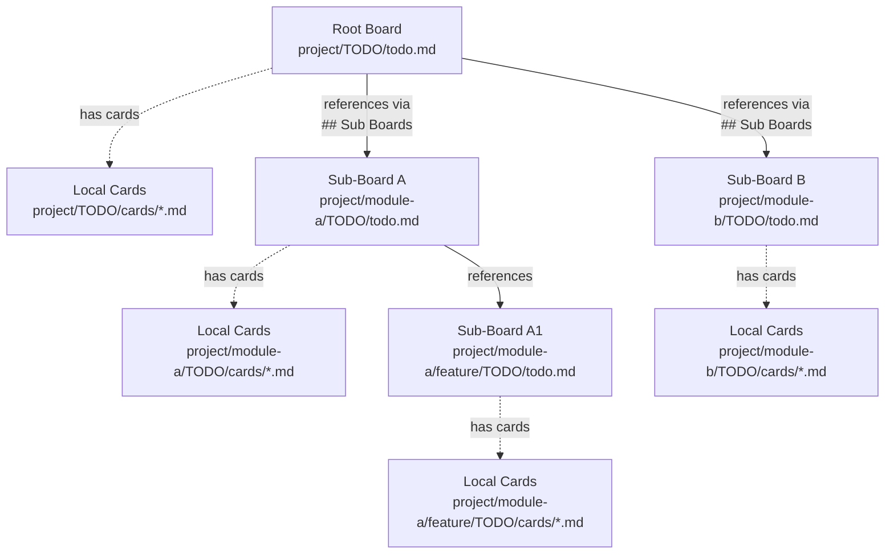
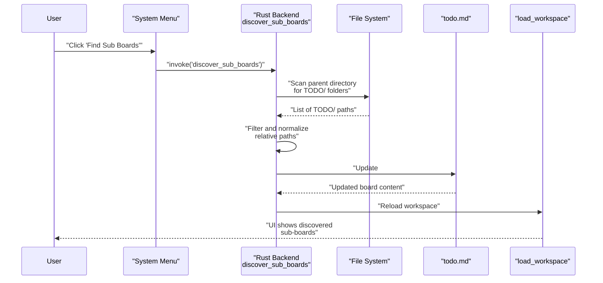

# Boards and Sub-Boards

<details>
<summary>Relevant source files</summary>

The following files were used as context for generating this wiki page:

- [TODO/cards/cross-workspace-boards.md](../TODO/cards/cross-workspace-boards.md)
- [TODO/cards/tauri-backend-module-split.md](../TODO/cards/tauri-backend-module-split.md)
- [TODO/todo.md](../TODO/todo.md)
- [docs/plans/2026-03-10-markdown-kanban-design.md](../docs/plans/2026-03-10-markdown-kanban-design.md)
- [docs/plans/2026-03-11-example-workspace-refresh-design.md](../docs/plans/2026-03-11-example-workspace-refresh-design.md)
- [docs/plans/2026-03-12-cross-workspace-boards-design.md](../docs/plans/2026-03-12-cross-workspace-boards-design.md)
- [src/types/workspace.ts](../src/types/workspace.ts)
- [src/utils/boardMarkdown.test.ts](../src/utils/boardMarkdown.test.ts)
- [src/utils/kanbanPath.ts](../src/utils/kanbanPath.ts)

</details>


This document explains the structure and organization of Kanban boards in KanStack, including columns, sections, sub-board hierarchies, and the discovery mechanism. For information about the workspace-level `TODO/` directory structure, see [Workspaces and TODO/ Structure](4.1-workspaces-and-todo-structure.md). For details on individual card structure and content, see [Cards](4.3-cards.md). For the markdown syntax conventions used in board files, see [Markdown Format](4.4-markdown-format.md).

## Overview

A board in KanStack is represented by a single markdown file (`todo.md`) within a `TODO/` directory. Each board organizes cards into columns and optional sections, and can reference child boards to create hierarchical project structures. Boards are identified by their filesystem path rather than their title, allowing boards to be renamed without breaking relationships.

## Board File Structure

### File Location and Identity

Every board exists as a `TODO/todo.md` file within its own project directory. The board's identity is derived from the normalized path to its `TODO/` directory, not from its filename or title.

```
project-name/
├── TODO/
│   ├── todo.md          # Board definition file
│   ├── cards/           # Local card files
│   └── README.md        # Optional board notes
└── ...
```

**Sources:** [docs/plans/2026-03-12-cross-workspace-boards-design.md:8-13](../docs/plans/2026-03-12-cross-workspace-boards-design.md), [docs/plans/2026-03-10-markdown-kanban-design.md:8-12](../docs/plans/2026-03-10-markdown-kanban-design.md)

### Board Identity Functions

The `boardIdFromBoardPath` function converts a board file path to its stable identity:

[src/utils/kanbanPath.ts:88-90](../src/utils/kanbanPath.ts)

The `boardTodoPathFromBoardPath` function extracts the `TODO/` directory path:

[src/utils/kanbanPath.ts:84-86](../src/utils/kanbanPath.ts)

**Sources:** [src/utils/kanbanPath.ts:84-90](../src/utils/kanbanPath.ts)

## Board Structure Components

### Columns

Columns are the primary organizational units of a board, defined using `##` headings in the markdown file. Each column can contain cards directly or organize them into sections.

```
## Backlog
## In Progress
## Review
## Done
```

The parser represents columns using the `KanbanBoardColumn` type, which includes a name, slug, and array of sections:

```typescript
interface KanbanBoardColumn {
  name: string
  slug: string
  sections: KanbanBoardSection[]
}
```

**Sources:** [docs/plans/2026-03-10-markdown-kanban-design.md:15-20](../docs/plans/2026-03-10-markdown-kanban-design.md), [TODO/todo.md:25-41](../TODO/todo.md)

### Sections

Sections are optional subdivisions within columns, defined using `###` headings. They provide additional organization for grouping related cards within a column.

**Board Markdown Structure Diagram**



**Sources:** [docs/plans/2026-03-10-markdown-kanban-design.md:26-32](../docs/plans/2026-03-10-markdown-kanban-design.md), [src/utils/boardMarkdown.test.ts:18-40](../src/utils/boardMarkdown.test.ts)

Example with sections:

```
## Todo

### High Priority
- [[cards/critical-bug]]

### Routine
- [[cards/minor-fix]]
```

The parser preserves sections throughout operations. The `DEFAULT_SECTION_KEY` constant (`"__default__"`) is used internally for cards not under an explicit section:

[src/utils/kanbanPath.ts:7](../src/utils/kanbanPath.ts)

**Sources:** [src/utils/kanbanPath.ts:7](../src/utils/kanbanPath.ts), [src/utils/boardMarkdown.test.ts:42-82](../src/utils/boardMarkdown.test.ts)

### Archive Column

Boards can have a special `Archive` column for storing completed or deprioritized cards. The archive column is automatically created when archiving a card if it doesn't exist, and is always placed last in column order:

[src/utils/boardMarkdown.test.ts:84-105](../src/utils/boardMarkdown.test.ts)

**Sources:** [src/utils/boardMarkdown.test.ts:84-105](../src/utils/boardMarkdown.test.ts), [src/utils/boardMarkdown.test.ts:180-194](../src/utils/boardMarkdown.test.ts)

### Settings Block

Boards can include a settings block to store preferences and view state. Settings are stored in a special comment block using Obsidian-style syntax with a JSON payload:

```
%% kanban:settings
```json
{
  "sort-order": "manual",
  "group-by": "none",
  "show-empty-columns": true,
  "card-preview": "metadata",
  "show-sub-boards": false,
  "show-archive-column": false
}
```
%%
```

**Sources:** [docs/plans/2026-03-10-markdown-kanban-design.md:34-40](../docs/plans/2026-03-10-markdown-kanban-design.md), [TODO/todo.md:5-23](../TODO/todo.md)

## Board Data Types

The `KanbanBoardDocument` type represents a fully parsed board:

```typescript
interface KanbanBoardDocument {
  slug: string              // Path-based identity
  path: string              // File path
  title: string             // Display name
  frontmatter: Record<string, unknown>
  columns: KanbanBoardColumn[]
  subBoards: NormalizedWikiTarget[]
  settings?: Record<string, unknown>
}
```

**Board Data Flow Diagram**



**Sources:** [src/types/workspace.ts:31-40](../src/types/workspace.ts)

The `LoadedWorkspace` provides indexed access to boards:

[src/types/workspace.ts:31-40](../src/types/workspace.ts)

**Sources:** [src/types/workspace.ts:31-40](../src/types/workspace.ts)

## Sub-Boards

### Sub-Board Hierarchy Model

Sub-boards enable hierarchical project organization. A parent board can reference child boards, which can themselves reference their own child boards, creating a tree structure. Each sub-board maintains its own `TODO/` directory with local cards and configuration.

**Sub-Board Hierarchy Structure**



**Sources:** [docs/plans/2026-03-10-markdown-kanban-design.md:51-56](../docs/plans/2026-03-10-markdown-kanban-design.md), [docs/plans/2026-03-12-cross-workspace-boards-design.md:8-13](../docs/plans/2026-03-12-cross-workspace-boards-design.md)

### Sub-Board Markdown Representation

Sub-boards are declared in a special `## Sub Boards` section of the parent board. Each sub-board is represented as a bulleted wikilink pointing to the child board's `TODO/` directory:

```
## Sub Boards

- [[services/api/TODO|API Service]]
- [[services/worker/TODO|Worker Service]]
```

The wikilink target points to the child's `TODO/` directory, not directly to `todo.md`. The optional display text after the `|` provides a human-readable title.

**Sources:** [docs/plans/2026-03-10-markdown-kanban-design.md:21-23](../docs/plans/2026-03-10-markdown-kanban-design.md), [docs/plans/2026-03-12-cross-workspace-boards-design.md:27-30](../docs/plans/2026-03-12-cross-workspace-boards-design.md)

### Sub-Board Discovery Mechanism

Sub-board discovery is a manual, user-triggered process rather than automatic scanning. The "Find Sub Boards" action scans the filesystem tree for descendant `TODO/` directories and persists discovered paths to markdown.

**Discovery Process:**

1. User triggers "Find Sub Boards" from system menu
2. Scanning starts from parent directory of current board's `TODO/` folder
3. Scanner recursively finds descendant directories named `TODO`
4. Current board's own `TODO/` is excluded from results
5. Only nearest `TODO/` folders are selected (no double-counting nested boards)
6. Discovered paths are written to `## Sub Boards` as relative wikilinks
7. Workspace reloads from updated markdown

**Sub-Board Discovery Flow**



**Sources:** [docs/plans/2026-03-12-cross-workspace-boards-design.md:15-23](../docs/plans/2026-03-12-cross-workspace-boards-design.md), [TODO/cards/cross-workspace-boards.md:32-34](../TODO/cards/cross-workspace-boards.md)

### Sub-Board Path Resolution

Sub-board paths are stored as relative paths from the parent board's project directory. The `resolveBoardTargetPath` function resolves these relative paths to absolute board identities:

[src/utils/kanbanPath.ts:111-119](../src/utils/kanbanPath.ts)

The `buildSubBoardTarget` function constructs the relative path from parent to child:

[src/utils/kanbanPath.ts:127-130](../src/utils/kanbanPath.ts)

**Sources:** [src/utils/kanbanPath.ts:111-130](../src/utils/kanbanPath.ts)

### Sub-Board Loading Model

When opening a board, the loader:

1. Loads the selected board's `todo.md` and local `cards/*.md`
2. Resolves `## Sub Boards` links relative to the board's project root
3. Recursively loads child boards and their cards
4. Builds indexed maps keyed by path-based slugs

Missing child board paths remain visible as unresolved links rather than being silently removed.

**Sources:** [docs/plans/2026-03-12-cross-workspace-boards-design.md:40-45](../docs/plans/2026-03-12-cross-workspace-boards-design.md)

## Board Operations

### Column Management

Boards support several column operations, each serialized to markdown and persisted:

| Operation | Function | Description |
|-----------|----------|-------------|
| Add Column | `addBoardColumnMarkdown()` | Appends new column before archive |
| Rename Column | `renameBoardColumnMarkdown()` | Updates column heading and slug |
| Delete Column | `deleteBoardColumnMarkdown()` | Removes column, orphaning cards |
| Reorder Columns | `reorderBoardColumnsMarkdown()` | Rearranges columns in specified order |

**Sources:** [src/utils/boardMarkdown.test.ts:157-178](../src/utils/boardMarkdown.test.ts)

### Creating Sub-Boards

Creating a sub-board involves two operations:

1. Add sub-board link to parent using `addSubBoardMarkdown()`:

[src/utils/boardMarkdown.test.ts:120-124](../src/utils/boardMarkdown.test.ts)

2. Create child board file using `createBoardMarkdown()`, which inherits parent column structure:

[src/utils/boardMarkdown.test.ts:125](../src/utils/boardMarkdown.test.ts)

The child board inherits the parent's column structure but starts with empty columns:

[src/utils/boardMarkdown.test.ts:130-139](../src/utils/boardMarkdown.test.ts)

**Sources:** [src/utils/boardMarkdown.test.ts:107-139](../src/utils/boardMarkdown.test.ts)

### Board Renaming

Renaming a board updates only the `title` field in frontmatter without changing the board's identity or path:

[src/utils/boardMarkdown.test.ts:141-155](../src/utils/boardMarkdown.test.ts)

**Sources:** [src/utils/boardMarkdown.test.ts:141-155](../src/utils/boardMarkdown.test.ts)

## Board Constraints and Rules

### Structural Rules

1. **Column Headings**: Must use `##` for columns, never `###` or other levels
2. **Section Headings**: Must use `###` for sections, only inside columns
3. **Card Links**: Must be bulleted wikilinks, one per line
4. **Sub-Board Section**: `## Sub Boards` is reserved and must not contain `###` sections
5. **Archive Position**: Archive column always appears last if present

**Sources:** [docs/plans/2026-03-10-markdown-kanban-design.md:14-32](../docs/plans/2026-03-10-markdown-kanban-design.md)

### Sub-Board Constraints

1. **Tree Structure**: Sub-boards only exist under parent board's filesystem tree
2. **No External Links**: Cannot link to arbitrary boards outside the tree
3. **Manual Discovery**: Discovery is user-triggered, not automatic
4. **Path-Based Identity**: Board identity derives from `TODO/` path, not title
5. **Local Cards**: Each board's cards live in its own `TODO/cards/` directory

**Sources:** [docs/plans/2026-03-12-cross-workspace-boards-design.md:15-23](../docs/plans/2026-03-12-cross-workspace-boards-design.md), [docs/plans/2026-03-12-cross-workspace-boards-design.md:34-37](../docs/plans/2026-03-12-cross-workspace-boards-design.md)

## Summary Table: Board vs Sub-Board

| Aspect | Board | Sub-Board |
|--------|-------|-----------|
| File Location | `TODO/todo.md` | `child-dir/TODO/todo.md` |
| Identity | Path to `TODO/` directory | Path to child's `TODO/` directory |
| Cards | `TODO/cards/*.md` | `child-dir/TODO/cards/*.md` |
| Parent Reference | None | Listed in parent's `## Sub Boards` |
| Column Structure | Defined by `##` headings | Inherits parent columns on creation |
| Discovery | Root board opened by user | Found via "Find Sub Boards" scan |

**Sources:** [docs/plans/2026-03-12-cross-workspace-boards-design.md:8-61](../docs/plans/2026-03-12-cross-workspace-boards-design.md)
