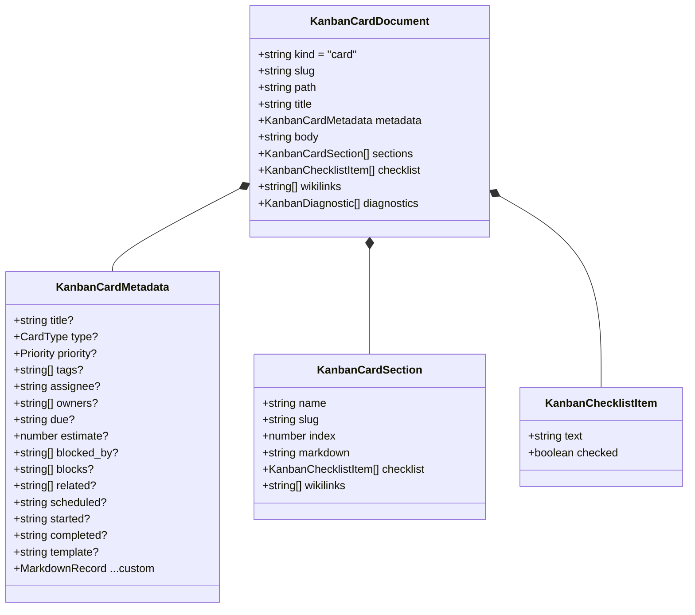
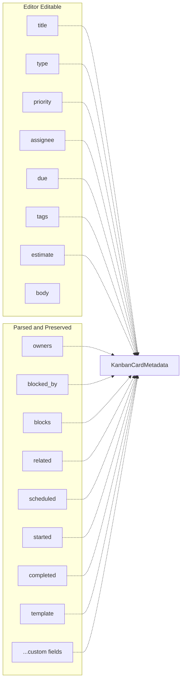
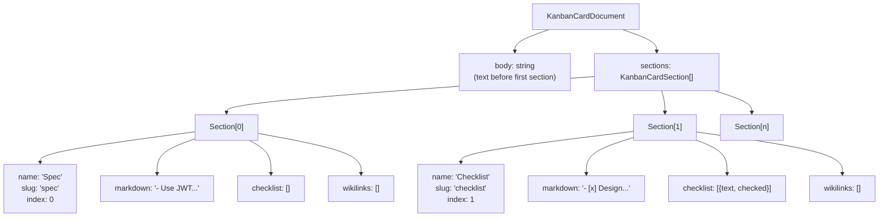
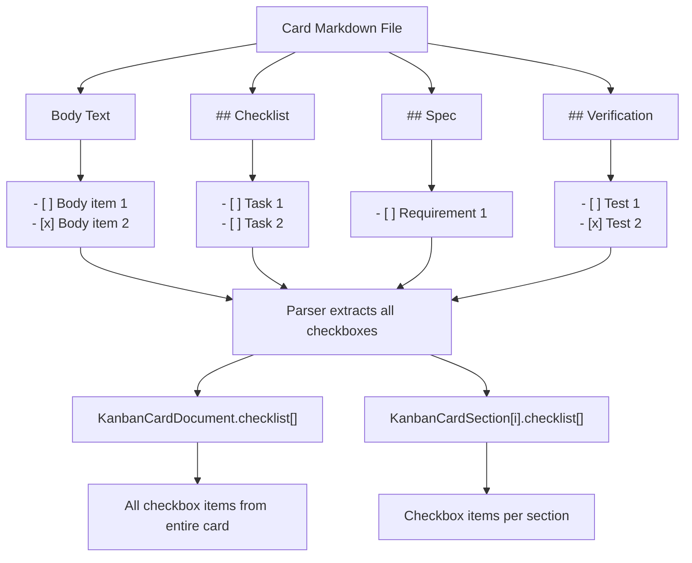
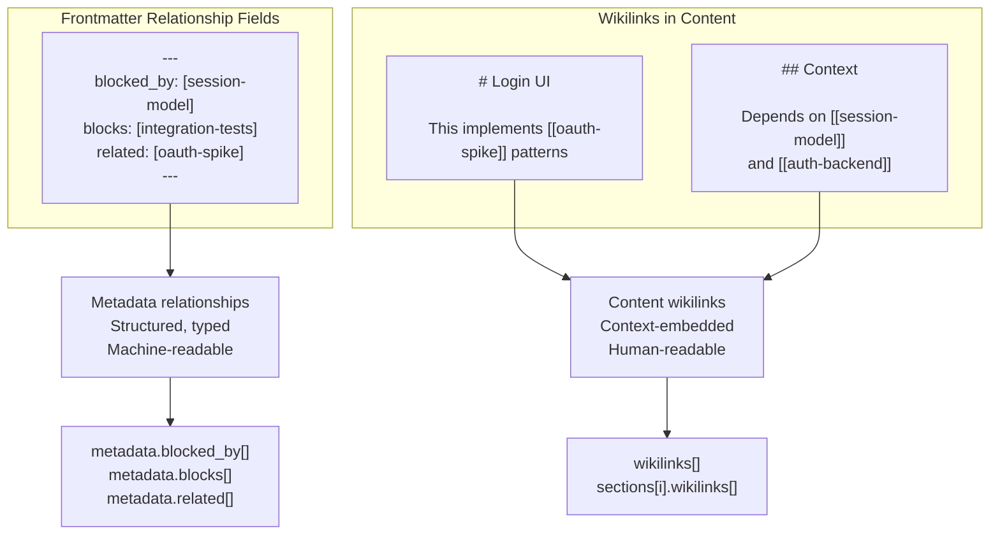
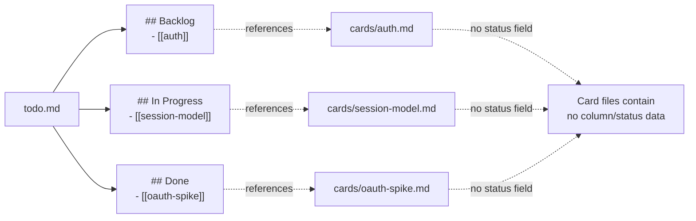
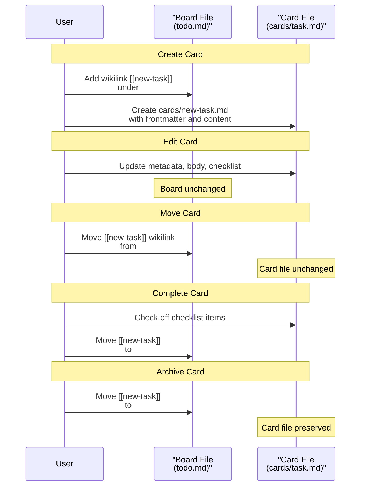

# Cards

<details>
<summary>Relevant source files</summary>

The following files were used as context for generating this wiki page:

- [TODO/README.md](../TODO/README.md)
- [docs/plans/2026-03-10-markdown-kanban-design.md](../docs/plans/2026-03-10-markdown-kanban-design.md)
- [docs/schemas/kanban-parser-schema.ts](../docs/schemas/kanban-parser-schema.ts)

</details>


Cards represent individual work items in KanStack. Each card is a standalone markdown file containing structured metadata, description, planning content, and task tracking information. Cards are referenced from boards via wikilinks, with the board placement determining the card's status and position in the workflow.

This page explains card structure, metadata, content organization, and relationships. For information about how cards are referenced and positioned on boards, see [Boards and Sub-Boards](4.2-boards-and-sub-boards.md). For details on the markdown syntax used in cards, see [Markdown Format](4.4-markdown-format.md). For implementation details on parsing and serialization, see [Workspace Parsing](#5.4.1) and [Board and Card Serialization](#5.4.2).

## Card Files and Location

Cards are stored as markdown files in `cards/` directories within the workspace structure. Each card occupies a single file named using a slug identifier.

### File Naming

```
TODO/
├── todo.md                    # root board
├── cards/
│   ├── session-model.md       # card with slug "session-model"
│   ├── auth.md                # card with slug "auth"
│   └── markdown-parser.md     # card with slug "markdown-parser"
└── project/
    └── TODO/
        └── cards/
            └── implement-api.md  # sub-board card
```

**File Naming Rules:**
- Card filename slug should be simple, lowercase, with hyphens for spaces
- Slug must match the wikilink reference from the board (e.g., `[[session-model]]` → `session-model.md`)
- Each card occupies exactly one markdown file
- Card files live in the `cards/` subdirectory of the board's TODO/ root

**Sources:** [TODO/README.md:1-179](../TODO/README.md), [docs/plans/2026-03-10-markdown-kanban-design.md:1-80](../docs/plans/2026-03-10-markdown-kanban-design.md)

### Card Data Type

The parsed representation of a card is defined by the `KanbanCardDocument` interface:



**Sources:** [docs/schemas/kanban-parser-schema.ts:83-126](../docs/schemas/kanban-parser-schema.ts)

## Card Anatomy

A card file consists of four main components: frontmatter, title heading, body text, and optional sections.

### Basic Structure

```markdown
---
title: Session Model
type: feature
priority: high
tags:
  - auth
  - backend
assignee: Galen
estimate: 5
---

# Session Model

Design and implement the session data model for user authentication.

## Spec

- Use JWT tokens for stateless sessions
- Store session metadata in Redis
- Support token refresh workflow

## Context

This builds on the authentication spike in [[oauth-spike]].

## Checklist

- [x] Research session patterns
- [x] Design data model
- [ ] Implement backend logic
- [ ] Add tests
```

### Structure Components

| Component | Syntax | Required | Purpose |
|-----------|--------|----------|---------|
| Frontmatter | `---` delimited YAML | No | Structured metadata fields |
| Title Heading | `# Title` | Yes | Card title (level 1 heading) |
| Body | Plain text/markdown | No | Card description |
| Sections | `## Section Name` | No | Organized content blocks |

**Parsing Behavior:**
- The title heading (`# Title`) is extracted separately and stored as `title` in `KanbanCardDocument`
- The `body` field contains description text between the title heading and first section
- Unknown frontmatter keys are preserved during save operations
- Sections (`##` headings) are parsed into structured `KanbanCardSection` objects

**Sources:** [TODO/README.md:106-168](../TODO/README.md), [docs/plans/2026-03-10-markdown-kanban-design.md:42-50](../docs/plans/2026-03-10-markdown-kanban-design.md), [docs/schemas/kanban-parser-schema.ts:83-94](../docs/schemas/kanban-parser-schema.ts)

## Card Metadata

Card metadata is stored in frontmatter as structured YAML fields. The metadata defines work attributes, relationships, and tracking information.

### Core Metadata Fields

| Field | Type | Values | Description |
|-------|------|--------|-------------|
| `title` | string | Any text | Card title (synced with `# heading`) |
| `type` | string | `task`, `bug`, `feature`, `research`, `chore` | Work item type |
| `priority` | string | `low`, `medium`, `high` | Priority level |
| `tags` | string[] | Any tags | Categorization labels |
| `assignee` | string | Person name | Primary person responsible |
| `estimate` | number | Story points / hours | Effort estimate |

**Sources:** [TODO/README.md:169-179](../TODO/README.md), [docs/schemas/kanban-parser-schema.ts:96-112](../docs/schemas/kanban-parser-schema.ts)

### Date and Timeline Fields

| Field | Type | Format | Description |
|-------|------|--------|-------------|
| `due` | string | `YYYY-MM-DDTHH:mm` | Due date/time (local datetime) |
| `scheduled` | string | `YYYY-MM-DD` | Planned start date |
| `started` | string | `YYYY-MM-DD` | Actual start date |
| `completed` | string | `YYYY-MM-DD` | Completion date |

**Note:** The `due` field should use the full datetime format `YYYY-MM-DDTHH:mm`, while other date fields use `YYYY-MM-DD`.

**Sources:** [TODO/README.md:169-179](../TODO/README.md), [docs/schemas/kanban-parser-schema.ts:103-111](../docs/schemas/kanban-parser-schema.ts)

### Relationship Fields

| Field | Type | Values | Description |
|-------|------|--------|-------------|
| `owners` | string[] | Person names | Multiple responsible parties |
| `blocked_by` | string[] | Card slugs | Cards blocking this card |
| `blocks` | string[] | Card slugs | Cards this card blocks |
| `related` | string[] | Card slugs | Related cards |

Relationship fields use card slugs to reference other cards:

```yaml
---
title: Login UI
blocked_by:
  - session-model
  - auth-backend
blocks:
  - integration-tests
related:
  - oauth-spike
---
```

**Sources:** [TODO/README.md:169-179](../TODO/README.md), [docs/schemas/kanban-parser-schema.ts:105-107](../docs/schemas/kanban-parser-schema.ts)

### Custom and Preserved Fields

```yaml
---
title: API Endpoint
type: feature
# Custom fields are preserved
story_points: 8
sprint: "2024-Q1-S3"
jira_id: PROJ-1234
parent_initiative: platform-v2
---
```

**Preservation Guarantee:** Unknown frontmatter keys are preserved during parse and serialize operations, allowing teams to extend the schema with custom fields without data loss.

**Sources:** [TODO/README.md:169-179](../TODO/README.md), [docs/plans/2026-03-10-markdown-kanban-design.md:44-50](../docs/plans/2026-03-10-markdown-kanban-design.md)

### Editable vs. Preserved Fields

The card editor UI currently supports direct editing of a subset of metadata fields:



All fields in `KanbanCardMetadata` are preserved when cards are loaded, edited, and saved, but the current card editor modal provides UI controls only for the "Editor Editable" subset.

**Sources:** [TODO/README.md:169-179](../TODO/README.md), [docs/schemas/kanban-parser-schema.ts:96-112](../docs/schemas/kanban-parser-schema.ts)

## Content Organization with Sections

Cards organize detailed content using `##` level sections. Sections provide structured areas for different types of planning and tracking information.

### Common Section Patterns

| Section Name | Purpose | Content Type |
|--------------|---------|--------------|
| Spec | Requirements and specifications | Bulleted requirements, acceptance criteria |
| Context | Background and motivation | Related work, dependencies, decisions |
| Checklist | Task breakdown | Checkbox list items |
| Review Notes | Feedback and corrections | Discussion, changes made |
| Verification | Testing and validation | Test scenarios, validation steps |
| Links / Depends On | Relationships | Wikilinks to related cards |

### Section Data Structure



Each `KanbanCardSection` contains:
- `name` and `slug`: Section identifier
- `index`: Position in card
- `markdown`: Raw markdown content of the section
- `checklist`: Extracted checkbox items
- `wikilinks`: Extracted wikilink references

**Sources:** [docs/schemas/kanban-parser-schema.ts:114-121](../docs/schemas/kanban-parser-schema.ts), [TODO/README.md:106-168](../TODO/README.md)

### Example: Full Card with Sections

```markdown
---
title: README Schema Coverage
type: feature
priority: high
tags:
  - docs
  - workflow
assignee: Galen
estimate: 3
---

# README Schema Coverage

Refresh the local KanStack README so new tasks have accurate examples.

## Spec

- Cover the supported board structure and actual current settings behavior.
- Match the fields the current editor can edit directly.
- Keep the examples easy to copy into `TODO/`.

## Context

This work builds on [[bootstrap-todo-kanstack]] and should stay aligned 
with the active schema docs.

## Checklist

- [x] Review `docs/schemas/kanban-parser-schema.ts`
- [x] Identify missing board and card fields in `TODO/README.md`
- [ ] Update the examples and guidance
- [ ] Verify the final examples render cleanly

## Review Notes

- Added a board example that matches the current parser and app behavior.
- Added a card example that matches the current editor fields and file format.

## Verification

- [ ] Compare the README examples against the schema
- [ ] Open the board/card in the app and spot-check the structure
```

**Sources:** [TODO/README.md:114-168](../TODO/README.md)

## Checklists

Checklist items are first-class data in cards, extracted from anywhere they appear in the markdown content. Checkbox list items use standard markdown checkbox syntax.

### Checkbox Syntax

```markdown
- [ ] Unchecked item
- [x] Checked item
- [X] Also checked (uppercase X)
```

### Checklist Extraction



The parser produces two checklist views:
1. `KanbanCardDocument.checklist`: Aggregated list of all checkbox items in the card
2. `KanbanCardSection[].checklist`: Checkbox items within each specific section

**Sources:** [docs/schemas/kanban-parser-schema.ts:91-126](../docs/schemas/kanban-parser-schema.ts), [TODO/README.md:106-168](../TODO/README.md)

### Checklist Item Structure

Each checklist item is represented as:

```typescript
interface KanbanChecklistItem {
  text: string      // Item text without checkbox syntax
  checked: boolean  // true if [x] or [X], false if [ ]
}
```

Example extraction:

| Markdown Source | Parsed Result |
|----------------|---------------|
| `- [ ] Write tests` | `{text: "Write tests", checked: false}` |
| `- [x] Review code` | `{text: "Review code", checked: true}` |
| `- [X] Deploy` | `{text: "Deploy", checked: true}` |

**Sources:** [docs/schemas/kanban-parser-schema.ts:123-126](../docs/schemas/kanban-parser-schema.ts)

## Card Relationships

Cards can reference other cards through two mechanisms: structured relationship metadata fields and wikilinks in markdown content.

### Relationship Metadata vs. Wikilinks



**Metadata Relationships:**
- Stored in frontmatter as structured arrays
- Typed by field name (`blocked_by`, `blocks`, `related`)
- Machine-parseable for dependency tracking
- Use card slugs as values

**Wikilinks:**
- Embedded in body text and sections
- Provide human context for relationships
- Extracted during parsing into `wikilinks` arrays
- Use wiki-style link syntax `[[card-slug]]`

**Sources:** [docs/schemas/kanban-parser-schema.ts:83-126](../docs/schemas/kanban-parser-schema.ts), [TODO/README.md:106-168](../TODO/README.md)

### Relationship Field Reference

| Field | Relationship Type | Example Usage |
|-------|------------------|---------------|
| `blocked_by` | Dependency | Card cannot start until referenced cards complete |
| `blocks` | Reverse dependency | Referenced cards depend on this card |
| `related` | Association | Referenced cards provide context or shared scope |
| `owners` | Collaboration | Multiple people responsible (not card reference) |

Example with multiple relationship types:

```yaml
---
title: Integration Tests
type: chore
blocked_by:
  - login-ui
  - session-model
  - auth-backend
blocks:
  - production-deploy
related:
  - test-automation-spike
  - ci-pipeline-setup
owners:
  - Galen
  - Alex
---

# Integration Tests

End-to-end tests for the authentication flow.

## Dependencies

Blocked by completion of [[login-ui]], [[session-model]], and [[auth-backend]].

## Context

Related to earlier work in [[test-automation-spike]].
```

**Sources:** [TODO/README.md:169-179](../TODO/README.md), [docs/schemas/kanban-parser-schema.ts:105-107](../docs/schemas/kanban-parser-schema.ts)

### Wikilink Extraction

Wikilinks are extracted from:
- Card body text
- Section markdown content
- Checklist item text

```typescript
interface KanbanCardDocument {
  wikilinks: string[]  // All wikilinks in entire card
  sections: KanbanCardSection[]
}

interface KanbanCardSection {
  wikilinks: string[]  // Wikilinks in this section only
}
```

**Extraction Example:**

```markdown
# Feature Card

Implements [[user-authentication]] based on [[security-spec]].

## Spec

See requirements in [[product-requirements]].

## Checklist

- [ ] Review [[api-design]]
- [ ] Implement logic
```

Produces:
- `KanbanCardDocument.wikilinks`: `["user-authentication", "security-spec", "product-requirements", "api-design"]`
- Section "Spec" wikilinks: `["product-requirements"]`
- Section "Checklist" wikilinks: `["api-design"]`

**Sources:** [docs/schemas/kanban-parser-schema.ts:92-93](../docs/schemas/kanban-parser-schema.ts), [docs/schemas/kanban-parser-schema.ts:120](../docs/schemas/kanban-parser-schema.ts)

## Card Status and Board Placement

Cards do not store their workflow status internally. Instead, **board placement determines card status**. The position of a card's wikilink reference on a board indicates which column and section the card occupies.

### Status Through Board References



**Key Principle:** A card file contains work content (description, checklist, metadata), while the board file contains workflow state (column, section, position).

**Sources:** [TODO/README.md:29-37](../TODO/README.md), [docs/plans/2026-03-10-markdown-kanban-design.md:13-23](../docs/plans/2026-03-10-markdown-kanban-design.md)

### Multi-Board References

A single card can be referenced from multiple boards:

```
project-a/TODO/todo.md:
## In Progress
- [[cards/shared-component]]

project-b/TODO/todo.md:
## Backlog
- [[../project-a/TODO/cards/shared-component]]
```

The same card appears in different columns on different boards, demonstrating that status is a view property, not an intrinsic card property.

**Sources:** [docs/plans/2026-03-10-markdown-kanban-design.md:13-23](../docs/plans/2026-03-10-markdown-kanban-design.md)

## Card Lifecycle Summary



**Lifecycle Operations:**
1. **Creation**: Add wikilink to board, create card file
2. **Editing**: Modify card file (metadata, content, checklist)
3. **Status Changes**: Move wikilink between board columns
4. **Completion**: Update checklist, move to Done
5. **Archival**: Move to Archive column (card file persists)

**Sources:** [TODO/README.md:1-179](../TODO/README.md), [docs/plans/2026-03-10-markdown-kanban-design.md:42-50](../docs/plans/2026-03-10-markdown-kanban-design.md)
