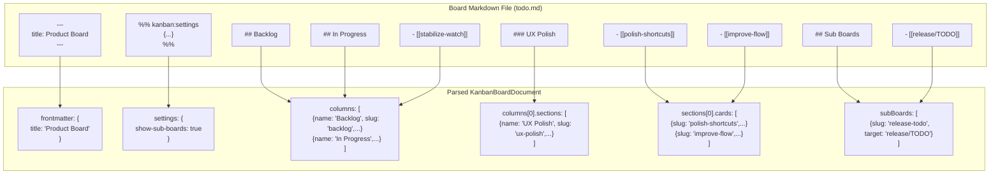
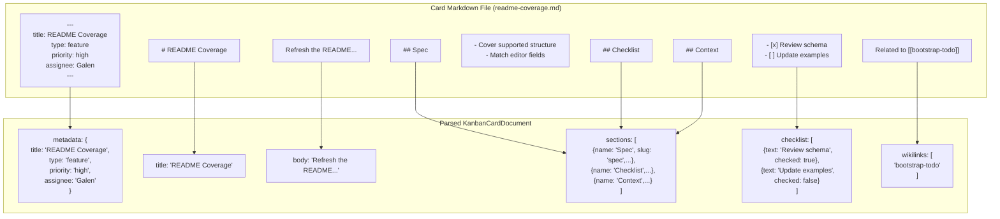

# Markdown Format

<details>
<summary>Relevant source files</summary>

The following files were used as context for generating this wiki page:

- [TODO/README.md](../TODO/README.md)
- [docs/plans/2026-03-10-markdown-kanban-design.md](../docs/plans/2026-03-10-markdown-kanban-design.md)
- [docs/schemas/kanban-parser-schema.ts](../docs/schemas/kanban-parser-schema.ts)

</details>


This document describes the markdown conventions used in KanStack to represent boards and cards. It covers frontmatter structure, heading semantics, wikilink syntax, settings blocks, and how markdown elements map to the parsed data model. For information about how these files are organized in the workspace, see [Workspaces and TODO/ Structure](4.1-workspaces-and-todo-structure.md). For parsing implementation details, see [Workspace Parsing](#5.4.1).

## Board Markdown Structure

Board files use markdown with specific conventions to encode columnar structure, card placement, and settings.

### Frontmatter

Board frontmatter contains lightweight metadata. The `title` field is the canonical board title:

```yaml
---
title: Product Board
---
```

Additional frontmatter fields are preserved but not actively used by the parser. The frontmatter is parsed and stored in `KanbanBoardDocument.frontmatter` as a `MarkdownRecord`.

**Sources:** [docs/schemas/kanban-parser-schema.ts:28-38](../docs/schemas/kanban-parser-schema.ts), [TODO/README.md:32-33](../TODO/README.md)

### Settings Block

Board settings are encoded in a special comment block immediately after frontmatter:

```markdown
%% kanban:settings
```json
{
  "show-sub-boards": true,
  "show-archive-column": false
}
```
%%
```

The block uses Obsidian-style comment delimiters (`%% %%`) with a JSON fenced code block inside. This format makes settings easy to parse while remaining hidden in markdown previewers.

#### Active Settings

| Setting Key | Type | Values | Description |
|-------------|------|--------|-------------|
| `show-sub-boards` | boolean | `true`, `false` | Controls rolled-up display of descendant cards |
| `show-archive-column` | boolean | `true`, `false` | Controls visibility of the Archive column |
| `group-by` | string | `none`, `section`, `assignee`, `priority`, `type`, `due` | Card grouping mode (parsed, preserved) |
| `show-empty-columns` | boolean | `true`, `false` | Empty column visibility (parsed, preserved) |
| `card-preview` | string | `none`, `metadata`, `body` | Card preview content mode (parsed, preserved) |
| `list-collapse` | boolean[] | - | Column collapse state (parsed, preserved) |
| `column-settings` | object | - | Per-column settings keyed by column slug |

#### Column Settings

The `column-settings` object uses column slugs as keys and supports:

| Setting Key | Type | Description |
|-------------|------|-------------|
| `wip-limit` | number | Work-in-progress limit for the column |
| `collapsed` | boolean | Column collapsed state |
| `default-section` | string | Default section slug for new cards |
| `hidden` | boolean | Column visibility flag |

Unknown settings keys are preserved during parse and serialization, enabling custom extensions without schema migrations.

**Sources:** [docs/schemas/kanban-parser-schema.ts:66-81](../docs/schemas/kanban-parser-schema.ts), TODO/README.md:48-55,96-104, [docs/plans/2026-03-10-markdown-kanban-design.md:35-41](../docs/plans/2026-03-10-markdown-kanban-design.md)

### Column Structure

Columns are defined with `##` level-2 headings:

```markdown
## Backlog

- [[plan-next-release]]
- [[improve-documentation]]

## In Progress

- [[stabilize-watch-mode]]

## Done

- [[ship-markdown-parser]]
```

Each `##` heading creates a `KanbanColumn` with:
- `name`: heading text
- `slug`: generated from heading text
- `index`: column position (0-based)
- `sections`: array of sections within the column

Column order is determined by heading order in the document. Bullet lists under a column heading define card membership.

**Sources:** [docs/schemas/kanban-parser-schema.ts:40-45](../docs/schemas/kanban-parser-schema.ts), [TODO/README.md:33](../TODO/README.md), [docs/plans/2026-03-10-markdown-kanban-design.md:16](../docs/plans/2026-03-10-markdown-kanban-design.md)

### Section Structure

Sections are optional subdivisions within columns, defined with `###` level-3 headings:

```markdown
## Backlog

- [[direct-card-in-backlog]]

### UX Polish

- [[polish-keyboard-shortcuts]]
- [[improve-new-card-flow]]

### Backend Work

- [[refactor-parser]]
```

Cards appearing directly under a `##` heading (before any `###` heading) form an unnamed default section with `name: null` and `slug: null`. Cards under a `###` heading belong to a named section.

Each section becomes a `KanbanSection` with:
- `name`: heading text (or `null` for default section)
- `slug`: generated from heading text (or `null` for default section)
- `index`: section position within the column
- `cards`: array of `KanbanCardLink` objects

**Sources:** [docs/schemas/kanban-parser-schema.ts:47-52](../docs/schemas/kanban-parser-schema.ts), [TODO/README.md:34-35](../TODO/README.md), [docs/plans/2026-03-10-markdown-kanban-design.md:26-32](../docs/plans/2026-03-10-markdown-kanban-design.md)

### Card Links

Cards are represented as wikilinks in bullet lists:

```markdown
## Backlog

- [[plan-next-release]]
- [[improve-documentation]]
```

Each bullet must contain exactly one wikilink. The wikilink target is parsed as a `KanbanCardLink`:

```typescript
{
  slug: "plan-next-release",
  target: "plan-next-release",
  title: undefined  // or extracted from [[target|Display Title]]
}
```

Wikilink display titles (using `[[target|title]]` syntax) are parsed but typically not used, as the card's own frontmatter provides the canonical title.

**Sources:** [docs/schemas/kanban-parser-schema.ts:54-58](../docs/schemas/kanban-parser-schema.ts), [TODO/README.md:89-90](../TODO/README.md), [docs/plans/2026-03-10-markdown-kanban-design.md:19](../docs/plans/2026-03-10-markdown-kanban-design.md)

### Sub Boards Section

Sub-boards are linked from a special `## Sub Boards` section:

```markdown
## Sub Boards

- [[release-readiness/TODO|Release Readiness]]
- [[technical-debt/TODO|Technical Debt]]
```

This section is **not** a normal column. It contains board links rather than card links. Each link becomes a `KanbanBoardLink` in the `subBoards` array with relative paths to other TODO directories.

**Sources:** [docs/schemas/kanban-parser-schema.ts:60-64](../docs/schemas/kanban-parser-schema.ts), TODO/README.md:36,84-94, docs/plans/2026-03-10-markdown-kanban-design.md:21-23,51-56

### Board Markdown to Data Structure Mapping



**Sources:** [docs/schemas/kanban-parser-schema.ts:28-64](../docs/schemas/kanban-parser-schema.ts), [TODO/README.md:39-85](../TODO/README.md)

## Card Markdown Structure

Card files are standalone markdown documents with frontmatter, a title heading, body content, and optional sections.

### Card Frontmatter

Card frontmatter contains structured metadata:

```yaml
---
title: README Schema Coverage
type: feature
priority: high
tags:
  - docs
  - workflow
assignee: Galen
estimate: 3
---
```

#### Metadata Fields

| Field | Type | Values | Description |
|-------|------|--------|-------------|
| `title` | string | - | Card title (canonical source) |
| `type` | string | `task`, `bug`, `feature`, `research`, `chore` | Card type classification |
| `priority` | string | `low`, `medium`, `high` | Priority level |
| `tags` | string[] | - | Tag labels |
| `assignee` | string | - | Primary assignee |
| `owners` | string[] | - | Card owners (parsed, preserved) |
| `due` | string | `YYYY-MM-DDTHH:mm` | Due date in local datetime format |
| `estimate` | number | - | Time estimate |
| `blocked_by` | string[] | - | Card slugs blocking this card |
| `blocks` | string[] | - | Card slugs blocked by this card |
| `related` | string[] | - | Related card slugs |
| `scheduled` | string | `YYYY-MM-DD` | Scheduled date (parsed, preserved) |
| `started` | string | `YYYY-MM-DD` | Start date (parsed, preserved) |
| `completed` | string | `YYYY-MM-DD` | Completion date (parsed, preserved) |
| `template` | string | - | Template reference (parsed, preserved) |

Unknown frontmatter keys are preserved as part of the `metadata` object, enabling custom fields like `story_points`, sprint IDs, or external issue IDs.

**Sources:** [docs/schemas/kanban-parser-schema.ts:96-112](../docs/schemas/kanban-parser-schema.ts), TODO/README.md:119-128,169-178

### Title Heading and Body

Cards begin with an `#` level-1 heading matching the frontmatter title:

```markdown
# README Schema Coverage

Refresh the local KanStack README so new tasks have accurate examples for boards, cards, optional metadata, and settings.
```

Content between the title heading and the first `##` heading is the card body, stored in `KanbanCardDocument.body`. The canonical title heading is excluded from the stored body content because serializers write it separately.

**Sources:** TODO/README.md:130,167

### Card Sections

Cards use `##` level-2 headings for planning sections:

```markdown
## Spec

- Cover the supported board structure and actual current settings behavior.
- Match the fields the current editor can edit directly.

## Context

This work builds on [[bootstrap-todo-kanstack]] and should stay aligned with the active schema docs.

## Checklist

- [x] Review `docs/schemas/kanban-parser-schema.ts`
- [x] Identify missing board and card fields
- [ ] Update the examples and guidance

## Review Notes

- Added a board example that matches the current parser.
- Added a card example that matches the current editor fields.
```

Each section becomes a `KanbanCardSection`:

```typescript
{
  name: "Checklist",
  slug: "checklist",
  index: 2,
  markdown: "- [x] Review `docs/schemas/kanban-parser-schema.ts`\n...",
  checklist: [...],
  wikilinks: [...]
}
```

Common section names include `Spec`, `Context`, `Checklist`, `Review Notes`, and `Verification`.

**Sources:** [docs/schemas/kanban-parser-schema.ts:114-121](../docs/schemas/kanban-parser-schema.ts), [TODO/README.md:134-159](../TODO/README.md)

### Checklists

Checklist items are extracted from markdown task lists wherever they appear:

```markdown
## Checklist

- [x] Review the schema
- [ ] Update examples
- [ ] Verify rendering
```

Each item becomes a `KanbanChecklistItem`:

```typescript
{
  text: "Review the schema",
  checked: true
}
```

Checklist items are extracted at both the card level (`KanbanCardDocument.checklist`) and section level (`KanbanCardSection.checklist`). The card-level array aggregates all checklist items from all sections.

**Sources:** [docs/schemas/kanban-parser-schema.ts:123-126](../docs/schemas/kanban-parser-schema.ts), [TODO/README.md:144-149](../TODO/README.md)

### Wikilinks in Cards

Wikilinks in card body and sections are extracted into `KanbanCardDocument.wikilinks` and `KanbanCardSection.wikilinks`:

```markdown
## Context

This work builds on [[bootstrap-todo-kanstack]] and should stay aligned with [[schema-docs]].
```

The `wikilinks` arrays contain slug strings (e.g., `["bootstrap-todo-kanstack", "schema-docs"]`). These enable relationship discovery and graph traversal.

Relationship fields in frontmatter (`blocked_by`, `blocks`, `related`) use card slugs directly and are stored separately in the metadata object.

**Sources:** [docs/schemas/kanban-parser-schema.ts:83-94](../docs/schemas/kanban-parser-schema.ts), TODO/README.md:112,142

### Card Markdown to Data Structure Mapping



**Sources:** [docs/schemas/kanban-parser-schema.ts:83-126](../docs/schemas/kanban-parser-schema.ts), [TODO/README.md:114-167](../TODO/README.md)

## Markdown Conventions

### Wikilink Syntax

KanStack uses standard wikilink syntax:

| Format | Example | Description |
|--------|---------|-------------|
| Simple | `[[card-slug]]` | Links to `cards/card-slug.md` |
| With path | `[[release/TODO]]` | Links to `release/TODO/todo.md` |
| With display text | `[[card-slug\|Display Text]]` | Link with custom label |

Wikilink targets are resolved relative to the workspace root or the current board's TODO directory. Card slugs match their filename without the `.md` extension.

**Sources:** TODO/README.md:11,23,59,84,89-90

### Slug Generation

Slugs are derived from titles or filenames using a normalization process:
- Convert to lowercase
- Replace spaces and special characters with hyphens
- Remove or replace non-alphanumeric characters
- Collapse multiple consecutive hyphens

For example:
- `"Product Board"` → `"product-board"`
- `"UX Polish"` → `"ux-polish"`
- `"README Schema Coverage"` → `"readme-schema-coverage"`

The slug becomes the identifier for lookups in `LoadedWorkspace.boardsBySlug` and `LoadedWorkspace.cardsBySlug`.

**Sources:** TODO/README.md:90,164

### Date Formats

| Field | Format | Example | Description |
|-------|--------|---------|-------------|
| `due` | `YYYY-MM-DDTHH:mm` | `2026-03-15T14:30` | Due date with time |
| `scheduled`, `started`, `completed` | `YYYY-MM-DD` | `2026-03-15` | Date-only fields |

Date formats should be consistent across the workspace to ensure proper parsing and display.

**Sources:** [TODO/README.md:177-178](../TODO/README.md)

### Preserved Fields and Extensions

Both board and card parsers preserve unknown frontmatter keys and settings. This enables:

- **Custom metadata fields**: `story_points`, `sprint_id`, `parent_epic`, `external_id`
- **Team-specific settings**: custom grouping modes, display preferences, integration flags
- **Future extensions**: new fields can be added without breaking existing workspaces

The parser reads these fields into `MarkdownRecord` objects, and serializers write them back unchanged.

**Sources:** [docs/schemas/kanban-parser-schema.ts:8-10](../docs/schemas/kanban-parser-schema.ts), TODO/README.md:94,165,176, docs/plans/2026-03-10-markdown-kanban-design.md:40,48

## Complete Examples

### Full Board Example

```markdown
---
title: Product Board
---

%% kanban:settings
```json
{
  "show-sub-boards": true,
  "show-archive-column": false
}
```
%%

## Backlog

- [[plan-next-release]]

### UX Polish

- [[polish-keyboard-shortcuts]]
- [[improve-new-card-flow]]

## In Progress

- [[stabilize-watch-mode]]

## Review

- [[qa-smoke-pass]]

## Done

- [[ship-markdown-parser]]

## Archive

- [[retire-old-demo-data]]

## Sub Boards

- [[release-readiness/TODO|Release Readiness]]
```

**Sources:** [TODO/README.md:43-85](../TODO/README.md)

### Full Card Example

```markdown
---
title: README Schema Coverage
type: feature
priority: high
tags:
  - docs
  - workflow
assignee: Galen
estimate: 3
---

# README Schema Coverage

Refresh the local KanStack README so new tasks have accurate examples for boards, cards, optional metadata, and settings.

## Spec

- Cover the supported board structure and actual current settings behavior.
- Match the fields the current editor can edit directly.
- Keep the examples easy to copy into `TODO/`.

## Context

This work builds on [[bootstrap-todo-kanstack]] and should stay aligned with the active schema docs.

## Checklist

- [x] Review `docs/schemas/kanban-parser-schema.ts`
- [x] Identify missing board and card fields in `TODO/README.md`
- [ ] Update the examples and guidance
- [ ] Verify the final examples render cleanly

## Review Notes

- Added a board example that matches the current parser and app behavior.
- Added a card example that matches the current editor fields and file format.

## Verification

- [ ] Compare the README examples against the schema
- [ ] Open the board/card in the app and spot-check the structure
```

**Sources:** [TODO/README.md:118-160](../TODO/README.md)

## Parsing Implementation

The markdown format is parsed by `parseWorkspace` in the frontend, which transforms `WorkspaceSnapshot` (raw file content) into `KanbanParseResult` (structured documents). The parsing logic extracts:

1. Frontmatter using YAML parsing
2. Settings blocks using regex pattern matching for `%% kanban:settings` delimiters
3. Structural headings (`##` for columns/sections, `###` for subsections)
4. Wikilinks using markdown link syntax patterns
5. Checklists from task list items
6. Diagnostics for malformed content

For detailed parsing logic, see [Workspace Parsing](#5.4.1). For serialization from structured data back to markdown, see [Board and Card Serialization](#5.4.2).

**Sources:** [docs/schemas/kanban-parser-schema.ts:12-17](../docs/schemas/kanban-parser-schema.ts)
