# Frontend Guide

<details>
<summary>Relevant source files</summary>

The following files were used as context for generating this wiki page:

- [index.html](../index.html)
- [package.json](../package.json)
- [src-tauri/tauri.conf.json](../src-tauri/tauri.conf.json)
- [src/App.vue](../src/App.vue)
- [src/main.ts](../src/main.ts)

</details>


## Purpose and Scope

This document provides a comprehensive guide to KanStack's Vue.js frontend codebase. It covers the application structure, component hierarchy, composable-based state management, and frontend utilities. The frontend is built with Vue 3 and TypeScript, using the Composition API pattern throughout.

For details on specific subsystems, see:
- Main application orchestration: [Main Application Component](5.1-main-application-component.md)
- State management patterns: [Composables Overview](../5.2.3-usecardeditor.md)
- UI components: [Key Components](../5.3.1-cardeditormodal.md)
- Parsing and serialization: [Frontend Utilities](../5.4.3-path-and-slug-management.md)
- Backend integration: [Backend Architecture](3.4-backend-architecture.md)
- Overall architecture: [Architecture Overview](3-architecture-overview.md)

---

## Technology Stack

The frontend is built on the following core technologies:

| Technology | Version | Purpose |
|------------|---------|---------|
| **Vue.js** | 3.5.13 | Reactive UI framework |
| **TypeScript** | 5.7.2 | Type-safe JavaScript |
| **Vite** | 5.4.14 | Build tool and dev server |
| **Tauri API** | 2.x | IPC bridge to Rust backend |
| **Vitest** | 3.2.4 | Unit testing framework |

**Sources:** [package.json:15-28](../package.json)

---

## Application Entry Point

The frontend application bootstraps through a standard Vue 3 setup:

```
index.html (root HTML template)
    ↓
src/main.ts (creates Vue app)
    ↓
src/App.vue (root component)
```

The entry point at [src/main.ts:1-6](../src/main.ts) creates a Vue application instance and mounts it to the DOM. The root HTML template at [index.html:1-13](../index.html) provides a minimal container (`<div id="app"></div>`) where the Vue application renders.

**Application Bootstrap Diagram:**

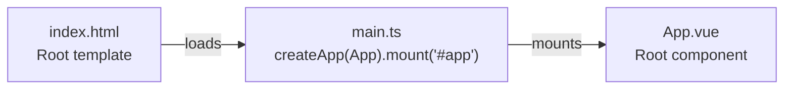

**Sources:** [index.html:1-13](../index.html), [src/main.ts:1-6](../src/main.ts)

---

## Component Hierarchy

The frontend uses a focused component structure with `App.vue` serving as the orchestrator. Components are organized into domain-specific directories under `src/components/`.

**Component Structure Diagram:**

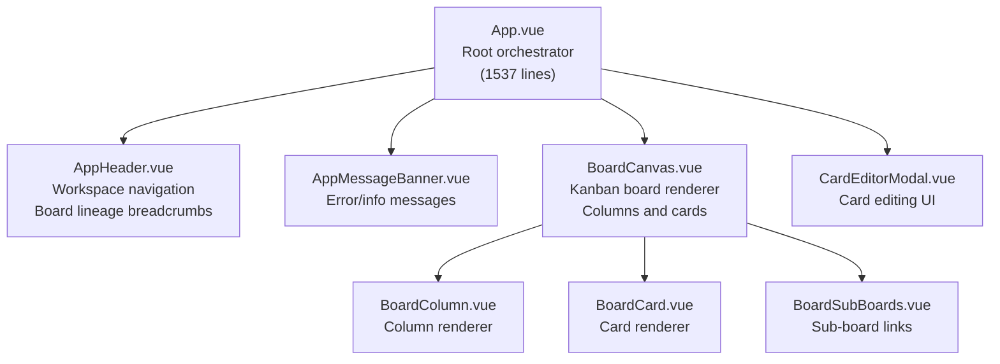

The component hierarchy follows a strict separation:

- **App.vue** ([src/App.vue:1-1537](../src/App.vue)): Owns all application state via composables, handles global keyboard shortcuts, coordinates menu actions, and manages workspace mutations.
- **Presentation Components**: Receive data via props, emit events for user actions, contain no business logic.
- **Domain Components**: Organized by domain (app/, board/, card/) for clear separation of concerns.

**Sources:** [src/App.vue:6-9](../src/App.vue)

---

## Composable Architecture

KanStack uses Vue's Composition API with specialized composables that separate concerns by domain. Each composable manages a specific aspect of application state and behavior.

**Composable Dependency Diagram:**

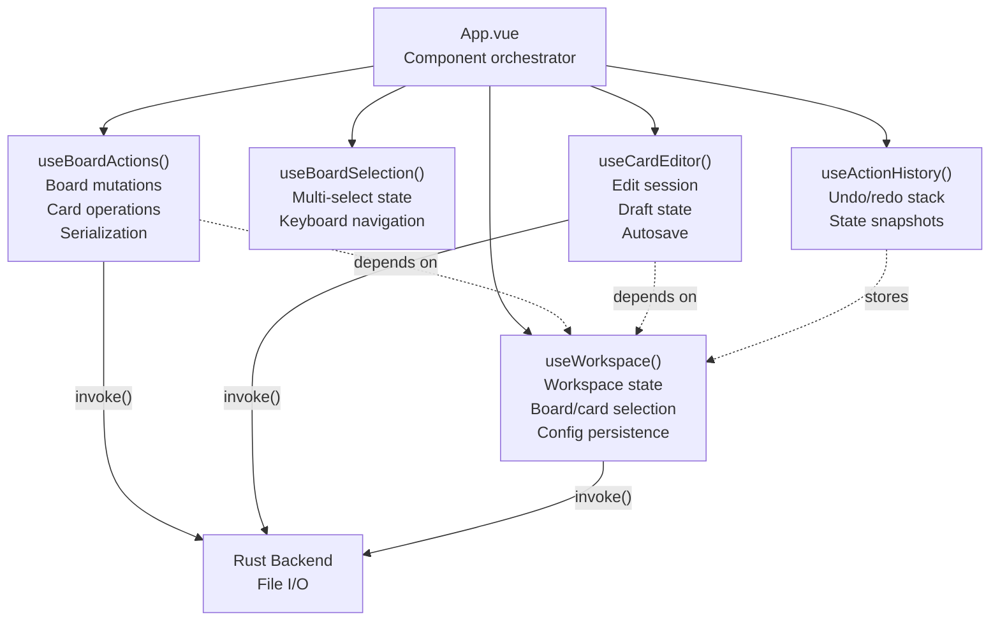

**Composable Responsibilities:**

| Composable | Primary Responsibility | Key Functions |
|------------|----------------------|---------------|
| `useWorkspace` | Workspace state and lifecycle | `openWorkspace()`, `selectBoard()`, `selectCard()`, `applyWorkspaceMutation()` |
| `useBoardActions` | Board and card mutations | `createCard()`, `moveCard()`, `archiveCards()`, `addColumn()`, `renameColumn()` |
| `useBoardSelection` | Multi-select UI state | `handleSelection()`, `moveSelection()`, `clearSelection()` |
| `useCardEditor` | Card editing session | `openCard()`, `saveDraft()`, `closeEditor()` |
| `useActionHistory` | Undo/redo functionality | `push()`, `shiftUndo()`, `shiftRedo()`, `clear()` |

**Sources:** [src/App.vue:29-64](../src/App.vue)

---

## State Management Patterns

The frontend uses a unidirectional data flow pattern with reactive state managed through composables:

**State Flow Diagram:**

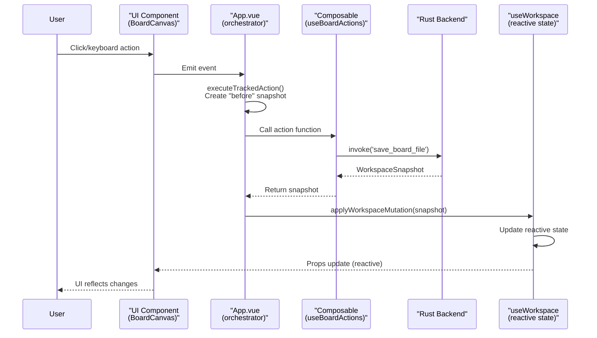

**Mutation Pattern:**

All workspace mutations follow a consistent pattern in [src/App.vue:134-155](../src/App.vue):

1. **Capture State**: Create a snapshot of current state for undo/redo
2. **Execute Action**: Call composable function that serializes and persists changes
3. **Receive Snapshot**: Backend returns updated `WorkspaceSnapshot`
4. **Store History**: Save before/after snapshots in action history
5. **Apply Mutation**: Update reactive state via `applyWorkspaceMutation()`

**Sources:** [src/App.vue:29-155](../src/App.vue)

---

## Workspace State Structure

The `useWorkspace` composable maintains several key pieces of reactive state:

**Workspace State Diagram:**

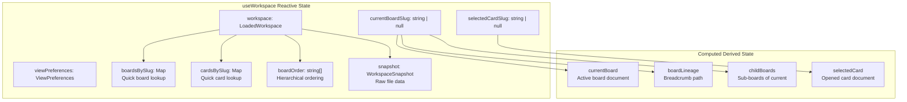

**Sources:** [src/App.vue:29-52](../src/App.vue)

---

## Event Flow and User Interactions

User interactions flow through a consistent event handling pattern:

**Keyboard Shortcuts:**

Global keyboard shortcuts are handled in [src/App.vue:912-1108](../src/App.vue). The application distinguishes between:

- **Editable context**: When focus is in an input/textarea (shortcuts disabled)
- **Global context**: When focus is on the board (shortcuts enabled)

Key shortcuts include:

| Shortcut | Action | Implementation |
|----------|--------|----------------|
| `Cmd/Ctrl+O` | Open workspace | `openWorkspaceFromMenu()` |
| `Cmd/Ctrl+N` | New card | `createCardFromBoard()` |
| `Cmd/Ctrl+Shift+N` | New board | `createBoardFromWorkspace()` |
| `Cmd/Ctrl+Z` | Undo | `undoAction()` |
| `Cmd/Ctrl+Shift+Z` | Redo | `redoAction()` |
| `Cmd/Ctrl+Shift+A` | Toggle archive | `toggleArchiveColumn()` |
| `Escape` | Close/clear selection | Multi-level escape handling |
| `Enter` | Open selected card | `openSelectedCard()` |
| `Delete/Backspace` | Archive cards | `archiveSelectedCards()` |
| `Shift+Delete` | Delete cards | `deleteSelectedCards()` |
| `Space` | Enter move mode | Toggle `keyboardMoveMode` |
| `Arrow keys` | Navigate/move | Context-dependent navigation |

**Keyboard Move Mode:**

The application supports two keyboard move modes ([src/App.vue:62](../src/App.vue), [src/App.vue:975-1022](../src/App.vue)):
- **Card move mode**: Activated with `Space` when a card is selected, allows arrow key repositioning
- **Column move mode**: Activated with `Space` when a column is selected, allows left/right reordering

**Sources:** [src/App.vue:912-1120](../src/App.vue)

---

## Menu Integration

The frontend integrates with Tauri's native menu system through an event listener:

**Menu Action Flow:**

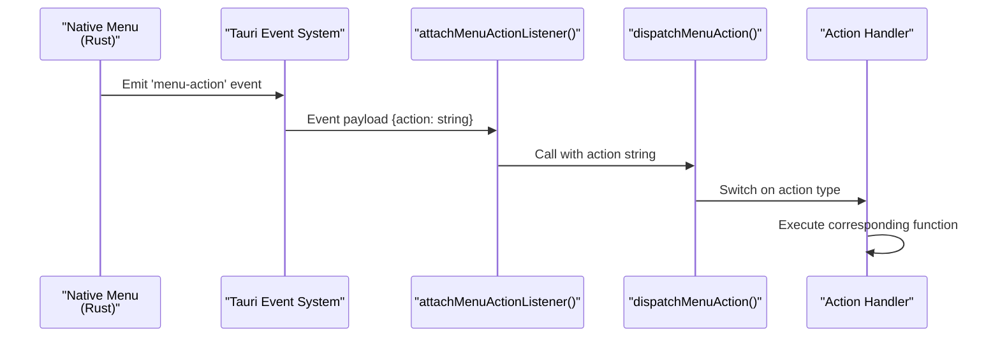

Menu actions are registered in [src/App.vue:1122-1133](../src/App.vue) and dispatched in [src/App.vue:1135-1201](../src/App.vue). The dispatcher maps action strings to handler functions:

```
"open-folder" → openWorkspaceFromMenu()
"new-card" → createCardFromBoard()
"new-board" → createBoardFromWorkspace()
"undo-action" → undoAction()
"archive-selected-cards" → archiveSelectedCards()
...etc
```

**Sources:** [src/App.vue:1122-1201](../src/App.vue)

---

## IPC Communication with Backend

The frontend communicates with the Rust backend through Tauri's `invoke()` API. All IPC calls are asynchronous and return `WorkspaceSnapshot` objects that represent the updated file system state.

**IPC Command Patterns:**

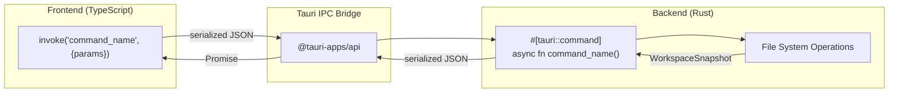

**Common IPC Commands:**

| Command | Purpose | Return Type |
|---------|---------|-------------|
| `load_workspace` | Load workspace from path | `WorkspaceSnapshot` |
| `save_board_file` | Write board markdown | `WorkspaceSnapshot` |
| `save_card_file` | Write card markdown | `WorkspaceSnapshot` |
| `create_card` | Create new card file | `{slug, snapshot}` |
| `delete_card_file` | Delete card file | `WorkspaceSnapshot` |
| `delete_board` | Delete board and descendants | `WorkspaceSnapshot` |
| `apply_workspace_snapshot` | Restore snapshot (undo/redo) | `WorkspaceSnapshot` |

**Sources:** [src/App.vue:3](../src/App.vue), [src/App.vue:119-131](../src/App.vue), [src/App.vue:709-719](../src/App.vue), [src/App.vue:783-794](../src/App.vue)

---

## Undo/Redo System

The undo/redo system is implemented using the `useActionHistory` composable, which stores complete workspace snapshots for each tracked action.

**Action History Structure:**

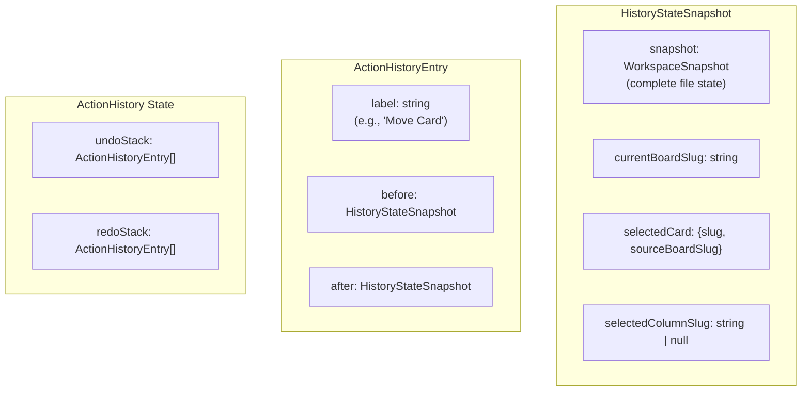

**Tracked Action Pattern:**

The `executeTrackedAction()` function ([src/App.vue:134-155](../src/App.vue)) wraps any mutation operation:

1. Call `createHistoryStateSnapshot()` to capture current state
2. Execute the action (returns a new snapshot)
3. Push both snapshots to action history with a label
4. Apply the new snapshot to reactive state

**Undo Operation:**

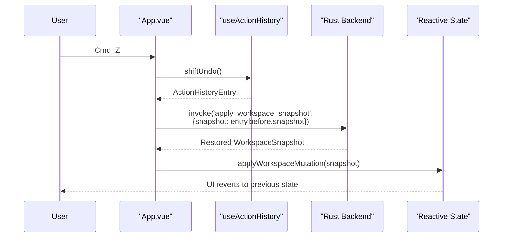

**Sources:** [src/App.vue:64](../src/App.vue), [src/App.vue:99-155](../src/App.vue), [src/App.vue:211-227](../src/App.vue)

---

## Multi-Select System

The `useBoardSelection` composable manages card multi-selection with keyboard and mouse support:

**Selection Interaction Patterns:**

| Interaction | Behavior |
|-------------|----------|
| Click card | Select single card, clear previous selection |
| Cmd/Ctrl+Click | Toggle card in selection |
| Shift+Click | Range select from last selected to clicked card |
| Arrow keys | Navigate selection in direction |
| Cmd/Ctrl+A | Select all visible cards |

**Selection State:**

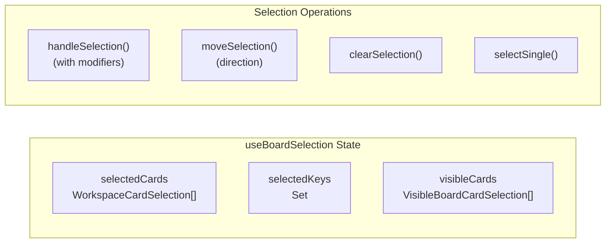

The selection system maintains a reference to all visible cards on the board ([src/App.vue:420-422](../src/App.vue)) to enable keyboard navigation and range selection. When cards are selected, they're tracked both as an array and as a Set of keys for efficient lookup.

**Sources:** [src/App.vue:60](../src/App.vue), [src/App.vue:420-422](../src/App.vue), [src/App.via:511-522](../src/App.via)

---

## Application Message System

The application displays temporary messages to users through `AppMessageBanner`. Messages auto-dismiss after 5 seconds.

**Message Flow:**

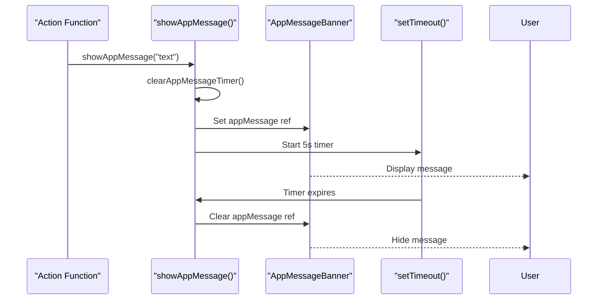

Messages are used for:
- Operation confirmations ("Created new board at...")
- Error notifications ("Cannot rename Archive column")
- Status updates ("Removed X missing known boards")

**Sources:** [src/App.vue:61](../src/App.vue), [src/App.vue:873-910](../src/App.vue)

---

## View Preferences

The `viewPreferences` state ([src/App.vue:40](../src/App.vue)) stores UI preferences that are persisted to the workspace config:

**Preference Structure:**

| Preference | Type | Purpose |
|------------|------|---------|
| `card-reorder` | `boolean` | Enable/disable drag-and-drop card reordering |

The `isCardReorderEnabled()` utility checks if card reordering is enabled ([src/App.vue:67](../src/App.vue)). This preference gates features like:
- Drag-and-drop card movement
- Keyboard card movement with Space+Arrows
- Card move mode activation

**Sources:** [src/App.vue:40](../src/App.vue), [src/App.vue:67](../src/App.vue), [src/App.vue:81-85](../src/App.vue)

---

## Board Lineage and Navigation

The application maintains a breadcrumb-style navigation path through nested boards:

**Lineage Computation:**

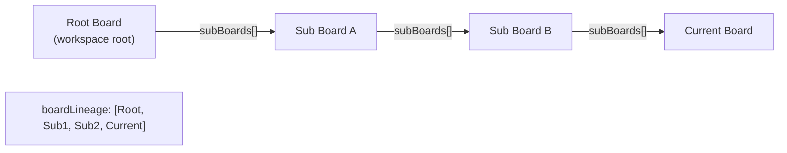

The `boardLineage` computed property ([src/App.vue:33](../src/App.vue)) builds an array representing the path from the workspace root to the currently selected board. This powers:
- Breadcrumb navigation in `AppHeader`
- Parent board resolution for board deletion
- Hierarchical board traversal

**Sources:** [src/App.vue:33](../src/App.vue), [src/App.vue:773-776](../src/App.vue)

---

## Column and Section Management

Boards organize cards into columns, which can optionally contain sections. The frontend handles column operations through `useBoardActions`:

**Column Operations:**

| Operation | Function | Tracked in History |
|-----------|----------|-------------------|
| Add column | `addColumn()` | Yes |
| Rename column | `renameColumn()` | Yes |
| Delete column | `deleteColumn()` | Yes |
| Reorder columns | `reorderColumns()` | Yes |

**Special Columns:**

- **Archive Column**: Has slug `archive`, cannot be renamed or deleted ([src/App.vue:442-444](../src/App.vue), [src/App.vue:817-819](../src/App.vue))
- **Show/Hide Archive**: Controlled by `show-archive` board setting ([src/App.vue:334-375](../src/App.vue))

**Sources:** [src/App.vue:264-294](../src/App.vue), [src/App.vue:437-475](../src/App.vue), [src/App.vue:812-863](../src/App.vue)

---

## Card Move Operations

Card movement is one of the most complex operations, supporting both drag-and-drop and keyboard-based movement:

**Card Move Data Structure:**

```typescript
interface CardMovePayload {
    cardSlug: string;
    sourceBoardSlug: string;
    targetColumnName: string;
    targetColumnSlug: string;
    targetSectionName: string | null;
    targetSectionSlug: string | null;
    targetIndex: number;
}
```

**Keyboard Card Movement:**

The keyboard movement system ([src/App.vue:1323-1367](../src/App.vue)) calculates target positions based on arrow key direction:

- **Up/Down**: Moves card within the same column, respecting section boundaries
- **Left/Right**: Moves card to adjacent column at same vertical position

The `getKeyboardCardMoveTarget()` function ([src/App.vue:1397-1501](../src/App.vue)) computes the target location by:
1. Flattening column cards into a single array with section metadata
2. Computing target index based on direction and current position
3. Adjusting for same-section moves (decrement index if moving within section)
4. Handling empty columns and edge cases

**Sources:** [src/App.vue:531-610](../src/App.vue), [src/App.vue:1323-1513](../src/App.vue)

---

## Board Deletion

Board deletion is a complex operation that handles cascading deletion of sub-boards:

**Deletion Flow:**

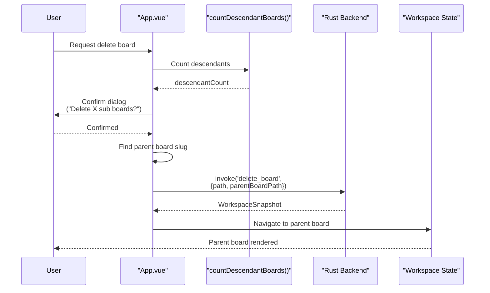

The `countDescendantBoards()` function ([src/App.vue:1229-1258](../src/App.vue)) performs a depth-first traversal to count all descendant boards, which is used to display an accurate confirmation message.

**Sources:** [src/App.vue:758-810](../src/App.vue), [src/App.vue:1229-1258](../src/App.vue)

---

## Summary

The KanStack frontend is built on Vue 3's Composition API with a clear separation of concerns:

- **App.vue** orchestrates all composables and handles global interactions
- **Composables** manage domain-specific state and operations
- **Components** are pure presentation with no business logic
- **State flows unidirectionally** from composables to components via props
- **User actions flow upward** through events to App.vue
- **All mutations are tracked** for undo/redo functionality
- **IPC communication** is handled through Tauri's invoke API

This architecture makes the frontend maintainable, testable, and easy to extend with new features.

**Sources:** [src/App.vue:1-1537](../src/App.vue), [src/main.ts:1-6](../src/main.ts), [package.json:1-29](../package.json)
