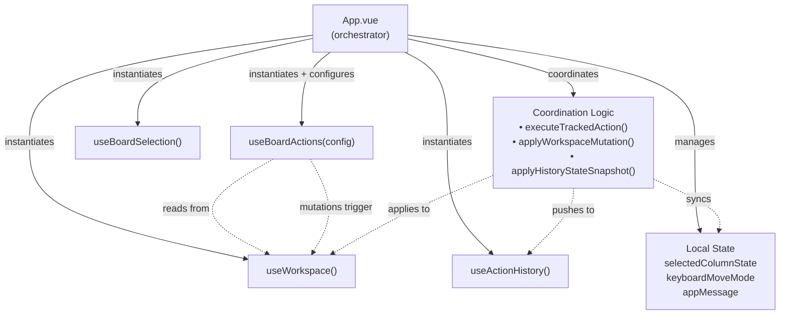
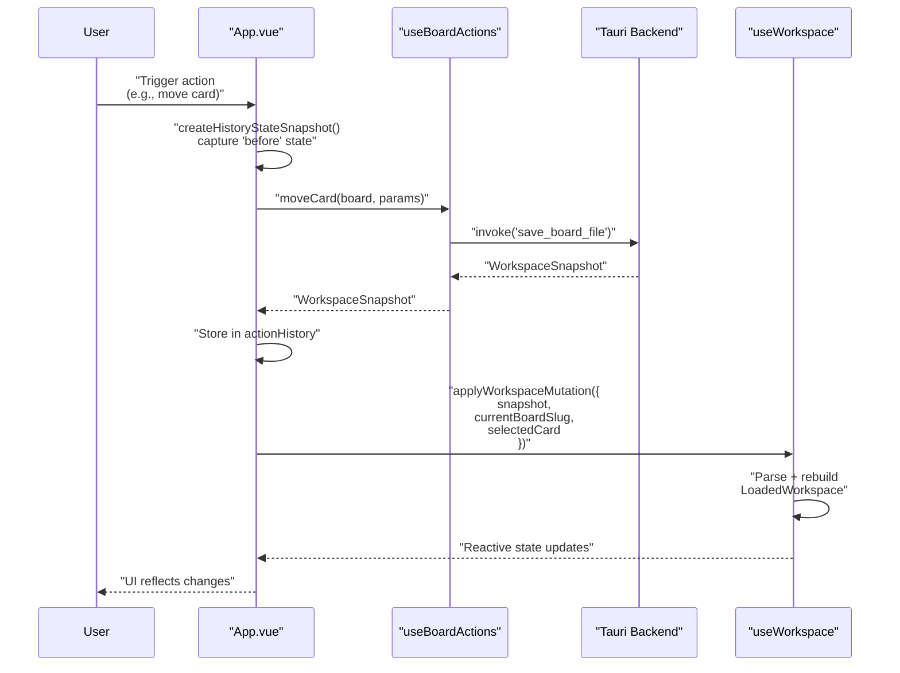
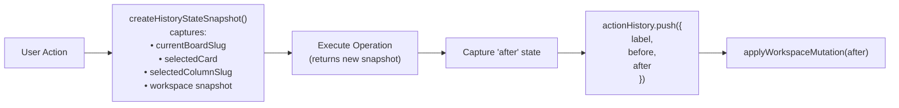
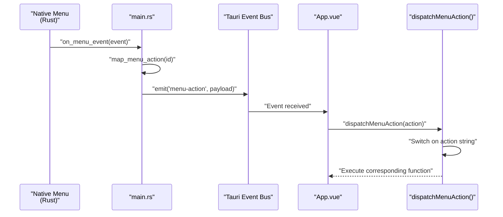
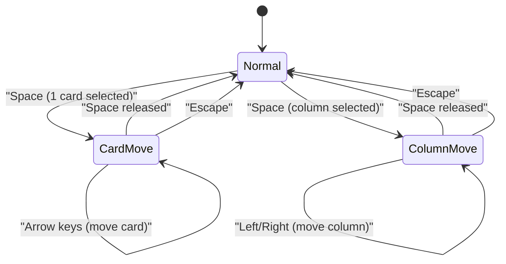

# Main Application Component

<details>
<summary>Relevant source files</summary>

The following files were used as context for generating this wiki page:

- [src-tauri/src/main.rs](../src-tauri/src/main.rs)
- [src/App.vue](../src/App.vue)

</details>


## Purpose and Scope

This document covers `App.vue`, the root application component that serves as the orchestrator for the entire KanStack frontend. It coordinates state management across multiple composables, handles global keyboard shortcuts and menu actions, implements the undo/redo system, and manages the integration between UI components and backend operations.

For details about individual composables managed by this component, see [Composables Overview](../5.2.3-usecardeditor.md). For information about child UI components, see [Key Components](../5.3.1-cardeditormodal.md).

---

## Component Overview

`App.vue` is the single root component of the KanStack application. It does not manage application state directly—instead, it instantiates and coordinates five core composables that handle different aspects of the application:

| Composable | Purpose | Lines |
|------------|---------|-------|
| `useWorkspace` | Workspace state, board/card selection, mutations | [src/App.vue:29-52](../src/App.vue) |
| `useBoardActions` | Board/card operations (create, move, delete) | [src/App.vue:54-59](../src/App.vue) |
| `useBoardSelection` | Multi-select state and keyboard navigation | [src/App.vue:60](../src/App.vue) |
| `useActionHistory` | Undo/redo stack management | [src/App.vue:64](../src/App.vue) |
| Local state | Column selection, keyboard move mode, app messages | [src/App.vue:61-63](../src/App.vue) |

The component renders three main child components:
- **AppHeader**: Navigation breadcrumb and board selection
- **BoardCanvas**: The main Kanban board UI
- **CardEditorModal**: Full-screen card editor overlay

Sources: [src/App.vue:1-1537](../src/App.vue)

---

## Composable Orchestration Architecture

**Diagram: App.vue Composable Dependencies**



`App.vue` passes configuration functions to `useBoardActions` that provide read-only access to workspace state. This ensures `useBoardActions` remains stateless and can only read (not modify) workspace data:

```typescript
const appBoardActions = useBoardActions({
    getBoardsBySlug: () => workspace.value?.boardsBySlug ?? {},
    getWorkspaceRoot: () => workspace.value?.rootPath ?? null,
    getBoardFilesBySlug: () => workspace.value?.boardFilesBySlug ?? {},
    getCardsBySlug: () => workspace.value?.cardsBySlug ?? {},
});
```

Sources: [src/App.vue:29-60](../src/App.vue)

---

## State Management Flow

All workspace state lives in `useWorkspace`, but state updates flow through `App.vue`'s coordination layer:

**Diagram: State Update Flow**



The `applyWorkspaceMutation` function is the single entry point for updating workspace state:

Sources: [src/App.vue:99-132](../src/App.vue), [src/App.vue:257-261](../src/App.vue)

---

## Action History and Undo/Redo System

Every mutating operation goes through the **tracked action pattern**, which automatically creates before/after snapshots for undo/redo:

**Diagram: Tracked Action Pattern**



The `executeTrackedAction` function encapsulates this pattern:

```typescript
async function executeTrackedAction(
    label: string,
    perform: () => Promise<HistoryStateSnapshot | null>,
) {
    const before = createHistoryStateSnapshot();
    if (!before) return null;
    
    const after = await perform();
    if (!after) return null;
    
    actionHistory.push({ label, before, after });
    return after;
}
```

All tracked operations return a `HistoryStateSnapshot` containing:

| Field | Type | Description |
|-------|------|-------------|
| `currentBoardSlug` | `string \| null` | Active board after operation |
| `selectedCard` | `{slug, sourceBoardSlug} \| null` | Selected card after operation |
| `selectedColumnSlug` | `string \| null` | Selected column after operation |
| `snapshot` | `WorkspaceSnapshot` | Complete workspace state |

Sources: [src/App.vue:99-155](../src/App.vue), [src/App.vue:229-262](../src/App.vue)

### Undo/Redo Implementation

Undo and redo operations apply snapshots by invoking the backend command `apply_workspace_snapshot`, which atomically restores file system state:

```typescript
async function applyHistoryStateSnapshot(state: HistoryStateSnapshot) {
    const snapshot = await invoke<WorkspaceSnapshot>(
        "apply_workspace_snapshot",
        { snapshot: state.snapshot }
    );
    
    applyWorkspaceMutation({
        snapshot,
        currentBoardSlug: state.currentBoardSlug,
        selectedCard: state.selectedCard,
    });
    selectedColumnState.value = state.selectedColumnSlug;
}
```

Sources: [src/App.vue:118-132](../src/App.vue), [src/App.vue:211-227](../src/App.vue)

---

## Global Keyboard Shortcuts

`App.vue` implements comprehensive keyboard shortcuts via `handleGlobalKeydown` and `handleGlobalKeyup` event listeners attached to the window:

**Keyboard Shortcuts Table**

| Shortcut | Condition | Action | Lines |
|----------|-----------|--------|-------|
| `Escape` | Keyboard move mode active | Cancel move mode | [src/App.vue:920-925](../src/App.vue) |
| `Escape` | Card editor open | Close editor | [src/App.vue:927-931](../src/App.vue) |
| `Escape` | Cards selected | Clear selection | [src/App.vue:933-937](../src/App.vue) |
| `Escape` | Column selected | Clear column selection | [src/App.vue:939-943](../src/App.vue) |
| `Cmd/Ctrl+Z` | Not in editable element | Undo | [src/App.vue:963-967](../src/App.vue) |
| `Cmd/Ctrl+Shift+Z` | Not in editable element | Redo | [src/App.vue:954-961](../src/App.vue) |
| `Cmd/Ctrl+Y` | Not in editable element | Redo | [src/App.vue:969-973](../src/App.vue) |
| `Space` | 1 card selected + reorder enabled | Enter card move mode | [src/App.vue:977-986](../src/App.vue) |
| `Space` | Column selected | Enter column move mode | [src/App.vue:988-994](../src/App.vue) |
| `Arrow Keys` | Card move mode | Move selected card | [src/App.vue:1008-1022](../src/App.vue) |
| `Arrow Left/Right` | Column move mode | Move selected column | [src/App.vue:997-1005](../src/App.vue) |
| `Arrow Keys` | Column selected | Navigate columns | [src/App.vue:1024-1031](../src/App.vue) |
| `Arrow Keys` | Normal mode | Navigate card selection | [src/App.vue:1033-1047](../src/App.vue) |
| `Delete/Backspace` | Cards selected | Archive cards | [src/App.vue:1051-1060](../src/App.vue) |
| `Shift+Delete` | Cards selected | Delete cards (with confirm) | [src/App.vue:1055-1060](../src/App.vue) |
| `Delete/Backspace` | Column selected | Delete column | [src/App.vue:1063-1070](../src/App.vue) |
| `Enter` | 1 card selected | Open card editor | [src/App.vue:1073-1080](../src/App.vue) |
| `Cmd/Ctrl+O` | - | Open workspace | [src/App.vue:1086-1090](../src/App.vue) |
| `Cmd/Ctrl+Shift+N` | - | Create new board | [src/App.vue:1092-1096](../src/App.vue) |
| `Cmd/Ctrl+N` | - | Create new card | [src/App.vue:1098-1102](../src/App.vue) |
| `Cmd/Ctrl+Shift+A` | - | Toggle archive column | [src/App.vue:1104-1107](../src/App.vue) |

The keyboard handler checks if focus is in an editable element and skips most shortcuts if so:

```typescript
function isEditableElement(target: Element | null) {
    if (!(target instanceof HTMLElement)) return false;
    
    const tagName = target.tagName.toLowerCase();
    return (
        tagName === "input" ||
        tagName === "textarea" ||
        tagName === "select" ||
        target.isContentEditable
    );
}
```

Sources: [src/App.vue:912-1108](../src/App.vue), [src/App.vue:1203-1215](../src/App.vue)

---

## Menu Integration System

Native application menus (built in `src-tauri/src/main.rs`) trigger actions that flow through an event-based system:

**Diagram: Menu Action Flow**



`App.vue` listens for `menu-action` events during mount:

```typescript
async function attachMenuActionListener() {
    unlistenMenuActions = await listen<{ action: string }>(
        "menu-action",
        (event) => {
            void dispatchMenuAction(event.payload.action);
        }
    );
}
```

The `dispatchMenuAction` function maps action strings to local functions:

Sources: [src/App.vue:1122-1201](../src/App.vue), [src-tauri/src/main.rs:27-31](../src-tauri/src/main.rs), [src-tauri/src/main.rs:161-180](../src-tauri/src/main.rs)

---

## Keyboard Move Modes

KanStack supports two keyboard-driven move modes for drag-free reordering:

1. **Card Move Mode**: Press `Space` with one card selected to enter mode, then use arrow keys to move the card between columns and positions
2. **Column Move Mode**: Press `Space` with a column selected to enter mode, then use left/right arrows to reorder columns

**Diagram: Keyboard Move Mode State Machine**



The `keyboardMoveMode` ref tracks which mode is active:

Sources: [src/App.vue:62](../src/App.vue), [src/App.vue:977-1005](../src/App.vue), [src/App.vue:1110-1120](../src/App.vue)

---

## Tracked Operation Functions

`App.vue` implements numerous tracked operations that follow the pattern shown earlier. Here are key examples:

### Board and Column Operations

| Function | Label | Operation | Lines |
|----------|-------|-----------|-------|
| `createCardFromBoard` | "New Card" | Creates card in current board | [src/App.vue:229-262](../src/App.vue) |
| `createColumn` | "New Column" | Adds column to current board | [src/App.vue:264-294](../src/App.vue) |
| `handleColumnReorder` | "Reorder Columns" | Reorders columns via drag | [src/App.vue:296-332](../src/App.vue) |
| `toggleArchiveColumn` | "Show/Hide Archive Column" | Toggles archive column visibility | [src/App.vue:334-375](../src/App.vue) |
| `handleColumnRename` | "Rename Column" | Renames column across workspace | [src/App.vue:437-475](../src/App.vue) |
| `handleBoardRename` | "Rename Board" | Renames current board | [src/App.vue:477-509](../src/App.vue) |

### Card Operations

| Function | Label | Operation | Lines |
|----------|-------|-----------|-------|
| `moveCardTracked` | "Move Card" | Moves card to different column/section | [src/App.vue:554-610](../src/App.vue) |
| `archiveSelectedCards` | "Archive Cards" | Archives multiple selected cards | [src/App.vue:612-669](../src/App.vue) |
| `deleteSelectedCards` | "Delete Cards" | Permanently deletes selected cards | [src/App.vue:676-751](../src/App.vue) |

### Destructive Operations

Some operations perform confirmation prompts before executing:

```typescript
async function deleteCurrentBoard() {
    if (!currentBoard.value || !workspace.value?.rootPath) {
        return;
    }
    
    const descendantCount = countDescendantBoards(currentBoard.value.slug);
    const confirmationMessage = descendantCount > 0
        ? `Delete board "${currentBoard.value.title}" and its ${descendantCount} sub board${descendantCount === 1 ? "" : "s"}? ...`
        : `Delete board "${currentBoard.value.title}"? ...`;
        
    const confirmed = window.confirm(confirmationMessage);
    if (!confirmed) return;
    
    // ... proceed with deletion
}
```

Sources: [src/App.vue:758-810](../src/App.vue), [src/App.vue:676-751](../src/App.vue)

---

## Integration with Child Components

`App.vue` renders three main child components and handles their events:

### BoardCanvas Integration

**Props Passed:**

```typescript
<BoardCanvas
    :board="currentBoard"
    :boards-by-slug="workspace?.boardsBySlug ?? {}"
    :board-files-by-slug="workspace?.boardFilesBySlug ?? {}"
    :cards-by-slug="workspace?.cardsBySlug ?? {}"
    :selected-column-slug="selectedColumnSlug"
    :selected-card-keys="boardSelection.selectedKeys.value"
    :view-preferences="viewPreferences"
    :workspace-root="workspace?.rootPath ?? null"
/>
```

**Events Handled:**

| Event | Handler | Purpose |
|-------|---------|---------|
| `@activate-card` | `handleCardActivate` | Multi-select card with modifiers |
| `@add-column` | `createColumn` | Create new column |
| `@clear-selections` | `clearSelections` | Clear all selections |
| `@create-card` | `createCardFromBoard` | Create new card |
| `@move-card` | `handleCardMove` | Drag-drop card move |
| `@open-card` | `openCard` | Open card editor |
| `@reorder-columns` | `handleColumnReorder` | Drag-drop column reorder |
| `@rename-board` | `handleBoardRename` | Rename current board |
| `@rename-column` | `handleColumnRename` | Rename column |
| `@select-column` | `handleColumnSelect` | Select column |
| `@toggle-archive-column` | `toggleArchiveColumn` | Toggle archive visibility |
| `@update-view-preferences` | `updateViewPreferences` | Update view settings |
| `@update-visible-cards` | `handleVisibleCards` | Update selection registry |

Sources: [src/App.vue:1555-1580](../src/App.vue)

### CardEditorModal Integration

**Props Passed:**

```typescript
<CardEditorModal
    :card="selectedCard"
    :board-files-by-slug="workspace?.boardFilesBySlug ?? {}"
    :boards-by-slug="workspace?.boardsBySlug ?? {}"
    :cards-by-slug="workspace?.cardsBySlug ?? {}"
    :open="Boolean(selectedCardSlug)"
    :source-board="selectedCardSourceBoard"
    :workspace-root="workspace?.rootPath ?? null"
/>
```

**Events Handled:**

| Event | Handler | Purpose |
|-------|---------|---------|
| `@archive-card` | `archiveSingleCard` | Archive single card |
| `@apply-workspace-mutation` | `applyWorkspaceMutation` | Apply editor changes |
| `@close` | `closeCard` | Close editor |
| `@delete-card` | `deleteSingleCard` | Delete single card |

The modal directly calls `applyWorkspaceMutation` when the user saves changes, bypassing the tracked action system since the card editor has its own undo/redo mechanism.

Sources: [src/App.vue:1612-1625](../src/App.vue)

---

## Lifecycle and Event Management

`App.vue` attaches global event listeners during mount and cleans them up during unmount:

```typescript
onMounted(() => {
    void restoreWorkspace();
    void attachMenuActionListener();
    window.addEventListener("keydown", handleGlobalKeydown);
    window.addEventListener("keyup", handleGlobalKeyup);
});

onUnmounted(() => {
    clearAppMessageTimer();
    if (unlistenMenuActions) {
        unlistenMenuActions();
        unlistenMenuActions = null;
    }
    window.removeEventListener("keydown", handleGlobalKeydown);
    window.removeEventListener("keyup", handleGlobalKeyup);
});
```

On mount, it also:
- Restores the previously opened workspace from persisted app config
- Attaches a listener for menu action events from the Rust backend

Sources: [src/App.vue:193-209](../src/App.vue)

---

## App Message System

`App.vue` manages transient notification messages displayed to users via `AppMessageBanner`:

```typescript
function showAppMessage(text: string) {
    clearAppMessageTimer();
    appMessage.value = { kind: "error", text };
    appMessageTimer = window.setTimeout(() => {
        appMessage.value = null;
        appMessageTimer = null;
    }, 5000);
}
```

Messages auto-dismiss after 5 seconds or can be manually dismissed. Common use cases:
- Board attachment confirmations
- Missing known board notifications
- Operation validation errors (e.g., cannot rename Archive column)

Sources: [src/App.vue:873-910](../src/App.vue)

---

## Summary

`App.vue` serves as the coordination layer between composables, UI components, and the backend. Its responsibilities include:

1. **Composable orchestration**: Instantiating and configuring all core composables
2. **Action tracking**: Wrapping operations in the `executeTrackedAction` pattern for undo/redo
3. **Event handling**: Processing keyboard shortcuts and menu actions
4. **State synchronization**: Coordinating state changes across composables and local state
5. **Component integration**: Managing props and events for child components
6. **Lifecycle management**: Attaching/detaching global event listeners

This architecture keeps the component focused on coordination rather than business logic, with actual operations delegated to specialized composables.

Sources: [src/App.vue:1-1537](../src/App.vue)
