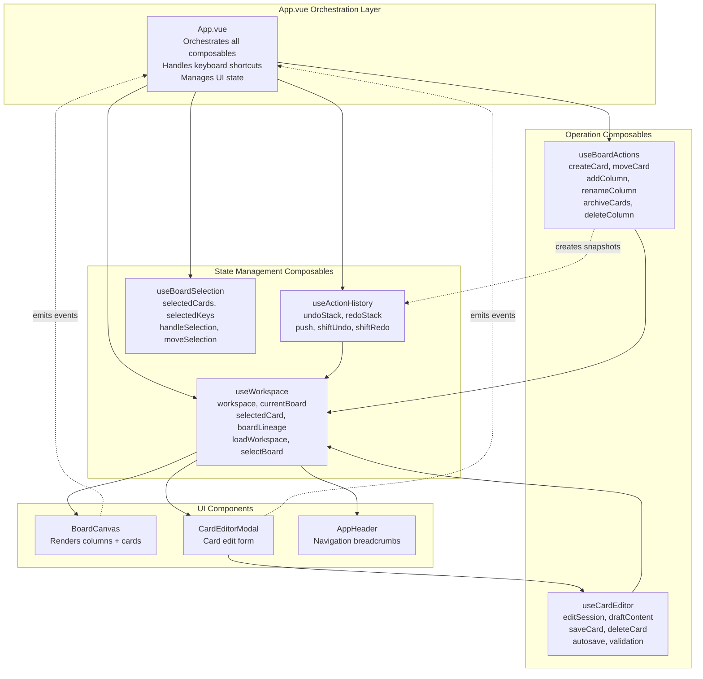
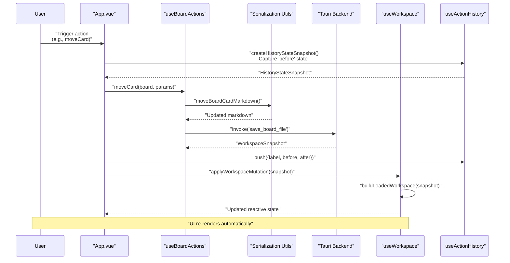
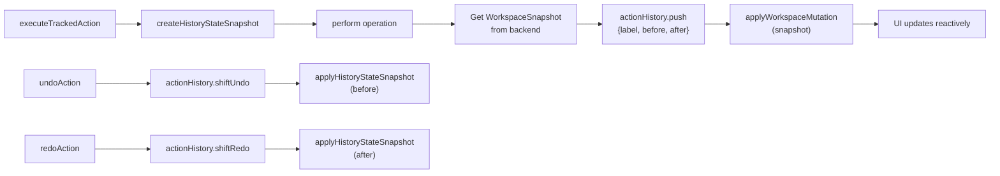
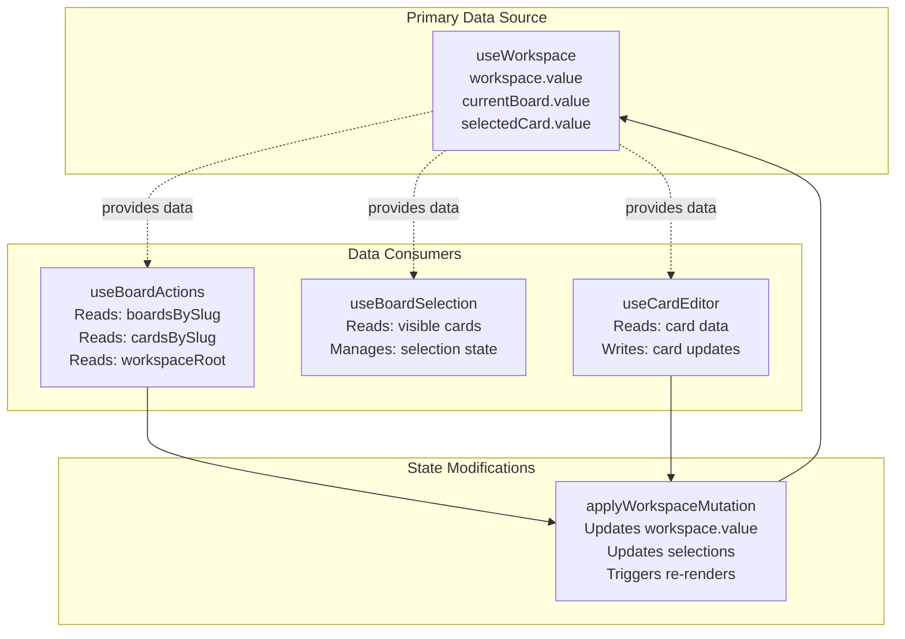

# Composables Overview

<details>
<summary>Relevant source files</summary>

The following files were used as context for generating this wiki page:

- [src/App.vue](../src/App.vue)
- [src/composables/useBoardActions.ts](../src/composables/useBoardActions.ts)
- [src/composables/useWorkspace.ts](../src/composables/useWorkspace.ts)

</details>


This page provides an overview of KanStack's composable architecture, explaining how Vue Composition API composables are used to separate concerns and manage application state. Each composable is responsible for a specific domain, and they work together to provide the complete functionality of the application.

For detailed documentation on individual composables, see:
- [useWorkspace](#5.2.1) - Workspace and board state management
- [useBoardActions](#5.2.2) - Board and card manipulation operations
- [useCardEditor](#5.2.3) - Card editing session management

For information about how these composables are orchestrated in the main application component, see [Main Application Component](5.1-main-application-component.md).

## Composable Architecture Pattern

KanStack uses Vue's Composition API to organize frontend logic into focused, reusable composables. Each composable is a TypeScript function that returns reactive state and methods, encapsulating a specific aspect of application behavior. This pattern provides:

- **Separation of Concerns**: Each composable handles a single domain (workspace state, board actions, card editing, etc.)
- **Testability**: Composables are pure functions that can be tested independently
- **Reusability**: Composables can be shared across components
- **Type Safety**: Full TypeScript support with typed inputs and outputs
- **Reactive State**: Built on Vue's reactivity system using `ref`, `computed`, and `shallowRef`

**Composable Architecture Overview**



Sources: [src/App.vue:1-64](../src/App.vue), [src/composables/useWorkspace.ts:1-50](../src/composables/useWorkspace.ts), [src/composables/useBoardActions.ts:1-50](../src/composables/useBoardActions.ts)

## Core Composables

KanStack implements five primary composables, each with distinct responsibilities:

| Composable | Purpose | Key State | Key Operations | File |
|------------|---------|-----------|----------------|------|
| **useWorkspace** | Workspace state and navigation | `workspace`, `currentBoard`, `selectedCard`, `boardLineage` | `openWorkspace`, `loadWorkspace`, `selectBoard`, `selectCard`, `applyWorkspaceMutation` | src/composables/useWorkspace.ts |
| **useBoardActions** | Board and card mutations | `isCreatingCard`, `isMovingCard`, `isCreatingColumn` | `createCard`, `moveCard`, `archiveCards`, `addColumn`, `renameColumn`, `deleteColumn` | src/composables/useBoardActions.ts |
| **useBoardSelection** | Multi-select card state | `selectedCards`, `selectedKeys`, `selectedCount` | `handleSelection`, `moveSelection`, `clearSelection`, `selectSingle` | Referenced in [src/App.vue:60](../src/App.vue) |
| **useCardEditor** | Card editing session | `editSession`, `draftContent`, `isDirty`, `isSaving` | `startEdit`, `saveCard`, `deleteCard`, `autosave` | Referenced in src/App.vue |
| **useActionHistory** | Undo/redo functionality | `undoStack`, `redoStack` | `push`, `shiftUndo`, `shiftRedo`, `clear` | src/App.vue:13-15,64 |

Sources: [src/App.vue:10-64](../src/App.vue), [src/composables/useWorkspace.ts:41-555](../src/composables/useWorkspace.ts), [src/composables/useBoardActions.ts:50-434](../src/composables/useBoardActions.ts)

## Composable Instantiation and Configuration

Composables are instantiated in `App.vue` and configured with appropriate dependencies:

**useWorkspace Instantiation**
```typescript
const {
    workspace,
    currentBoard,
    currentBoardSlug,
    boardLineage,
    childBoards,
    selectedCard,
    selectedCardSlug,
    selectedCardSourceBoard,
    isLoading,
    errorMessage,
    viewPreferences,
    openWorkspace,
    selectBoard,
    selectCard,
    closeCard,
    applyWorkspaceMutation,
    updateViewPreferences,
} = useWorkspace();
```

The `useWorkspace` composable returns reactive state and methods that manage the entire workspace lifecycle. It maintains the loaded workspace, current board selection, and card selection state.

**useBoardActions Instantiation with Dependencies**
```typescript
const appBoardActions = useBoardActions({
    getBoardsBySlug: () => workspace.value?.boardsBySlug ?? {},
    getWorkspaceRoot: () => workspace.value?.rootPath ?? null,
    getBoardFilesBySlug: () => workspace.value?.boardFilesBySlug ?? {},
    getCardsBySlug: () => workspace.value?.cardsBySlug ?? {},
});
```

The `useBoardActions` composable requires access to workspace data through dependency injection. This pattern keeps the composable testable and decoupled from global state.

Sources: [src/App.vue:29-59](../src/App.vue), [src/composables/useWorkspace.ts:529-554](../src/composables/useWorkspace.ts), [src/composables/useBoardActions.ts:43-59](../src/composables/useBoardActions.ts)

## Data Flow Pattern

**Operation Execution Flow**



This sequence shows the standard pattern for tracked operations:

1. **Capture State**: Create a snapshot of current state for undo functionality
2. **Execute Operation**: Call composable method to perform the operation
3. **Serialize Changes**: Generate updated markdown content
4. **Persist to Backend**: Invoke Tauri command to save changes
5. **Record History**: Store before/after snapshots in action history
6. **Apply Mutation**: Update reactive workspace state with new snapshot
7. **UI Update**: Vue reactivity triggers component re-renders

Sources: src/App.vue:99-155,554-610, [src/composables/useBoardActions.ts:60-81](../src/composables/useBoardActions.ts)

## State Mutation Pattern

All workspace mutations follow a consistent pattern implemented in `App.vue`:

**Tracked Action Pattern**



The `executeTrackedAction` function ([src/App.vue:134-155](../src/App.vue)) wraps all operations that should be undoable. It:

1. Captures the current state snapshot (board, card selection, column selection)
2. Executes the provided operation function
3. Records both before and after states in history
4. Returns the after state for further processing

**History State Snapshot Structure**
```typescript
interface HistoryStateSnapshot {
    currentBoardSlug: string | null;
    selectedCard: {
        slug: string;
        sourceBoardSlug: string;
    } | null;
    selectedColumnSlug: string | null;
    snapshot: WorkspaceSnapshot;
}
```

Sources: src/App.vue:99-155,211-227, src/history/useActionHistory.ts

## Composable Interaction Patterns

**Inter-Composable Communication**



Composables interact through well-defined interfaces:

- **useWorkspace**: The single source of truth for workspace data. Other composables read from it but don't directly modify it.
- **useBoardActions**: Reads workspace data through dependency injection, performs operations, returns `WorkspaceSnapshot` results.
- **useBoardSelection**: Maintains its own selection state, independent of workspace state, synchronized via events.
- **useCardEditor**: Operates on card data, emits mutations back through events or direct method calls.
- **useActionHistory**: Stores snapshots but doesn't read or modify workspace directly.

Sources: [src/App.vue:29-64](../src/App.vue), [src/composables/useWorkspace.ts:420-443](../src/composables/useWorkspace.ts), [src/composables/useBoardActions.ts:43-59](../src/composables/useBoardActions.ts)

## Reactive State Management

All composables use Vue's reactivity primitives for efficient updates:

| Primitive | Usage | Example |
|-----------|-------|---------|
| `shallowRef` | For objects where only the reference changes | `workspace = shallowRef<LoadedWorkspace \| null>(null)` |
| `ref` | For primitive values that change frequently | `isLoading = shallowRef(false)` |
| `computed` | For derived state based on other reactive values | `currentBoard = computed(() => workspace.value?.boardsBySlug[currentBoardSlug.value])` |
| `watch` | For side effects when reactive values change | `watch(currentBoard, (board) => {...})` |

**Example: Computed Derived State**

The `currentBoard` computed property ([src/composables/useWorkspace.ts:57-63](../src/composables/useWorkspace.ts)) automatically updates when either `workspace` or `currentBoardSlug` changes:

```typescript
const currentBoard = computed<KanbanBoardDocument | null>(() => {
    if (!workspace.value || !currentBoardSlug.value) {
        return null;
    }
    return workspace.value.boardsBySlug[currentBoardSlug.value] ?? null;
});
```

This pattern eliminates manual state synchronization and reduces bugs.

Sources: [src/composables/useWorkspace.ts:41-79](../src/composables/useWorkspace.ts), [src/composables/useBoardActions.ts:50-58](../src/composables/useBoardActions.ts)

## App.vue Orchestration

`App.vue` serves as the orchestration layer that coordinates all composables. Key responsibilities:

**Orchestration Responsibilities**

| Responsibility | Implementation | Lines |
|----------------|----------------|-------|
| **Composable Initialization** | Instantiate and configure all composables | [src/App.vue:29-64](../src/App.vue) |
| **Event Handling** | Convert UI events into composable method calls | [src/App.vue:420-610](../src/App.vue) |
| **Keyboard Shortcuts** | Handle global keyboard events and dispatch to composables | [src/App.vue:912-1108](../src/App.vue) |
| **Menu Actions** | Listen for menu events from backend and route to handlers | [src/App.vue:1122-1201](../src/App.vue) |
| **History Integration** | Wrap operations in `executeTrackedAction` for undo/redo | [src/App.vue:134-155](../src/App.vue) |
| **State Synchronization** | Clear selections when changing contexts | [src/App.vue:424-428](../src/App.vue) |
| **Error Handling** | Display error messages and manage loading states | src/App.vue:61,873-880 |

**Example: Keyboard Shortcut Routing**
```typescript
function handleGlobalKeydown(event: KeyboardEvent) {
    // Undo/Redo
    if (hasPrimaryModifier && event.key.toLowerCase() === "z") {
        void undoAction();  // -> useActionHistory
    }
    
    // Create card
    if (hasPrimaryModifier && event.key.toLowerCase() === "n") {
        void createCardFromBoard();  // -> useBoardActions
    }
    
    // Navigate selection
    if (event.key === "ArrowRight") {
        boardSelection.moveSelection("right");  // -> useBoardSelection
    }
}
```

Sources: src/App.vue:912-1108,1135-1201

## Composable Lifecycle Hooks

Composables use Vue lifecycle hooks for initialization and cleanup:

**useWorkspace Lifecycle**
- `onMounted`: Attach workspace change listener, restore previous workspace
- `onUnmounted`: Clean up event listeners, stop file watching, cancel pending config writes

**Lifecycle Hook Pattern**
```typescript
onMounted(() => {
    void attachWorkspaceListener();  // Listen for backend file changes
});

onUnmounted(() => {
    if (pendingConfigWrite !== null) {
        window.clearTimeout(pendingConfigWrite);
    }
    if (unlistenWorkspaceChanges) {
        unlistenWorkspaceChanges();  // Clean up event listener
    }
    void stopWorkspaceWatch();  // Stop backend file watcher
});
```

This ensures proper resource management and prevents memory leaks.

Sources: [src/composables/useWorkspace.ts:511-527](../src/composables/useWorkspace.ts), [src/App.vue:193-209](../src/App.vue)

## Summary

KanStack's composable architecture provides:

1. **Clear Separation**: Each composable has a single, well-defined responsibility
2. **Testability**: Pure functions with dependency injection
3. **Type Safety**: Full TypeScript support throughout
4. **Reactive Updates**: Automatic UI updates via Vue reactivity
5. **Undo/Redo**: Consistent state snapshot pattern for all operations
6. **Orchestration**: `App.vue` coordinates composables without complex logic

For implementation details of individual composables, see:
- [useWorkspace](#5.2.1) - Workspace loading, navigation, and state management
- [useBoardActions](#5.2.2) - Board and card CRUD operations
- [useCardEditor](#5.2.3) - Card editing session with autosave and validation

Sources: [src/App.vue:1-1714](../src/App.vue), [src/composables/useWorkspace.ts:1-630](../src/composables/useWorkspace.ts), [src/composables/useBoardActions.ts:1-449](../src/composables/useBoardActions.ts)
