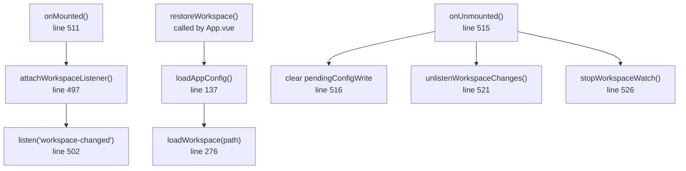
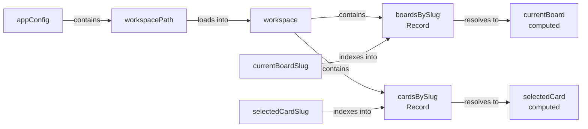
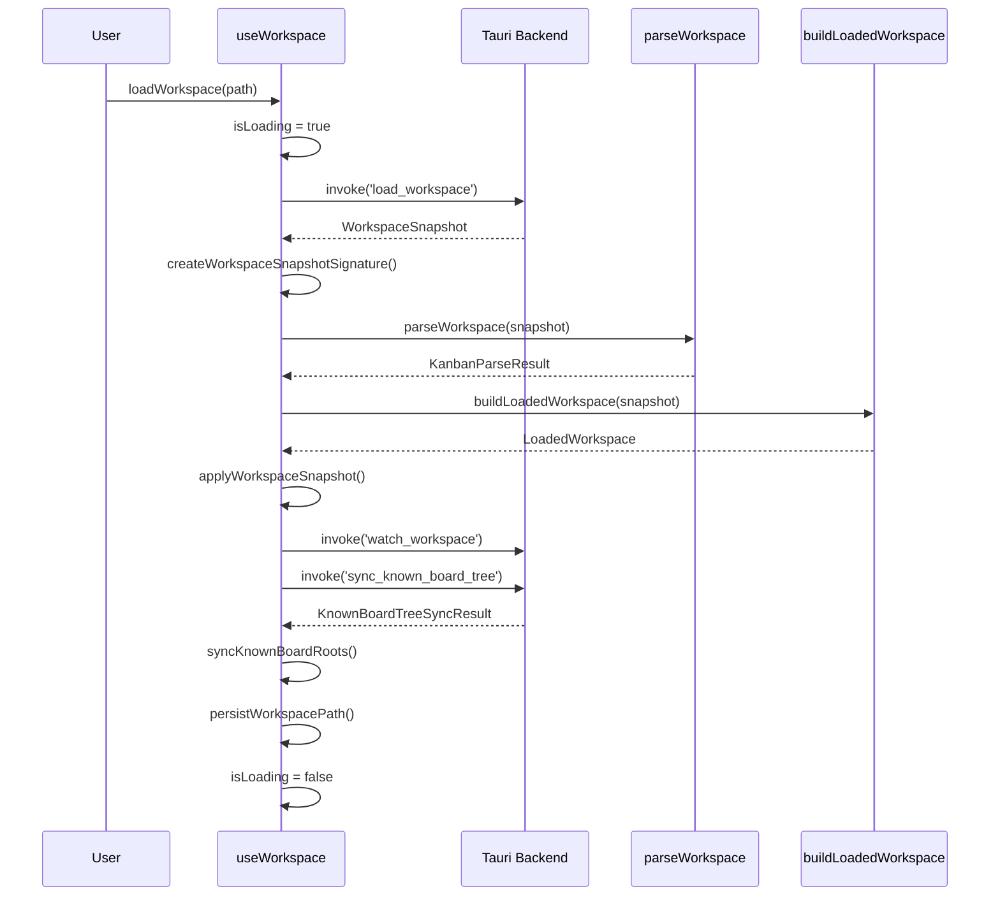
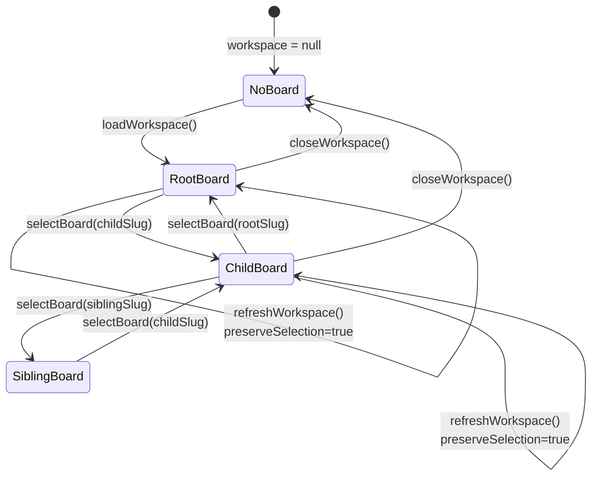
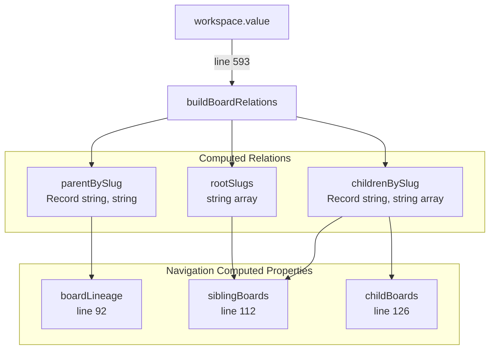
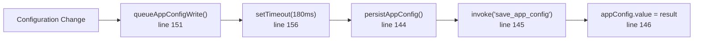
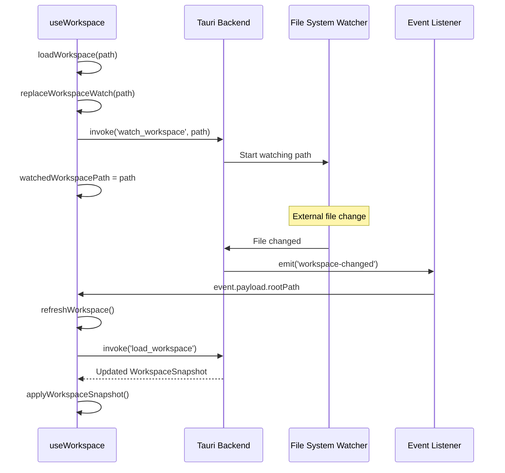
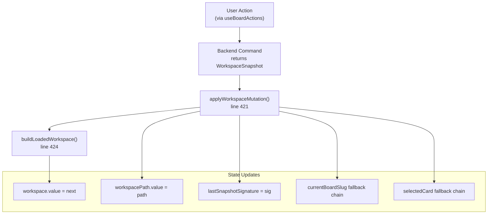
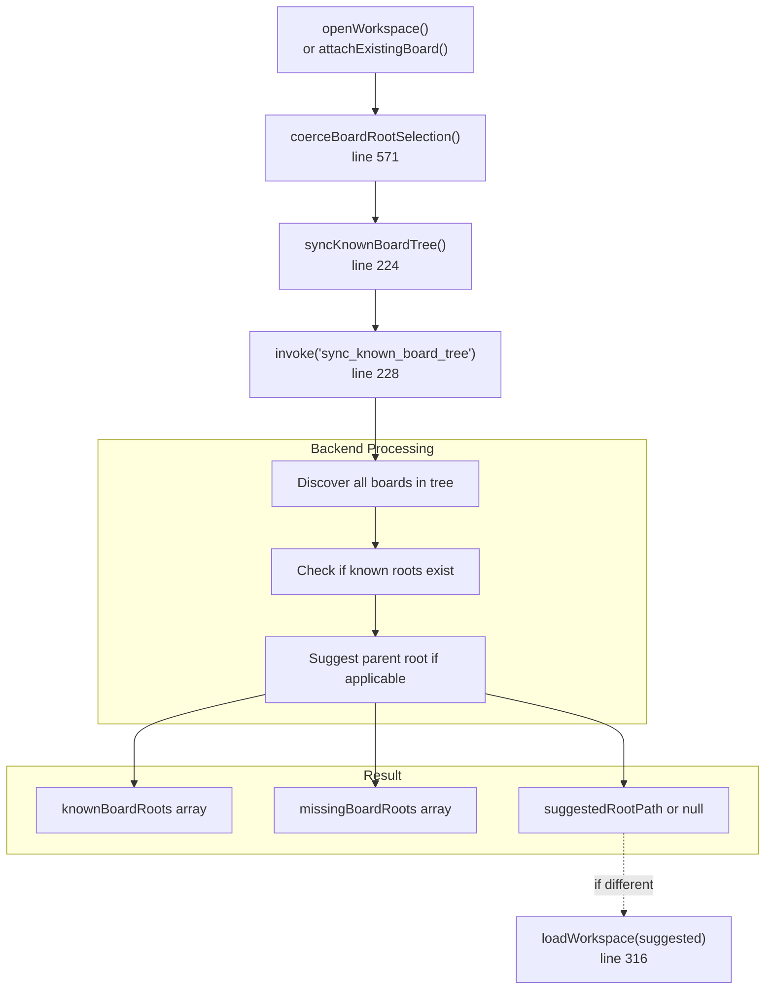

# useWorkspace

Relevant source files

The following files were used as context for generating this wiki page:

- [src/composables/useWorkspace.ts](../src/composables/useWorkspace.ts)
- [src/types/workspace.ts](../src/types/workspace.ts)
- [src/utils/boardMarkdown.test.ts](../src/utils/boardMarkdown.test.ts)
- [src/utils/kanbanPath.ts](../src/utils/kanbanPath.ts)
- [src/utils/workspaceSnapshot.ts](../src/utils/workspaceSnapshot.ts)

The `useWorkspace` composable is the primary state management hub for workspace operations in KanStack. It provides reactive state for the currently loaded workspace, handles workspace loading and persistence, manages board and card selection, integrates with the file system watcher, and coordinates workspace mutations from user actions.

For board and card manipulation operations (creating, moving, archiving), see [useBoardActions](#5.2.2). For card editing sessions, see [useCardEditor](#5.2.3). For the underlying data structures, see [Workspace Types](7.2-workspace-types.md).

---

## Composable Structure and Lifecycle

The `useWorkspace` composable follows Vue 3's Composition API pattern, exposing reactive state and imperative functions. It initializes on mount by attaching event listeners for file system changes and attempts to restore the previously opened workspace. On unmount, it cleans up pending timers and detaches listeners.

**Composable Initialization and Cleanup Flow**

Sources: [src/composables/useWorkspace.ts:511-527](../src/composables/useWorkspace.ts)

---

## Core Reactive State

The composable maintains several `shallowRef` state variables to track the workspace, configuration, and current selections. These are kept as shallow refs for performance, as the objects themselves (like `LoadedWorkspace`) are replaced entirely on updates rather than mutated.

| State Variable | Type | Purpose |
|----------------|------|---------|
| `appConfig` | `AppConfig` | Application configuration including workspace path and view preferences |
| `workspace` | `LoadedWorkspace \| null` | Parsed and indexed workspace with boards, cards, and metadata |
| `currentBoardSlug` | `string \| null` | Slug of the currently displayed board |
| `selectedCardSlug` | `string \| null` | Slug of the currently selected card |
| `selectedCardSourceBoardSlug` | `string \| null` | Board where the selected card is located |
| `workspacePath` | `string \| null` | File system path to the workspace TODO/ directory |
| `lastSnapshotSignature` | `string \| null` | JSON signature for detecting workspace changes |
| `isLoading` | `boolean` | Whether a workspace is loading (visible to user) |
| `isRefreshing` | `boolean` | Whether a silent background refresh is occurring |
| `errorMessage` | `string \| null` | User-facing error message, if any |

**State Variable Relationships**

Sources: [src/composables/useWorkspace.ts:42-55](../src/composables/useWorkspace.ts), [src/types/workspace.ts:31-40](../src/types/workspace.ts)

---

## Workspace Loading Pipeline

Workspace loading is a multi-stage process that reads files from disk, parses markdown, indexes data structures, and synchronizes the known board tree. The pipeline supports both explicit user-initiated loads and silent background refreshes triggered by file system changes.

**Workspace Loading Sequence**

Sources: [src/composables/useWorkspace.ts:276-355](../src/composables/useWorkspace.ts)

### Loading Options and Modes

The `loadWorkspace()` function accepts an options object to control its behavior:

- **preserveSelection** (`boolean`, default `false`): If true, attempts to keep the current board and card selection after reload
- **silent** (`boolean`, default `false`): If true, uses `isRefreshing` instead of `isLoading`, and skips file watching setup
- **surfaceErrors** (`boolean`, default `true`): If true, sets `errorMessage` on failure; if false, silently fails

Silent mode is used by `refreshWorkspace()` line 388 when the file watcher detects changes, preventing visible loading indicators during background syncs. The snapshot signature line 296 prevents redundant re-renders if the workspace hasn't actually changed.

Sources: [src/composables/useWorkspace.ts:15-19](../src/composables/useWorkspace.ts), [src/composables/useWorkspace.ts:276-355](../src/composables/useWorkspace.ts)

### Workspace Snapshot Processing

Once the backend returns a `WorkspaceSnapshot`, the composable transforms it through several steps:

1. **Signature Creation** line 296: Generate a JSON signature for change detection using `createWorkspaceSnapshotSignature()`
2. **Snapshot Application** line 302: Call `applyWorkspaceSnapshot()` to parse and index the data
3. **File Watching** line 304: Replace the file system watch to monitor the new workspace
4. **Board Tree Sync** line 308: Discover sub-boards and update known board roots
5. **Suggested Root Handling** line 315: If a better root is found (e.g., a parent board), recursively reload
6. **Configuration Persistence** line 331: Save the workspace path to app config

Sources: [src/composables/useWorkspace.ts:294-333](../src/composables/useWorkspace.ts), [src/utils/workspaceSnapshot.ts:29-35](../src/utils/workspaceSnapshot.ts)

---

## Board and Card Selection

The composable maintains selection state for the current board and selected card. Board selection determines what `BoardCanvas` renders, while card selection opens the `CardEditorModal`. Selection state is preserved across refreshes when `preserveSelection` is enabled.

**Board Selection State Machine**

Sources: [src/composables/useWorkspace.ts:400-404](../src/composables/useWorkspace.ts), [src/composables/useWorkspace.ts:457-464](../src/composables/useWorkspace.ts)

### Board Selection Logic

The `selectBoard()` function line 400 updates `currentBoardSlug` and clears card selection. When a board is selected, the `currentBoard` computed property line 57 resolves it from `workspace.value.boardsBySlug`. If the board doesn't exist, `currentBoard` returns `null`.

During workspace mutations or snapshot application, the composable follows a fallback chain to determine the current board:

1. Use the explicitly provided `currentBoardSlug` if the board exists
2. Fall back to the previous `currentBoardSlug` if it still exists
3. Fall back to `workspace.rootBoardSlug` if it exists
4. Fall back to the first board in `boardOrder`
5. Set to `null` if no boards exist

Sources: [src/composables/useWorkspace.ts:429-435](../src/composables/useWorkspace.ts), [src/composables/useWorkspace.ts:457-461](../src/composables/useWorkspace.ts)

### Card Selection and Source Board Tracking

Card selection requires tracking both the card slug and its source board slug. This is necessary because cards can appear on multiple boards (e.g., when shown in parent board views), but operations like editing or moving need to know the card's actual location.

The `selectCard()` function line 406 validates that the card exists in `workspace.cardsBySlug` before setting selection state. The `selectedCard` computed property line 65 resolves the full `KanbanCardDocument`, while `selectedCardSourceBoard` line 73 resolves the board document where the card is located.

Sources: [src/composables/useWorkspace.ts:406-419](../src/composables/useWorkspace.ts), [src/types/workspace.ts:15-23](../src/types/workspace.ts)

---

## Board Hierarchy and Navigation

The composable computes several navigation aids based on board relationships. These are used by the UI to render breadcrumbs, sibling navigation, and sub-board lists.

**Board Relationship Computation**

Sources: [src/composables/useWorkspace.ts:91-135](../src/composables/useWorkspace.ts), [src/composables/useWorkspace.ts:593-629](../src/composables/useWorkspace.ts)

### Board Lineage (Breadcrumbs)

The `boardLineage` computed property line 92 constructs an ancestor chain from the root board to the current board by following parent links. It prevents infinite loops by tracking visited slugs and builds the path by prepending ancestors until reaching a board with no parent.

The result is an array of `BoardNavOption` objects with `slug` and `title` properties, suitable for rendering a breadcrumb trail in the UI.

Sources: [src/composables/useWorkspace.ts:92-111](../src/composables/useWorkspace.ts)

### Sibling and Child Boards

The `siblingBoards` computed property line 112 returns boards at the same hierarchical level as the current board. If the current board has a parent, siblings are the parent's children (excluding the current board). If the current board is a root, siblings are other root boards.

The `childBoards` computed property line 126 returns the sub-boards listed in the current board's `subBoards` array, filtering out any that don't exist in the workspace (e.g., if they failed to load).

Sources: [src/composables/useWorkspace.ts:112-135](../src/composables/useWorkspace.ts)

---

## Configuration Persistence

The composable manages application configuration through `AppConfig`, which includes the workspace path, known board roots, and view preferences. Configuration is loaded from disk on initialization and persisted when changed.

**Configuration Write Flow**

Sources: [src/composables/useWorkspace.ts:144-160](../src/composables/useWorkspace.ts)

### Configuration Operations

| Function | Purpose |
|----------|---------|
| `loadAppConfig()` line 137 | Invokes `load_app_config` command and normalizes the result |
| `persistAppConfig(config)` line 144 | Invokes `save_app_config` command and updates reactive state |
| `queueAppConfigWrite()` line 151 | Debounces config writes with a 180ms delay |
| `persistWorkspacePath(path)` line 162 | Updates workspace path and clears legacy localStorage |
| `syncKnownBoardRoots(roots)` line 179 | Updates known board roots array in config |
| `updateViewPreferences(prefs)` line 186 | Updates view preferences and queues a write |

The debounced write mechanism line 151 prevents excessive disk writes when preferences are rapidly changed (e.g., during UI interactions). The 180ms delay is cleared and reset on each change.

Sources: [src/composables/useWorkspace.ts:137-192](../src/composables/useWorkspace.ts)

### Legacy Workspace Path Migration

The composable checks for a legacy `localStorage` key `kanstack.workspacePath` line 12 during `restoreWorkspace()` line 256. If found and `appConfig.workspacePath` is null, it migrates the value by calling `persistWorkspacePath()` and removes the legacy key.

Sources: [src/composables/useWorkspace.ts:256-274](../src/composables/useWorkspace.ts)

---

## File System Integration

The composable integrates with the Tauri backend's file watcher to receive real-time notifications when workspace files change externally. This enables collaborative editing scenarios and handles changes made by other applications.

**File System Watch Lifecycle**

Sources: [src/composables/useWorkspace.ts:475-509](../src/composables/useWorkspace.ts)

### Watch Management Functions

The `replaceWorkspaceWatch()` function line 475 ensures only one workspace is watched at a time. If a watch already exists for a different path, it calls `stopWorkspaceWatch()` line 488 before starting a new watch. The `watchedWorkspacePath` variable line 53 tracks the currently watched path.

The `attachWorkspaceListener()` function line 497 sets up a Tauri event listener for the `workspace-changed` event line 13. When triggered, it checks if the event's `rootPath` matches the current workspace and calls `refreshWorkspace()` line 388 to silently reload.

Sources: [src/composables/useWorkspace.ts:475-509](../src/composables/useWorkspace.ts)

---

## Workspace Mutations

Workspace mutations occur when user actions modify the workspace (e.g., creating a card, moving a board). The `applyWorkspaceMutation()` function line 421 updates the composable's state with the new snapshot returned from the backend.

**Workspace Mutation Application**

Sources: [src/composables/useWorkspace.ts:421-443](../src/composables/useWorkspace.ts)

### Mutation Payload Structure

The `WorkspaceMutationPayload` type [src/types/workspace.ts:25-29](../src/types/workspace.ts) contains:

- **snapshot**: The updated `WorkspaceSnapshot` with new file contents
- **currentBoardSlug** (optional): The board to select after mutation
- **selectedCard** (optional): The card to select after mutation, including `slug` and `sourceBoardSlug`

The mutation function intelligently handles missing references. If the provided `currentBoardSlug` doesn't exist in the new workspace, it falls back through several options line 429-435. Similarly, card selection is only preserved if both the card and its source board exist line 436-442.

Sources: [src/composables/useWorkspace.ts:421-443](../src/composables/useWorkspace.ts), [src/types/workspace.ts:25-29](../src/types/workspace.ts)

---

## Known Board Tree Synchronization

The composable maintains a list of "known board roots" across the workspace tree. This enables discovering sub-boards in sibling project directories and suggesting better workspace roots when opening a sub-board directly.

**Known Board Tree Sync Flow**

Sources: [src/composables/useWorkspace.ts:224-234](../src/composables/useWorkspace.ts), [src/composables/useWorkspace.ts:194-215](../src/composables/useWorkspace.ts)

### Board Root Discovery

The `syncKnownBoardTree()` function line 224 invokes the backend's `sync_known_board_tree` command with:

- **additionalBoardRoots**: New roots to register (e.g., from file picker)
- **focusRootPath**: The root the user wants to work with

The backend scans the file system tree, discovers all `TODO/todo.md` files, and returns a `KnownBoardTreeSyncResult` line 25 containing:

- **knownBoardRoots**: All valid TODO roots that exist
- **missingBoardRoots**: Roots that were registered but no longer exist
- **suggestedRootPath**: A parent root if the focus root is a sub-board
- **updatedBoardRoots**: Roots whose sub-board structure changed

If `suggestedRootPath` differs from the current workspace path and is not null, the composable recursively calls `loadWorkspace()` with the suggested path line 315. This provides a smooth experience when users open a sub-board directly—they're automatically upgraded to the parent board.

Sources: [src/composables/useWorkspace.ts:224-234](../src/composables/useWorkspace.ts), [src/composables/useWorkspace.ts:306-327](../src/composables/useWorkspace.ts)

---

## Exported API Reference

The `useWorkspace` composable exports the following reactive references and functions:

### Reactive State

| Export | Type | Description |
|--------|------|-------------|
| `workspace` | `ShallowRef<LoadedWorkspace \| null>` | The loaded and indexed workspace |
| `currentBoard` | `ComputedRef<KanbanBoardDocument \| null>` | The currently displayed board |
| `currentBoardSlug` | `ShallowRef<string \| null>` | Slug of the current board |
| `boardOptions` | `ComputedRef<BoardNavOption[]>` | All boards available for navigation |
| `boardLineage` | `ComputedRef<BoardNavOption[]>` | Breadcrumb trail to current board |
| `siblingBoards` | `ComputedRef<BoardNavOption[]>` | Boards at the same level as current |
| `childBoards` | `ComputedRef<BoardNavOption[]>` | Sub-boards of the current board |
| `selectedCard` | `ComputedRef<KanbanCardDocument \| null>` | The selected card document |
| `selectedCardSlug` | `ShallowRef<string \| null>` | Slug of the selected card |
| `selectedCardSourceBoard` | `ComputedRef<KanbanBoardDocument \| null>` | Board where selected card lives |
| `isLoading` | `ShallowRef<boolean>` | Whether workspace is loading |
| `errorMessage` | `ShallowRef<string \| null>` | User-facing error message |
| `viewPreferences` | `ComputedRef<BoardViewPreferences>` | UI view preferences from config |

### Functions

| Function | Parameters | Returns | Description |
|----------|------------|---------|-------------|
| `openWorkspace()` | none | `Promise<WorkspaceLoadResult \| null>` | Opens file picker and loads selected workspace |
| `attachExistingBoard()` | none | `Promise<{attachedRootPath, missingBoardRoots} \| null>` | Opens file picker to attach an additional board root |
| `closeWorkspace()` | none | `Promise<void>` | Closes workspace, stops watching, clears state |
| `restoreWorkspace()` | none | `Promise<void>` | Loads last workspace from config on app start |
| `loadWorkspaceRoot(path)` | `path: string` | `Promise<WorkspaceLoadResult \| undefined>` | Loads workspace from a specific path |
| `registerKnownBoardRoots(roots)` | `roots: string[]` | `Promise<WorkspaceLoadResult>` | Registers board roots and reloads if necessary |
| `selectBoard(slug)` | `slug: string` | `void` | Changes the current board |
| `selectCard(selection)` | `selection: {slug, sourceBoardSlug}` | `void` | Selects a card for editing |
| `closeCard()` | none | `void` | Closes the card editor |
| `applyWorkspaceMutation(payload)` | `payload: WorkspaceMutationPayload` | `void` | Updates workspace state after a mutation |
| `updateViewPreferences(prefs)` | `prefs: BoardViewPreferences` | `void` | Updates UI view preferences |

Sources: [src/composables/useWorkspace.ts:529-554](../src/composables/useWorkspace.ts)

---

## Helper Functions

The composable includes several internal helper functions that handle path normalization and board relationships:

**Path Normalization Utilities**

| Function | Purpose |
|----------|---------|
| `coerceBoardRootSelection(selection)` line 571 | Ensures a path ends with `/TODO` |
| `parentDirectoryOfTodoRoot(todoRoot)` line 576 | Removes `/TODO` suffix to get parent directory |
| `normalizeTodoRootPath(path)` line 580 | Normalizes path separators and trailing slashes |
| `snapshotBoardRoots(snapshot)` line 557 | Extracts TODO roots from all boards in a snapshot |
| `joinTodoRoot(projectRoot, boardPath)` line 562 | Combines project root with board path |
| `isBoardWithinWorkspaceTree(boardRoot, workspaceRoot)` line 584 | Checks if a board is a child of the workspace |

**Board Relationship Builder**

The `buildBoardRelations()` function line 593 constructs a parent-child mapping by iterating through all boards and processing their `subBoards` arrays. It returns:

- **parentBySlug**: Maps each board slug to its parent slug (or `null` for roots)
- **childrenBySlug**: Maps each board slug to an array of child slugs
- **rootSlugs**: Array of board slugs with no parent

This structure enables efficient navigation queries without tree traversal on every render.

Sources: [src/composables/useWorkspace.ts:557-629](../src/composables/useWorkspace.ts)
