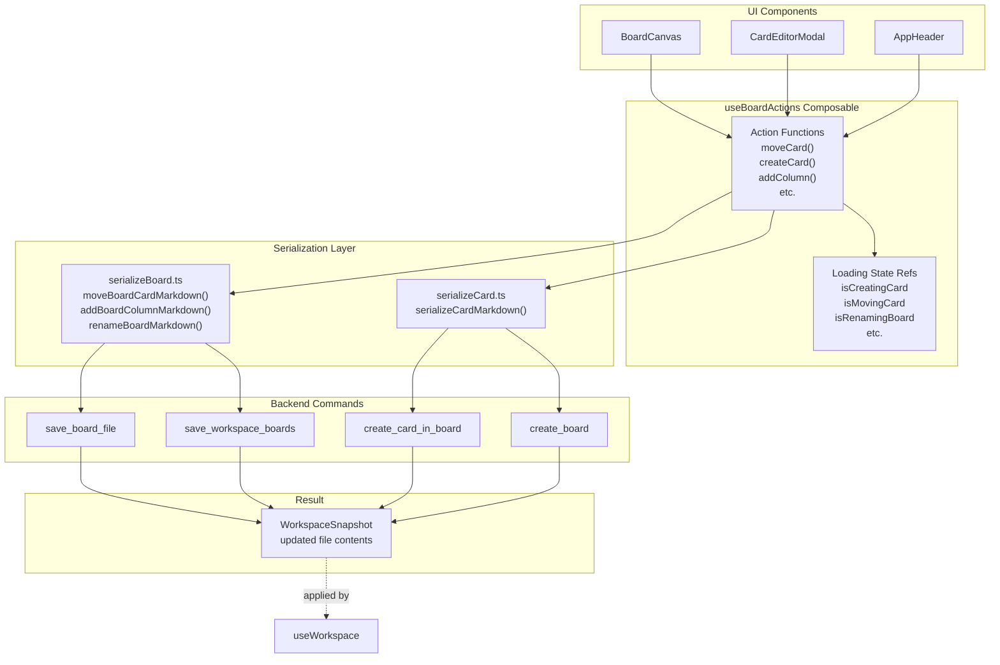
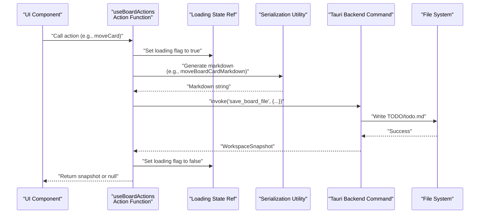
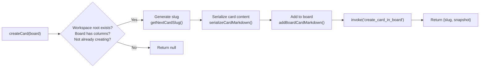
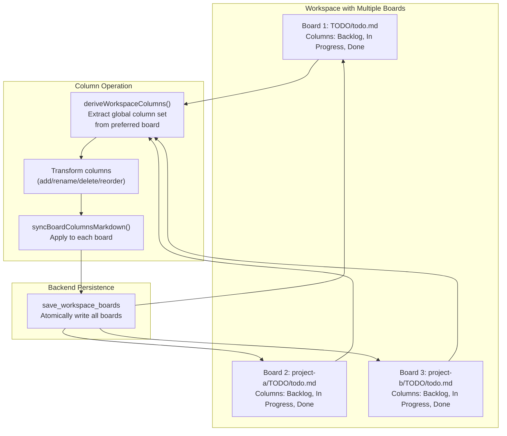
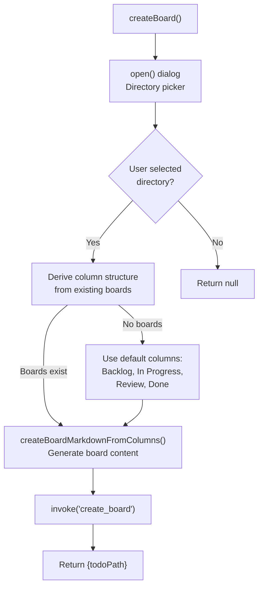
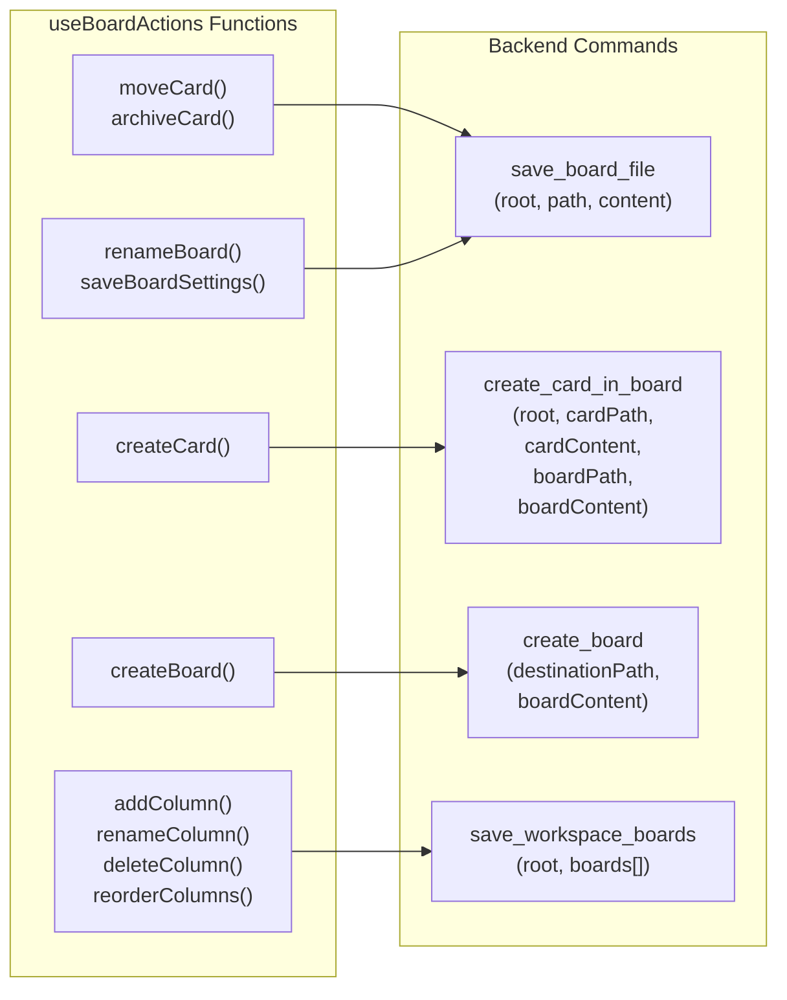

# useBoardActions

<details>
<summary>Relevant source files</summary>

The following files were used as context for generating this wiki page:

- [src/composables/useBoardActions.ts](../src/composables/useBoardActions.ts)
- [src/types/workspace.ts](../src/types/workspace.ts)
- [src/utils/boardMarkdown.test.ts](../src/utils/boardMarkdown.test.ts)
- [src/utils/kanbanPath.ts](../src/utils/kanbanPath.ts)

</details>


The `useBoardActions` composable provides the mutation layer for board and card operations in KanStack. It exposes functions for creating, moving, archiving, and renaming boards, columns, and cards. Each operation follows a consistent pattern: serialize the change to markdown, invoke a backend command to persist it, and return an updated workspace snapshot.

For workspace state management and queries, see [useWorkspace](#5.2.1). For card editing sessions, see [useCardEditor](#5.2.3).

## Overview and Architecture

The `useBoardActions` composable sits between the UI layer and the backend, coordinating three key responsibilities:

1. **Serialization**: Transforms structured board/card data into markdown using utilities from `serializeBoard.ts` and `serializeCard.ts`
2. **Persistence**: Invokes Tauri backend commands to write markdown files to disk
3. **State Updates**: Returns `WorkspaceSnapshot` objects that `useWorkspace` applies to reactive state



**Sources:** [src/composables/useBoardActions.ts:1-449](../src/composables/useBoardActions.ts)

## Composable Interface

The `useBoardActions` function accepts an options object that provides access to the current workspace state without creating circular dependencies with `useWorkspace`:

```typescript
interface UseBoardActionsOptions {
  getBoardsBySlug: () => Record<string, KanbanBoardDocument>
  getWorkspaceRoot: () => string | null
  getBoardFilesBySlug: () => Record<string, WorkspaceFileSnapshot>
  getCardsBySlug: () => Record<string, KanbanCardDocument>
}
```

The composable returns an object containing:
- **Action functions**: Async functions that perform mutations
- **Loading state refs**: Reactive boolean flags indicating operation progress

**Sources:** [src/composables/useBoardActions.ts:43-48](../src/composables/useBoardActions.ts), [src/composables/useBoardActions.ts:413-433](../src/composables/useBoardActions.ts)

## Operation Pattern

All mutation operations in `useBoardActions` follow a consistent flow:



Key characteristics of this pattern:

1. **Loading State Management**: Each operation sets a loading flag before starting and clears it in a `finally` block
2. **Early Returns**: Operations check preconditions (workspace root exists, not already in progress) and return `null` if invalid
3. **Error Handling**: All backend invocations are wrapped in try/catch blocks that log errors and return `null`
4. **Snapshot Returns**: Successful operations return a `WorkspaceSnapshot` that the caller can apply to reactive state

**Sources:** [src/composables/useBoardActions.ts:60-81](../src/composables/useBoardActions.ts), [src/composables/useBoardActions.ts:107-149](../src/composables/useBoardActions.ts)

## Card Operations

### Creating Cards

The `createCard` function creates a new card in the first non-archive column of a board:

| Step | Action | Implementation |
|------|--------|----------------|
| 1 | Generate unique slug | Uses `getNextCardSlug()` to find next available `untitled-card-N` slug |
| 2 | Serialize card markdown | Calls `serializeCardMarkdown()` with title and empty body |
| 3 | Update board markdown | Calls `addBoardCardMarkdown()` to insert wikilink in target column |
| 4 | Invoke backend | Calls `create_card_in_board` command to atomically write both files |
| 5 | Return result | Returns object with card slug and workspace snapshot |



The card is placed in the first section of the first non-archive column. If all columns are archive columns, it defaults to the first column.

**Sources:** [src/composables/useBoardActions.ts:107-149](../src/composables/useBoardActions.ts), [src/composables/useBoardActions.ts:436-444](../src/composables/useBoardActions.ts)

### Moving Cards

The `moveCard` function relocates a card to a different column, section, or position within the same board:

```typescript
async function moveCard(board: KanbanBoardDocument, input: MoveBoardCardInput)
```

The `MoveBoardCardInput` interface specifies:
- `cardSlug`: Full slug of the card being moved
- `targetColumnName` and `targetColumnSlug`: Destination column
- `targetSectionName` and `targetSectionSlug`: Destination section (or `null` for default section)
- `targetIndex`: Position within the section's card list

The operation uses `moveBoardCardMarkdown()` to regenerate the board's markdown with the card in its new position, then persists via `save_board_file`.

**Sources:** [src/composables/useBoardActions.ts:60-81](../src/composables/useBoardActions.ts), [src/utils/serializeBoard.ts:1-14](../src/utils/serializeBoard.ts)

### Archiving Cards

The `archiveCard` and `archiveCards` functions move cards to the archive column:

- `archiveCard(board, cardSlug)`: Archives a single card
- `archiveCards(board, cardSlugs)`: Archives multiple cards in batch

Both functions:
1. Generate updated board markdown using `archiveBoardCardMarkdown()` or `archiveBoardCardsMarkdown()`
2. Automatically create an "Archive" column if one doesn't exist
3. Place archived cards at the end of the archive column

The archive column is special-cased throughout the codebase via `isArchiveColumnSlug()` checks.

**Sources:** [src/composables/useBoardActions.ts:348-375](../src/composables/useBoardActions.ts), [src/utils/serializeBoard.ts:7-8](../src/utils/serializeBoard.ts)

## Column Operations

Column operations affect all boards in the workspace simultaneously, maintaining consistency across the board hierarchy.

### Column Synchronization Model



The `deriveWorkspaceColumns()` utility extracts a canonical column set from the "preferred board" (typically the current board). All column operations apply the same transformation to every board.

**Sources:** [src/composables/useBoardActions.ts:191-220](../src/composables/useBoardActions.ts), src/utils/workspaceColumns.ts

### Adding Columns

The `addColumn` function creates a new column across all boards:

1. Generate column name and slug (`"Untitled Column"` and unique slug)
2. Derive current global columns from the preferred board
3. Insert new column before the archive column using `insertWorkspaceColumnBeforeArchive()`
4. Apply to all boards via `syncBoardColumnsMarkdown()`
5. Persist all boards atomically via `save_workspace_boards`

Archive columns are always kept last, even when new columns are added.

**Sources:** [src/composables/useBoardActions.ts:191-221](../src/composables/useBoardActions.ts)

### Renaming Columns

The `renameColumn` function updates a column's name and slug across all boards:

```typescript
async function renameColumn(
  preferredBoard: KanbanBoardDocument,
  currentSlug: string,
  nextName: string
)
```

Special cases:
- Archive columns cannot be renamed (throws error)
- The new slug is derived from `slugifySegment(nextName)`
- If the derived slug conflicts with existing columns, `getNextAvailableSlug()` appends a numeric suffix
- All boards receive the same rename via `renameBoardColumnMarkdown()`

**Sources:** [src/composables/useBoardActions.ts:223-254](../src/composables/useBoardActions.ts)

### Deleting Columns

The `deleteColumn` function removes a column from all boards:

```typescript
async function deleteColumn(columnSlug: string)
```

Deletion is blocked if any board has cards in the target column:

```typescript
const hasCards = boards.some(
  (board) => countCardsInColumn(board.columns.find((column) => column.slug === columnSlug)) > 0
)
if (hasCards) {
  return { blocked: true, snapshot: null }
}
```

If deletion proceeds, `deleteBoardColumnMarkdown()` removes the column heading and any empty sections from all boards.

**Sources:** [src/composables/useBoardActions.ts:256-285](../src/composables/useBoardActions.ts)

### Reordering Columns

The `reorderColumns` function changes column order across all boards:

```typescript
async function reorderColumns(
  preferredBoard: KanbanBoardDocument,
  draggedSlug: string,
  targetIndex: number
)
```

The operation:
1. Derives global columns from the preferred board
2. Reorders using `reorderWorkspaceColumns()` utility
3. Applies new order to all boards via `reorderBoardColumnsMarkdown()`
4. Persists via `save_workspace_boards`

The archive column always remains last regardless of the specified target index.

**Sources:** [src/composables/useBoardActions.ts:287-304](../src/composables/useBoardActions.ts)

### Column Batch Persistence

The `saveColumns` helper function centralizes the logic for persisting column changes across all boards:

```typescript
async function saveColumns(
  boards: Array<{ path: string; content: string }>,
  mode: 'create' | 'rename' | 'delete'
)
```

It manages the appropriate loading state flag based on the mode and invokes the `save_workspace_boards` backend command, which atomically writes all board files.

**Sources:** [src/composables/useBoardActions.ts:306-346](../src/composables/useBoardActions.ts)

## Board Operations

### Creating Boards

The `createBoard` function opens a directory picker and creates a new board at the selected location:



New boards inherit their column structure from existing boards in the workspace. If no boards exist, they use a default set of four columns defined in `DEFAULT_NEW_BOARD_COLUMNS`.

**Sources:** [src/composables/useBoardActions.ts:151-189](../src/composables/useBoardActions.ts), [src/composables/useBoardActions.ts:36-41](../src/composables/useBoardActions.ts)

### Renaming Boards

The `renameBoard` function updates a board's title in its frontmatter:

```typescript
async function renameBoard(board: KanbanBoardDocument, title: string)
```

The operation:
1. Normalizes the title (trims whitespace)
2. Returns early if the title is unchanged
3. Uses `renameBoardMarkdown()` to update the frontmatter `title` field
4. Persists via `save_board_file`
5. Returns the board slug and snapshot (or null if title unchanged)

Only the frontmatter is modified; the board's column structure remains intact.

**Sources:** [src/composables/useBoardActions.ts:377-411](../src/composables/useBoardActions.ts)

### Saving Board Settings

The `saveBoardSettings` function updates a board's `%% kanban:settings %%` block:

```typescript
async function saveBoardSettings(
  board: KanbanBoardDocument,
  settings: KanbanBoardSettings
)
```

Settings include preferences like:
- `show-archive-column`: Whether to display the archive column
- `show-sub-boards`: Whether to display the sub-boards section

The operation uses `updateBoardSettingsMarkdown()` to update the JSON settings block while preserving the rest of the markdown content.

**Sources:** [src/composables/useBoardActions.ts:83-105](../src/composables/useBoardActions.ts)

## Loading State Management

The composable maintains eight loading state refs to prevent concurrent operations and provide UI feedback:

| Ref | Operations | Type |
|-----|-----------|------|
| `isCreatingCard` | `createCard()` | Card creation |
| `isCreatingColumn` | `addColumn()` | Column creation |
| `isCreatingBoard` | `createBoard()` | Board creation |
| `isDeletingColumn` | `deleteColumn()` | Column deletion |
| `isMovingCard` | `moveCard()`, `archiveCard()`, `archiveCards()` | Card movement |
| `isRenamingColumn` | `renameColumn()`, `reorderColumns()` | Column renaming/reordering |
| `isRenamingBoard` | `renameBoard()` | Board renaming |
| `isSavingPreference` | `saveBoardSettings()` | Settings updates |

Each loading state follows the pattern:

```typescript
if (isLoadingState.value) {
  return null  // Prevent concurrent operations
}

isLoadingState.value = true
try {
  // Perform operation
} finally {
  isLoadingState.value = false  // Always clear flag
}
```

UI components can bind to these refs to show loading spinners or disable controls during operations.

**Sources:** [src/composables/useBoardActions.ts:51-58](../src/composables/useBoardActions.ts), [src/composables/useBoardActions.ts:60-81](../src/composables/useBoardActions.ts)

## Backend Command Integration

The composable invokes four Tauri backend commands:



Each command returns a `WorkspaceSnapshot` containing the updated file contents, which the composable returns to the caller for application to reactive state.

**Sources:** [src/composables/useBoardActions.ts:70-74](../src/composables/useBoardActions.ts), [src/composables/useBoardActions.ts:135-141](../src/composables/useBoardActions.ts), [src/composables/useBoardActions.ts:178-181](../src/composables/useBoardActions.ts), [src/composables/useBoardActions.ts:328-331](../src/composables/useBoardActions.ts)

## Serialization Function Mapping

The composable delegates markdown generation to specialized utilities in `serializeBoard.ts`:

| Operation | Serialization Function | Purpose |
|-----------|----------------------|---------|
| Move card | `moveBoardCardMarkdown()` | Relocates wikilink to new column/section/index |
| Archive card(s) | `archiveBoardCardMarkdown()`, `archiveBoardCardsMarkdown()` | Moves wikilink(s) to archive column |
| Add card | `addBoardCardMarkdown()` | Inserts new wikilink at specified position |
| Create board | `createBoardMarkdownFromColumns()` | Generates complete board file with frontmatter and columns |
| Rename board | `renameBoardMarkdown()` | Updates frontmatter title |
| Add column | `syncBoardColumnsMarkdown()` | Inserts new `## Column` heading |
| Rename column | `renameBoardColumnMarkdown()` | Updates `## Column` heading and slug |
| Delete column | `deleteBoardColumnMarkdown()` | Removes `## Column` heading |
| Reorder columns | `reorderBoardColumnsMarkdown()` | Rearranges `## Column` headings |
| Update settings | `updateBoardSettingsMarkdown()` | Modifies `%% kanban:settings %%` JSON block |

These functions preserve board structure like sections, settings blocks, and card ordering while applying the requested mutation.

**Sources:** [src/composables/useBoardActions.ts:12-26](../src/composables/useBoardActions.ts), [src/utils/serializeBoard.ts:1-14](../src/utils/serializeBoard.ts), src/utils/serializeBoardSettings.ts

## Error Handling

All operations follow a consistent error handling pattern:

1. **Precondition Checks**: Early return `null` if workspace root is missing or operation already in progress
2. **Try/Catch Blocks**: Wrap backend invocations to catch and log errors
3. **Error Logging**: Use `console.error()` with descriptive messages
4. **Null Returns**: Return `null` on failure, allowing callers to detect errors
5. **Finally Blocks**: Always clear loading states even if errors occur

Example from `moveCard`:

```typescript
try {
  return await invoke<WorkspaceSnapshot>('save_board_file', {
    root: workspaceRoot,
    path: board.path,
    content: nextContent,
  })
} catch (error) {
  console.error('Failed to move card', error)
  return null
} finally {
  isMovingCard.value = false
}
```

Callers should check for `null` returns and handle errors appropriately in the UI layer.

**Sources:** [src/composables/useBoardActions.ts:69-80](../src/composables/useBoardActions.ts), [src/composables/useBoardActions.ts:134-148](../src/composables/useBoardActions.ts)
