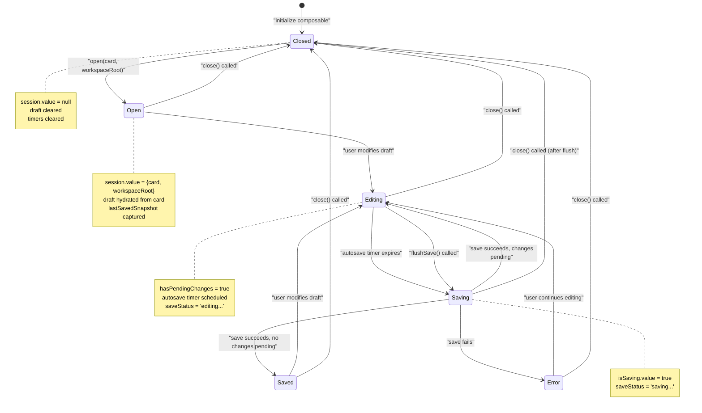
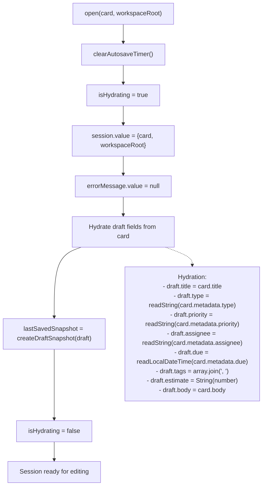
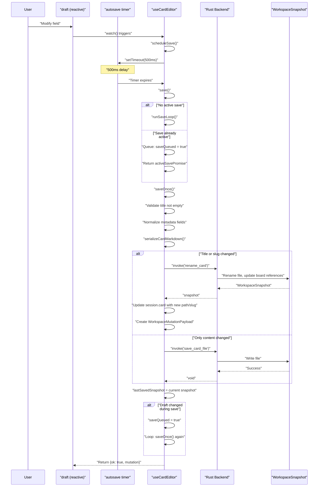
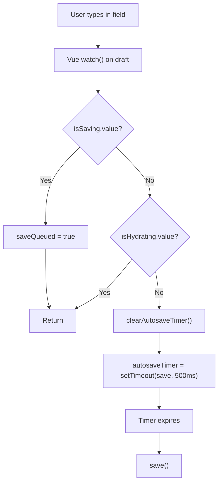

# useCardEditor

<details>
<summary>Relevant source files</summary>

The following files were used as context for generating this wiki page:

- [src/components/card/CardEditorModal.vue](../src/components/card/CardEditorModal.vue)
- [src/composables/useCardEditor.ts](../src/composables/useCardEditor.ts)

</details>


This composable manages the card editing experience in KanStack. It maintains an editing session with draft state, handles autosaving with debouncing, validates and normalizes card metadata, and coordinates save/rename/delete operations with the backend. The composable ensures data consistency by tracking pending changes, queuing concurrent saves, and providing save status feedback.

For board and card manipulation operations (create, move, archive), see [useBoardActions](#5.2.2). For workspace-level state management, see [useWorkspace](#5.2.1).

---

## Overview and Responsibilities

The `useCardEditor` composable encapsulates all logic for editing individual cards:

| Responsibility | Description |
|----------------|-------------|
| **Session Management** | Opens/closes editing sessions, tracks active card and workspace root |
| **Draft State** | Maintains reactive draft state separate from source card document |
| **Autosave** | Debounces user input and automatically saves after 500ms of inactivity |
| **Validation** | Validates required fields (title) and normalizes metadata values |
| **Save Coordination** | Queues concurrent save requests, handles rename detection, updates workspace |
| **Error Handling** | Captures and exposes save/delete errors to UI |
| **Status Tracking** | Computes save status: 'saved', 'editing...', 'saving...', 'save failed' |

The composable is designed to be instantiated once per card editor modal instance, not globally. It maintains local state for a single editing session.

**Sources:** [src/composables/useCardEditor.ts:1-371](../src/composables/useCardEditor.ts)

---

## Core Data Structures

### CardEditorSession

Represents an active editing session:

```typescript
interface CardEditorSession {
  card: KanbanCardDocument        // Current card being edited
  workspaceRoot: string            // Workspace root path for backend commands
}
```

The session is established when `open()` is called and cleared when `close()` is called.

**Sources:** [src/composables/useCardEditor.ts:13-16](../src/composables/useCardEditor.ts)

### Draft State

The `draft` reactive object holds the in-progress edits:

```typescript
const draft = reactive({
  title: '',          // Card title (required)
  type: '',           // task | bug | feature | research | chore
  priority: '',       // low | medium | high
  assignee: '',       // Assignee name
  due: '',            // ISO datetime-local format
  tags: '',           // Comma-separated tags
  estimate: '',       // Numeric estimate
  body: ''            // Markdown body content
})
```

These fields are bound directly to form inputs in `CardEditorModal`. Changes trigger autosave.

**Sources:** [src/composables/useCardEditor.ts:35-44](../src/composables/useCardEditor.ts), [src/components/card/CardEditorModal.vue:222-313](../src/components/card/CardEditorModal.vue)

### UseCardEditorOptions

Required options passed during instantiation:

```typescript
interface UseCardEditorOptions {
  getBoardCardPaths: (cardPath: string) => string[]  // Returns all card paths in same directory
  getSourceBoardSlug: () => string | null            // Returns current board slug for mutations
}
```

These callbacks allow the composable to check for slug collisions during renames and create workspace mutation payloads without directly accessing workspace state.

**Sources:** [src/composables/useCardEditor.ts:18-21](../src/composables/useCardEditor.ts)

---

## State Lifecycle



**Sources:** [src/composables/useCardEditor.ts:67-93](../src/composables/useCardEditor.ts), [src/composables/useCardEditor.ts:51-65](../src/composables/useCardEditor.ts)

---

## Opening and Closing Sessions

### open()

The `open()` function initializes an editing session:



The `isHydrating` flag prevents autosave from triggering during initial population of the draft.

**Sources:** [src/composables/useCardEditor.ts:67-82](../src/composables/useCardEditor.ts)

### close()

The `close()` function tears down the session:

- Clears autosave timer
- Nullifies session
- Clears error message
- Resets all flags (`isHydrating`, `isSaving`, `isDeleting`, `saveQueued`)
- Nullifies active save promise

**Sources:** [src/composables/useCardEditor.ts:84-93](../src/composables/useCardEditor.ts)

---

## Save Operations

### Save Flow Overview



**Sources:** [src/composables/useCardEditor.ts:95-225](../src/composables/useCardEditor.ts)

### Save Loop Mechanism

The save system handles concurrent edits through a loop:

1. **Check for active save**: If `activeSavePromise` exists, set `saveQueued = true` and return the active promise
2. **Start save loop**: `runSaveLoop()` repeatedly calls `saveOnce()` while `saveQueued` is true
3. **Save once**: `saveOnce()` performs a single save operation
4. **Check for changes**: After save, if draft snapshot differs from `lastSavedSnapshot`, set `saveQueued = true`
5. **Loop**: Continue until `saveQueued` is false

This ensures all edits are saved even if the user types during a save operation, without spawning multiple concurrent backend calls.

**Sources:** [src/composables/useCardEditor.ts:95-126](../src/composables/useCardEditor.ts)

### Rename Detection

The composable detects when a card needs to be renamed:

```typescript
const renameTarget = getCardRenameTarget(
  title,
  session.value.card.path,
  options.getBoardCardPaths(session.value.card.path),
)

if (title !== session.value.card.title || renameTarget.slug !== session.value.card.slug) {
  // Invoke 'rename_card' command
}
```

The `getCardRenameTarget` utility determines the new slug and path based on the title, avoiding collisions with existing cards in the same directory.

**Sources:** [src/composables/useCardEditor.ts:165-182](../src/composables/useCardEditor.ts), src/utils/renameTarget.ts

### Workspace Mutation Payload

When a rename occurs, a `WorkspaceMutationPayload` is created:

```typescript
mutation = {
  snapshot,                    // Updated WorkspaceSnapshot from backend
  selectedCard: sourceBoardSlug
    ? {
        slug: renameTarget.slug,
        sourceBoardSlug,
      }
    : null,
}
```

This payload is returned to the caller (typically `CardEditorModal`), which emits it to `App.vue` to update the workspace state and selection.

**Sources:** [src/composables/useCardEditor.ts:196-205](../src/composables/useCardEditor.ts), [src/components/card/CardEditorModal.vue:73-75](../src/components/card/CardEditorModal.vue)

---

## Validation and Normalization

### Field Validation

Currently, only the title field is validated:

```typescript
const title = draft.title.trim()
if (!title) {
  errorMessage.value = 'Title is required.'
  return { ok: false, mutation: null }
}
```

Empty titles are rejected before attempting to save.

**Sources:** [src/composables/useCardEditor.ts:138-142](../src/composables/useCardEditor.ts)

### Metadata Normalization

Each metadata field has a normalization function:

| Field | Function | Logic |
|-------|----------|-------|
| `type` | `normalizeCardType()` | Must match one of: `task`, `bug`, `feature`, `research`, `chore` |
| `priority` | `normalizeCardPriority()` | Must match one of: `low`, `medium`, `high` |
| `assignee` | `normalizeOptionalString()` | Trimmed, returns `undefined` if empty |
| `due` | `normalizeLocalDateTime()` | Must match pattern `YYYY-MM-DDTHH:MM`, else `undefined` |
| `tags` | `normalizeTags()` | Split by comma, trimmed, returns `undefined` if empty array |
| `estimate` | `normalizeEstimate()` | Parse as number, returns `undefined` if not finite |

Invalid values are converted to `undefined` rather than causing errors.

**Sources:** [src/composables/useCardEditor.ts:317-366](../src/composables/useCardEditor.ts)

### Reading from Card Metadata

When hydrating the draft, specialized read functions handle type conversions:

- `readString()`: Returns string value or empty string
- `readLocalDateTime()`: Extracts `YYYY-MM-DDTHH:MM` prefix or returns empty string
- Tags array is joined with `', '`
- Estimate number is converted to string

**Sources:** [src/composables/useCardEditor.ts:72-79](../src/composables/useCardEditor.ts), [src/composables/useCardEditor.ts:348-370](../src/composables/useCardEditor.ts)

---

## Autosave Mechanism

### Debouncing Strategy



The watch on `draft` triggers `scheduleSave()` on every change. The function:

1. Returns early if `isHydrating` (prevents autosave during initial hydration)
2. Clears any existing timer (debounces rapid typing)
3. Sets new timer for 500ms
4. If already saving, sets `saveQueued = true` instead

**Sources:** [src/composables/useCardEditor.ts:257-282](../src/composables/useCardEditor.ts)

### Timer Management

The autosave timer is cleared in multiple scenarios:

- When `scheduleSave()` is called again (debouncing)
- When `open()` is called (new session)
- When `close()` is called (session teardown)
- When `flushSave()` is called (immediate save requested)
- When component is unmounted

**Sources:** [src/composables/useCardEditor.ts:268-275](../src/composables/useCardEditor.ts), [src/composables/useCardEditor.ts:284-286](../src/composables/useCardEditor.ts)

---

## Computed Properties

### hasPendingChanges

```typescript
const hasPendingChanges = computed(() => 
  Boolean(session.value) && createDraftSnapshot(draft) !== lastSavedSnapshot.value
)
```

Compares a JSON snapshot of the current draft against the last saved snapshot. Returns `true` if there are unsaved changes.

**Sources:** [src/composables/useCardEditor.ts:49](../src/composables/useCardEditor.ts)

### saveStatus

```typescript
const saveStatus = computed(() => {
  if (isSaving.value) {
    return 'saving...'
  }

  if (errorMessage.value) {
    return 'save failed'
  }

  if (hasPendingChanges.value) {
    return 'editing...'
  }

  return 'saved'
})
```

Provides user-friendly status text that drives the UI status indicator.

**Sources:** [src/composables/useCardEditor.ts:51-65](../src/composables/useCardEditor.ts), [src/components/card/CardEditorModal.vue:184-187](../src/components/card/CardEditorModal.vue)

---

## Integration with CardEditorModal

### Instantiation

The modal creates an editor instance with required options:

```typescript
const editor = useCardEditor({
  getBoardCardPaths: (cardPath) => {
    const boardCardDirectory = cardPath.replace(/\/[^/]+$/, "");
    return Object.values(props.cardsBySlug)
      .map((card) => card.path)
      .filter((path) =>
        path.startsWith(`${boardCardDirectory}/`) || path === cardPath,
      );
  },
  getSourceBoardSlug: () => props.sourceBoard?.slug ?? null,
});
```

This provides the composable with access to card paths (for collision detection) and source board slug (for mutation payloads).

**Sources:** [src/components/card/CardEditorModal.vue:28-40](../src/components/card/CardEditorModal.vue)

### State Synchronization

The modal watches props and syncs editor state:

```typescript
function syncEditorState() {
  if (props.open && props.workspaceRoot) {
    const nextCard = props.card ?? editor.session.value?.card ?? null;
    if (!nextCard) {
      return;
    }

    const sameSession =
      editor.session.value?.card.slug === nextCard.slug &&
      editor.session.value?.workspaceRoot === props.workspaceRoot;

    if (sameSession) {
      return;
    }

    editor.open(nextCard, props.workspaceRoot);
    return;
  }

  editor.close();
}

watch(
  () => [props.open, props.card?.slug ?? null, props.workspaceRoot],
  syncEditorState,
  { immediate: true },
);
```

This ensures the editor opens/closes/switches cards based on modal props.

**Sources:** [src/components/card/CardEditorModal.vue:45-149](../src/components/card/CardEditorModal.vue)

### Event Handlers

The modal provides handlers that call editor methods:

| Handler | Editor Method | Additional Logic |
|---------|---------------|------------------|
| `handleClose()` | `flushSave()` | Emits mutation if returned, then emits 'close' |
| `handleBlur()` | `flushSave()` | Emits mutation if returned |
| `handleDelete()` | `flushSave()`, `close()` | Confirms with user, emits 'deleteCard', emits 'close' |
| `handleArchive()` | `flushSave()`, `close()` | Emits 'archiveCard', emits 'close' |

All handlers flush pending saves before performing their action, ensuring no data loss.

**Sources:** [src/components/card/CardEditorModal.vue:67-143](../src/components/card/CardEditorModal.vue)

### Form Bindings

Draft fields are bound directly to form inputs with `v-model`:

```vue
<input
  v-model="editor.draft.title"
  class="card-editor__input"
  type="text"
  @blur="handleBlur"
/>

<select
  v-model="editor.draft.type"
  class="card-editor__input"
  @blur="handleBlur"
  @change="handleBlur"
>
  <option value="">None</option>
  <option value="task">Task</option>
  <option value="bug">Bug</option>
  <option value="feature">Feature</option>
  <option value="research">Research</option>
  <option value="chore">Chore</option>
</select>

<textarea
  v-model="editor.draft.body"
  class="card-editor__textarea"
  spellcheck="false"
  @blur="handleBlur"
></textarea>
```

The `@blur` handlers trigger immediate saves when users leave fields.

**Sources:** [src/components/card/CardEditorModal.vue:222-313](../src/components/card/CardEditorModal.vue)

---

## Return Value API

The composable returns the following reactive references and functions:

```typescript
return {
  session,              // shallowRef<CardEditorSession | null>
  draft,                // reactive draft object
  isDeleting,           // shallowRef<boolean>
  isSaving,             // shallowRef<boolean>
  errorMessage,         // shallowRef<string | null>
  hasPendingChanges,    // computed<boolean>
  saveStatus,           // computed<string>
  open,                 // (card, workspaceRoot) => void
  close,                // () => void
  save,                 // () => Promise<SaveResult>
  flushSave,            // () => Promise<SaveResult>
  deleteCard            // () => Promise<boolean>
}
```

All state is reactive and can be used directly in templates or watched in other composables.

**Sources:** [src/composables/useCardEditor.ts:288-301](../src/composables/useCardEditor.ts)

---

## Key Design Decisions

### Local vs Global State

The composable is instantiated per modal instance rather than globally. This allows multiple editors to potentially exist (though the current UI only supports one), and ensures clean state isolation.

### Snapshot-Based Change Detection

Rather than deep-watching the draft object or comparing individual fields, the composable uses JSON stringification to create snapshots. This is simple, reliable, and efficient for the small draft objects.

**Sources:** [src/composables/useCardEditor.ts:49](../src/composables/useCardEditor.ts), [src/composables/useCardEditor.ts:304-315](../src/composables/useCardEditor.ts)

### Save Queuing vs Debouncing

The composable uses both:
- **Debouncing**: Delays save by 500ms after last edit (via `scheduleSave`)
- **Queuing**: If user edits during save, queues another save (via `saveQueued`)

This ensures all changes are persisted while avoiding unnecessary backend calls.

**Sources:** [src/composables/useCardEditor.ts:95-126](../src/composables/useCardEditor.ts), [src/composables/useCardEditor.ts:257-266](../src/composables/useCardEditor.ts)

### Flush Before Destructive Actions

Delete and archive operations call `flushSave()` before proceeding. This ensures any pending edits are saved before the card is moved or deleted.

**Sources:** [src/components/card/CardEditorModal.vue:88-139](../src/components/card/CardEditorModal.vue)
