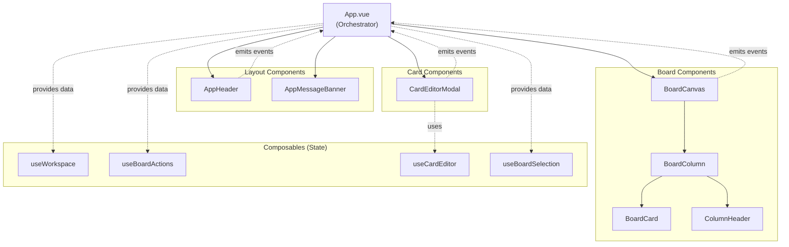
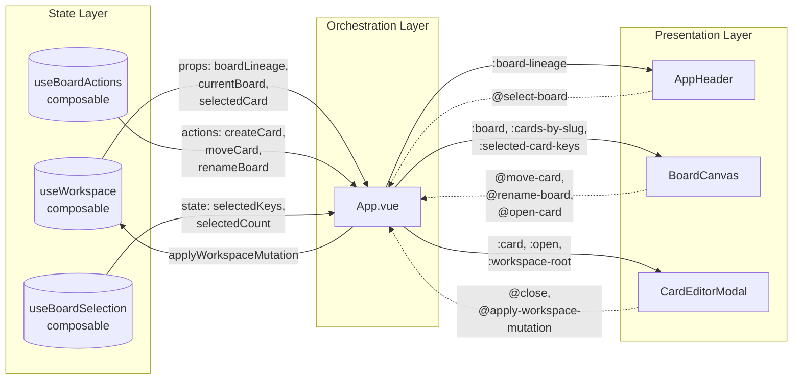
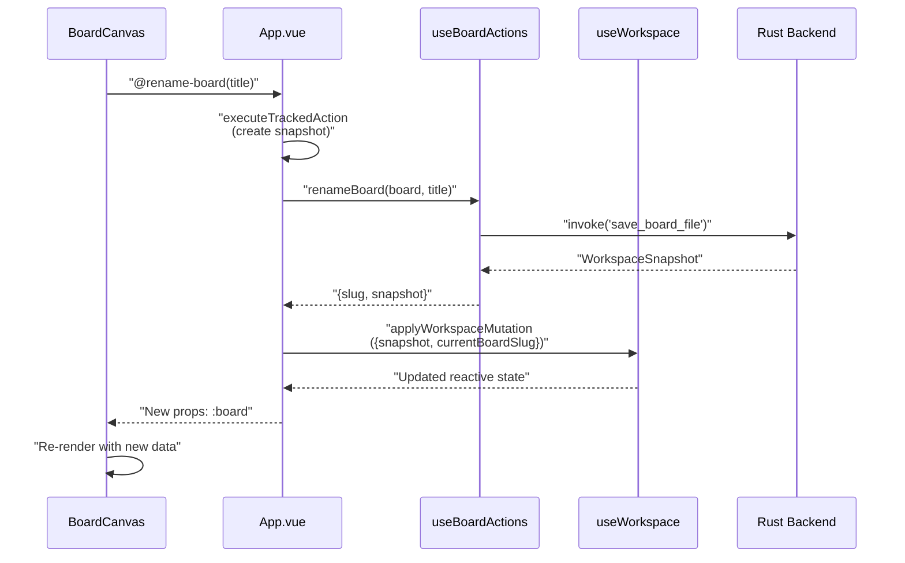

# Key Components

<details>
<summary>Relevant source files</summary>

The following files were used as context for generating this wiki page:

- [src/App.vue](../src/App.vue)
- [src/components/card/CardEditorModal.vue](../src/components/card/CardEditorModal.vue)

</details>


This page provides an overview of the major UI components in KanStack's Vue.js frontend, their responsibilities, and how they integrate with the application architecture. For detailed information about composables and state management, see [Composables Overview](../5.2.3-usecardeditor.md). For information about the main application orchestrator, see [Main Application Component](5.1-main-application-component.md).

---

## Component Architecture

KanStack's UI is built from specialized Vue components that follow a clear separation of concerns. Components receive data through props and communicate upward through events, maintaining unidirectional data flow. The main application component (`App.vue`) orchestrates these components and connects them to composables.

**Component Hierarchy Diagram**



Sources: [src/App.vue:1-1714](../src/App.vue)

---

## Core UI Components

KanStack's frontend is organized into four primary component categories, each serving a distinct role in the application.

### AppHeader Component

Located at `src/components/app/AppHeader.vue`, this component manages workspace navigation and displays the board hierarchy breadcrumb trail.

**Responsibilities:**
- Renders board lineage as navigable breadcrumbs
- Displays child board navigation
- Manages board selection events
- Shows workspace controls

**Integration:**
```typescript
// In App.vue template
<AppHeader
    :board-lineage="boardLineage"
    :child-boards="childBoards"
    @select-board="selectBoard"
/>
```

The component receives `boardLineage` (array of ancestor boards) and `childBoards` (array of sub-boards) from the `useWorkspace` composable and emits `select-board` events when the user navigates to a different board.

Sources: [src/App.vue:1541-1545](../src/App.vue), [src/App.vue:29-52](../src/App.vue)

### AppMessageBanner Component

Located at `src/components/app/AppMessageBanner.vue`, this component displays transient notification messages to the user.

**Responsibilities:**
- Renders success, error, or informational messages
- Provides message dismissal
- Auto-dismisses after a timeout

**Integration:**
```typescript
// Message state in App.vue
const appMessage = shallowRef<{ kind: "error"; text: string } | null>(null);

// Display logic
<AppMessageBanner
    v-if="appMessage"
    :kind="appMessage.kind"
    :message="appMessage.text"
    @close="dismissAppMessage"
/>
```

Messages are displayed for 5 seconds before auto-dismissing via a timer managed in `App.vue`.

Sources: [src/App.vue:61](../src/App.vue), [src/App.vue:873-910](../src/App.vue), [src/App.vue:1547-1552](../src/App.vue)

### BoardCanvas Component

Located at `src/components/board/BoardCanvas.vue`, this is the primary board visualization component that renders columns, sections, and cards.

**Responsibilities:**
- Renders the kanban board layout
- Manages column and card drag-and-drop interactions
- Handles card selection and multi-select
- Supports keyboard navigation
- Renders sub-board navigation
- Manages column renaming and board renaming UI

**Props Interface:**

| Prop | Type | Purpose |
|------|------|---------|
| `board` | `KanbanBoardDocument` | Current board to render |
| `boardsBySlug` | `Record<string, KanbanBoardDocument>` | All boards for reference resolution |
| `boardFilesBySlug` | `Record<string, {content, path}>` | Board file metadata |
| `cardsBySlug` | `Record<string, KanbanCardDocument>` | All cards for rendering |
| `selectedColumnSlug` | `string \| null` | Currently selected column |
| `selectedCardKeys` | `Set<string>` | Multi-selected card keys |
| `viewPreferences` | `ViewPreferences` | User view settings |
| `workspaceRoot` | `string \| null` | Workspace root path |

**Events Emitted:**

| Event | Payload | Purpose |
|-------|---------|---------|
| `activate-card` | `{metaKey, shiftKey, selection}` | Card clicked with modifiers |
| `add-column` | - | User requests new column |
| `clear-selections` | - | Clear all selections |
| `create-card` | - | User requests new card |
| `move-card` | `{cardSlug, targetColumnSlug, ...}` | Card moved via drag-and-drop |
| `open-card` | `{slug, sourceBoardSlug}` | Open card editor |
| `reorder-columns` | `{draggedSlug, targetIndex}` | Column reordered |
| `rename-board` | `string` | Board title changed |
| `rename-column` | `{name, slug}` | Column renamed |
| `select-column` | `string` | Column selected |
| `toggle-archive-column` | - | Toggle archive column visibility |
| `toggle-sub-boards` | - | Toggle sub-board section visibility |
| `update-view-preferences` | `Partial<ViewPreferences>` | Update user preferences |
| `update-visible-cards` | `VisibleBoardCardSelection[]` | Cards currently visible |

**Integration Example:**
```typescript
<BoardCanvas
    :board="currentBoard"
    :boards-by-slug="workspace?.boardsBySlug ?? {}"
    :cards-by-slug="workspace?.cardsBySlug ?? {}"
    :selected-column-slug="selectedColumnSlug"
    :selected-card-keys="boardSelection.selectedKeys.value"
    @activate-card="handleCardActivate"
    @move-card="handleCardMove"
    @open-card="openCard"
    @rename-board="handleBoardRename"
/>
```

Sources: [src/App.vue:1556-1579](../src/App.vue), [src/App.vue:511-541](../src/App.vue), [src/App.vue:296-332](../src/App.vue)

### CardEditorModal Component

Located at `src/components/card/CardEditorModal.vue`, this modal component provides the card editing interface. For detailed documentation, see [CardEditorModal](#5.3.1).

**Responsibilities:**
- Displays card editing form
- Manages edit session state via `useCardEditor` composable
- Handles save, delete, and archive operations
- Auto-saves changes on blur
- Displays save status indicator

**Integration:**
```typescript
<CardEditorModal
    :card="selectedCard"
    :board-files-by-slug="workspace?.boardFilesBySlug ?? {}"
    :boards-by-slug="workspace?.boardsBySlug ?? {}"
    :cards-by-slug="workspace?.cardsBySlug ?? {}"
    :open="Boolean(selectedCardSlug)"
    :source-board="selectedCardSourceBoard"
    :workspace-root="workspace?.rootPath ?? null"
    @archive-card="archiveSingleCard"
    @apply-workspace-mutation="applyWorkspaceMutation"
    @close="closeCard"
    @delete-card="deleteSingleCard"
/>
```

Sources: [src/App.vue:1612-1624](../src/App.vue), [src/components/card/CardEditorModal.vue:1-462](../src/components/card/CardEditorModal.vue)

---

## Data Flow Pattern

Components in KanStack follow a strict unidirectional data flow: state flows down through props, actions flow up through events.

**Data Flow Diagram**



Sources: [src/App.vue:29-52](../src/App.vue), [src/App.vue:54-59](../src/App.vue), [src/App.vue:60](../src/App.vue)

---

## Component Communication Patterns

### Props for Data Provision

Components receive all necessary data through props, ensuring they remain stateless and testable. The main categories of props are:

1. **Entity Data**: Current board, cards, workspace metadata
2. **Index Maps**: `boardsBySlug`, `cardsBySlug` for efficient lookups
3. **Selection State**: `selectedCardKeys`, `selectedColumnSlug`
4. **Configuration**: `viewPreferences`, `workspaceRoot`

Example from `BoardCanvas`:

```typescript
// Props interface
const props = defineProps<{
    board: KanbanBoardDocument;
    boardsBySlug: Record<string, KanbanBoardDocument>;
    cardsBySlug: Record<string, KanbanCardDocument>;
    selectedColumnSlug: string | null;
    selectedCardKeys: Set<string>;
    viewPreferences: ViewPreferences;
    workspaceRoot: string | null;
}>();
```

Sources: [src/App.vue:1556-1564](../src/App.vue)

### Events for Action Propagation

Components emit strongly-typed events to communicate user actions back to the orchestrator. Events carry the minimal payload needed to execute the action.

**Event Handling Pattern:**

```typescript
// Component emits event with action payload
@move-card="handleCardMove"

// App.vue handles event, coordinates with composables
async function handleCardMove(payload: {
    cardSlug: string;
    sourceBoardSlug: string;
    targetColumnSlug: string;
    targetIndex: number;
}) {
    await moveCardTracked(payload);
}

// Composable performs the actual mutation
async function moveCardTracked(input) {
    const snapshot = await appBoardActions.moveCard(ownerBoard, {
        cardSlug: input.cardSlug,
        targetColumnSlug: input.targetColumnSlug,
        targetIndex: input.targetIndex,
    });
    
    applyWorkspaceMutation({ snapshot });
}
```

Sources: [src/App.vue:531-610](../src/App.vue)

### Workspace Mutation Pattern

All state-changing operations follow a consistent mutation pattern:

1. Component emits event with action parameters
2. `App.vue` handles event and calls composable action
3. Action returns `WorkspaceSnapshot` from backend
4. `App.vue` calls `applyWorkspaceMutation` to update reactive state
5. Components automatically re-render with new props

**Mutation Flow Diagram:**



Sources: [src/App.vue:477-509](../src/App.vue), [src/App.vue:126-132](../src/App.vue)

---

## Component Lifecycle Integration

### Global Event Listeners

Some components register global event listeners for cross-component communication:

**CardEditorModal** listens for the custom event `kanstack:request-close-editor` to handle editor closure requests from keyboard shortcuts:

```typescript
onMounted(() => {
    window.addEventListener(
        "kanstack:request-close-editor",
        handleCloseEditorRequest as EventListener,
    );
});

onUnmounted(() => {
    window.removeEventListener(
        "kanstack:request-close-editor",
        handleCloseEditorRequest as EventListener,
    );
});
```

This allows `App.vue` to dispatch close requests via keyboard shortcuts without prop drilling.

Sources: [src/components/card/CardEditorModal.vue:151-163](../src/components/card/CardEditorModal.vue), [src/App.vue:865-867](../src/App.vue)

### Component State Synchronization

Components with internal state (like `CardEditorModal` with `useCardEditor`) synchronize their state with parent props through watchers:

```typescript
watch(
    () => [props.open, props.card?.slug ?? null, props.workspaceRoot],
    syncEditorState,
    { immediate: true },
);

function syncEditorState() {
    if (props.open && props.workspaceRoot) {
        const nextCard = props.card ?? editor.session.value?.card ?? null;
        if (!nextCard) return;
        
        const sameSession =
            editor.session.value?.card.slug === nextCard.slug &&
            editor.session.value?.workspaceRoot === props.workspaceRoot;
        
        if (!sameSession) {
            editor.open(nextCard, props.workspaceRoot);
        }
        return;
    }
    
    editor.close();
}
```

This ensures the editor state stays synchronized with the selected card from parent state.

Sources: [src/components/card/CardEditorModal.vue:45-65](../src/components/card/CardEditorModal.vue), [src/components/card/CardEditorModal.vue:145-149](../src/components/card/CardEditorModal.vue)

---

## Component Organization

Components are organized by domain in the `src/components/` directory:

```
src/components/
├── app/
│   ├── AppHeader.vue          # Workspace navigation and breadcrumbs
│   └── AppMessageBanner.vue   # Transient message display
├── board/
│   ├── BoardCanvas.vue        # Main board visualization
│   ├── BoardColumn.vue        # Individual column rendering
│   ├── BoardCard.vue          # Card rendering
│   └── ColumnHeader.vue       # Column header with controls
└── card/
    └── CardEditorModal.vue    # Card editing modal
```

This structure mirrors the conceptual separation between application-level components (`app/`), board-related components (`board/`), and card-related components (`card/`).

Sources: [src/App.vue:6-9](../src/App.vue)

---

## Summary

KanStack's component architecture emphasizes:

- **Single Responsibility**: Each component has a focused purpose
- **Unidirectional Data Flow**: Props down, events up
- **Stateless Components**: State lives in composables, components are presentational
- **Type Safety**: Strong TypeScript typing for props and events
- **Composable Integration**: Components connect to composables through `App.vue` orchestration
- **Event-Driven Communication**: Custom events and standard Vue events for cross-component communication

For detailed information about specific components, see:
- [CardEditorModal](#5.3.1) for card editing UI details
- [Main Application Component](5.1-main-application-component.md) for `App.vue` orchestration
- [Composables Overview](../5.2.3-usecardeditor.md) for state management details

Sources: [src/App.vue:1-1714](../src/App.vue), [src/components/card/CardEditorModal.vue:1-462](../src/components/card/CardEditorModal.vue)
