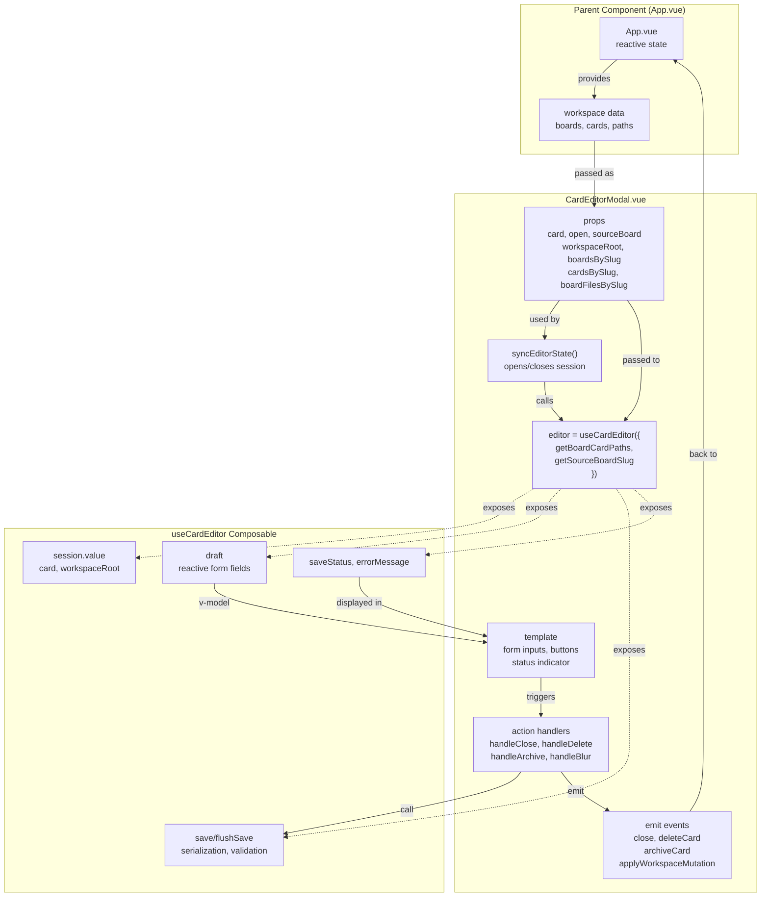
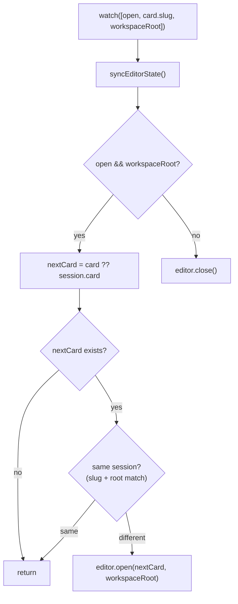
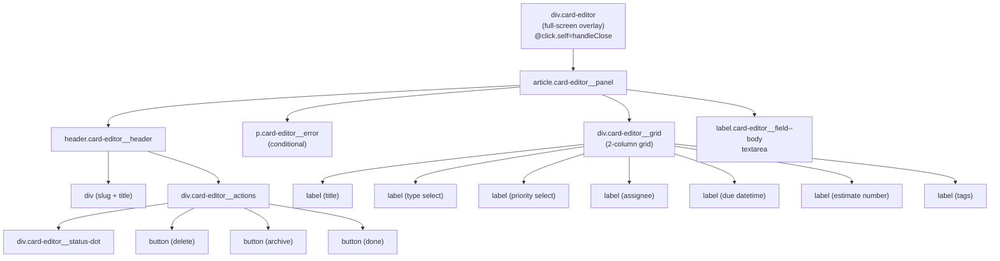
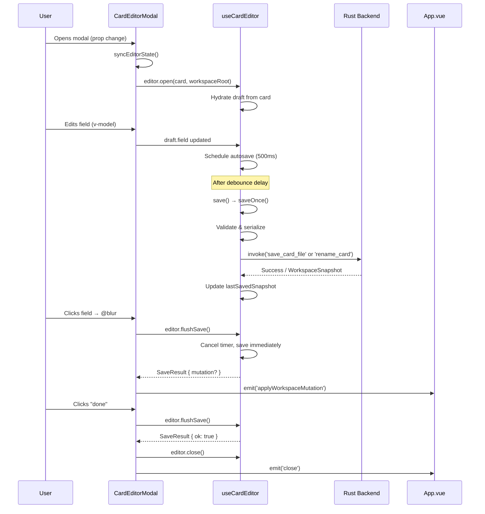

# CardEditorModal

<details>
<summary>Relevant source files</summary>

The following files were used as context for generating this wiki page:

- [src/components/card/CardEditorModal.vue](../src/components/card/CardEditorModal.vue)
- [src/composables/useCardEditor.ts](../src/composables/useCardEditor.ts)

</details>


The `CardEditorModal` component provides the modal dialog interface for editing card properties and content. It renders a full-screen overlay with a form containing fields for card metadata (title, type, priority, assignee, due date, estimate, tags) and the card body. The component delegates state management to the `useCardEditor` composable and emits events to coordinate card operations with the parent application.

For the business logic and state management of card editing, see [useCardEditor](#5.2.3).

---

## Purpose and Scope

`CardEditorModal` is responsible for:

- Rendering the card editor form UI
- Binding form inputs to the editor draft state
- Handling user interactions (save, delete, archive, close)
- Displaying save status and error messages
- Synchronizing editor sessions with props changes
- Coordinating with the parent component via events

The component itself contains minimal business logic; most editing concerns are delegated to the `useCardEditor` composable. The modal focuses on presentation and user interaction orchestration.

**Sources:** [src/components/card/CardEditorModal.vue:1-164](../src/components/card/CardEditorModal.vue)

---

## Component Architecture

The following diagram shows how `CardEditorModal` integrates with the editor composable and parent application:



**Sources:** [src/components/card/CardEditorModal.vue:1-64](../src/components/card/CardEditorModal.vue), [src/components/card/CardEditorModal.vue:166-316](../src/components/card/CardEditorModal.vue)

---

## Component Interface

### Props

The component accepts the following props:

| Prop | Type | Description |
|------|------|-------------|
| `boardFilesBySlug` | `Record<string, { content: string; path: string }>` | Map of board files by slug for path resolution |
| `boardsBySlug` | `Record<string, KanbanBoardDocument>` | Indexed map of parsed boards |
| `cardsBySlug` | `Record<string, KanbanCardDocument>` | Indexed map of parsed cards |
| `card` | `KanbanCardDocument \| null` | The card to edit (null when closed) |
| `open` | `boolean` | Controls modal visibility |
| `sourceBoard` | `KanbanBoardDocument \| null` | The board containing the card (for archive/delete operations) |
| `workspaceRoot` | `string \| null` | Absolute path to workspace root directory |

**Sources:** [src/components/card/CardEditorModal.vue:11-19](../src/components/card/CardEditorModal.vue)

### Emitted Events

The component emits the following events:

| Event | Payload | Description |
|-------|---------|-------------|
| `archiveCard` | `{ slug: string, sourceBoardSlug: string }` | Request to archive the card to the Archive column |
| `applyWorkspaceMutation` | `WorkspaceMutationPayload` | Workspace snapshot to apply after save/rename operations |
| `close` | none | Request to close the modal |
| `deleteCard` | `{ slug: string, sourceBoardSlug: string }` | Request to delete the card file |

**Sources:** [src/components/card/CardEditorModal.vue:21-26](../src/components/card/CardEditorModal.vue)

---

## Editor Composable Integration

The component instantiates `useCardEditor` with options that provide workspace context:

```typescript
const editor = useCardEditor({
    getBoardCardPaths: (cardPath) => {
        const boardCardDirectory = cardPath.replace(/\/[^/]+$/, "");
        return Object.values(props.cardsBySlug)
            .map((card) => card.path)
            .filter(
                (path) =>
                    path.startsWith(`${boardCardDirectory}/`) ||
                    path === cardPath,
            );
    },
    getSourceBoardSlug: () => props.sourceBoard?.slug ?? null,
});
```

- **`getBoardCardPaths`**: Returns all card paths in the same board directory. Used for slug collision detection when renaming cards.
- **`getSourceBoardSlug`**: Provides the current board slug. Used to maintain card selection after rename operations.

The composable exposes reactive state that the component binds to:
- `editor.session.value`: Current editing session (card + workspace root)
- `editor.draft`: Reactive object with form field values
- `editor.saveStatus.value`: Current save state ('saved', 'saving...', 'editing...', 'save failed')
- `editor.errorMessage.value`: Error message if save/delete fails
- `editor.isDeleting.value`: True when delete operation is in progress

**Sources:** [src/components/card/CardEditorModal.vue:28-43](../src/components/card/CardEditorModal.vue)

---

## Session Synchronization

The `syncEditorState()` function keeps the editor session synchronized with props:



The synchronization logic:
1. Triggers when `open`, `card.slug`, or `workspaceRoot` changes
2. If modal is closed, closes the editor session
3. If modal is open, uses `card` prop (or falls back to session card)
4. Opens new session only if card/workspace changed (avoids resetting the form)

The `displayCard` computed property provides the card to display in the UI, prioritizing the prop over the session:

```typescript
const displayCard = computed(
    () => props.card ?? editor.session.value?.card ?? null,
);
```

**Sources:** [src/components/card/CardEditorModal.vue:41-65](../src/components/card/CardEditorModal.vue), [src/components/card/CardEditorModal.vue:145-149](../src/components/card/CardEditorModal.vue)

---

## Form Fields and Data Binding

The modal renders form inputs bound to the `editor.draft` reactive object via `v-model`:

| Field | Draft Property | Input Type | Notes |
|-------|---------------|------------|-------|
| Title | `draft.title` | `text` | Required field; validated on save |
| Type | `draft.type` | `select` | Options: task, bug, feature, research, chore |
| Priority | `draft.priority` | `select` | Options: low, medium, high |
| Assignee | `draft.assignee` | `text` | Free-form text |
| Due | `draft.due` | `datetime-local` | ISO 8601 format (YYYY-MM-DDTHH:mm) |
| Estimate | `draft.estimate` | `number` | Integer value (hours/points) |
| Tags | `draft.tags` | `text` | Comma-separated list |
| Body | `draft.body` | `textarea` | Markdown content |

All inputs trigger `@blur="handleBlur"` to flush pending saves when focus leaves the field. Select inputs additionally trigger `@change="handleBlur"` for immediate save on selection.

The draft object is watched by `useCardEditor`, which schedules autosave with a 500ms debounce delay after any change.

**Sources:** [src/components/card/CardEditorModal.vue:219-314](../src/components/card/CardEditorModal.vue), [src/composables/useCardEditor.ts:35-44](../src/composables/useCardEditor.ts), [src/composables/useCardEditor.ts:277-282](../src/composables/useCardEditor.ts)

---

## Action Handlers

### Close Handler

```typescript
async function handleClose() {
    const result = await editor.flushSave();
    if (!result.ok) {
        return;
    }

    if (result.mutation) {
        emit("applyWorkspaceMutation", result.mutation);
    }

    editor.close();
    emit("close");
}
```

The close handler:
1. Flushes any pending saves (cancels debounce timer)
2. Returns early if save fails (keeps modal open)
3. Applies workspace mutation if rename occurred
4. Closes the editor session
5. Emits `close` event to parent

**Sources:** [src/components/card/CardEditorModal.vue:67-79](../src/components/card/CardEditorModal.vue)

### Blur Handler

```typescript
async function handleBlur() {
    const result = await editor.flushSave();
    if (result.mutation) {
        emit("applyWorkspaceMutation", result.mutation);
    }
}
```

Called when form inputs lose focus. Flushes saves immediately (rather than waiting for autosave delay) and applies mutations if the card was renamed.

**Sources:** [src/components/card/CardEditorModal.vue:81-86](../src/components/card/CardEditorModal.vue)

### Delete Handler

```typescript
async function handleDelete() {
    if (
        !displayCard.value ||
        !window.confirm(`Delete "${displayCard.value.title}"?`)
    ) {
        return;
    }

    const result = await editor.flushSave();
    if (!result.ok) {
        return;
    }

    if (result.mutation) {
        emit("applyWorkspaceMutation", result.mutation);
    }

    if (!props.sourceBoard) {
        return;
    }

    emit("deleteCard", {
        slug: displayCard.value.slug,
        sourceBoardSlug: props.sourceBoard.slug,
    });

    editor.close();
    emit("close");
}
```

The delete handler:
1. Prompts for confirmation
2. Flushes pending saves first
3. Applies any mutations from save
4. Emits `deleteCard` event (backend command executed by parent)
5. Closes editor and modal

Note: Delete does not use `editor.deleteCard()` directly. The parent component handles the backend command after the event is emitted.

**Sources:** [src/components/card/CardEditorModal.vue:88-116](../src/components/card/CardEditorModal.vue)

### Archive Handler

```typescript
async function handleArchive() {
    if (!displayCard.value || !props.sourceBoard) {
        return;
    }

    const result = await editor.flushSave();
    if (!result.ok) {
        return;
    }

    if (result.mutation) {
        emit("applyWorkspaceMutation", result.mutation);
    }

    emit("archiveCard", {
        slug: displayCard.value.slug,
        sourceBoardSlug: props.sourceBoard.slug,
    });

    editor.close();
    emit("close");
}
```

Similar to delete, but emits `archiveCard` event. The parent component handles moving the card to the Archive column.

**Sources:** [src/components/card/CardEditorModal.vue:118-139](../src/components/card/CardEditorModal.vue)

---

## Save Status Display

The modal header displays a status indicator dot and text label based on `editor.saveStatus.value`:

| Status Value | Dot Color | Description |
|--------------|-----------|-------------|
| `'saved'` | Green | All changes persisted to disk |
| `'saving...'` | Red | Save operation in progress |
| `'editing...'` | Red | Unsaved changes exist |
| `'save failed'` | Red | Last save operation failed |

The status dot is rendered with conditional styling:

```vue
<div
    class="card-editor__status-dot"
    :class="{
        'card-editor__status-dot--saved':
            editor.saveStatus.value === 'saved',
    }"
    :title="editor.saveStatus.value"
    :aria-label="editor.saveStatus.value"
></div>
```

When an error occurs, `editor.errorMessage.value` is displayed in a dedicated error banner:

```vue
<p v-if="editor.errorMessage.value" class="card-editor__error">
    {{ editor.errorMessage.value }}
</p>
```

**Sources:** [src/components/card/CardEditorModal.vue:180-217](../src/components/card/CardEditorModal.vue), [src/composables/useCardEditor.ts:51-65](../src/composables/useCardEditor.ts)

---

## Keyboard Shortcut Integration

The component listens for the custom `kanstack:request-close-editor` event to support keyboard shortcuts:

```typescript
onMounted(() => {
    window.addEventListener(
        "kanstack:request-close-editor",
        handleCloseEditorRequest as EventListener,
    );
});

onUnmounted(() => {
    window.removeEventListener(
        "kanstack:request-close-editor",
        handleCloseEditorRequest as EventListener,
    );
});
```

This event is dispatched by `App.vue` when the user presses `Escape` or `Cmd/Ctrl+W`. The handler calls `handleClose()` to flush saves and close the modal.

**Sources:** [src/components/card/CardEditorModal.vue:141-163](../src/components/card/CardEditorModal.vue)

---

## Template Structure and Layout

The modal template follows this hierarchy:



Layout details:
- **Overlay**: Fixed position covering entire viewport, semi-transparent backdrop with blur
- **Panel**: Centered, max-width 62rem, full height, contains all form content
- **Grid**: 2-column responsive grid (collapses to 1 column on mobile)
- **Wide fields**: Title and Tags span both columns (`.card-editor__field--wide`)
- **Body field**: Flexes to fill remaining vertical space

Clicking the overlay background (`.card-editor`) triggers `handleClose` via `@click.self` (event only fires on the overlay itself, not child elements).

**Sources:** [src/components/card/CardEditorModal.vue:166-316](../src/components/card/CardEditorModal.vue), [src/components/card/CardEditorModal.vue:319-461](../src/components/card/CardEditorModal.vue)

---

## Data Flow Summary

The following diagram shows the complete data flow for editing and saving a card:



**Sources:** [src/components/card/CardEditorModal.vue:45-86](../src/components/card/CardEditorModal.vue), [src/composables/useCardEditor.ts:95-225](../src/composables/useCardEditor.ts)
