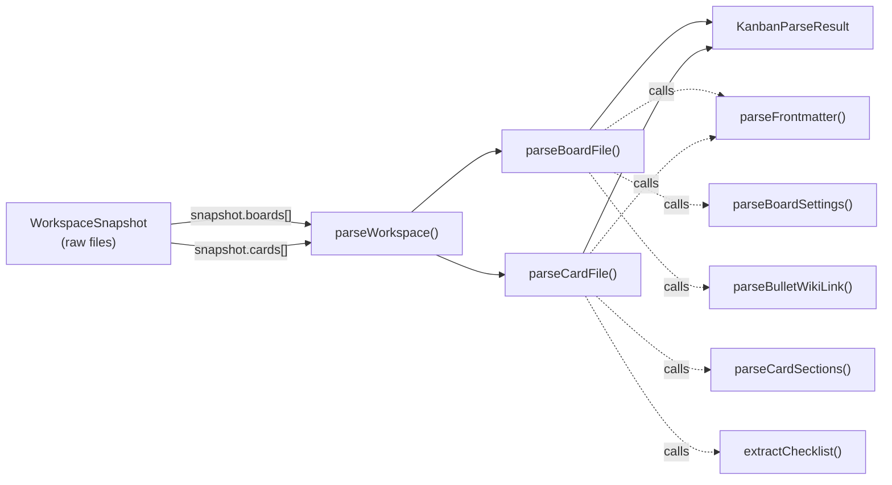
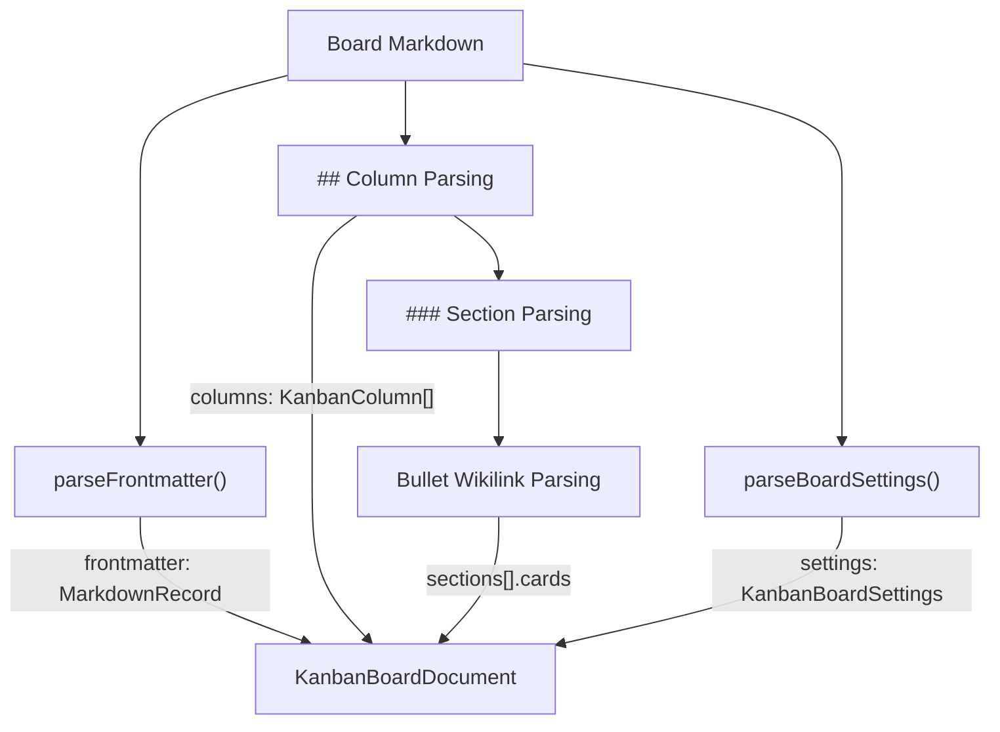
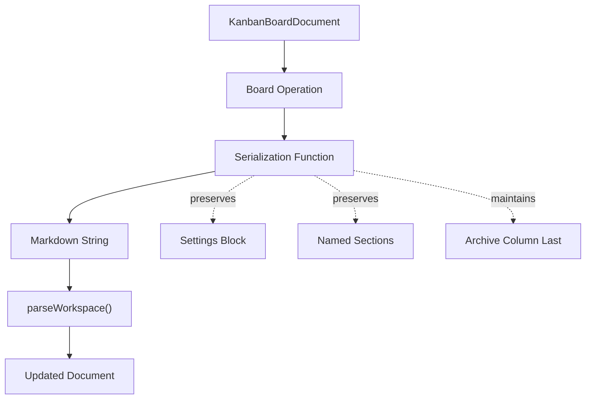
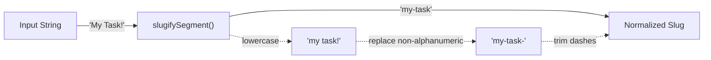
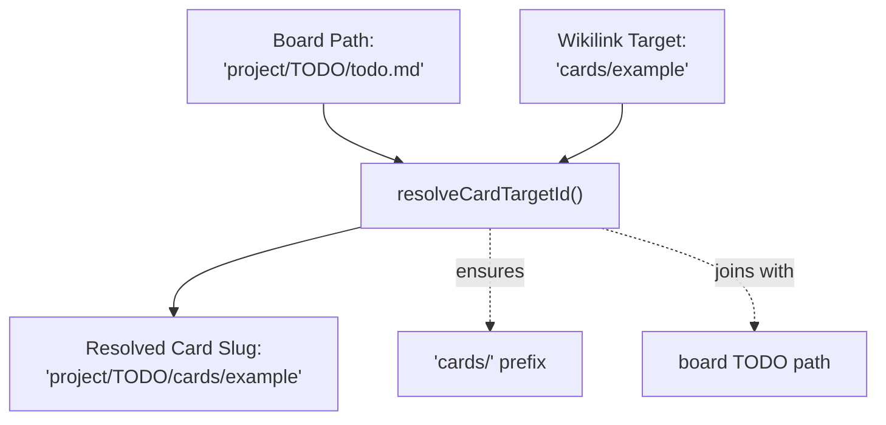
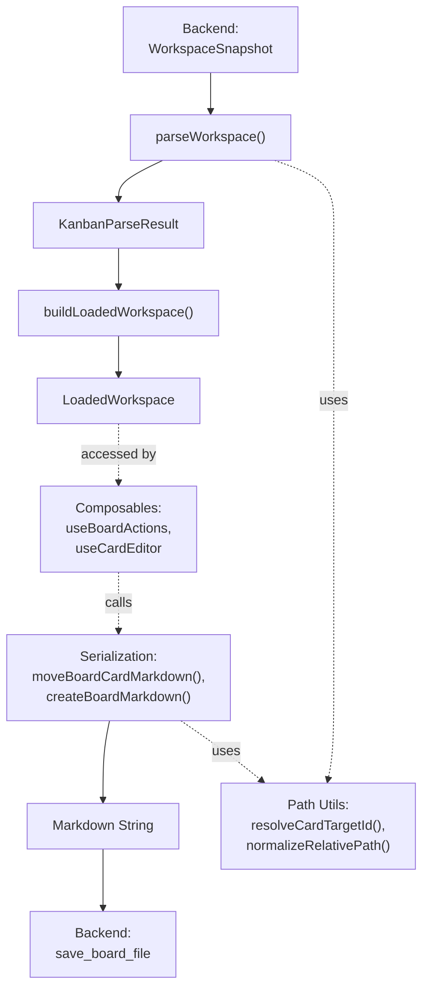

# Frontend Utilities

<details>
<summary>Relevant source files</summary>

The following files were used as context for generating this wiki page:

- [src/types/workspace.ts](../src/types/workspace.ts)
- [src/utils/boardMarkdown.test.ts](../src/utils/boardMarkdown.test.ts)
- [src/utils/kanbanPath.ts](../src/utils/kanbanPath.ts)
- [src/utils/parseWorkspace.ts](../src/utils/parseWorkspace.ts)
- [src/utils/renameTarget.ts](../src/utils/renameTarget.ts)

</details>


The frontend utilities provide the foundational layer for transforming data between markdown files and structured TypeScript objects. These pure functions handle three core responsibilities: parsing markdown content into typed documents, serializing structured data back to markdown, and managing file paths, slugs, and wikilink resolution. All utilities are stateless and side-effect free, making them independently testable and composable.

For information about how these utilities are consumed by reactive state management, see [Composables Overview](../5.2.3-usecardeditor.md).

---

## Utility Categories

The frontend utilities are organized into three functional modules:

| Module | Primary File | Purpose |
|--------|-------------|---------|
| Workspace Parsing | `src/utils/parseWorkspace.ts` | Transform `WorkspaceSnapshot` (raw file content) into `KanbanParseResult` (structured documents) |
| Board/Card Serialization | `src/utils/serializeBoard.ts` | Transform structured documents back into markdown strings for persistence |
| Path & Slug Management | `src/utils/kanbanPath.ts` | Resolve paths, generate slugs, normalize wikilinks, and handle relative path operations |

These utilities form a pipeline: raw markdown is parsed into structured objects, manipulated by composables, serialized back to markdown, and written to disk via backend commands.

**Sources:** [src/utils/parseWorkspace.ts:1-463](../src/utils/parseWorkspace.ts), [src/utils/kanbanPath.ts:1-164](../src/utils/kanbanPath.ts), [src/utils/boardMarkdown.test.ts:1-205](../src/utils/boardMarkdown.test.ts)

---

## Parsing Pipeline

### Core Parsing Function

The `parseWorkspace()` function is the entry point for all workspace parsing. It accepts a `WorkspaceSnapshot` from the backend and produces a `KanbanParseResult` containing typed board and card documents.

**Parsing Flow Diagram**



The function iterates through board and card file snapshots, parsing each into its respective document type. Diagnostics are collected during parsing and aggregated in the result.

**Sources:** [src/utils/parseWorkspace.ts:30-40](../src/utils/parseWorkspace.ts)

### Board File Parsing

The `parseBoardFile()` function transforms board markdown into a `KanbanBoardDocument`. It extracts:

- **Frontmatter**: YAML metadata parsed into a `MarkdownRecord`
- **Title**: From frontmatter, leading `# ` heading, or inferred from path
- **Columns**: `## ` level headings become columns with slugified identifiers
- **Sections**: `### ` level headings within columns become named sections
- **Card Links**: Bulleted wikilinks `- [[cards/example]]` resolved to card slugs
- **Sub-Boards**: Links under the `## Sub Boards` heading
- **Settings**: JSON block within `%% kanban:settings %%` comment markers

**Board Structure Recognition:**



The parser maintains state as it iterates through lines, tracking the current column and section context. When it encounters a `## ` heading, it creates a new column. A `### ` heading creates a named section within the current column. Bulleted wikilinks are added to the active section (or an unnamed default section if no `### ` heading precedes them).

**Sources:** [src/utils/parseWorkspace.ts:42-157](../src/utils/parseWorkspace.ts), [src/utils/parseWorkspace.ts:221-249](../src/utils/parseWorkspace.ts)

### Card File Parsing

The `parseCardFile()` function transforms card markdown into a `KanbanCardDocument`:

```typescript
// Structure produced by parseCardFile
{
  kind: 'card',
  slug: string,            // Resolved from path
  path: string,            // Original file path
  title: string,           // From metadata, # heading, or slug
  metadata: KanbanCardMetadata,  // Frontmatter as typed record
  body: string,            // Full markdown content
  sections: KanbanCardSection[],  // Parsed ## sections
  checklist: KanbanChecklistItem[],  // All - [ ] items
  wikilinks: string[],     // All [[links]] found
  diagnostics: KanbanDiagnostic[]
}
```

The `parseCardSections()` helper extracts `## ` level sections from the card body. Each section captures its markdown content, extracted checklist items, and wikilinks for indexed access.

**Sources:** [src/utils/parseWorkspace.ts:159-180](../src/utils/parseWorkspace.ts), [src/utils/parseWorkspace.ts:182-219](../src/utils/parseWorkspace.ts)

### Diagnostic Collection

Parsing functions collect diagnostics for issues like:
- Unclosed or invalid frontmatter
- Cards outside column context
- Boards without columns
- Invalid settings JSON

These are aggregated into `KanbanParseResult.diagnostics` for display in the UI. The parser continues on errors to maximize the amount of parseable content recovered.

**Sources:** [src/utils/parseWorkspace.ts:36-39](../src/utils/parseWorkspace.ts), [src/utils/parseWorkspace.ts:121-129](../src/utils/parseWorkspace.ts)

---

## Serialization Pipeline

Board and card serialization utilities in `src/utils/serializeBoard.ts` generate markdown strings from structured documents. These are called when composables need to persist changes.

### Board Serialization Operations

The serialization module exports functions for each board mutation operation:

| Function | Purpose |
|----------|---------|
| `createBoardMarkdown()` | Generate initial board markdown with columns inherited from parent |
| `renameBoardMarkdown()` | Update frontmatter title |
| `addBoardColumnMarkdown()` | Insert new `## ` column heading |
| `renameBoardColumnMarkdown()` | Update column heading text |
| `deleteBoardColumnMarkdown()` | Remove column heading and all its content |
| `reorderBoardColumnsMarkdown()` | Rearrange column order |
| `moveBoardCardMarkdown()` | Move wikilink between columns/sections |
| `archiveBoardCardMarkdown()` | Move card to archive column (creating it if needed) |
| `addSubBoardMarkdown()` | Add wikilink under `## Sub Boards` |

**Serialization Contract Diagram:**



All serialization functions preserve the board's settings block, named sections, and ensure the archive column remains last. The contract is validated by tests that parse, serialize, and reparse to verify structural integrity.

**Sources:** [src/utils/boardMarkdown.test.ts:4-14](../src/utils/boardMarkdown.test.ts), [src/utils/boardMarkdown.test.ts:42-82](../src/utils/boardMarkdown.test.ts)

### Key Serialization Behaviors

**Section Preservation**: When moving cards, named sections are maintained:

```typescript
// Board with named section
## Todo
- [[cards/a]]
### Review
- [[cards/b]]

// After moving card 'a' to Review section, structure is preserved
## Todo
### Review
- [[cards/a]]
- [[cards/b]]
```

**Archive Column Management**: The archive column is always kept as the last column, even when adding or reordering columns. When archiving a card from a board without an archive column, `archiveBoardCardMarkdown()` creates one.

**Sub-Board Creation**: When creating a child board, `createBoardMarkdown()` inherits the parent's column structure (without sections) to maintain consistency.

**Sources:** [src/utils/boardMarkdown.test.ts:42-82](../src/utils/boardMarkdown.test.ts), [src/utils/boardMarkdown.test.ts:84-105](../src/utils/boardMarkdown.test.ts), [src/utils/boardMarkdown.test.ts:107-139](../src/utils/boardMarkdown.test.ts)

---

## Path and Slug Utilities

The `kanbanPath.ts` module provides utilities for working with file paths, slugs, and wikilink targets.

### Path Normalization

**Core Path Functions:**

| Function | Purpose | Example |
|----------|---------|---------|
| `normalizeRelativePath()` | Resolve `.` and `..`, prevent escape | `a/../b/./c` → `b/c` |
| `dirnameRelativePath()` | Get parent directory | `a/b/c.md` → `a/b` |
| `joinRelativePath()` | Join path segments safely | `('a/b', '../c')` → `a/c` |
| `relativePathBetween()` | Compute relative path | `(a/b, a/c/d)` → `../c/d` |

These functions operate on normalized forward-slash paths and throw errors if a path attempts to escape the workspace root via excessive `..` segments.

**Sources:** [src/utils/kanbanPath.ts:22-82](../src/utils/kanbanPath.ts)

### Slug Generation

**Slug Functions:**



The `slugifySegment()` function converts display names to URL-safe slugs by lowercasing, replacing non-alphanumeric characters with hyphens, and trimming leading/trailing hyphens.

**Sources:** [src/utils/kanbanPath.ts:9-15](../src/utils/kanbanPath.ts)

### ID and Slug Resolution

**Board and Card Identifiers:**

| Function | Purpose |
|----------|---------|
| `boardIdFromBoardPath()` | Extract board ID: `project/TODO/todo.md` → `project/TODO` |
| `cardIdFromCardPath()` | Extract card ID: `TODO/cards/task.md` → `TODO/cards/task` |
| `slugFromMarkdownPath()` | Get filename without extension: `cards/task.md` → `task` |
| `localCardSlugFromCardPath()` | Get card's local slug within board |
| `localBoardNameFromBoardPath()` | Infer board name from path structure |

These functions provide consistent ID extraction across the codebase, ensuring boards and cards are uniquely identified by their normalized paths (without `.md` extensions).

**Sources:** [src/utils/kanbanPath.ts:84-109](../src/utils/kanbanPath.ts)

### Wikilink Resolution

**Target Resolution Functions:**



The `resolveCardTargetId()` and `resolveBoardTargetPath()` functions resolve relative wikilink targets to absolute slugs within the workspace. They handle both relative paths (`../other-project/TODO`) and local references (`cards/task`).

**Normalized Wikilink Structure:**

```typescript
interface NormalizedWikiTarget {
  slug: string      // Resolved slug (used as key)
  target: string    // Original target (preserved for serialization)
  title?: string    // Optional display title from [[target|title]]
}
```

The `normalizeWikiTarget()` function parses wikilinks, extracting the target path and optional pipe-delimited title. This normalization ensures consistent handling of wikilink variations.

**Sources:** [src/utils/kanbanPath.ts:111-159](../src/utils/kanbanPath.ts)

### Path Construction Helpers

**Builder Functions:**

| Function | Purpose |
|----------|---------|
| `buildBoardCardPath()` | Construct card path within board: `(board, 'task')` → `TODO/cards/task.md` |
| `buildBoardCardTarget()` | Build card wikilink target: `'task'` → `cards/task` |
| `buildChildBoardPath()` | Construct child board path from parent and directory name |
| `buildSubBoardTarget()` | Build relative wikilink for sub-board reference |

These functions provide canonical path construction, ensuring consistent file structure across board and card operations.

**Sources:** [src/utils/kanbanPath.ts:132-143](../src/utils/kanbanPath.ts)

---

## Rename Target Resolution

The `renameTarget.ts` utility handles card renaming with slug conflict resolution.

**Rename Target Structure:**

```typescript
interface RenameTarget {
  path: string    // New file path
  slug: string    // New resolved slug
  title: string   // Normalized title
}
```

The `getCardRenameTarget()` function:
1. Generates a base slug from the title using `cardSlugFromTitle()`
2. Collects sibling card slugs to check for conflicts
3. Calls `getNextAvailableSlug()` to append a numeric suffix if needed
4. Constructs the new card path and resolved slug

This ensures renamed cards never overwrite existing files.

**Sources:** [src/utils/renameTarget.ts:1-24](../src/utils/renameTarget.ts)

---

## Utility Integration Flow

**Complete Data Transformation Pipeline:**



The utilities form a complete bidirectional pipeline:
1. **Parse**: Transform raw files → structured documents
2. **Index**: Build efficient lookup maps
3. **Mutate**: Composables operate on structured data
4. **Serialize**: Transform documents → markdown strings
5. **Persist**: Backend writes to disk

Path utilities are used throughout parsing (to resolve wikilinks) and serialization (to construct targets).

**Sources:** [src/types/workspace.ts:31-40](../src/types/workspace.ts), [src/utils/parseWorkspace.ts:30-40](../src/utils/parseWorkspace.ts), [src/utils/boardMarkdown.test.ts:1-205](../src/utils/boardMarkdown.test.ts)

---

## Testing Patterns

The utilities are extensively tested using a parse-serialize-reparse pattern:

```typescript
// Example test pattern from boardMarkdown.test.ts
const board = parseBoard([/* markdown lines */].join('\n'))
const nextContent = moveBoardCardMarkdown(board, { /* params */ })
const reparsedBoard = parseBoard(nextContent)
expect(reparsedBoard.columns[0].sections[0].cards).toEqual([/* expected */])
```

This validates that:
- Parsing produces the expected structure
- Serialization preserves all structural elements
- Round-trip transformations are lossless

The test suite in `boardMarkdown.test.ts` serves as a living specification of the markdown format contract.

**Sources:** [src/utils/boardMarkdown.test.ts:18-194](../src/utils/boardMarkdown.test.ts)
