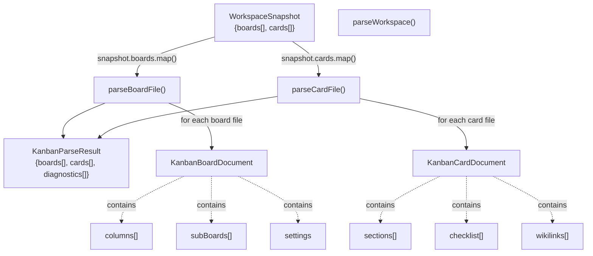
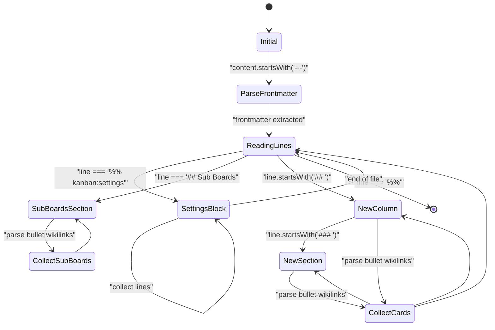
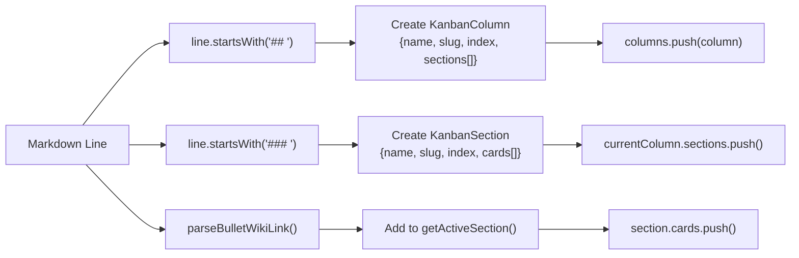
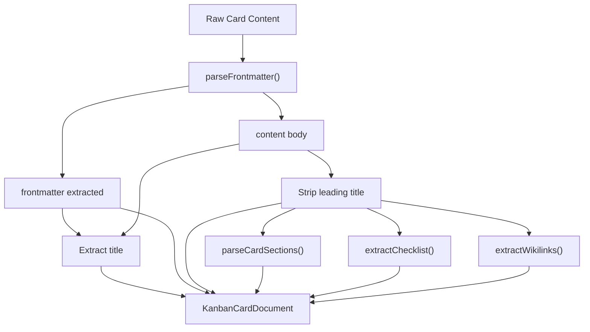
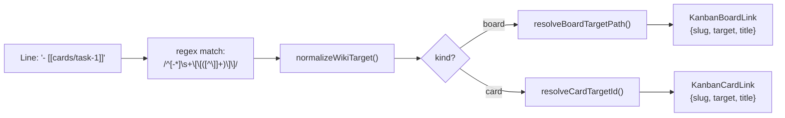
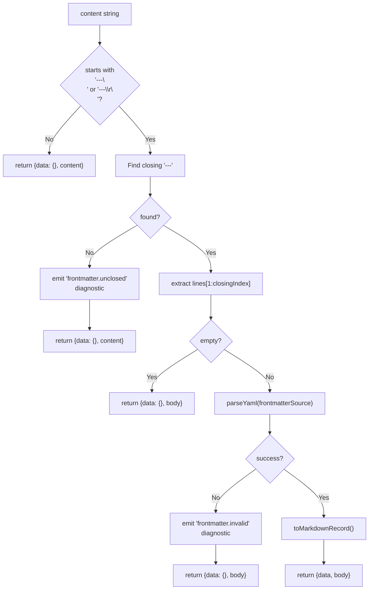
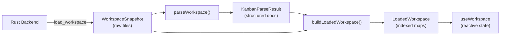
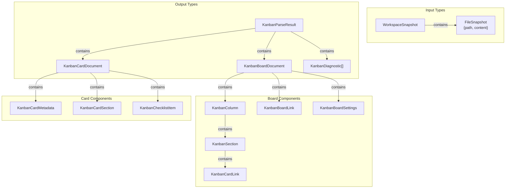

# Workspace Parsing

<details>
<summary>Relevant source files</summary>

The following files were used as context for generating this wiki page:

- [docs/schemas/kanban-parser-schema.ts](../docs/schemas/kanban-parser-schema.ts)
- [src/utils/parseWorkspace.ts](../src/utils/parseWorkspace.ts)
- [src/utils/workspaceSnapshot.ts](../src/utils/workspaceSnapshot.ts)

</details>


The workspace parsing system transforms raw markdown file content from a `WorkspaceSnapshot` into strongly-typed TypeScript objects (`KanbanParseResult`). This parsing layer interprets markdown conventions (headings, wikilinks, frontmatter) and produces structured board and card documents that the application can work with. For serialization (converting structured data back to markdown), see [Board and Card Serialization](#5.4.2). For path and slug utilities used during parsing, see [Path and Slug Management](#5.4.3).

**Sources:** [src/utils/parseWorkspace.ts:1-463](../src/utils/parseWorkspace.ts)

---

## Overview and Entry Point

The primary entry point is the `parseWorkspace` function, which accepts a `WorkspaceSnapshot` (raw file paths and contents from the Rust backend) and returns a `KanbanParseResult` containing parsed boards, cards, and diagnostics.

**Parsing Flow Diagram**



**Key Function:**

| Function | Input | Output | Purpose |
|----------|-------|--------|---------|
| `parseWorkspace` | `WorkspaceSnapshot` | `KanbanParseResult` | Main entry point that delegates to board and card parsers |
| `parseBoardFile` | `path: string, rawContent: string` | `KanbanBoardDocument` | Parses a single board markdown file |
| `parseCardFile` | `path: string, rawContent: string` | `KanbanCardDocument` | Parses a single card markdown file |

The function implementation [src/utils/parseWorkspace.ts:30-40](../src/utils/parseWorkspace.ts) maps over all boards and cards in the snapshot, collects their diagnostics, and returns a structured result with version identifier `"kanban-parser/v1"`.

**Sources:** [src/utils/parseWorkspace.ts:30-40](../src/utils/parseWorkspace.ts), [docs/schemas/kanban-parser-schema.ts:12-17](../docs/schemas/kanban-parser-schema.ts)

---

## Board File Parsing State Machine

Board file parsing (`parseBoardFile`) is a stateful line-by-line parser that tracks the current column, section, and special regions (settings blocks, sub-boards section).

**Board Parsing State Machine Diagram**



**State Tracking Variables:**

| Variable | Type | Purpose |
|----------|------|---------|
| `currentColumn` | `KanbanColumn \| null` | Tracks the active column being parsed |
| `currentSectionIndex` | `number \| null` | Index of the active section within current column |
| `inSubBoards` | `boolean` | Whether parser is inside the "Sub Boards" section |
| `inSettings` | `boolean` | Whether parser is inside the settings block |
| `settingsLines` | `string[]` | Accumulates lines within the settings block |

The parser [src/utils/parseWorkspace.ts:58-133](../src/utils/parseWorkspace.ts) iterates through each line and:

1. **Settings Block Detection**: Lines between `%% kanban:settings` and `%%` are collected for JSON parsing
2. **Column Detection**: `## ` headings create new columns with slugified names
3. **Sub-Boards Section**: `## Sub Boards` heading switches to sub-board collection mode
4. **Section Detection**: `### ` headings within columns create sections
5. **Card Links**: Bullet-point wikilinks are added to the active section or column

**Sources:** [src/utils/parseWorkspace.ts:42-157](../src/utils/parseWorkspace.ts), [docs/schemas/kanban-parser-schema.ts:28-53](../docs/schemas/kanban-parser-schema.ts)

---

## Board Structure Elements

### Columns and Sections

Columns are top-level organizational units marked by `## ` headings. Each column contains sections (marked by `### ` headings or an implicit unnamed section).

**Column Structure Mapping**



The `getActiveSection` helper [src/utils/parseWorkspace.ts:251-260](../src/utils/parseWorkspace.ts) returns the current section if one exists, otherwise it calls `ensureUnnamedSection` [src/utils/parseWorkspace.ts:262-277](../src/utils/parseWorkspace.ts) to create an implicit section with `name: null` and `slug: null` for cards that appear outside explicit `### ` sections.

**Sources:** [src/utils/parseWorkspace.ts:76-108](../src/utils/parseWorkspace.ts), [src/utils/parseWorkspace.ts:251-277](../src/utils/parseWorkspace.ts)

### Settings Block Parsing

Board settings are stored in a special markdown comment block:

```
%% kanban:settings
```json
{
  "show-archive": true,
  "group-by": "section"
}
```
%%
```

The parser [src/utils/parseWorkspace.ts:61-74](../src/utils/parseWorkspace.ts) collects lines between the delimiters and passes them to `parseBoardSettings` [src/utils/parseWorkspace.ts:221-249](../src/utils/parseWorkspace.ts), which:

1. Attempts to extract JSON from a code fence (`\`\`\`json ... \`\`\``)
2. Falls back to parsing the entire block as JSON
3. Returns `null` if empty or invalid, emitting a diagnostic on parse failure

**Sources:** [src/utils/parseWorkspace.ts:61-74](../src/utils/parseWorkspace.ts), [src/utils/parseWorkspace.ts:221-249](../src/utils/parseWorkspace.ts), [docs/schemas/kanban-parser-schema.ts:66-74](../docs/schemas/kanban-parser-schema.ts)

### Sub-Boards Section

The special `## Sub Boards` heading marks a section for hierarchical board references. When detected [src/utils/parseWorkspace.ts:78-83](../src/utils/parseWorkspace.ts), the parser sets `inSubBoards = true` and subsequent bullet wikilinks are parsed as board links (not card links) and added to the `subBoards` array.

**Sources:** [src/utils/parseWorkspace.ts:78-83](../src/utils/parseWorkspace.ts), [src/utils/parseWorkspace.ts:115-118](../src/utils/parseWorkspace.ts)

---

## Card File Parsing

Card parsing is simpler than board parsing, focusing on extracting metadata, title, body content, and structured sections.

**Card Parsing Pipeline**



The `parseCardFile` function [src/utils/parseWorkspace.ts:159-180](../src/utils/parseWorkspace.ts) performs these steps:

1. **Parse Frontmatter**: Extract YAML metadata from the card
2. **Determine Title**: Priority is `metadata.title`, then first `# ` heading, then slugified filename
3. **Extract Body**: Strip the leading `# title` heading if present [src/utils/parseWorkspace.ts:435-454](../src/utils/parseWorkspace.ts)
4. **Parse Sections**: Extract `## ` sections from the body
5. **Extract Checklist**: Find all `- [ ]` and `- [x]` items
6. **Extract Wikilinks**: Find all `[[...]]` references

**Sources:** [src/utils/parseWorkspace.ts:159-180](../src/utils/parseWorkspace.ts), [docs/schemas/kanban-parser-schema.ts:83-94](../docs/schemas/kanban-parser-schema.ts)

### Card Sections

Card sections are extracted by `parseCardSections` [src/utils/parseWorkspace.ts:182-219](../src/utils/parseWorkspace.ts), which scans for `## ` headings and accumulates lines until the next section. Each section includes:

- Name and slugified slug
- Full markdown content
- Extracted checklist items within that section
- Extracted wikilinks within that section

The parser uses a `flush()` pattern to finalize the current section when a new one begins or the file ends.

**Sources:** [src/utils/parseWorkspace.ts:182-219](../src/utils/parseWorkspace.ts), [docs/schemas/kanban-parser-schema.ts:114-121](../docs/schemas/kanban-parser-schema.ts)

---

## Wikilink and Reference Parsing

### Bullet Wikilink Extraction

The `parseBulletWikiLink` function [src/utils/parseWorkspace.ts:279-305](../src/utils/parseWorkspace.ts) handles both card and board links. It:

1. Matches lines starting with `- [[...]]` or `* [[...]]`
2. Normalizes the wikilink target using `normalizeWikiTarget` from path utilities
3. Resolves the target to a slug using either `resolveBoardTargetPath` or `resolveCardTargetId`
4. Returns a link object with `slug`, `target`, and optional `title`

**Wikilink Resolution Flow**



The resolution functions are wrapped in try-catch blocks [src/utils/parseWorkspace.ts:307-321](../src/utils/parseWorkspace.ts) to handle invalid paths gracefully, falling back to the normalized target as the slug.

**Sources:** [src/utils/parseWorkspace.ts:279-321](../src/utils/parseWorkspace.ts)

### Inline Wikilink Extraction

The `extractWikilinks` function [src/utils/parseWorkspace.ts:334-336](../src/utils/parseWorkspace.ts) extracts all `[[...]]` patterns from markdown content (not just bulleted ones). It returns an array of slugs after normalizing each target. This is used to build the `wikilinks` array on card documents and sections.

**Sources:** [src/utils/parseWorkspace.ts:334-336](../src/utils/parseWorkspace.ts)

### Checklist Extraction

The `extractChecklist` function [src/utils/parseWorkspace.ts:323-332](../src/utils/parseWorkspace.ts) uses a regex to find markdown checklist items:

- Pattern: `/^[-*]\s+\[( |x|X)\]\s+(.+)$/`
- Maps to `KanbanChecklistItem` objects with `checked` (boolean) and `text` (string)

This extraction is performed on both the card body and individual sections.

**Sources:** [src/utils/parseWorkspace.ts:323-332](../src/utils/parseWorkspace.ts), [docs/schemas/kanban-parser-schema.ts:123-126](../docs/schemas/kanban-parser-schema.ts)

---

## Frontmatter Parsing

Frontmatter is YAML data enclosed in `---` delimiters at the start of a file. The `parseFrontmatter` function [src/utils/parseWorkspace.ts:338-388](../src/utils/parseWorkspace.ts):

**Frontmatter Parsing Logic**



The parser emits diagnostics for two error cases:
- `frontmatter.unclosed`: Starts with `---` but no closing delimiter found
- `frontmatter.invalid`: Closing delimiter found but YAML parsing failed

Parsed YAML is normalized using `toMarkdownRecord` [src/utils/parseWorkspace.ts:390-398](../src/utils/parseWorkspace.ts), which ensures the result is a flat object (not array, not primitive) and recursively normalizes nested values via `normalizeMarkdownValue` [src/utils/parseWorkspace.ts:400-424](../src/utils/parseWorkspace.ts).

**Sources:** [src/utils/parseWorkspace.ts:338-424](../src/utils/parseWorkspace.ts)

---

## Title Extraction Strategy

Both board and card files use a three-tier fallback strategy for determining the title:

**Title Resolution Priority**

| Priority | Source | Board Implementation | Card Implementation |
|----------|--------|---------------------|---------------------|
| 1 | Frontmatter `title` field | `readString(frontmatter.title)` | `readString(metadata.title)` |
| 2 | First `# ` heading in body | `readHeading(parsed.content, '# ')` | `readHeading(parsed.content, '# ')` |
| 3 | Derived from path | `localBoardNameFromBoardPath(path)` | `titleFromSlug(slugFromMarkdownPath(path))` |

The `readHeading` helper [src/utils/parseWorkspace.ts:426-429](../src/utils/parseWorkspace.ts) finds the first line starting with the given prefix and extracts the text after it.

The `titleFromSlug` helper [src/utils/parseWorkspace.ts:456-462](../src/utils/parseWorkspace.ts) converts a kebab-case slug to Title Case by splitting on hyphens and capitalizing each part.

**Sources:** [src/utils/parseWorkspace.ts:47](../src/utils/parseWorkspace.ts), [src/utils/parseWorkspace.ts:164](../src/utils/parseWorkspace.ts), [src/utils/parseWorkspace.ts:426-462](../src/utils/parseWorkspace.ts)

---

## Diagnostic Collection

Diagnostics are warnings or errors collected during parsing. Each document (board or card) maintains its own `diagnostics` array, and the final `KanbanParseResult` aggregates all diagnostics [src/utils/parseWorkspace.ts:38](../src/utils/parseWorkspace.ts).

**Diagnostic Types**

| Code | Level | Condition | Location |
|------|-------|-----------|----------|
| `frontmatter.unclosed` | warning | Frontmatter starts but never closes | [src/utils/parseWorkspace.ts:354-361](../src/utils/parseWorkspace.ts) |
| `frontmatter.invalid` | warning | Frontmatter YAML parse failed | [src/utils/parseWorkspace.ts:377-384](../src/utils/parseWorkspace.ts) |
| `board.card-outside-column` | warning | Card link appears before any `## ` column | [src/utils/parseWorkspace.ts:121-129](../src/utils/parseWorkspace.ts) |
| `board.no-columns` | warning | Board file contains no `## ` columns | [src/utils/parseWorkspace.ts:135-142](../src/utils/parseWorkspace.ts) |
| `board.invalid-settings` | warning | Settings block JSON parse failed | [src/utils/parseWorkspace.ts:241-246](../src/utils/parseWorkspace.ts) |

Each diagnostic includes:
- `level`: `"error"` or `"warning"`
- `code`: Machine-readable identifier
- `message`: Human-readable description
- `path`: File path where issue occurred
- `line` and `column`: Optional position information

**Sources:** [src/utils/parseWorkspace.ts:43](../src/utils/parseWorkspace.ts), [src/utils/parseWorkspace.ts:121-142](../src/utils/parseWorkspace.ts), [src/utils/parseWorkspace.ts:241-246](../src/utils/parseWorkspace.ts), [src/utils/parseWorkspace.ts:354-384](../src/utils/parseWorkspace.ts), [docs/schemas/kanban-parser-schema.ts:19-26](../docs/schemas/kanban-parser-schema.ts)

---

## Integration with LoadedWorkspace

The parsed result is immediately consumed by `buildLoadedWorkspace` in the workspace snapshot module [src/utils/workspaceSnapshot.ts:5-27](../src/utils/workspaceSnapshot.ts). This function:

1. Calls `parseWorkspace(snapshot)` to get structured documents
2. Builds indexed maps: `boardsBySlug`, `cardsBySlug`, `boardFilesBySlug`
3. Determines `boardOrder` from parse result
4. Resolves `rootBoardSlug` from the snapshot's `rootBoardPath`

This creates a `LoadedWorkspace` object optimized for efficient lookups during UI rendering and operations.

**Complete Parsing to Loading Pipeline**



**Sources:** [src/utils/workspaceSnapshot.ts:5-27](../src/utils/workspaceSnapshot.ts)

---

## Type System Summary

**Core Parsing Types Hierarchy**



All types are defined in [docs/schemas/kanban-parser-schema.ts:1-127](../docs/schemas/kanban-parser-schema.ts).

**Sources:** [docs/schemas/kanban-parser-schema.ts:1-127](../docs/schemas/kanban-parser-schema.ts), [src/utils/parseWorkspace.ts:3-17](../src/utils/parseWorkspace.ts)
