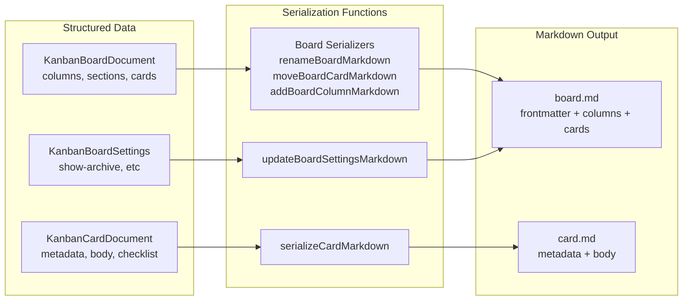
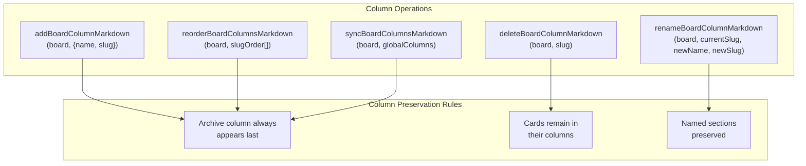
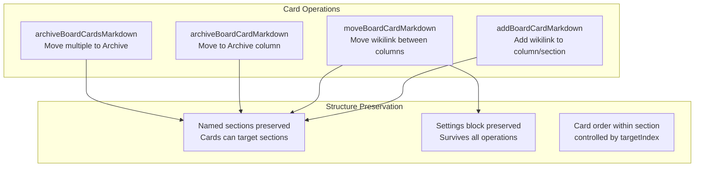
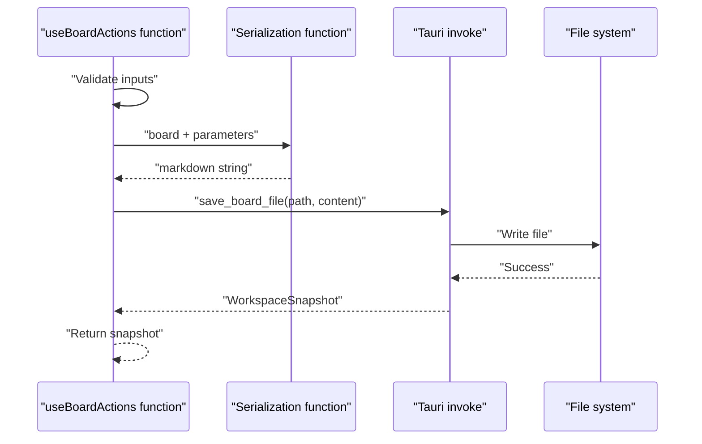

# Board and Card Serialization

<details>
<summary>Relevant source files</summary>

The following files were used as context for generating this wiki page:

- [src/composables/useBoardActions.ts](../src/composables/useBoardActions.ts)
- [src/types/workspace.ts](../src/types/workspace.ts)
- [src/utils/boardMarkdown.test.ts](../src/utils/boardMarkdown.test.ts)
- [src/utils/kanbanPath.ts](../src/utils/kanbanPath.ts)

</details>


## Purpose and Scope

This page documents the serialization utilities that convert structured TypeScript board and card objects back into markdown format for persistence. These functions are the inverse of the parsing process (see [Workspace Parsing](#5.4.1)) and are used by composables like `useBoardActions` to persist changes to the file system.

For information about how markdown is parsed into structured objects, see [Workspace Parsing](#5.4.1). For path and slug utilities used during serialization, see [Path and Slug Management](#5.4.3).

---

## Serialization Overview

Serialization transforms structured `KanbanBoardDocument` and `KanbanCardDocument` objects into markdown strings that conform to KanStack's markdown conventions. This process preserves all structural elements including frontmatter, columns, sections, card references, sub-board links, and settings blocks.



**Sources:** [src/composables/useBoardActions.ts:1-449](../src/composables/useBoardActions.ts), [src/utils/boardMarkdown.test.ts:1-205](../src/utils/boardMarkdown.test.ts)

---

## Board Serialization Functions

Board serialization functions are located in `src/utils/serializeBoard.ts` (referenced throughout the codebase). Each function takes a `KanbanBoardDocument` and additional parameters, returning a markdown string.

### Complete Board Creation

| Function | Purpose | Parameters |
|----------|---------|------------|
| `createBoardMarkdown` | Create new board inheriting parent structure | `title: string`, `parentBoard: KanbanBoardDocument` |
| `createBoardMarkdownFromColumns` | Create board from column definitions | `title: string`, `columns: Array<{name, slug}>` |

These functions generate complete board markdown with frontmatter, all columns (preserving parent structure for sub-boards), and an optional settings block.

**Example flow from test:**
```typescript
// Creates child board that inherits parent's column structure
const childContent = createBoardMarkdown('Untitled Board', parentBoard)
const childBoard = parseBoard(childContent, 'untitled-board/TODO/todo.md')
// childBoard.columns matches parentBoard.columns (Todo, Done, etc)
```

**Sources:** [src/utils/boardMarkdown.test.ts:107-139](../src/utils/boardMarkdown.test.ts), [src/composables/useBoardActions.ts:168-174](../src/composables/useBoardActions.ts)

---

### Board Metadata Operations

| Function | Purpose | Returns |
|----------|---------|---------|
| `renameBoardMarkdown` | Update board title in frontmatter | Markdown with updated `title:` field |

This function preserves all board content while only modifying the frontmatter title.

**Example:**
```typescript
const renamedContent = renameBoardMarkdown(board, 'Renamed Board')
// Frontmatter changes: title: Main → title: Renamed Board
// All columns, cards, sections remain unchanged
```

**Sources:** [src/utils/boardMarkdown.test.ts:141-156](../src/utils/boardMarkdown.test.ts), [src/composables/useBoardActions.ts:377-411](../src/composables/useBoardActions.ts)

---

### Column Management Operations

These functions modify board column structure. All column operations preserve existing cards and sections.



**Sources:** [src/utils/boardMarkdown.test.ts:157-194](../src/utils/boardMarkdown.test.ts), [src/composables/useBoardActions.ts:191-346](../src/composables/useBoardActions.ts)

#### addBoardColumnMarkdown

Adds a new column to the board. Automatically inserts before the Archive column if present.

**Parameters:**
- `board: KanbanBoardDocument` - Board to modify
- `column: {name: string, slug: string}` - Column to add

**Test demonstration:**
```typescript
const withColumn = parseBoard(addBoardColumnMarkdown(board, {name: 'Doing', slug: 'doing'}))
// Result: columns = ['todo', 'doing', 'archive']
// Archive automatically moved to end
```

**Sources:** [src/utils/boardMarkdown.test.ts:180-194](../src/utils/boardMarkdown.test.ts)

#### renameBoardColumnMarkdown

Renames a column heading while updating all section parent references.

**Parameters:**
- `board: KanbanBoardDocument`
- `currentSlug: string` - Column to rename
- `newName: string` - New display name
- `newSlug: string` - New slug identifier

**Sources:** [src/utils/boardMarkdown.test.ts:169-174](../src/utils/boardMarkdown.test.ts), [src/composables/useBoardActions.ts:223-254](../src/composables/useBoardActions.ts)

#### deleteBoardColumnMarkdown

Removes a column heading. Cards within the column are not deleted from the board document.

**Parameters:**
- `board: KanbanBoardDocument`
- `columnSlug: string` - Column to delete

**Sources:** [src/utils/boardMarkdown.test.ts:175-178](../src/utils/boardMarkdown.test.ts), [src/composables/useBoardActions.ts:256-285](../src/composables/useBoardActions.ts)

#### reorderBoardColumnsMarkdown

Reorders columns according to specified slug order. Archive column stays last.

**Parameters:**
- `board: KanbanBoardDocument`
- `slugOrder: string[]` - Desired column order by slug

**Test:**
```typescript
const reordered = reorderBoardColumnsMarkdown(board, ['doing', 'todo', 'archive'])
// Columns appear in new order: doing, todo, archive
```

**Sources:** [src/utils/boardMarkdown.test.ts:192-194](../src/utils/boardMarkdown.test.ts), [src/composables/useBoardActions.ts:287-304](../src/composables/useBoardActions.ts)

#### syncBoardColumnsMarkdown

Synchronizes board columns to match a global column set. Used for multi-board workspaces where all boards share the same column structure.

**Parameters:**
- `board: KanbanBoardDocument`
- `globalColumns: Array<{name: string, slug: string}>` - Target column set

**Sources:** [src/composables/useBoardActions.ts:204-221](../src/composables/useBoardActions.ts)

---

### Card Reference Operations

These functions manipulate card wikilink references within board markdown.



**Sources:** [src/utils/boardMarkdown.test.ts:42-82](../src/utils/boardMarkdown.test.ts), [src/composables/useBoardActions.ts:60-81](../src/composables/useBoardActions.ts)

#### addBoardCardMarkdown

Adds a card wikilink to a specific column and section.

**Parameters:**
```typescript
{
  cardSlug: string              // Full card identifier
  cardTarget: string            // Wikilink target (e.g., "cards/task-1")
  targetColumnName: string      // Display name of column
  targetColumnSlug: string      // Column identifier
  targetSectionName: string | null
  targetSectionSlug: string | null
}
```

**Usage in card creation:**
```typescript
const boardContent = addBoardCardMarkdown(board, {
  cardSlug: cardIdFromCardPath(cardPath),
  cardTarget: buildBoardCardTarget(slug),
  targetColumnName: targetColumn.name,
  targetColumnSlug: targetColumn.slug,
  targetSectionName: targetSection?.name ?? null,
  targetSectionSlug: targetSection?.slug ?? null,
})
```

**Sources:** [src/composables/useBoardActions.ts:123-130](../src/composables/useBoardActions.ts)

#### moveBoardCardMarkdown

Moves a card wikilink from its current position to a target column/section/index.

**Parameters:**
```typescript
interface MoveBoardCardInput {
  cardSlug: string
  targetColumnName: string
  targetColumnSlug: string
  targetSectionName: string | null
  targetSectionSlug: string | null
  targetIndex: number
}
```

**Test demonstrating section preservation:**
```typescript
const nextContent = moveBoardCardMarkdown(board, {
  cardSlug: 'TODO/cards/a',
  targetColumnName: 'Todo',
  targetColumnSlug: 'todo',
  targetSectionName: 'Review',
  targetSectionSlug: 'review',
  targetIndex: 0,
})
// Card moves into "### Review" section
// Settings block and section structure preserved
```

**Sources:** [src/utils/boardMarkdown.test.ts:61-82](../src/utils/boardMarkdown.test.ts), [src/composables/useBoardActions.ts:60-81](../src/composables/useBoardActions.ts)

#### archiveBoardCardMarkdown

Moves a single card to the Archive column. Creates the Archive column if it doesn't exist.

**Parameters:**
- `board: KanbanBoardDocument`
- `cardSlug: string` - Card to archive

**Automatic Archive column creation:**
```typescript
const nextContent = archiveBoardCardMarkdown(board, 'TODO/cards/a')
// If no Archive column exists, creates: ## Archive
```

**Sources:** [src/utils/boardMarkdown.test.ts:84-105](../src/utils/boardMarkdown.test.ts), [src/composables/useBoardActions.ts:348-375](../src/composables/useBoardActions.ts)

#### archiveBoardCardsMarkdown

Batch archives multiple cards to the Archive column.

**Parameters:**
- `board: KanbanBoardDocument`
- `cardSlugs: string[]` - Cards to archive

**Sources:** [src/composables/useBoardActions.ts:352-375](../src/composables/useBoardActions.ts)

---

### Sub-Board Operations

#### addSubBoardMarkdown

Adds a sub-board wikilink to the board's Sub Boards section.

**Parameters:**
```typescript
{
  boardSlug: string      // Full board identifier
  boardTarget: string    // Wikilink target
  boardTitle: string     // Display title
}
```

**Example output:**
```markdown
## Sub Boards

- [[untitled-board/TODO|Untitled Board]]
```

**Test:**
```typescript
const parentContent = addSubBoardMarkdown(board, {
  boardSlug: 'untitled-board/TODO',
  boardTarget: 'untitled-board/TODO',
  boardTitle: 'Untitled Board',
})
// Creates "## Sub Boards" section with wikilink
```

**Sources:** [src/utils/boardMarkdown.test.ts:107-139](../src/utils/boardMarkdown.test.ts)

---

### Settings Serialization

#### updateBoardSettingsMarkdown

Updates or creates the board settings JSON block without affecting other content.

**Parameters:**
- `boardContent: string` - Current board markdown
- `settings: KanbanBoardSettings` - Settings object to serialize

**Settings block format:**
```markdown
%% kanban:settings
```json
{"show-archive-column":true,"show-sub-boards":true}
```
%%
```

**Sources:** [src/composables/useBoardActions.ts:83-105](../src/composables/useBoardActions.ts)

---

## Card Serialization

### serializeCardMarkdown

Converts a card document structure into markdown format with frontmatter and body content.

**Function signature:**
```typescript
serializeCardMarkdown(card: {
  title: string
  metadata: Record<string, any>
  body: string
}): string
```

**Output structure:**
```markdown
---
title: Card Title
custom-field: value
---

Card body content here
```

**Usage in card creation:**
```typescript
const cardContent = serializeCardMarkdown({
  title: 'Untitled Card',
  metadata: { title: 'Untitled Card' },
  body: '',
})
```

**Sources:** [src/composables/useBoardActions.ts:118-123](../src/composables/useBoardActions.ts)

---

## Preservation Guarantees

All serialization functions maintain specific preservation guarantees to ensure data integrity:

| Element | Preservation Behavior |
|---------|----------------------|
| **Frontmatter** | Preserved across all operations except explicit renames |
| **Settings block** | Preserved in all operations; only modified by `updateBoardSettingsMarkdown` |
| **Named sections** | Preserved during card moves and column operations |
| **Card order** | Maintained within sections unless explicitly reordered |
| **Archive column** | Always positioned last when present |
| **Sub-board links** | Preserved during board structure changes |
| **Column structure** | Child boards inherit parent column structure on creation |

**Test verification:**
```typescript
// Moving cards preserves sections and settings
const nextContent = moveBoardCardMarkdown(board, moveParams)
expect(nextContent).toContain('%% kanban:settings')
expect(nextContent).toContain('### Review')

const reparsedBoard = parseBoard(nextContent)
expect(reparsedBoard.settings?.['show-sub-boards']).toBe(true)
```

**Sources:** [src/utils/boardMarkdown.test.ts:42-82](../src/utils/boardMarkdown.test.ts)

---

## Integration with Board Actions

The `useBoardActions` composable orchestrates serialization functions to implement user operations. Each action follows this pattern:



**Sources:** [src/composables/useBoardActions.ts:60-411](../src/composables/useBoardActions.ts)

### Example: Moving a Card

```typescript
async function moveCard(board: KanbanBoardDocument, input: MoveBoardCardInput) {
  // Step 1: Serialize board with card in new position
  const nextContent = moveBoardCardMarkdown(board, input)
  
  // Step 2: Persist to filesystem
  return await invoke<WorkspaceSnapshot>('save_board_file', {
    root: workspaceRoot,
    path: board.path,
    content: nextContent,
  })
}
```

**Sources:** [src/composables/useBoardActions.ts:60-81](../src/composables/useBoardActions.ts)

### Example: Multi-Board Column Sync

For operations affecting all boards (add/rename/delete/reorder columns), the composable:

1. Derives global column structure using `deriveWorkspaceColumns`
2. Serializes each board with `syncBoardColumnsMarkdown` or specific operation function
3. Batch saves all boards via `save_workspace_boards` command

```typescript
async function renameColumn(preferredBoard, currentSlug, nextName) {
  const globalColumns = deriveWorkspaceColumns(getBoardsBySlug(), preferredBoard)
  const nextSlug = getNextAvailableSlug(slugifySegment(nextName), siblingSlugs)
  
  // Serialize ALL boards with renamed column
  const snapshot = await saveColumns(
    Object.values(getBoardsBySlug()).map((board) => ({
      path: board.path,
      content: renameBoardColumnMarkdown(board, currentSlug, nextName, nextSlug),
    })),
    'rename',
  )
}
```

**Sources:** [src/composables/useBoardActions.ts:223-254](../src/composables/useBoardActions.ts), [src/composables/useBoardActions.ts:306-346](../src/composables/useBoardActions.ts)

---

## Key Serialization Utilities

Supporting utilities used throughout serialization:

| Utility | Purpose | Module |
|---------|---------|--------|
| `slugifySegment` | Convert names to URL-safe slugs | `kanbanPath.ts` |
| `normalizeWikiTarget` | Parse wikilink syntax `[[target\|title]]` | `kanbanPath.ts` |
| `buildBoardCardTarget` | Generate card wikilink target | `kanbanPath.ts` |
| `buildBoardCardPath` | Generate full card file path | `kanbanPath.ts` |
| `cardIdFromCardPath` | Extract card ID from path | `kanbanPath.ts` |
| `getNextAvailableSlug` | Find unique slug in set | `slug.ts` |

**Sources:** [src/utils/kanbanPath.ts:9-164](../src/utils/kanbanPath.ts), [src/composables/useBoardActions.ts:27-33](../src/composables/useBoardActions.ts)
