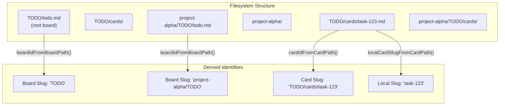
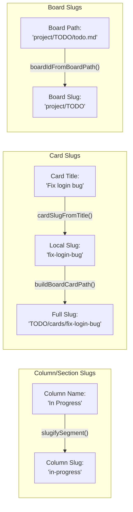
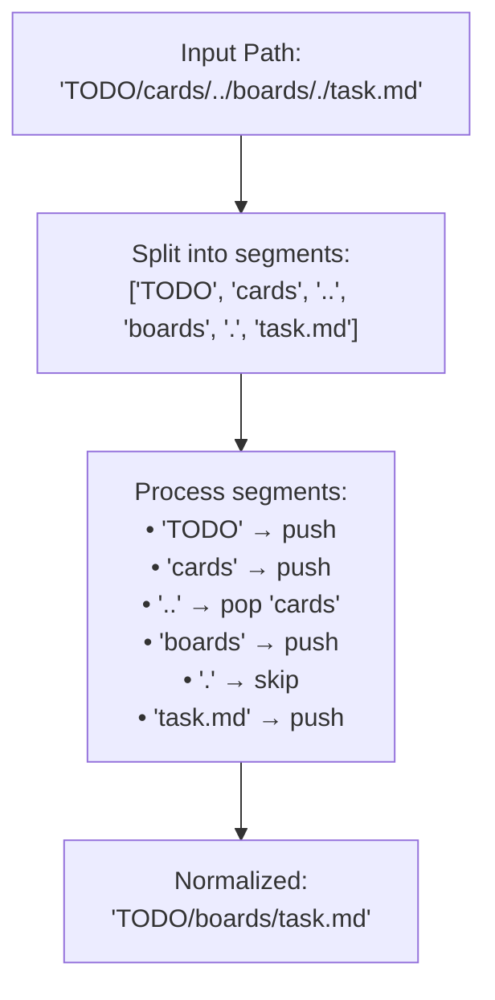
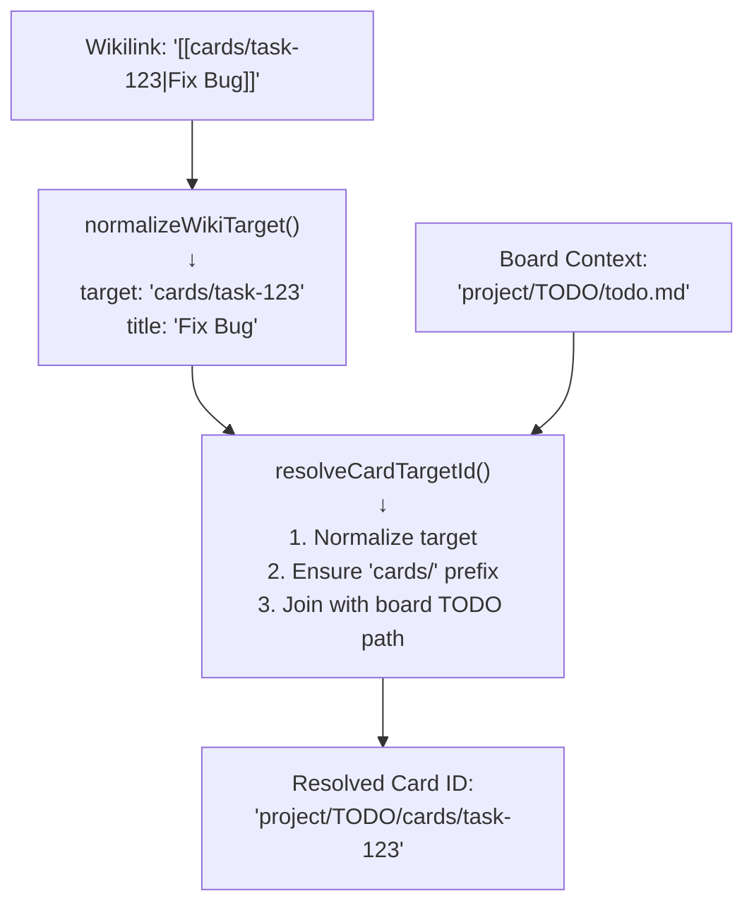
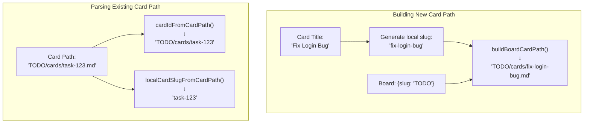
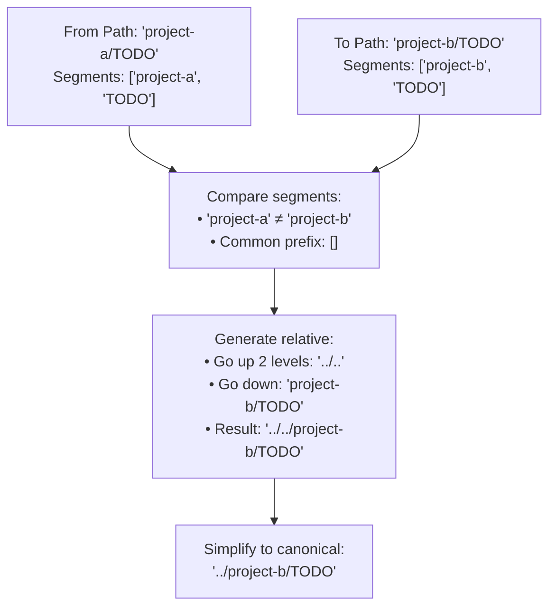

# Path and Slug Management

<details>
<summary>Relevant source files</summary>

The following files were used as context for generating this wiki page:

- [src/types/workspace.ts](../src/types/workspace.ts)
- [src/utils/boardMarkdown.test.ts](../src/utils/boardMarkdown.test.ts)
- [src/utils/kanbanPath.ts](../src/utils/kanbanPath.ts)
- [src/utils/renameTarget.ts](../src/utils/renameTarget.ts)

</details>


## Purpose and Scope

This document describes the path and slug management utilities in KanStack's frontend. These utilities handle path normalization, slug generation, wikilink resolution, and path construction for boards and cards throughout the application.

For information about how markdown is parsed into structured data, see [Workspace Parsing](#5.4.1). For information about how structured data is serialized back to markdown, see [Board and Card Serialization](#5.4.2).

**Sources:** [src/utils/kanbanPath.ts:1-164](../src/utils/kanbanPath.ts)

---

## Path Terminology and Formats

KanStack uses specific path conventions to organize boards and cards in the filesystem. Understanding these formats is essential for working with the path utilities.

### Board Paths

Board files are always named `todo.md` and located in a `TODO/` directory:

| Path Type | Example | Description |
|-----------|---------|-------------|
| Root board path | `TODO/todo.md` | Main board at workspace root |
| Sub-board path | `project-alpha/TODO/todo.md` | Board in a subdirectory |
| Board TODO path | `TODO` | Directory containing the board (without `todo.md`) |
| Board ID/slug | `TODO` or `project-alpha/TODO` | Unique identifier for the board |

### Card Paths

Cards are markdown files stored in a `cards/` subdirectory within each board's TODO directory:

| Path Type | Example | Description |
|-----------|---------|-------------|
| Full card path | `TODO/cards/task-123.md` | Complete filesystem path |
| Card ID | `TODO/cards/task-123` | Path without `.md` extension |
| Local card slug | `task-123` | Just the filename without `.md` |

### Wikilink Targets

Wikilinks use relative paths from the current board's project directory:

| Wikilink Format | Resolves To | Context |
|-----------------|-------------|---------|
| `[[cards/task-123]]` | `TODO/cards/task-123.md` | Card in current board |
| `[[project-alpha/TODO\|Project Alpha]]` | `project-alpha/TODO/todo.md` | Sub-board with custom title |
| `[[../TODO]]` | Parent board | Relative navigation |

**Diagram: Path Format Relationships**



**Sources:** [src/utils/kanbanPath.ts:84-109](../src/utils/kanbanPath.ts), [src/types/workspace.ts:3-40](../src/types/workspace.ts)

---

## Slug Generation

Slugs are normalized, URL-safe identifiers derived from human-readable names. KanStack uses slugs for columns, sections, boards, and cards.

### Slugification Algorithm

The `slugifySegment()` function converts any string to a lowercase, hyphen-separated slug:

1. Convert to lowercase
2. Trim whitespace
3. Replace non-alphanumeric characters with hyphens
4. Remove leading/trailing hyphens

**Examples:**

| Input | Output |
|-------|--------|
| `"Todo"` | `"todo"` |
| `"In Progress"` | `"in-progress"` |
| `"Review & QA"` | `"review-qa"` |
| `"  Backlog  "` | `"backlog"` |

### Slug Types

Different entities use different slug formats:



**Sources:** [src/utils/kanbanPath.ts:9-20](../src/utils/kanbanPath.ts), [src/utils/renameTarget.ts:10-24](../src/utils/renameTarget.ts)

---

## Path Normalization

Path normalization ensures consistent path handling across different operating systems and input formats. The utilities handle forward slashes, backslashes, relative navigation (`.` and `..`), and extra separators.

### Core Normalization Function

`normalizeRelativePath(path: string)` performs the following operations:

1. Convert backslashes to forward slashes
2. Trim whitespace
3. Split into segments
4. Process segments:
   - Skip empty segments and `.` (current directory)
   - For `..` (parent directory), pop the last segment
   - Otherwise, accumulate the segment
5. Join segments with `/`

**Diagram: Path Normalization Process**



### Safe Normalization

`tryNormalizeRelativePath(path: string)` wraps normalization in a try-catch block, returning `null` if the path escapes the workspace (too many `..` segments).

```typescript
// Throws error if path escapes workspace
normalizeRelativePath('../../etc/passwd')  // Error: "Relative path escapes the workspace tree."

// Returns null instead of throwing
tryNormalizeRelativePath('../../etc/passwd')  // null
```

### Path Manipulation Utilities

| Function | Purpose | Example |
|----------|---------|---------|
| `dirnameRelativePath(path)` | Get directory portion | `"TODO/cards/task.md"` → `"TODO/cards"` |
| `joinRelativePath(...parts)` | Join and normalize paths | `("TODO", "cards", "task.md")` → `"TODO/cards/task.md"` |
| `relativePathBetween(from, to)` | Calculate relative path | `("TODO", "project/TODO")` → `"../project/TODO"` |

**Sources:** [src/utils/kanbanPath.ts:22-82](../src/utils/kanbanPath.ts)

---

## Wikilink Target Resolution

Wikilinks in markdown files use the format `[[target]]` or `[[target|title]]`. The utilities parse and resolve these targets to absolute paths within the workspace.

### Parsing Wikilink Syntax

`normalizeWikiTarget(value: string)` parses the wikilink format:

```typescript
normalizeWikiTarget('cards/task-123')
// { slug: 'cards/task-123', target: 'cards/task-123', title: undefined }

normalizeWikiTarget('project/TODO|Project Alpha')
// { slug: 'project/TODO', target: 'project/TODO', title: 'Project Alpha' }
```

The function:
1. Splits on `|` to separate target from title
2. Normalizes the target:
   - Converts backslashes to forward slashes
   - Removes `.md` extension
   - Removes leading `./`
3. Returns a `NormalizedWikiTarget` object

### Board Target Resolution

`resolveBoardTargetPath(boardPath: string, target: string)` resolves a sub-board wikilink to an absolute board ID:

```typescript
// From board at 'TODO/todo.md', resolve relative sub-board link
resolveBoardTargetPath('TODO/todo.md', 'project-alpha/TODO')
// Returns: 'project-alpha/TODO'

// Handle 'todo' suffix
resolveBoardTargetPath('TODO/todo.md', 'project/TODO/todo')
// Returns: 'project/TODO'
```

### Card Target Resolution

`resolveCardTargetId(boardPath: string, target: string)` resolves a card wikilink to an absolute card ID:

```typescript
// Explicit cards/ prefix
resolveCardTargetId('TODO/todo.md', 'cards/task-123')
// Returns: 'TODO/cards/task-123'

// Implicit cards/ prefix (auto-added)
resolveCardTargetId('TODO/todo.md', 'task-123')
// Returns: 'TODO/cards/task-123'

// Sub-board card
resolveCardTargetId('project/TODO/todo.md', 'cards/fix-bug')
// Returns: 'project/TODO/cards/fix-bug'
```

**Diagram: Wikilink Resolution Flow**



**Sources:** [src/utils/kanbanPath.ts:111-159](../src/utils/kanbanPath.ts)

---

## Board Path Utilities

Board-specific path utilities handle the unique structure of board files (always `todo.md` in a `TODO/` directory).

### Extracting Board Identifiers

| Function | Input | Output | Purpose |
|----------|-------|--------|---------|
| `boardTodoPathFromBoardPath()` | `"TODO/todo.md"` | `"TODO"` | Remove `todo.md` suffix |
| `boardIdFromBoardPath()` | `"project/TODO/todo.md"` | `"project/TODO"` | Get board slug (alias for above) |
| `localBoardNameFromBoardPath()` | `"project-alpha/TODO/todo.md"` | `"project-alpha"` | Extract human-readable name |

### Board Name Extraction Logic

`localBoardNameFromBoardPath()` attempts to derive a display name from the path:

1. Get the TODO path (e.g., `"project-alpha/TODO"`)
2. Split into segments
3. If multiple segments, return the parent directory name
4. Otherwise, return the last segment
5. Default to `"Board"` if empty

```typescript
localBoardNameFromBoardPath('TODO/todo.md')
// Returns: 'TODO'

localBoardNameFromBoardPath('project-alpha/TODO/todo.md')
// Returns: 'project-alpha'

localBoardNameFromBoardPath('foo/bar/baz/TODO/todo.md')
// Returns: 'baz'
```

### Building Board Paths

`buildChildBoardPath(parentBoard, directoryName)` constructs a sub-board path:

```typescript
const parent = { path: 'TODO/todo.md' }
buildChildBoardPath(parent, 'project-alpha')
// Returns: 'project-alpha/TODO/todo.md'

const nestedParent = { path: 'projects/TODO/todo.md' }
buildChildBoardPath(nestedParent, 'alpha')
// Returns: 'projects/alpha/TODO/todo.md'
```

**Sources:** [src/utils/kanbanPath.ts:84-143](../src/utils/kanbanPath.ts)

---

## Card Path Utilities

Card-specific utilities handle the `.md` file extension and the `cards/` subdirectory convention.

### Card ID and Path Conversion

| Function | Input | Output | Purpose |
|----------|-------|--------|---------|
| `cardIdFromCardPath()` | `"TODO/cards/task.md"` | `"TODO/cards/task"` | Remove `.md` |
| `cardPathFromId()` | `"TODO/cards/task"` | `"TODO/cards/task.md"` | Add `.md` |
| `localCardSlugFromCardPath()` | `"TODO/cards/task-123.md"` | `"task-123"` | Extract filename slug |

### Building Card Paths

`buildBoardCardPath(board, localCardSlug)` constructs a full card path:

```typescript
const board = { slug: 'TODO' }
buildBoardCardPath(board, 'task-123')
// Returns: 'TODO/cards/task-123.md'

const subBoard = { slug: 'project/TODO' }
buildBoardCardPath(subBoard, 'fix-bug')
// Returns: 'project/TODO/cards/fix-bug.md'
```

### Building Wikilink Targets

`buildBoardCardTarget(localCardSlug)` creates a wikilink target string:

```typescript
buildBoardCardTarget('task-123')
// Returns: 'cards/task-123'
```

This target is then used in markdown like `[[cards/task-123]]`.

### Card Rename Logic

`getCardRenameTarget()` in `renameTarget.ts` calculates the new path and slug when a card's title changes:

```typescript
getCardRenameTarget(
  'Fix Login Bug',
  'TODO/cards/old-name.md',
  ['TODO/cards/other-card.md']
)
// Returns: {
//   title: 'Fix Login Bug',
//   slug: 'TODO/cards/fix-login-bug',
//   path: 'TODO/cards/fix-login-bug.md'
// }
```

The function:
1. Generates a slug from the new title
2. Checks for conflicts with existing cards
3. Appends a number if needed (`fix-login-bug-2`)
4. Constructs the new path and slug

**Diagram: Card Path Construction and Resolution**



**Sources:** [src/utils/kanbanPath.ts:92-138](../src/utils/kanbanPath.ts), [src/utils/renameTarget.ts:1-24](../src/utils/renameTarget.ts)

---

## Path Construction for Sub-Boards

When creating sub-boards, the utilities handle relative path calculation and wikilink target generation.

### Building Sub-Board Targets

`buildSubBoardTarget(boardPath, childBoardId)` creates a relative wikilink target from parent to child:

```typescript
// Parent board at root
buildSubBoardTarget('TODO/todo.md', 'project-alpha/TODO')
// Returns: 'project-alpha/TODO'

// Nested parent board
buildSubBoardTarget('project/TODO/todo.md', 'project/alpha/TODO')
// Returns: 'alpha/TODO'

// Sibling board
buildSubBoardTarget('project-a/TODO/todo.md', 'project-b/TODO')
// Returns: '../project-b/TODO'
```

The function:
1. Gets the parent board's project directory
2. Calculates the relative path from parent to child
3. Returns a target suitable for wikilinks

### Relative Path Calculation

`relativePathBetween(from, to)` computes the relative path between any two locations:

```typescript
relativePathBetween('TODO', 'TODO/cards')
// Returns: 'cards'

relativePathBetween('project-a/TODO', 'project-b/TODO')
// Returns: '../project-b/TODO'

relativePathBetween('a/b/c', 'a/d')
// Returns: '../../d'
```

**Algorithm:**
1. Normalize both paths
2. Split into segments
3. Find the common prefix
4. Generate `..` for each remaining "from" segment
5. Append remaining "to" segments
6. Return `.` if paths are identical

**Diagram: Relative Path Calculation**



**Sources:** [src/utils/kanbanPath.ts:65-143](../src/utils/kanbanPath.ts)

---

## Section Key Management

Sections within columns can be named or unnamed. The `DEFAULT_SECTION_KEY` constant and `sectionKeyFromSlug()` function provide consistent handling.

### Default Section Key

The unnamed section (cards not in a named section) uses the key `"__default__"`:

```typescript
export const DEFAULT_SECTION_KEY = '__default__'

sectionKeyFromSlug(null)
// Returns: '__default__'

sectionKeyFromSlug('review')
// Returns: 'review'
```

This allows the application to use sections as map keys consistently, whether they're named or not.

**Sources:** [src/utils/kanbanPath.ts:7-163](../src/utils/kanbanPath.ts)

---

## Usage Examples

The following examples demonstrate common path and slug operations in KanStack:

### Example 1: Resolving Card Wikilinks

```typescript
import { resolveCardTargetId, normalizeWikiTarget } from '@/utils/kanbanPath'

// Parse wikilink from markdown
const wikilink = '[[cards/implement-feature|Implement Feature]]'
const normalized = normalizeWikiTarget(wikilink)
// { slug: 'cards/implement-feature', target: 'cards/implement-feature', title: 'Implement Feature' }

// Resolve to absolute card ID
const boardPath = 'project/TODO/todo.md'
const cardId = resolveCardTargetId(boardPath, normalized.target)
// 'project/TODO/cards/implement-feature'
```

### Example 2: Creating a New Card

```typescript
import { buildBoardCardPath, buildBoardCardTarget } from '@/utils/kanbanPath'
import { cardSlugFromTitle } from '@/utils/slug'

const board = { slug: 'TODO' }
const cardTitle = 'Fix Navigation Bug'
const localSlug = cardSlugFromTitle(cardTitle)
// 'fix-navigation-bug'

const cardPath = buildBoardCardPath(board, localSlug)
// 'TODO/cards/fix-navigation-bug.md'

const wikilinkTarget = buildBoardCardTarget(localSlug)
// 'cards/fix-navigation-bug'
```

### Example 3: Building Sub-Board Links

```typescript
import { buildSubBoardTarget, resolveBoardTargetPath } from '@/utils/kanbanPath'

const parentBoard = { path: 'TODO/todo.md' }
const childBoardId = 'project-alpha/TODO'

// Create wikilink target for child
const target = buildSubBoardTarget(parentBoard.path, childBoardId)
// 'project-alpha/TODO'

// Verify resolution back to child
const resolved = resolveBoardTargetPath(parentBoard.path, target)
// 'project-alpha/TODO'
```

### Example 4: Renaming a Card

```typescript
import { getCardRenameTarget } from '@/utils/renameTarget'

const newTitle = 'Update User Profile'
const currentPath = 'TODO/cards/old-task.md'
const existingCards = [
  'TODO/cards/update-user-profile.md', // Conflict!
  'TODO/cards/other-task.md'
]

const renameTarget = getCardRenameTarget(newTitle, currentPath, existingCards)
// {
//   title: 'Update User Profile',
//   slug: 'TODO/cards/update-user-profile-2',
//   path: 'TODO/cards/update-user-profile-2.md'
// }
```

**Sources:** [src/utils/kanbanPath.ts:1-164](../src/utils/kanbanPath.ts), [src/utils/renameTarget.ts:1-24](../src/utils/renameTarget.ts), [src/utils/boardMarkdown.test.ts:1-205](../src/utils/boardMarkdown.test.ts)

---

## Summary Table

| Operation | Function | Example Input | Example Output |
|-----------|----------|---------------|----------------|
| Slugify text | `slugifySegment()` | `"In Progress"` | `"in-progress"` |
| Normalize path | `normalizeRelativePath()` | `"TODO/../cards/task.md"` | `"cards/task.md"` |
| Get directory | `dirnameRelativePath()` | `"TODO/cards/task.md"` | `"TODO/cards"` |
| Join paths | `joinRelativePath()` | `"TODO", "cards", "task.md"` | `"TODO/cards/task.md"` |
| Relative path | `relativePathBetween()` | `"TODO", "project/TODO"` | `"../project/TODO"` |
| Board ID | `boardIdFromBoardPath()` | `"TODO/todo.md"` | `"TODO"` |
| Card ID | `cardIdFromCardPath()` | `"TODO/cards/task.md"` | `"TODO/cards/task"` |
| Local slug | `localCardSlugFromCardPath()` | `"TODO/cards/task.md"` | `"task"` |
| Parse wikilink | `normalizeWikiTarget()` | `"cards/task\|Task"` | `{target, title}` |
| Resolve card | `resolveCardTargetId()` | board path + `"task-1"` | `"TODO/cards/task-1"` |
| Resolve board | `resolveBoardTargetPath()` | board path + `"project/TODO"` | `"project/TODO"` |
| Build card path | `buildBoardCardPath()` | board + `"task-1"` | `"TODO/cards/task-1.md"` |
| Build sub-board | `buildSubBoardTarget()` | parent path + child ID | Relative target |

**Sources:** [src/utils/kanbanPath.ts:1-164](../src/utils/kanbanPath.ts), [src/utils/renameTarget.ts:1-24](../src/utils/renameTarget.ts)
