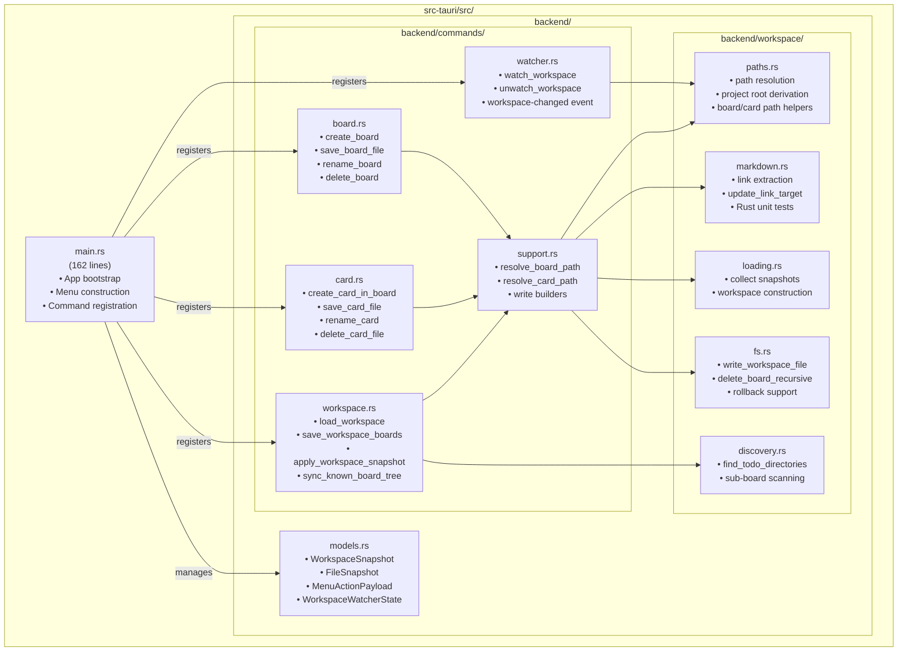
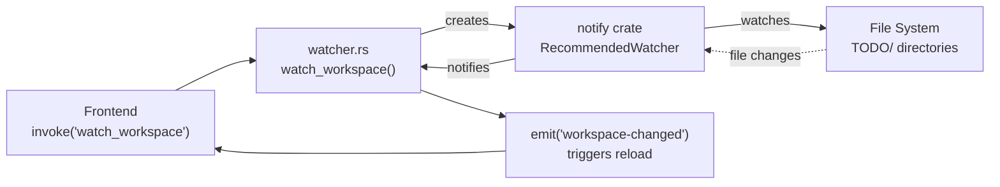
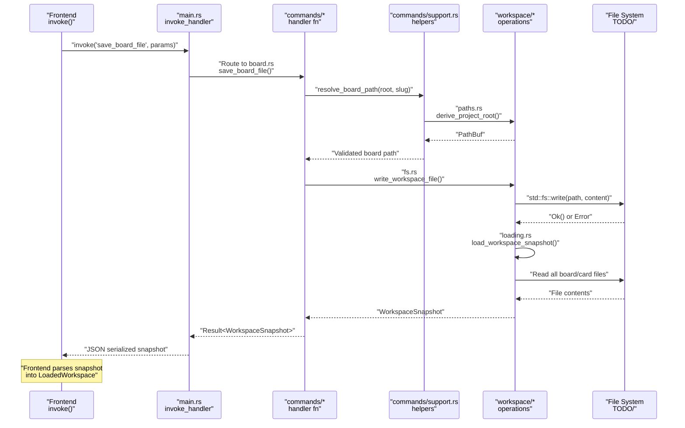
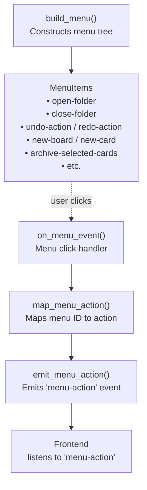

# Backend Guide

Relevant source files

The following files were used as context for generating this wiki page:

- [TODO/cards/cross-workspace-boards.md](../TODO/cards/cross-workspace-boards.md)
- [TODO/cards/tauri-backend-module-split.md](../TODO/cards/tauri-backend-module-split.md)
- [TODO/todo.md](../TODO/todo.md)
- [docs/plans/2026-03-11-example-workspace-refresh-design.md](../docs/plans/2026-03-11-example-workspace-refresh-design.md)
- [docs/plans/2026-03-12-cross-workspace-boards-design.md](../docs/plans/2026-03-12-cross-workspace-boards-design.md)
- [src-tauri/Cargo.toml](../src-tauri/Cargo.toml)
- [src-tauri/src/main.rs](../src-tauri/src/main.rs)

This document provides a comprehensive overview of the Rust backend in KanStack. The backend is responsible for all file system operations, workspace loading and parsing, file watching, and exposing Tauri commands to the frontend. It manages the persistent state of boards and cards stored as markdown files in the `TODO/` directory structure.

For frontend integration patterns and how to invoke these backend commands, see [Frontend Architecture](3.3-frontend-architecture.md). For the specific markdown format the backend parses and generates, see [Markdown Format](4.4-markdown-format.md). For detailed data type definitions, see [Workspace Types](7.2-workspace-types.md).

## Backend Architecture Overview

The KanStack backend is built with Rust using the Tauri 2 framework. After a significant refactoring (documented in the "Tauri Backend Module Split" card), the backend was reorganized from a monolithic `main.rs` into focused modules with clear separation of concerns.

**Diagram: Backend Module Organization with Actual File Paths**

The backend is organized into three main layers:

1. **Entry Point** (src-tauri/src/main.rs): Minimal bootstrap code that sets up the Tauri application, constructs the menu system, registers command handlers, and maps menu events to frontend actions.

2. **Command Layer** (src-tauri/src/backend/commands/): Tauri command handlers that expose operations to the frontend via IPC. Each handler validates inputs, coordinates workspace operations, and returns results or errors.

3. **Workspace Layer** (src-tauri/src/backend/workspace/): Pure business logic for path resolution, markdown parsing, sub-board discovery, snapshot loading, and file system operations. These modules have no Tauri dependencies and can be unit tested independently.

**Sources:** src-tauri/src/main.rs, TODO/cards/tauri-backend-module-split.md

## Technology Stack

The backend relies on the following key dependencies:

| Dependency | Version | Purpose |
|------------|---------|---------|
| `tauri` | 2.x | Desktop app framework, IPC bridge, command handlers |
| `notify` | 6.x | File system watcher for detecting external changes |
| `serde` | 1.x | Serialization/deserialization with derive macros |
| `serde_json` | 1.x | JSON parsing for settings blocks and API responses |
| `serde_yaml` | 0.9 | YAML frontmatter parsing in markdown files |
| `tauri-plugin-dialog` | 2.x | Native file picker dialogs |
| `trash` | 5.x | Safe file deletion (move to system trash) |

The release profile is optimized with `opt-level = 3`, `strip = true`, and `lto = true` for maximum performance and minimal binary size.

**Sources:** [src-tauri/Cargo.toml:1-27](../src-tauri/Cargo.toml)

## Core Subsystems

### Command Layer

The command layer exposes 14 Tauri commands to the frontend, organized by domain:

| Command Module | Commands | Purpose |
|----------------|----------|---------|
| `workspace.rs` | `load_workspace`, `save_workspace_boards`, `apply_workspace_snapshot`, `load_app_config`, `save_app_config`, `sync_known_board_tree` | Workspace-level operations: loading, snapshot application, config persistence |
| `card.rs` | `create_card_in_board`, `save_card_file`, `rename_card`, `delete_card_file` | Card lifecycle: creation, editing, renaming, deletion |
| `board.rs` | `create_board`, `save_board_file`, `rename_board`, `delete_board` | Board lifecycle: creation, editing, renaming, deletion |
| `watcher.rs` | `watch_workspace`, `unwatch_workspace` | File system watching and change event emission |

All commands follow a consistent pattern:
1. Accept structured input parameters (typically containing paths and content)
2. Validate inputs and resolve paths using `support.rs` helpers
3. Execute file system operations via `workspace/fs.rs`
4. Return a `WorkspaceSnapshot` or error

**Sources:** [src-tauri/src/main.rs:32-49](../src-tauri/src/main.rs)

### Workspace Layer

The workspace layer handles all business logic for workspace operations:

| Module | Key Functions | Purpose |
|--------|---------------|---------|
| `paths.rs` | `derive_project_root`, `resolve_board_file_path`, `resolve_card_file_path` | Path resolution and validation for board/card files |
| `markdown.rs` | `extract_markdown_link_target`, `update_link_target` | Markdown wikilink parsing and manipulation, with unit tests |
| `discovery.rs` | `find_todo_directories`, `find_todo_directories_filtered` | Recursive sub-board discovery under a board's parent directory |
| `loading.rs` | `load_workspace_snapshot`, `collect_board_and_card_files` | Workspace snapshot construction from file system |
| `fs.rs` | `write_workspace_file`, `delete_board_recursive`, `apply_workspace_writes` | File write operations with rollback support |

**Sources:** [TODO/cards/tauri-backend-module-split.md:39-45](../TODO/cards/tauri-backend-module-split.md)

### File System Watching

The file watcher subsystem uses the `notify` crate to detect external changes to workspace files and emit `workspace-changed` events to the frontend. The watcher state is managed globally using Tauri's state management system.

**Diagram: File System Watching Flow with Code Entities**

**Sources:** [src-tauri/src/main.rs:10-17](../src-tauri/src/main.rs), [src-tauri/Cargo.toml:12](../src-tauri/Cargo.toml)

## Command Invocation Flow

This diagram shows the complete flow from frontend command invocation to file system persistence:

**Diagram: Command Invocation Flow from Frontend to File System**

Key observations:
- All commands return a `WorkspaceSnapshot` after successful mutations, ensuring the frontend has the latest state
- The `support.rs` module centralizes path resolution to avoid duplication across command handlers
- The `fs.rs` module handles all actual file writes, providing a single point for error handling and rollback
- Path validation happens before any file operations to fail fast on invalid inputs

**Sources:** [TODO/cards/tauri-backend-module-split.md:39-46](../TODO/cards/tauri-backend-module-split.md), [src-tauri/src/main.rs:19-52](../src-tauri/src/main.rs)

## Shared Helpers and Utilities

The `commands/support.rs` module provides critical shared functionality used by all command handlers:

| Helper Function | Purpose | Used By |
|-----------------|---------|---------|
| `resolve_board_path()` | Resolve and validate board file paths (`TODO/todo.md`) | `board.rs`, `card.rs`, `workspace.rs` |
| `resolve_card_path()` | Resolve and validate card file paths (`cards/*.md`) | `card.rs` |
| `build_write_operations()` | Construct write operations for file persistence | `board.rs`, `card.rs` |
| `parse_markdown_slug()` | Extract slug from wikilink format | `card.rs` |

These helpers enforce important invariants:
- Board writes must target `TODO/todo.md` (not arbitrary markdown files)
- Card writes must target `cards/*.md` (within the board's cards directory)
- All paths are validated before file operations execute

**Sources:** [TODO/cards/tauri-backend-module-split.md:42-44](../TODO/cards/tauri-backend-module-split.md)

## Menu System Integration

The backend implements a native application menu that bridges to frontend actions via event emission:

**Diagram: Menu System Event Flow with Function Names**

The menu system defines accelerators (keyboard shortcuts) for common actions and emits standardized action names to the frontend. This decouples the native menu from frontend implementation details.

**Sources:** [src-tauri/src/main.rs:54-191](../src-tauri/src/main.rs)

## Data Types and Models

The `backend/models.rs` module defines shared data types used across the backend:

| Type | Purpose | Serialization |
|------|---------|---------------|
| `WorkspaceSnapshot` | Raw file content snapshot (root path + board files + card files) | Serde JSON |
| `FileSnapshot` | Individual file metadata (relative path + content + absolute path) | Serde JSON |
| `MenuActionPayload` | Menu event payload (action string) | Serde JSON |
| `WorkspaceWatcherState` | Global state for file watcher (Mutex-wrapped) | Tauri State |

These types form the IPC contract between Rust and TypeScript. All types derive `Serialize` and `Deserialize` for seamless JSON conversion.

**Sources:** [src-tauri/src/main.rs:16](../src-tauri/src/main.rs)

## Error Handling

Backend commands use Rust's `Result` type for error handling. All commands return `Result<T, String>` where:
- `Ok(T)` contains the success value (typically `WorkspaceSnapshot`)
- `Err(String)` contains a human-readable error message

Errors are propagated to the frontend as rejected promises, where they can be displayed to the user or handled programmatically.

Common error scenarios:
- Invalid workspace path (directory doesn't exist)
- File write failures (permissions, disk full)
- Malformed markdown (parsing errors surface as diagnostics, not command failures)
- Missing board or card files during operations

## Testing Strategy

The backend includes Rust unit tests for critical parsing and markdown manipulation logic:

- `workspace/markdown.rs` contains unit tests for `extract_markdown_link_target` and `update_link_target`
- Tests validate wikilink parsing, title extraction, and link target updates
- Tests are run with `cargo test --manifest-path src-tauri/Cargo.toml`

The modular architecture enables testing pure functions (in `workspace/`) independently from Tauri-dependent code (in `commands/`).

**Sources:** [TODO/cards/tauri-backend-module-split.md:32-33](../TODO/cards/tauri-backend-module-split.md), [TODO/cards/cross-workspace-boards.md:48](../TODO/cards/cross-workspace-boards.md)

## Module Responsibilities Summary

| Module | Lines of Code | Primary Responsibility |
|--------|---------------|------------------------|
| `main.rs` | 162 | App bootstrap, menu, command registration |
| `commands/workspace.rs` | ~200 | Workspace loading, snapshot application, config |
| `commands/card.rs` | ~150 | Card CRUD operations |
| `commands/board.rs` | ~150 | Board CRUD operations |
| `commands/watcher.rs` | ~100 | File system watching |
| `commands/support.rs` | ~100 | Shared path resolution and helpers |
| `workspace/paths.rs` | ~100 | Path resolution and validation |
| `workspace/markdown.rs` | ~150 | Markdown parsing and link manipulation |
| `workspace/discovery.rs` | ~100 | Sub-board discovery |
| `workspace/loading.rs` | ~200 | Snapshot construction |
| `workspace/fs.rs` | ~200 | File write operations and rollback |
| `models.rs` | ~50 | Shared data type definitions |

**Total backend LOC:** ~1,600 lines (approximately)

**Sources:** [TODO/cards/tauri-backend-module-split.md:38-46](../TODO/cards/tauri-backend-module-split.md)

## Detailed Coverage in Child Pages

For in-depth coverage of specific backend subsystems, refer to these child pages:

- **[Main Entry Point and Menu System](6.1-main-entry-point-and-menu-system.md)**: Detailed explanation of `main.rs`, menu construction, accelerator mapping, and event emission
- **[Command Handlers](6.2-command-handlers.md)**: Complete reference for all 14 Tauri commands, their parameters, validation logic, and return types
- **[Workspace Operations](6.3-workspace-operations.md)**: Deep dive into path resolution, markdown parsing, sub-board discovery, snapshot loading, and file operations
- **[File System Watching](6.4-file-system-watching.md)**: Comprehensive guide to the file watcher implementation, event handling, and state management

**Sources:** All files listed above
