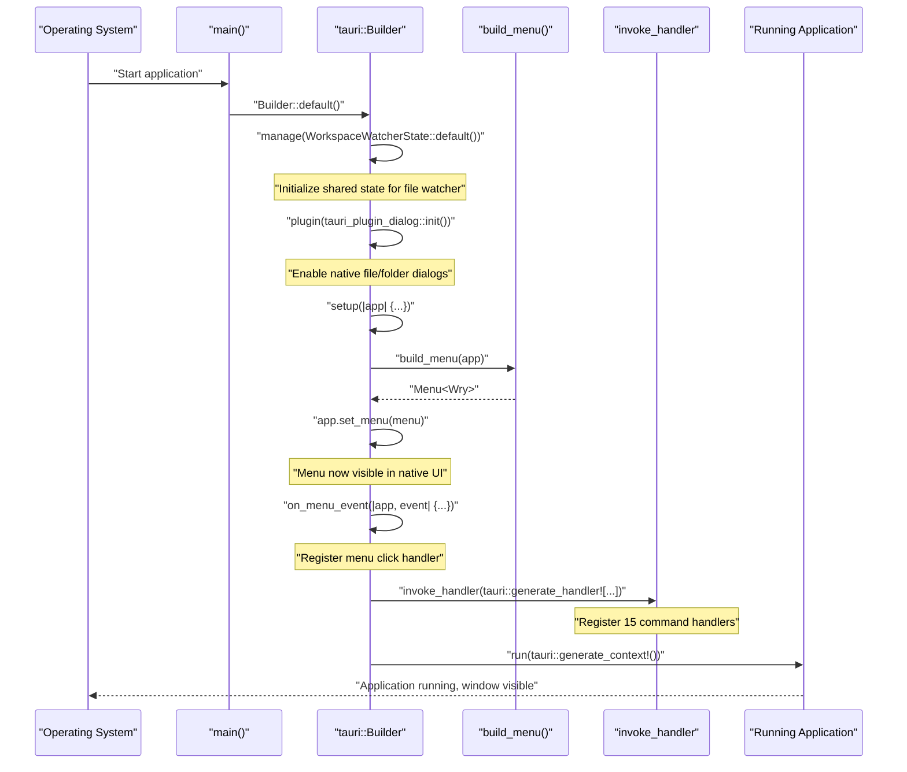
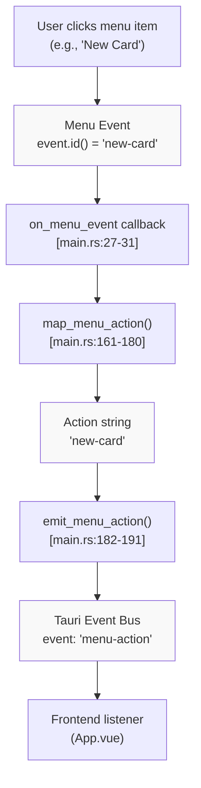
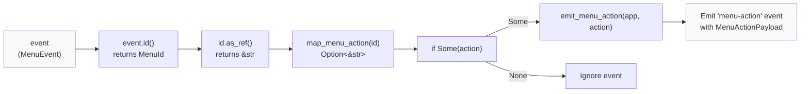
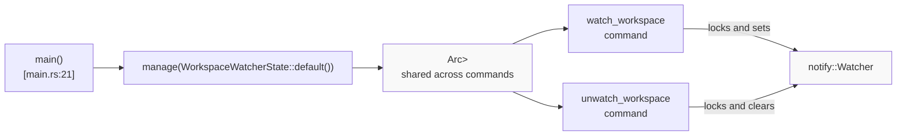

# Main Entry Point and Menu System

<details>
<summary>Relevant source files</summary>

The following files were used as context for generating this wiki page:

- [index.html](../index.html)
- [src-tauri/src/main.rs](../src-tauri/src/main.rs)
- [src-tauri/tauri.conf.json](../src-tauri/tauri.conf.json)
- [src/main.ts](../src/main.ts)

</details>


This page documents the Rust backend's application entry point (`main.rs`) and its menu system. It covers application initialization, Tauri command registration, menu construction with keyboard shortcuts, and the mechanism for forwarding menu actions to the frontend. For information about the frontend orchestration and how menu actions are handled in Vue, see [Main Application Component](5.1-main-application-component.md). For details on the individual command handlers that are registered here, see [Command Handlers](6.2-command-handlers.md).

## Purpose and Scope

The `main.rs` file serves as the entry point for the Tauri desktop application. It is responsible for:

- Initializing the Tauri runtime and window system
- Constructing the native application menu with keyboard shortcuts
- Registering all Tauri command handlers for frontend-backend IPC
- Managing workspace watcher state
- Forwarding menu events to the frontend via the event system

This 192-line file [src-tauri/src/main.rs:1-192](../src-tauri/src/main.rs) acts as the "glue" that connects Tauri's native platform capabilities with the application's custom backend logic and frontend UI.

Sources: [src-tauri/src/main.rs:1-192](../src-tauri/src/main.rs)

## Application Initialization Flow

The application bootstrap process follows a specific sequence to ensure all components are properly initialized before the application becomes interactive.

### Initialization Sequence Diagram



Sources: [src-tauri/src/main.rs:19-52](../src-tauri/src/main.rs)

### Main Function Structure

The `main()` function [src-tauri/src/main.rs:19-52](../src-tauri/src/main.rs) uses Tauri's builder pattern to configure the application:

| Step | Purpose | Code Location |
|------|---------|---------------|
| **State Management** | Initialize shared `WorkspaceWatcherState` for file watching | [src-tauri/src/main.rs:21](../src-tauri/src/main.rs) |
| **Dialog Plugin** | Enable native file/folder picker dialogs | [src-tauri/src/main.rs:22](../src-tauri/src/main.rs) |
| **Setup Hook** | Construct and set application menu | [src-tauri/src/main.rs:23-26](../src-tauri/src/main.rs) |
| **Menu Handler** | Register callback for menu click events | [src-tauri/src/main.rs:27-31](../src-tauri/src/main.rs) |
| **Command Registration** | Register 15 IPC command handlers | [src-tauri/src/main.rs:32-49](../src-tauri/src/main.rs) |
| **Run** | Start the Tauri application event loop | [src-tauri/src/main.rs:50-51](../src-tauri/src/main.rs) |

Sources: [src-tauri/src/main.rs:19-52](../src-tauri/src/main.rs)

## Menu System Architecture

The menu system consists of three interconnected components: menu construction, event routing, and action emission. Menu items are assigned string identifiers that are mapped to action strings and forwarded to the frontend.

### Menu Event Flow Diagram



Sources: [src-tauri/src/main.rs:27-31](../src-tauri/src/main.rs), [src-tauri/src/main.rs:161-191](../src-tauri/src/main.rs)

### Menu Action Mapping

The `map_menu_action()` function [src-tauri/src/main.rs:161-180](../src-tauri/src/main.rs) converts menu item IDs to action strings. This indirection allows the menu ID to differ from the action name if needed, though currently they are identical:

| Menu Item ID | Action String | Keyboard Shortcut |
|--------------|---------------|-------------------|
| `open-folder` | `open-folder` | `Cmd/Ctrl+O` |
| `close-folder` | `close-folder` | `Cmd/Ctrl+W` |
| `undo-action` | `undo-action` | `Cmd/Ctrl+Z` |
| `redo-action` | `redo-action` | `Cmd/Ctrl+Shift+Z` |
| `new-card` | `new-card` | `Cmd/Ctrl+N` |
| `new-board` | `new-board` | `Cmd/Ctrl+Shift+N` |
| `attach-existing-board` | `attach-existing-board` | (none) |
| `new-column` | `new-column` | (none) |
| `rename-selected-column` | `rename-selected-column` | (none) |
| `delete-selected-column` | `delete-selected-column` | (none) |
| `toggle-archive-column` | `toggle-archive-column` | `Cmd/Ctrl+Shift+A` |
| `toggle-sub-boards` | `toggle-sub-boards` | (none) |
| `delete-current-board` | `delete-current-board` | (none) |
| `archive-selected-cards` | `archive-selected-cards` | `Delete` |
| `delete-selected-cards` | `delete-selected-cards` | `Shift+Delete` |

The mapping function returns `Option<&'static str>`, allowing unrecognized menu IDs to be ignored [src-tauri/src/main.rs:178](../src-tauri/src/main.rs).

Sources: [src-tauri/src/main.rs:161-180](../src-tauri/src/main.rs), [src-tauri/src/main.rs:68-112](../src-tauri/src/main.rs)

## Menu Construction

The `build_menu()` function [src-tauri/src/main.rs:54-159](../src-tauri/src/main.rs) constructs the native application menu using Tauri's menu builder API. The menu structure varies by platform, with macOS receiving a dedicated application menu.

### Menu Structure Diagram

```mermaid
graph TD
    MenuBar["Menu Bar"]
    
    AppMenu["App Menu<br/>(macOS only)"]
    FileMenu["File Menu"]
    EditMenu["Edit Menu"]
    BoardMenu["Board Menu"]
    ColumnMenu["Column Menu"]
    CardMenu["Card Menu"]
    
    MenuBar --> AppMenu
    MenuBar --> FileMenu
    MenuBar --> EditMenu
    MenuBar --> BoardMenu
    MenuBar --> ColumnMenu
    MenuBar --> CardMenu
    
    AppMenu --> AboutItem["About KanStack"]
    
    FileMenu --> OpenFolder["Open Folder<br/>(Cmd+O)"]
    FileMenu --> CloseFolder["Close Folder<br/>(Cmd+W)"]
    
    EditMenu --> Undo["Undo<br/>(Cmd+Z)"]
    EditMenu --> Redo["Redo<br/>(Cmd+Shift+Z)"]
    
    BoardMenu --> NewBoard["New Board<br/>(Cmd+Shift+N)"]
    BoardMenu --> AttachBoard["Attach Existing Board"]
    BoardMenu --> Sep1["---"]
    BoardMenu --> ToggleArchive["Toggle Archive Column<br/>(Cmd+Shift+A)"]
    BoardMenu --> ToggleSub["Toggle Sub Boards"]
    BoardMenu --> Sep2["---"]
    BoardMenu --> DeleteBoard["Delete Current Board"]
    
    ColumnMenu --> NewColumn["New Column"]
    ColumnMenu --> RenameColumn["Rename Column"]
    ColumnMenu --> Sep3["---"]
    ColumnMenu --> DeleteColumn["Delete Column"]
    
    CardMenu --> NewCard["New Card<br/>(Cmd+N)"]
    CardMenu --> Sep4["---"]
    CardMenu --> ArchiveCards["Archive Selected<br/>(Delete)"]
    CardMenu --> DeleteCards["Delete Selected<br/>(Shift+Delete)"]
    
    style MenuBar fill:#f9f9f9
    style AppMenu fill:#e8f4f8
    style FileMenu fill:#e8f4f8
    style EditMenu fill:#e8f4f8
    style BoardMenu fill:#e8f4f8
    style ColumnMenu fill:#e8f4f8
    style CardMenu fill:#e8f4f8
```



Sources: [src-tauri/src/main.rs:54-159](../src-tauri/src/main.rs)

### Menu Item Construction

Menu items are created using `MenuItemBuilder` [src-tauri/src/main.rs:68-112](../src-tauri/src/main.rs), which provides a fluent API for configuring each item:

```
MenuItemBuilder::with_id(id, label)
    .accelerator(shortcut)  // Optional
    .build(app)?
```

For example, the "New Card" menu item [src-tauri/src/main.rs:102-104](../src-tauri/src/main.rs):

```
MenuItemBuilder::with_id("new-card", "New Card")
    .accelerator("CmdOrCtrl+N")
    .build(app)?
```

The `CmdOrCtrl` prefix ensures cross-platform compatibility: `Cmd` on macOS, `Ctrl` on Windows/Linux.

Sources: [src-tauri/src/main.rs:68-112](../src-tauri/src/main.rs)

### Platform-Specific Menu Construction

The menu construction logic uses conditional compilation to handle platform differences:

**macOS-specific elements** [src-tauri/src/main.rs:56-67](../src-tauri/src/main.rs), [src-tauri/src/main.rs:114-117](../src-tauri/src/main.rs):
- `PredefinedMenuItem::about()` creates a standard "About" menu item
- `AboutMetadataBuilder` populates it with app name, version, and icon
- The app menu is added to the menu bar [src-tauri/src/main.rs:149-150](../src-tauri/src/main.rs)

**All platforms** [src-tauri/src/main.rs:118-158](../src-tauri/src/main.rs):
- File, Edit, Board, Column, and Card menus are created using `SubmenuBuilder`
- Separators divide related menu items using `.separator()`
- Final menu is assembled using `MenuBuilder` chain

Sources: [src-tauri/src/main.rs:54-159](../src-tauri/src/main.rs)

## Menu Event Handling

When a user clicks a menu item or presses a keyboard shortcut, Tauri invokes the callback registered via `on_menu_event()` [src-tauri/src/main.rs:27-31](../src-tauri/src/main.rs). This callback orchestrates the flow from native menu event to frontend notification.

### Menu Event Handler Flow



Sources: [src-tauri/src/main.rs:27-31](../src-tauri/src/main.rs)

### Event Emission

The `emit_menu_action()` function [src-tauri/src/main.rs:182-191](../src-tauri/src/main.rs) uses Tauri's event system to notify the frontend:

1. Constructs a `MenuActionPayload` with the action string [src-tauri/src/main.rs:186-188](../src-tauri/src/main.rs)
2. Calls `app_handle.emit()` with event name `MENU_ACTION_EVENT` [src-tauri/src/main.rs:184-189](../src-tauri/src/main.rs)
3. Returns `Result<(), String>` to handle potential emission errors

The event name `MENU_ACTION_EVENT` is defined in `backend/models.rs` (imported at [src-tauri/src/main.rs:17](../src-tauri/src/main.rs)) and used by the frontend to listen for menu actions.

Sources: [src-tauri/src/main.rs:182-191](../src-tauri/src/main.rs), [src-tauri/src/main.rs:16-17](../src-tauri/src/main.rs)

## Command Handler Registration

The `invoke_handler` macro [src-tauri/src/main.rs:32-49](../src-tauri/src/main.rs) registers 15 Tauri command handlers that the frontend can invoke via IPC. These commands provide the backend API for all workspace, board, and card operations.

### Registered Commands by Category

| Category | Commands | Module |
|----------|----------|--------|
| **Workspace** | `load_workspace`<br/>`save_workspace_boards`<br/>`apply_workspace_snapshot`<br/>`sync_known_board_tree` | [workspace.rs](6.2-command-handlers.md) |
| **Card** | `save_card_file`<br/>`create_card_in_board`<br/>`rename_card`<br/>`delete_card_file` | [card.rs](6.2-command-handlers.md) |
| **Board** | `save_board_file`<br/>`create_board`<br/>`rename_board`<br/>`delete_board` | [board.rs](6.2-command-handlers.md) |
| **Watcher** | `watch_workspace`<br/>`unwatch_workspace` | [watcher.rs](6.2-command-handlers.md) |
| **Config** | `load_app_config`<br/>`save_app_config` | [workspace.rs](6.2-command-handlers.md) |

All command functions are imported from `backend::commands` module [src-tauri/src/main.rs:10-15](../src-tauri/src/main.rs).

Sources: [src-tauri/src/main.rs:10-15](../src-tauri/src/main.rs), [src-tauri/src/main.rs:32-49](../src-tauri/src/main.rs)

### Command Invocation Pattern

Commands are invoked from the frontend using Tauri's `invoke()` API:

```typescript
// Frontend code example
const result = await invoke('load_workspace', { workspacePath });
```

The `tauri::generate_handler!` macro [src-tauri/src/main.rs:32](../src-tauri/src/main.rs) generates the routing code that:
1. Deserializes command arguments from the frontend
2. Calls the appropriate Rust function
3. Serializes the return value back to the frontend
4. Handles errors and converts them to frontend-compatible formats

Sources: [src-tauri/src/main.rs:32-49](../src-tauri/src/main.rs)

## State Management

The application manages a single piece of shared state: `WorkspaceWatcherState` [src-tauri/src/main.rs:21](../src-tauri/src/main.rs). This state is initialized using Tauri's `manage()` method, which makes it available to all command handlers.

### WorkspaceWatcherState Usage



The `WorkspaceWatcherState` type is defined in `backend/models.rs` [src-tauri/src/main.rs:16](../src-tauri/src/main.rs) and provides thread-safe access to the file system watcher. For details on how the watcher operates, see [File System Watching](6.4-file-system-watching.md).

Sources: [src-tauri/src/main.rs:21](../src-tauri/src/main.rs), [src-tauri/src/main.rs:16](../src-tauri/src/main.rs)

## Configuration Files

The Tauri configuration file [src-tauri/tauri.conf.json:1-36](../src-tauri/tauri.conf.json) defines application metadata and window properties:

| Setting | Value | Purpose |
|---------|-------|---------|
| `productName` | `"KanStack"` | Application display name |
| `version` | `"0.6.0"` | Current version number |
| `identifier` | `"com.kanstack.app"` | Bundle identifier |
| `window.width` | `1440` | Initial window width |
| `window.height` | `920` | Initial window height |
| `window.maximized` | `true` | Start maximized |
| `window.title` | `""` | Empty title (set dynamically) |
| `beforeDevCommand` | `"npm run dev"` | Dev server startup command |
| `beforeBuildCommand` | `"npm run build"` | Production build command |
| `devUrl` | `"http://localhost:1420"` | Dev server URL |
| `frontendDist` | `"../dist"` | Production build output directory |

The window title is left empty [src-tauri/tauri.conf.json:16](../src-tauri/tauri.conf.json) because it is set dynamically by the frontend based on the current workspace and board.

Sources: [src-tauri/tauri.conf.json:1-36](../src-tauri/tauri.conf.json)

## Bootstrap Summary

The complete application bootstrap process can be summarized as:

1. **State Initialization**: Create `WorkspaceWatcherState` for file watching
2. **Plugin Setup**: Initialize dialog plugin for native file pickers
3. **Menu Construction**: Build platform-appropriate menu with shortcuts
4. **Menu Routing**: Register event handler to forward menu actions to frontend
5. **Command Registration**: Register 15 IPC command handlers
6. **Event Loop**: Start Tauri runtime and display window

This architecture separates concerns cleanly: the menu system handles user actions in native UI, the command system handles programmatic operations from the frontend, and the event system bridges the two layers bidirectionally.

Sources: [src-tauri/src/main.rs:1-192](../src-tauri/src/main.rs), [src-tauri/tauri.conf.json:1-36](../src-tauri/tauri.conf.json)
