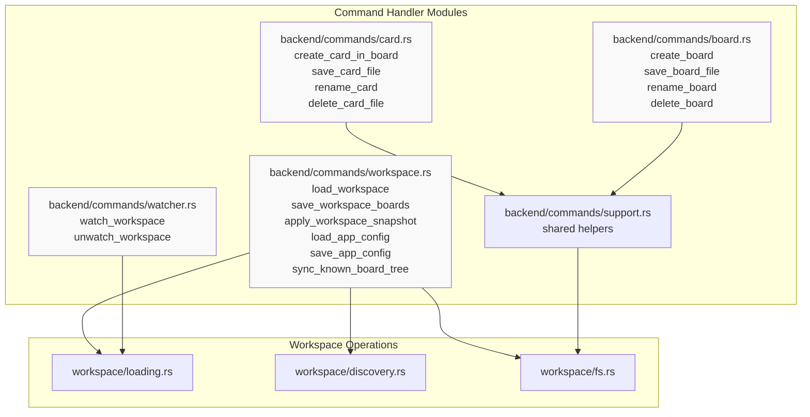
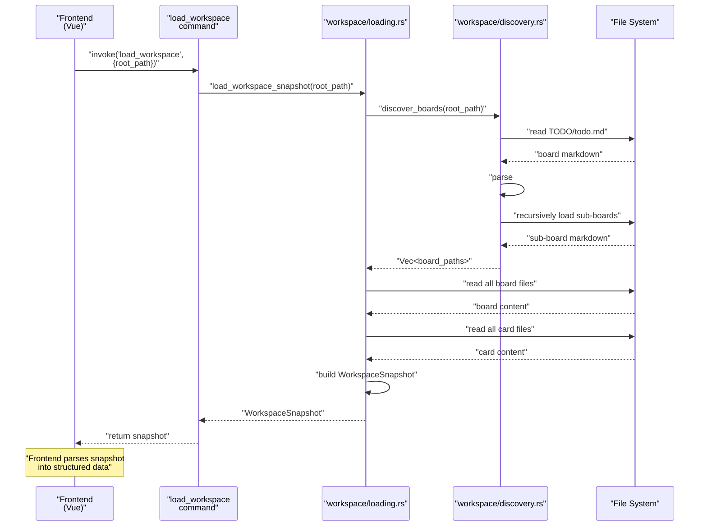
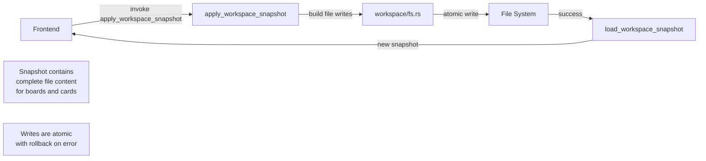
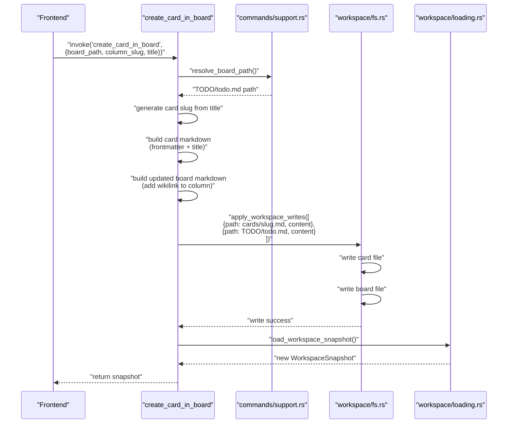
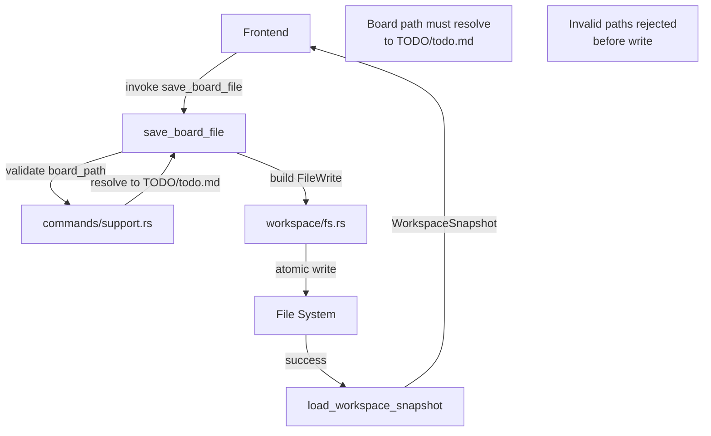
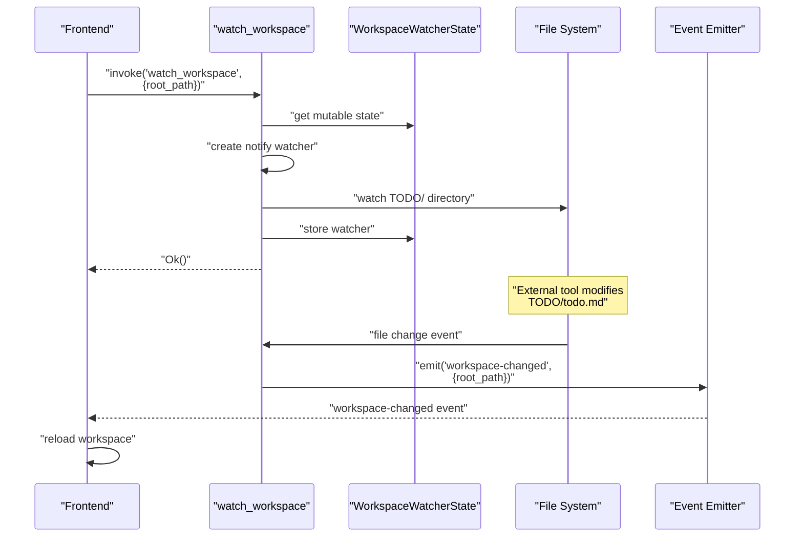
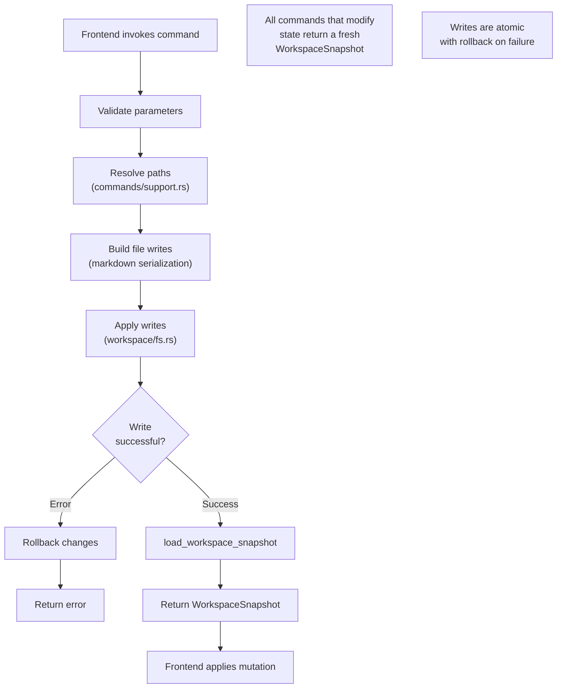
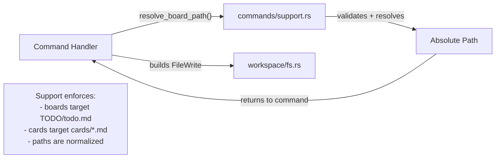
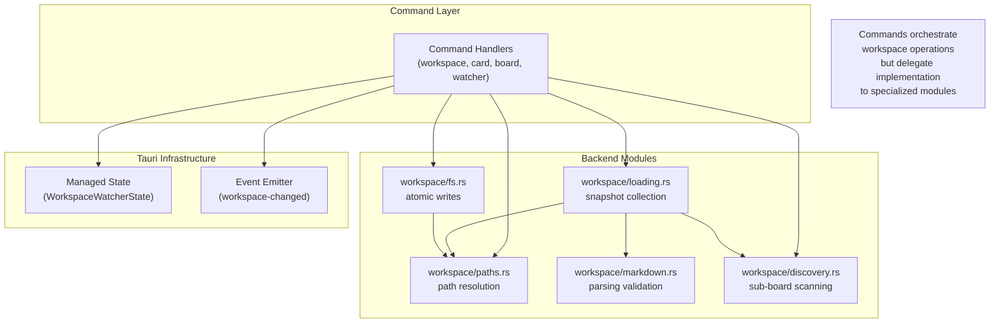

# Command Handlers

<details>
<summary>Relevant source files</summary>

The following files were used as context for generating this wiki page:

- [TODO/cards/cross-workspace-boards.md](../TODO/cards/cross-workspace-boards.md)
- [TODO/cards/tauri-backend-module-split.md](../TODO/cards/tauri-backend-module-split.md)
- [TODO/todo.md](../TODO/todo.md)
- [docs/plans/2026-03-11-example-workspace-refresh-design.md](../docs/plans/2026-03-11-example-workspace-refresh-design.md)
- [docs/plans/2026-03-12-cross-workspace-boards-design.md](../docs/plans/2026-03-12-cross-workspace-boards-design.md)
- [src-tauri/src/main.rs](../src-tauri/src/main.rs)

</details>


This document details the Tauri command handlers that form the bridge between the Vue.js frontend and the Rust backend. Command handlers are Rust functions marked with the `#[tauri::command]` attribute that can be invoked from the frontend via the Tauri IPC bridge. These handlers manage workspace loading, board and card operations, file system watching, and application configuration.

For information about the main entry point and menu system, see [6.1](6.1-main-entry-point-and-menu-system.md). For details on the underlying workspace operations that commands invoke, see [6.3](6.3-workspace-operations.md).

---

## Command Registration

All command handlers are registered in `main.rs` using Tauri's `generate_handler!` macro. The registration occurs during application setup and makes these functions callable from the frontend via `invoke()`.

**Registration in main.rs**

The Tauri application builder registers all command handlers in a single invocation:

[src-tauri/src/main.rs:32-49](../src-tauri/src/main.rs)

This registration makes the commands available to the frontend through the `@tauri-apps/api` package. The frontend can invoke commands using `invoke('command_name', { param: value })`.

**Command Module Structure**

Command handlers are imported from the `backend::commands` module:

[src-tauri/src/main.rs:10-15](../src-tauri/src/main.rs)

The backend is organized into specialized command modules that handle different domains of functionality. This modular structure keeps the main entry point lightweight while organizing commands by their area of responsibility.

**Sources:**
- [src-tauri/src/main.rs:10-15](../src-tauri/src/main.rs)
- [src-tauri/src/main.rs:32-49](../src-tauri/src/main.rs)

---

## Command Categories

The command handlers are organized into five functional categories, each managing a specific aspect of the application.

### Command Category Overview



**Sources:**
- [src-tauri/src/main.rs:10-15](../src-tauri/src/main.rs)

---

## Workspace Commands

Workspace commands manage the loading, saving, and synchronization of the entire workspace tree. These are the primary commands that establish the working context for the application.

### Workspace Command Functions

| Command | Purpose | Parameters | Returns |
|---------|---------|------------|---------|
| `load_workspace` | Loads all boards and cards from a board root | `root_path: String` | `WorkspaceSnapshot` |
| `save_workspace_boards` | Saves multiple board files atomically | `root_path: String`<br/>`writes: Vec<FileWrite>` | `WorkspaceSnapshot` |
| `apply_workspace_snapshot` | Applies a complete workspace state (for undo/redo) | `snapshot: WorkspaceSnapshot` | `WorkspaceSnapshot` |
| `load_app_config` | Loads application configuration | none | `AppConfig` |
| `save_app_config` | Saves application configuration | `config: AppConfig` | `AppConfig` |
| `sync_known_board_tree` | Discovers and persists sub-boards | `root_path: String` | `WorkspaceSnapshot` |

### Workspace Loading Flow



The `load_workspace` command is the entry point for establishing a workspace session. It takes a board root path (pointing to a `TODO/` directory), discovers all nested sub-boards, reads board and card markdown files, and returns a `WorkspaceSnapshot` containing raw file content.

### Snapshot Application Flow

The `apply_workspace_snapshot` command supports undo/redo by applying a previously captured workspace state:



**Sources:**
- [src-tauri/src/main.rs:33](../src-tauri/src/main.rs)
- [src-tauri/src/main.rs:36-37](../src-tauri/src/main.rs)
- [src-tauri/src/main.rs:44-46](../src-tauri/src/main.rs)

---

## Card Commands

Card commands handle the creation, modification, and deletion of individual card files within the workspace.

### Card Command Functions

| Command | Purpose | Parameters | Returns |
|---------|---------|------------|---------|
| `create_card_in_board` | Creates a new card file and adds it to a board | `root_path: String`<br/>`board_path: String`<br/>`column_slug: String`<br/>`title: String` | `WorkspaceSnapshot` |
| `save_card_file` | Saves card markdown content | `root_path: String`<br/>`card_path: String`<br/>`markdown: String` | `WorkspaceSnapshot` |
| `rename_card` | Renames a card file and updates references | `root_path: String`<br/>`old_card_path: String`<br/>`new_title: String` | `WorkspaceSnapshot` |
| `delete_card_file` | Deletes a card file | `root_path: String`<br/>`card_path: String` | `WorkspaceSnapshot` |

### Card Creation Flow



Card commands use the `commands/support.rs` module for shared logic like board path resolution and card slug generation. Each command returns a fresh `WorkspaceSnapshot` after successfully persisting changes, ensuring the frontend has an up-to-date view of the workspace.

**Sources:**
- [src-tauri/src/main.rs:34](../src-tauri/src/main.rs)
- [src-tauri/src/main.rs:38-40](../src-tauri/src/main.rs)
- [src-tauri/src/main.rs:42](../src-tauri/src/main.rs)

---

## Board Commands

Board commands manage board file creation, modification, and deletion, including handling the board's `TODO/todo.md` file and its associated directory structure.

### Board Command Functions

| Command | Purpose | Parameters | Returns |
|---------|---------|------------|---------|
| `create_board` | Creates a new board with TODO/ structure | `parent_path: String`<br/>`board_name: String`<br/>`title: String` | `WorkspaceSnapshot` |
| `save_board_file` | Saves board markdown content | `root_path: String`<br/>`board_path: String`<br/>`markdown: String` | `WorkspaceSnapshot` |
| `rename_board` | Renames a board (title only, path-based identity) | `root_path: String`<br/>`board_path: String`<br/>`new_title: String` | `WorkspaceSnapshot` |
| `delete_board` | Deletes a board and its directory | `root_path: String`<br/>`board_path: String` | `WorkspaceSnapshot` |

### Board Creation Structure

When `create_board` is invoked, it creates a complete board directory structure:

```
parent_path/
└── board_name/
    └── TODO/
        ├── todo.md          (board file with title)
        ├── cards/           (directory for card files)
        └── README.md        (board notes)
```

The command creates all necessary directories and files atomically, ensuring a valid board structure exists before returning the updated workspace snapshot.

### Board Save Flow



Board commands enforce path validation through the `commands/support.rs` module. Board writes must target a `TODO/todo.md` file to prevent accidental writes to card files or other locations.

**Sources:**
- [src-tauri/src/main.rs:35](../src-tauri/src/main.rs)
- [src-tauri/src/main.rs:39](../src-tauri/src/main.rs)
- [src-tauri/src/main.rs:41](../src-tauri/src/main.rs)
- [src-tauri/src/main.rs:43](../src-tauri/src/main.rs)

---

## File System Watcher Commands

Watcher commands manage the file system monitoring that enables real-time synchronization when external tools modify the workspace.

### Watcher Command Functions

| Command | Purpose | Parameters | Returns |
|---------|---------|------------|---------|
| `watch_workspace` | Starts watching a workspace for file changes | `root_path: String` | `Result<(), String>` |
| `unwatch_workspace` | Stops watching the current workspace | none | `Result<(), String>` |

### Watcher State Management

The file system watcher uses managed state to maintain a single active watcher instance:

[src-tauri/src/main.rs:21](../src-tauri/src/main.rs)

The `WorkspaceWatcherState` is a Tauri-managed state that stores the active file watcher. This ensures only one watcher runs at a time and allows clean shutdown when switching workspaces or closing the folder.

### Watcher Event Flow



When file changes are detected, the watcher emits a `workspace-changed` event to the frontend. The frontend listens for this event in the `useWorkspace` composable and triggers a workspace reload to synchronize with external changes.

**Sources:**
- [src-tauri/src/main.rs:14](../src-tauri/src/main.rs)
- [src-tauri/src/main.rs:21](../src-tauri/src/main.rs)
- [src-tauri/src/main.rs:47-48](../src-tauri/src/main.rs)

---

## Command Lifecycle

Every command follows a consistent lifecycle pattern that ensures data consistency and error handling.

### Standard Command Pattern



### Command Parameter Patterns

Commands follow consistent parameter patterns based on their scope:

**Workspace-scoped commands:**
- Take `root_path: String` to identify the workspace root (path to a `TODO/` directory)
- Example: `load_workspace(root_path: String)`

**Board-scoped commands:**
- Take `root_path: String` and `board_path: String`
- Example: `save_board_file(root_path: String, board_path: String, markdown: String)`

**Card-scoped commands:**
- Take `root_path: String` and `card_path: String`
- Example: `save_card_file(root_path: String, card_path: String, markdown: String)`

### Return Value Convention

All commands that modify workspace state return a fresh `WorkspaceSnapshot`. This ensures the frontend always has a consistent view of the file system after operations complete. Commands that only read state (like `load_app_config`) return their specific data types.

**Sources:**
- [src-tauri/src/main.rs:32-49](../src-tauri/src/main.rs)

---

## Shared Command Support

The `commands/support.rs` module provides shared helpers used across all command categories to avoid code duplication and ensure consistent behavior.

### Support Module Responsibilities

The support module handles:

1. **Path Resolution**: Converting relative board/card paths to absolute file system paths
2. **Board Path Validation**: Ensuring board paths resolve to `TODO/todo.md` files
3. **Card Path Validation**: Ensuring card paths resolve to `cards/*.md` files
4. **Slug Extraction**: Parsing card slugs from file paths
5. **Write Building**: Creating `FileWrite` structures for common operations

### Typical Command Support Flow



By centralizing path resolution and validation in the support module, individual command handlers remain focused on their specific operations while maintaining consistent path handling across the entire command layer.

**Sources:**
- [src-tauri/src/main.rs:10-15](../src-tauri/src/main.rs)

---

## Error Handling

Command handlers use Rust's `Result<T, String>` type for error handling, with string error messages propagated to the frontend.

### Error Propagation Pattern

Commands that modify state typically return `Result<WorkspaceSnapshot, String>`:

```rust
// Conceptual example (not actual code)
#[tauri::command]
fn save_card_file(
    root_path: String,
    card_path: String,
    markdown: String
) -> Result<WorkspaceSnapshot, String> {
    // Validation can fail
    let resolved_path = resolve_card_path(&root_path, &card_path)?;
    
    // Write can fail
    apply_workspace_writes(root_path, vec![write])?;
    
    // Reload can fail
    let snapshot = load_workspace_snapshot(root_path)?;
    
    Ok(snapshot)
}
```

### Frontend Error Handling

When commands fail, the frontend receives a rejected promise with the error message:

```typescript
// Conceptual example (not actual code)
try {
    const snapshot = await invoke('save_card_file', {
        rootPath,
        cardPath,
        markdown
    });
    // Apply snapshot to state
} catch (error) {
    // Display error message to user
    console.error('Failed to save card:', error);
}
```

This pattern keeps error handling simple while providing enough context for debugging. The backend ensures atomicity by rolling back partial writes when errors occur during multi-file operations.

**Sources:**
- [src-tauri/src/main.rs:32-49](../src-tauri/src/main.rs)

---

## Command Integration Points

Commands integrate with several other backend systems to provide complete functionality.

### Integration Architecture



Commands serve as orchestration points that:
- Validate and resolve parameters
- Delegate to workspace modules for actual work
- Manage Tauri-specific concerns (state, events)
- Return consistent snapshot results
- Handle error propagation

This separation allows workspace modules to remain pure Rust functions with no Tauri dependencies, making them testable and reusable.

**Sources:**
- [src-tauri/src/main.rs:1-52](../src-tauri/src/main.rs)
