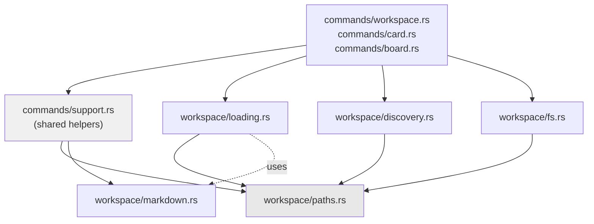
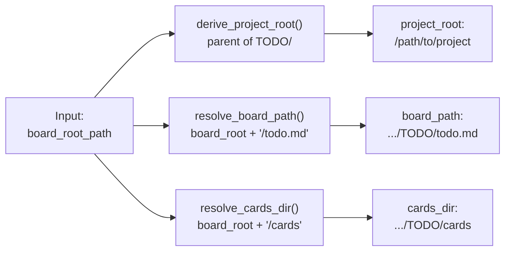
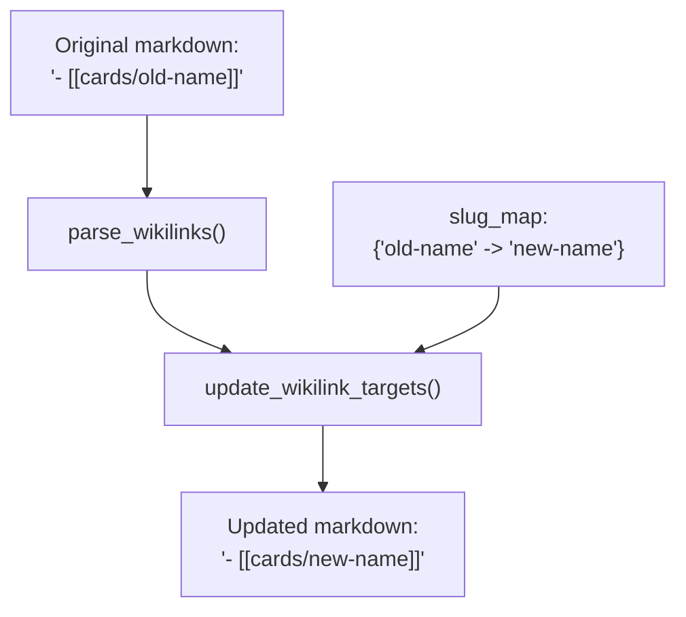
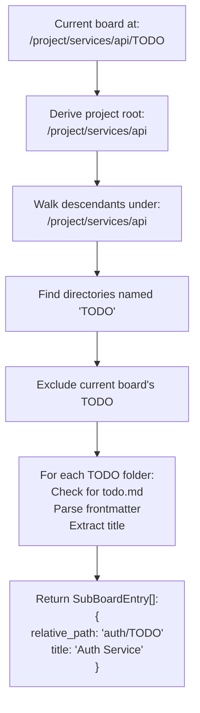
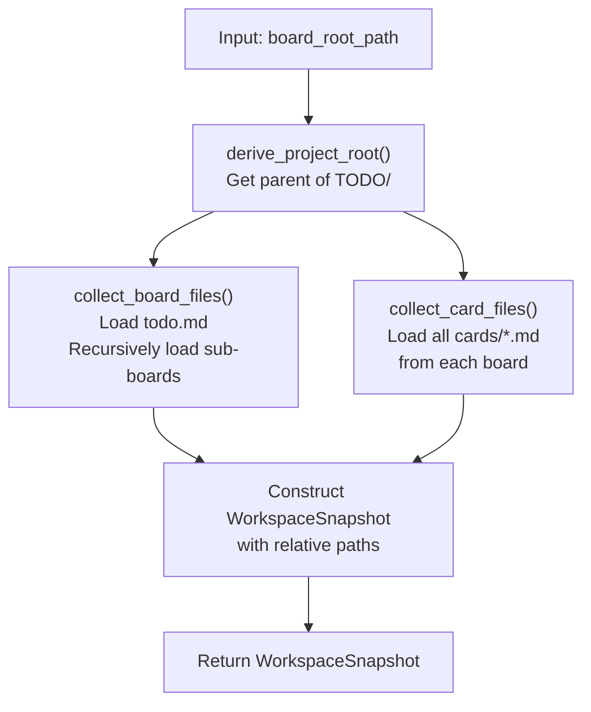
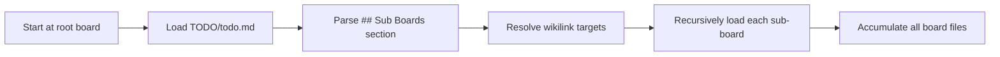
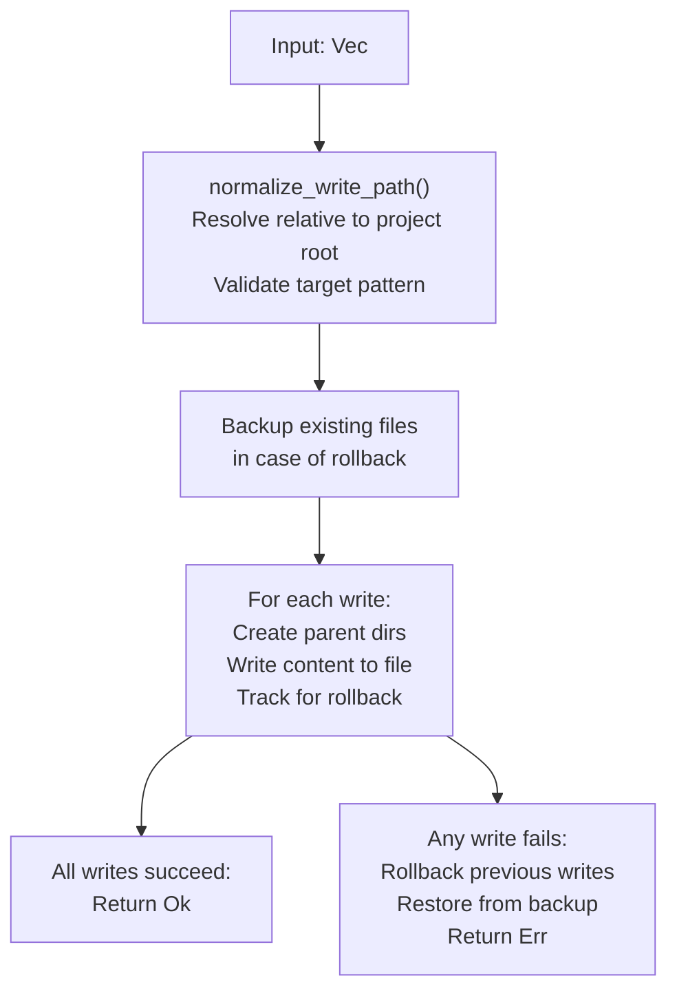
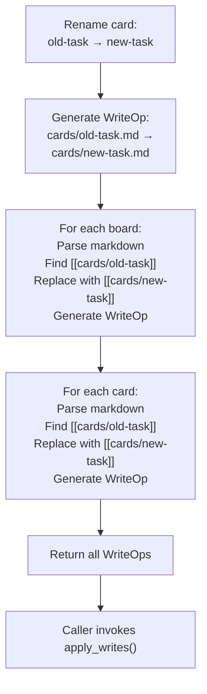
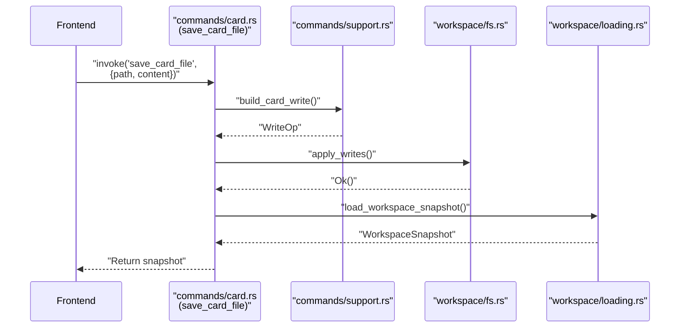

# Workspace Operations

<details>
<summary>Relevant source files</summary>

The following files were used as context for generating this wiki page:

- [TODO/cards/cross-workspace-boards.md](../TODO/cards/cross-workspace-boards.md)
- [TODO/cards/tauri-backend-module-split.md](../TODO/cards/tauri-backend-module-split.md)
- [TODO/todo.md](../TODO/todo.md)
- [docs/plans/2026-03-11-example-workspace-refresh-design.md](../docs/plans/2026-03-11-example-workspace-refresh-design.md)
- [docs/plans/2026-03-12-cross-workspace-boards-design.md](../docs/plans/2026-03-12-cross-workspace-boards-design.md)
- [src-tauri/Cargo.toml](../src-tauri/Cargo.toml)

</details>


This page documents the backend workspace operations layer located in `src-tauri/src/backend/workspace/`. These modules provide the core functionality for path resolution, markdown parsing, sub-board discovery, workspace snapshot loading, and file system operations. Command handlers (see [Command Handlers](6.2-command-handlers.md)) invoke these utilities to implement the workspace commands exposed to the frontend.

For information about the high-level data model and type definitions, see [Data Model](3.2-data-model.md) and [Workspace Types](7.2-workspace-types.md). For file system watching functionality, see [File System Watching](6.4-file-system-watching.md).

---

## Module Organization

The workspace operations are organized into five focused modules, each handling a specific concern:

| Module | File | Purpose |
|--------|------|---------|
| **Paths** | `src-tauri/src/backend/workspace/paths.rs` | Path resolution, normalization, and validation |
| **Markdown** | `src-tauri/src/backend/workspace/markdown.rs` | Markdown link parsing and manipulation |
| **Discovery** | `src-tauri/src/backend/workspace/discovery.rs` | Sub-board filesystem scanning |
| **Loading** | `src-tauri/src/backend/workspace/loading.rs` | Workspace snapshot collection and construction |
| **File System** | `src-tauri/src/backend/workspace/fs.rs` | Write operations, rename operations, rollback handling |

These modules are pure Rust utilities with no direct Tauri dependencies, making them independently testable. The `commands/support.rs` module provides shared helpers that bridge command handlers to these workspace utilities.

**Module Dependency Flow:**



Sources: src-tauri/src/backend/commands/support.rs, src-tauri/src/backend/workspace/paths.rs, src-tauri/src/backend/workspace/markdown.rs, src-tauri/src/backend/workspace/discovery.rs, src-tauri/src/backend/workspace/loading.rs, src-tauri/src/backend/workspace/fs.rs, [TODO/cards/tauri-backend-module-split.md:14-46](../TODO/cards/tauri-backend-module-split.md)

---

## Path Resolution

The `paths.rs` module provides utilities for resolving, normalizing, and validating file system paths in the context of the per-board `TODO/` workspace model.

### Path Types and Conventions

KanStack uses a board-root model where each board has its own `TODO/` directory containing:
- `TODO/todo.md` — the canonical board file
- `TODO/cards/*.md` — card files
- `TODO/README.md` — optional board notes

Paths are resolved relative to the board root (the `TODO/` directory), and path validation enforces these conventions:

| Path Type | Required Pattern | Purpose |
|-----------|------------------|---------|
| Board file | `TODO/todo.md` | Board markdown content |
| Card file | `TODO/cards/*.md` | Individual card content |
| Board notes | `TODO/README.md` | Board-level documentation |

### Key Functions

**Path Resolution:**



**Path Normalization:**

The module handles platform-specific path separators and ensures consistent relative path representation for markdown links. Relative paths are normalized to use forward slashes and are calculated relative to the project root (the directory containing the board's `TODO/` folder).

**Path Validation:**

Write operations validate that target paths match expected patterns:
- Board writes must target `TODO/todo.md`
- Card writes must target `TODO/cards/*.md`
- Board note writes must target `TODO/README.md`

This enforcement prevents accidental writes to incorrect locations.

Sources: src-tauri/src/backend/workspace/paths.rs, [TODO/cards/tauri-backend-module-split.md:43](../TODO/cards/tauri-backend-module-split.md), [docs/plans/2026-03-12-cross-workspace-boards-design.md:6-21](../docs/plans/2026-03-12-cross-workspace-boards-design.md)

---

## Markdown Parsing

The `markdown.rs` module provides utilities for parsing and manipulating markdown wikilinks. These utilities support the link resolution and update operations needed for workspace loading and card/board rename operations.

### Wikilink Format

KanStack uses standard markdown wikilink syntax:
- `[[target]]` — link with implicit display text (uses target as display)
- `[[target|Display Text]]` — link with explicit display text

Targets are interpreted as relative paths from the current board's project root.

### Parsing Functions

**`parse_wikilinks(content: &str) -> Vec<WikiLink>`**

Extracts all wikilinks from markdown content. Returns a vector of `WikiLink` structs containing:
- `full_match` — the complete `[[...]]` syntax
- `target` — the link target path
- `display` — optional display text
- `start` and `end` — byte positions in the source

**`extract_slug_from_card_wikilink(wikilink: &str) -> Option<String>`**

Parses a card wikilink (e.g., `[[cards/my-task]]`) and extracts the slug portion (`my-task`). Returns `None` if the link doesn't follow the `cards/` pattern.

### Link Manipulation

**`update_wikilink_targets(content: &str, slug_map: HashMap<String, String>) -> String`**

Updates all wikilinks in markdown content according to a mapping of old slugs to new slugs. Used during card rename operations to update references throughout the workspace.

**Flow for Link Updates:**



The parser handles edge cases including:
- Links with pipes separating target and display text
- Links with spaces and special characters
- Nested brackets (treats as literal text, not wikilinks)
- Invalid wikilink syntax (ignored during parsing)

Sources: src-tauri/src/backend/workspace/markdown.rs, [TODO/cards/cross-workspace-boards.md:48](../TODO/cards/cross-workspace-boards.md)

---

## Sub-Board Discovery

The `discovery.rs` module implements the manual sub-board discovery system. Sub-boards are discovered by scanning the filesystem tree under the parent directory of the current board's `TODO/` folder.

### Discovery Model

KanStack uses a **manual, user-triggered** discovery model rather than continuous automatic scanning. This design choice:
- Avoids performance overhead from continuous filesystem scanning
- Gives users control over when sub-board relationships are updated
- Persists discovered relationships in markdown as the source of truth
- Allows the loader to reconstruct the board tree from markdown without re-scanning

The discovery is triggered via the "Find Sub Boards" menu action.

### Discovery Algorithm

**`discover_sub_boards(board_root_path: &Path) -> Result<Vec<SubBoardEntry>>`**

The discovery algorithm:

1. **Determine scan root**: Start from the parent directory of the current board's `TODO/` folder (the "project root")
2. **Walk descendants**: Recursively scan all descendant directories
3. **Identify TODO folders**: Collect directories named exactly `TODO`
4. **Filter current board**: Exclude the current board's own `TODO/` folder
5. **Calculate relative paths**: Compute normalized relative paths from the project root to each discovered `TODO/` folder
6. **Validate board files**: Check that each discovered `TODO/` contains a `todo.md` file
7. **Extract titles**: Parse frontmatter from each `todo.md` to extract the board title
8. **Sort results**: Order by relative path for consistent presentation

**Discovery Flow:**



### SubBoardEntry Structure

Each discovered sub-board is represented as:

```rust
pub struct SubBoardEntry {
    pub relative_path: String,  // e.g., "auth/TODO"
    pub title: Option<String>,  // e.g., "Auth Service"
}
```

The `relative_path` is used as the wikilink target in the `## Sub Boards` section of the parent board's markdown. The `title` is used as the display text.

Sources: src-tauri/src/backend/workspace/discovery.rs, [docs/plans/2026-03-12-cross-workspace-boards-design.md:15-32](../docs/plans/2026-03-12-cross-workspace-boards-design.md), [TODO/cards/cross-workspace-boards.md:41-46](../TODO/cards/cross-workspace-boards.md)

---

## Snapshot Loading

The `loading.rs` module implements workspace snapshot collection. A snapshot captures the current state of all board and card files in the workspace tree, which is then sent to the frontend for parsing and rendering.

### Loading Model

KanStack loads workspaces in a **multi-stage pipeline**:

1. **Backend collection** (Rust): Read file contents from disk → `WorkspaceSnapshot`
2. **Frontend parsing** (TypeScript): Parse markdown → `KanbanParseResult`
3. **Frontend indexing** (TypeScript): Build lookup maps → `LoadedWorkspace`

The `loading.rs` module handles stage 1: collecting raw file data without interpretation.

### Snapshot Structure

A `WorkspaceSnapshot` contains:

```rust
pub struct WorkspaceSnapshot {
    pub root_path: String,
    pub boards: Vec<FileSnapshot>,
    pub cards: Vec<FileSnapshot>,
}

pub struct FileSnapshot {
    pub path: String,
    pub content: String,
}
```

Each `FileSnapshot` captures the relative path and raw text content of one markdown file.

### Loading Functions

**`load_workspace_snapshot(board_root_path: &Path) -> Result<WorkspaceSnapshot>`**

Main entry point for workspace loading. Orchestrates the collection pipeline:



**Board Collection:**



The loader resolves `## Sub Boards` wikilinks relative to each board's project root and recursively loads nested boards. Missing sub-board paths are handled gracefully—they remain as unresolved references without crashing the load process.

**Card Collection:**

For each board in the workspace tree:
1. Resolve the `cards/` directory path
2. Read all `*.md` files in that directory
3. Store each card with its relative path (e.g., `cards/my-task.md`)
4. Associate cards with their owning board through path-based identification

### Path Normalization

All paths in the snapshot are normalized to:
- Use forward slashes (`/`) regardless of platform
- Be relative to the project root
- Exclude the project root itself from the path

This ensures consistent path representation across platforms and simplifies frontend parsing.

Sources: src-tauri/src/backend/workspace/loading.rs, [TODO/cards/tauri-backend-module-split.md:44](../TODO/cards/tauri-backend-module-split.md), [docs/plans/2026-03-12-cross-workspace-boards-design.md:40-45](../docs/plans/2026-03-12-cross-workspace-boards-design.md)

---

## File System Operations

The `fs.rs` module provides utilities for writing files to disk, handling rename operations with link updates, and managing rollback on errors.

### Write Operations Model

KanStack uses an **atomic multi-file write** model with rollback support:

1. Prepare all writes in memory
2. Apply writes sequentially to disk
3. If any write fails, roll back all previous writes
4. Return the updated workspace snapshot

This ensures the workspace remains in a consistent state even if an error occurs mid-operation.

### Core Write Functions

**`apply_writes(project_root: &Path, writes: Vec<WriteOp>) -> Result<()>`**

Applies a sequence of write operations atomically with rollback support.

**Write Operation Pipeline:**



**`WriteOp` Structure:**

```rust
pub struct WriteOp {
    pub path: String,      // Relative path from project root
    pub content: String,   // New file content
}
```

### Rename Operations

**`rename_card_file(project_root: &Path, old_slug: &str, new_slug: &str, board_paths: Vec<String>) -> Result<Vec<WriteOp>>`**

Handles card file rename with automatic link updates across all boards:

1. **Rename the card file**: Generate write operation for `cards/{new_slug}.md`
2. **Update all board files**: For each board, parse its markdown, find wikilinks referencing the old slug, update them to the new slug, generate write operations
3. **Update all card files**: Similarly update cross-references in card content
4. **Return write operations**: Caller applies the writes atomically

**Rename Flow:**



The rename operation ensures referential integrity—all wikilinks to a renamed card are automatically updated throughout the workspace.

### Delete Operations

**`delete_card_file(project_root: &Path, card_path: &str) -> Result<()>`**

Moves a card file to the system trash using the `trash` crate. This provides a recoverable delete that users can undo through their operating system's trash/recycle bin.

The delete operation:
1. Resolves the full path to the card file
2. Validates the path is within the project and matches `cards/*.md` pattern
3. Moves the file to trash using `trash::delete()`
4. Returns an error if the trash operation fails

Unlike rename operations, delete does not automatically remove wikilinks to the deleted card. These remain in the markdown as "broken" references, which the frontend can detect and handle (e.g., display as unresolved).

### Path Validation

All write operations enforce path patterns:

| Operation Type | Required Pattern | Validation |
|----------------|------------------|------------|
| Board write | `TODO/todo.md` | Must end with `/TODO/todo.md` |
| Card write | `TODO/cards/*.md` | Must match `*/TODO/cards/*.md` |
| Board note write | `TODO/README.md` | Must end with `/TODO/README.md` |

Invalid paths are rejected before any file system operations occur.

Sources: src-tauri/src/backend/workspace/fs.rs, [TODO/cards/tauri-backend-module-split.md:43-45](../TODO/cards/tauri-backend-module-split.md), [src-tauri/Cargo.toml:18](../src-tauri/Cargo.toml)

---

## Integration with Command Handlers

The workspace operations modules are invoked by command handlers in `src-tauri/src/backend/commands/`. The `commands/support.rs` module provides shared helpers that command handlers use to bridge to workspace utilities:

**Shared Command Helpers:**

| Helper Function | Purpose |
|-----------------|---------|
| `resolve_board_path_from_workspace()` | Resolve `TODO/todo.md` path from workspace root |
| `build_card_write()` | Construct `WriteOp` for card file write |
| `build_board_write()` | Construct `WriteOp` for board file write |
| `extract_card_slug()` | Parse slug from card wikilink |

**Command Handler Integration Example:**



This layered architecture keeps command handlers focused on request/response handling while delegating the actual workspace logic to specialized modules.

Sources: src-tauri/src/backend/commands/support.rs, src-tauri/src/backend/commands/card.rs, src-tauri/src/backend/commands/board.rs, src-tauri/src/backend/commands/workspace.rs, [TODO/cards/tauri-backend-module-split.md:29-45](../TODO/cards/tauri-backend-module-split.md)
