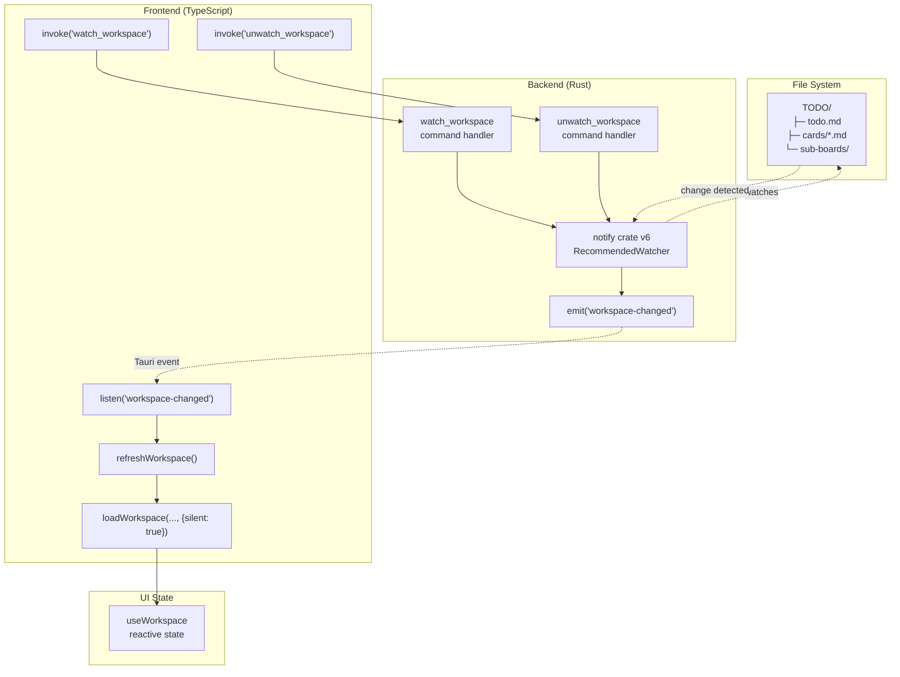
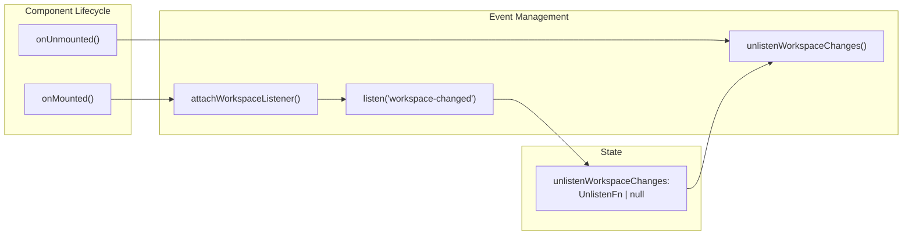
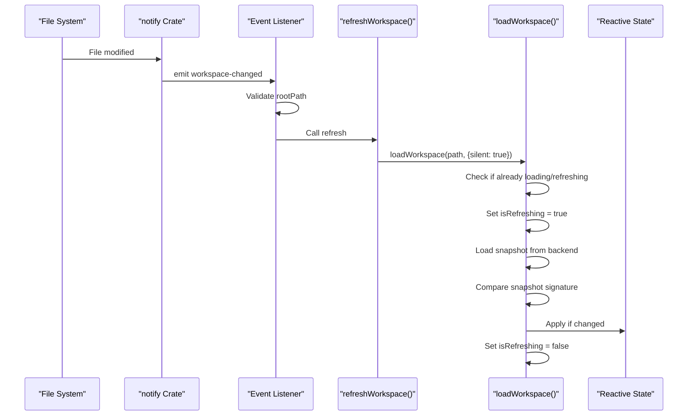
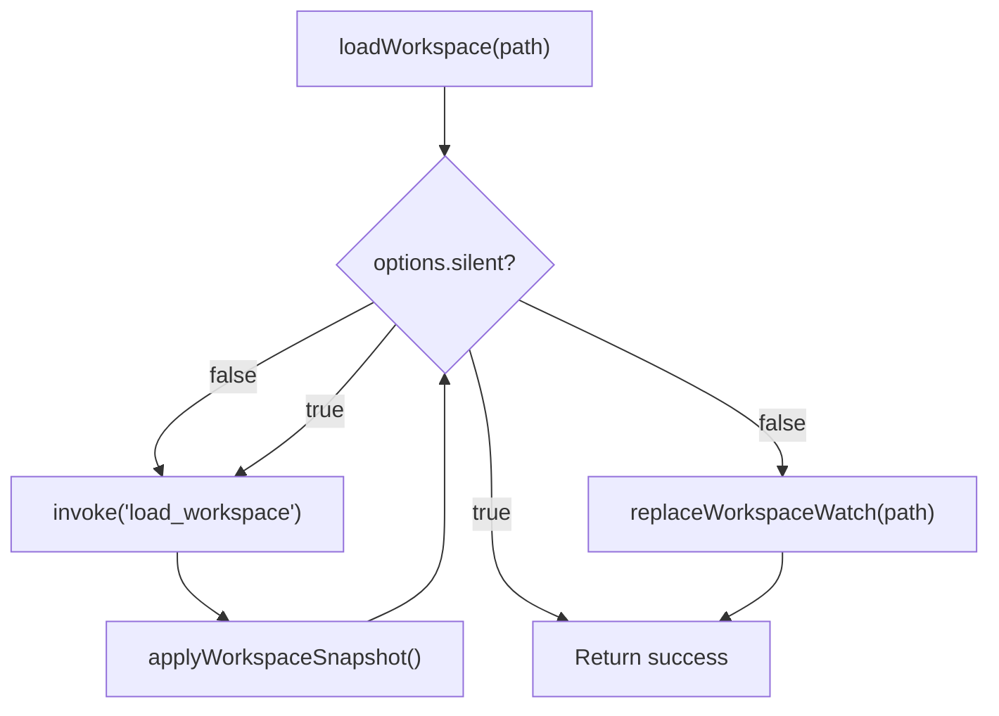

# File System Watching

<details>
<summary>Relevant source files</summary>

The following files were used as context for generating this wiki page:

- [src-tauri/Cargo.toml](../src-tauri/Cargo.toml)
- [src/composables/useWorkspace.ts](../src/composables/useWorkspace.ts)

</details>


The file system watching subsystem monitors workspace directories for external changes and automatically refreshes the application state. This enables KanStack to detect and respond to modifications made by external editors or tools, maintaining synchronization between the filesystem and the UI.

For information about the workspace loading mechanism that the watcher triggers, see [Workspace Operations](6.3-workspace-operations.md). For details on the command handlers, see [Command Handlers](6.2-command-handlers.md).

---

## Purpose and Scope

The file watching system serves two primary functions:

1. **External Change Detection**: Monitors the workspace directory tree for file modifications, additions, and deletions made outside the application
2. **Automatic Synchronization**: Triggers workspace reloads when changes are detected, ensuring the UI reflects the current filesystem state

The system uses the `notify` crate (version 6) on the backend to watch filesystem events and emits Tauri events that the frontend listens for. When changes occur, the frontend performs a silent workspace refresh that preserves user selection state.

**Sources:** [src-tauri/Cargo.toml:1-27](../src-tauri/Cargo.toml)

---

## Architecture Overview

The file watching system spans both the Rust backend and Vue frontend, coordinating through Tauri's event system.

### System Flow Diagram



**Sources:** [src-tauri/Cargo.toml:12](../src-tauri/Cargo.toml), [src/composables/useWorkspace.ts:13-13](../src/composables/useWorkspace.ts), [src/composables/useWorkspace.ts:484-509](../src/composables/useWorkspace.ts)

---

## Backend Watch System

### notify Crate Integration

The backend uses the `notify` crate to monitor filesystem events. This crate provides cross-platform filesystem notification support using native APIs (FSEvents on macOS, inotify on Linux, ReadDirectoryChangesW on Windows).

| Component | Description |
|-----------|-------------|
| **Dependency** | `notify = "6"` in Cargo.toml |
| **Watch Type** | Recursive directory watching |
| **Events Monitored** | File modifications, creations, deletions, renames |
| **Debouncing** | Implementation-specific (configured in watcher command) |

**Sources:** [src-tauri/Cargo.toml:12](../src-tauri/Cargo.toml)

### Command Handlers

The backend exposes two command handlers for watch management:

#### `watch_workspace` Command

Initiates filesystem watching for a workspace path.

**Command Signature:**
```
invoke('watch_workspace', { path: string })
```

**Behavior:**
- Creates or replaces the active filesystem watcher
- Configures recursive watching of the workspace directory
- Sets up event handlers that emit `workspace-changed` events
- Returns immediately after watch setup

**Sources:** [src/composables/useWorkspace.ts:484-486](../src/composables/useWorkspace.ts)

#### `unwatch_workspace` Command

Stops the active filesystem watcher.

**Command Signature:**
```
invoke('unwatch_workspace')
```

**Behavior:**
- Stops the current watcher if one exists
- Cleans up event handlers
- Does nothing if no watcher is active

**Sources:** [src/composables/useWorkspace.ts:488-495](../src/composables/useWorkspace.ts)

### Event Emission

When filesystem changes are detected, the backend emits a Tauri event:

**Event Name:** `workspace-changed`

**Event Payload:**
```typescript
{
  rootPath: string  // The workspace root path where changes occurred
}
```

The payload includes the `rootPath` to allow the frontend to verify that the changes are relevant to the currently open workspace.

**Sources:** [src/composables/useWorkspace.ts:13](../src/composables/useWorkspace.ts), [src/composables/useWorkspace.ts:502-508](../src/composables/useWorkspace.ts)

---

## Frontend Event Handling

### Event Listener Lifecycle

The `useWorkspace` composable manages the event listener lifecycle using Vue's composition API hooks.



**Sources:** [src/composables/useWorkspace.ts:511-527](../src/composables/useWorkspace.ts)

### Event Listener Implementation

The `attachWorkspaceListener` function sets up the event handler:

[src/composables/useWorkspace.ts:497-509](../src/composables/useWorkspace.ts)

| Step | Action |
|------|--------|
| 1 | Check if listener already exists (prevent duplicates) |
| 2 | Register listener for `workspace-changed` event |
| 3 | Store unlisten function for cleanup |
| 4 | When event fires, validate rootPath matches current workspace |
| 5 | If valid, trigger `refreshWorkspace()` |

**Key Variables:**
- `unlistenWorkspaceChanges`: Stores the cleanup function returned by `listen()`
- `WORKSPACE_CHANGED_EVENT`: Constant string `'workspace-changed'`
- `workspacePath.value`: Current workspace path to compare against event payload

**Sources:** [src/composables/useWorkspace.ts:13](../src/composables/useWorkspace.ts), [src/composables/useWorkspace.ts:54](../src/composables/useWorkspace.ts), [src/composables/useWorkspace.ts:497-509](../src/composables/useWorkspace.ts)

### Workspace Refresh Mechanism

When a `workspace-changed` event is received, the system triggers a silent refresh:



**Sources:** [src/composables/useWorkspace.ts:388-398](../src/composables/useWorkspace.ts), [src/composables/useWorkspace.ts:502-508](../src/composables/useWorkspace.ts)

### Silent Refresh Behavior

The `refreshWorkspace` function calls `loadWorkspace` with specific options:

[src/composables/useWorkspace.ts:388-398](../src/composables/useWorkspace.ts)

**Options Passed:**
| Option | Value | Purpose |
|--------|-------|---------|
| `preserveSelection` | `true` | Maintains current board and card selection |
| `silent` | `true` | Uses `isRefreshing` instead of `isLoading` state |
| `surfaceErrors` | `false` | Suppresses error messages to avoid disrupting user |

**Silent Mode Characteristics:**
- Returns early if already loading or refreshing [src/composables/useWorkspace.ts:283-286](../src/composables/useWorkspace.ts)
- Uses `isRefreshing` flag instead of `isLoading` [src/composables/useWorkspace.ts:288](../src/composables/useWorkspace.ts)
- Compares workspace snapshot signatures to avoid redundant updates [src/composables/useWorkspace.ts:298-300](../src/composables/useWorkspace.ts)
- Does not modify watch state (skips `replaceWorkspaceWatch`) [src/composables/useWorkspace.ts:303-305](../src/composables/useWorkspace.ts)
- Does not sync known board tree [src/composables/useWorkspace.ts:306-311](../src/composables/useWorkspace.ts)

**Sources:** [src/composables/useWorkspace.ts:276-355](../src/composables/useWorkspace.ts), [src/composables/useWorkspace.ts:388-398](../src/composables/useWorkspace.ts)

---

## Watch Lifecycle Management

### Starting a Watch

Watches are started when a workspace is successfully loaded:

[src/composables/useWorkspace.ts:303-305](../src/composables/useWorkspace.ts)

The `replaceWorkspaceWatch` function handles watch initialization:

[src/composables/useWorkspace.ts:475-486](../src/composables/useWorkspace.ts)

**Logic:**
1. Check if already watching the same path (avoid duplicate watches)
2. If watching a different path, stop the old watch first
3. Invoke backend `watch_workspace` command with new path
4. Store watched path in `watchedWorkspacePath` state variable

**Sources:** [src/composables/useWorkspace.ts:53](../src/composables/useWorkspace.ts), [src/composables/useWorkspace.ts:475-486](../src/composables/useWorkspace.ts)

### Stopping a Watch

Watches are stopped when:
1. Workspace is closed [src/composables/useWorkspace.ts:218](../src/composables/useWorkspace.ts)
2. Workspace fails to load [src/composables/useWorkspace.ts:341](../src/composables/useWorkspace.ts)
3. Component is unmounted [src/composables/useWorkspace.ts:526](../src/composables/useWorkspace.ts)
4. Watch is being replaced with a new path [src/composables/useWorkspace.ts:481](../src/composables/useWorkspace.ts)

The `stopWorkspaceWatch` function:

[src/composables/useWorkspace.ts:488-495](../src/composables/useWorkspace.ts)

**Behavior:**
- Returns early if no watch is active
- Invokes backend `unwatch_workspace` command
- Clears `watchedWorkspacePath` state

**Sources:** [src/composables/useWorkspace.ts:488-495](../src/composables/useWorkspace.ts)

### Watch State Variables

| Variable | Type | Purpose | Scope |
|----------|------|---------|-------|
| `watchedWorkspacePath` | `string \| null` | Path currently being watched | Function closure |
| `unlistenWorkspaceChanges` | `UnlistenFn \| null` | Event listener cleanup function | Function closure |

Both variables are declared outside the returned object to maintain state across renders while not being exposed to consumers.

**Sources:** [src/composables/useWorkspace.ts:53-54](../src/composables/useWorkspace.ts)

---

## Integration with Workspace Loading

### Watch Setup During Load

The watch is established after successful workspace load:



**Sources:** [src/composables/useWorkspace.ts:276-355](../src/composables/useWorkspace.ts)

### Watch Behavior by Load Type

| Load Type | Sets Up Watch | Reason |
|-----------|---------------|--------|
| Initial load | ✓ Yes | Establish monitoring for new workspace |
| Manual refresh | ✗ No | Watch already active; avoid redundant setup |
| Silent refresh | ✗ No | Triggered by watch; avoid circular setup |
| After error | ✗ No | Watch stopped during error cleanup |

**Sources:** [src/composables/useWorkspace.ts:276-355](../src/composables/useWorkspace.ts)

### Workspace Closure Cleanup

When closing a workspace, the watch is properly cleaned up:

[src/composables/useWorkspace.ts:217-222](../src/composables/useWorkspace.ts)

**Cleanup Order:**
1. Stop filesystem watch (`stopWorkspaceWatch()`)
2. Clear workspace state
3. Clear error messages
4. Persist empty workspace path to config

**Sources:** [src/composables/useWorkspace.ts:217-222](../src/composables/useWorkspace.ts)

---

## Snapshot Signature Comparison

The system uses snapshot signatures to avoid unnecessary UI updates when files haven't actually changed:

### Signature Creation

[src/composables/useWorkspace.ts:296](../src/composables/useWorkspace.ts)

The `createWorkspaceSnapshotSignature` utility (implemented in workspace snapshot utilities) generates a hash or signature from the snapshot content.

### Signature Comparison

During silent refresh:

[src/composables/useWorkspace.ts:298-300](../src/composables/useWorkspace.ts)

If the new signature matches the stored `lastSnapshotSignature`, the refresh returns early without updating state.

**Purpose:**
- Prevents unnecessary re-renders
- Avoids disrupting user interactions (e.g., card selection, scroll position)
- Reduces computational overhead for no-op changes

**Sources:** [src/composables/useWorkspace.ts:48](../src/composables/useWorkspace.ts), [src/composables/useWorkspace.ts:296-300](../src/composables/useWorkspace.ts)

---

## Error Handling

### Silent Failure Mode

When `surfaceErrors: false` is set during silent refresh:

[src/composables/useWorkspace.ts:345-347](../src/composables/useWorkspace.ts)

Errors during silent refresh are not shown to the user because:
1. They may be transient (e.g., file temporarily locked during save)
2. The workspace may recover on the next watch event
3. Showing errors would disrupt the user experience during background synchronization

### Error Recovery

If a silent refresh fails:
- The current workspace state remains intact
- The `isRefreshing` flag is cleared [src/composables/useWorkspace.ts:350](../src/composables/useWorkspace.ts)
- The next filesystem event will trigger another refresh attempt
- The watch remains active

**Sources:** [src/composables/useWorkspace.ts:336-354](../src/composables/useWorkspace.ts)

---

## Component Lifecycle Integration

### Mounting

When `useWorkspace` is used by a component (typically `App.vue`):

[src/composables/useWorkspace.ts:511-513](../src/composables/useWorkspace.ts)

The listener is attached during the mount phase, before the component renders.

### Unmounting

Cleanup occurs during unmount:

[src/composables/useWorkspace.ts:515-527](../src/composables/useWorkspace.ts)

**Cleanup Steps:**
1. Clear pending config write timeout (if any)
2. Unlisten from workspace-changed events
3. Stop filesystem watch

This ensures no memory leaks or orphaned watchers when the application closes.

**Sources:** [src/composables/useWorkspace.ts:511-527](../src/composables/useWorkspace.ts)

---

## System Guarantees

| Property | Guarantee |
|----------|-----------|
| **Single Watcher** | Only one filesystem watcher is active at a time per workspace |
| **Event Validation** | Events are validated against current workspace path before processing |
| **Selection Preservation** | Silent refreshes maintain board and card selection state |
| **No Circular Triggers** | Silent refreshes skip watch setup to prevent feedback loops |
| **Cleanup Safety** | Watchers and listeners are properly cleaned up on unmount |
| **Debouncing** | Signature comparison prevents redundant updates for identical snapshots |

**Sources:** [src/composables/useWorkspace.ts:475-527](../src/composables/useWorkspace.ts)
