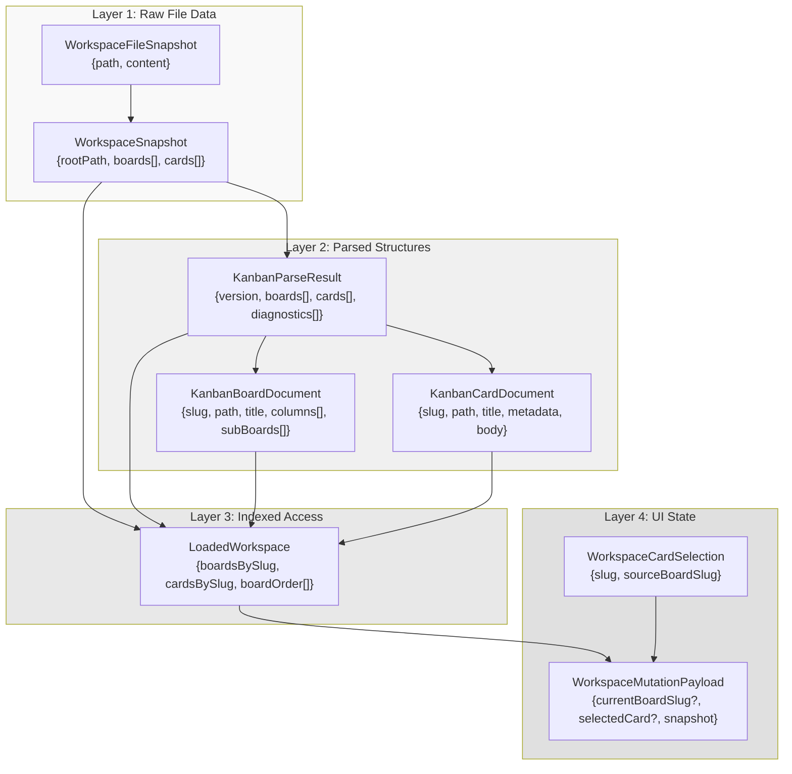
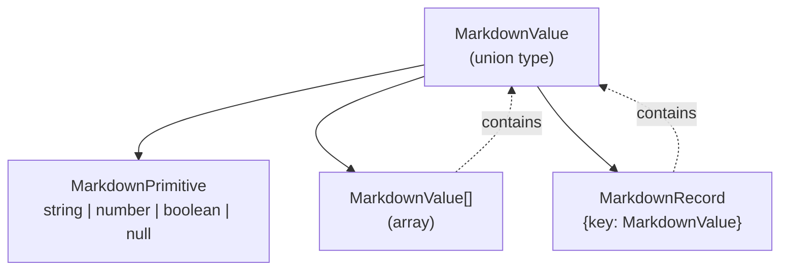
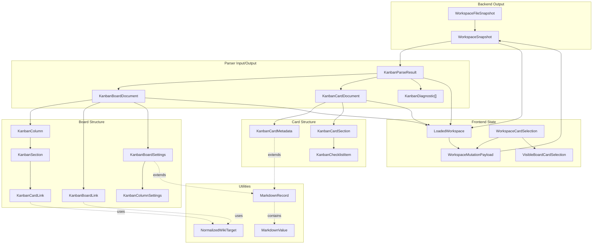

# Data Schemas and Types

<details>
<summary>Relevant source files</summary>

The following files were used as context for generating this wiki page:

- [docs/schemas/kanban-parser-schema.ts](../docs/schemas/kanban-parser-schema.ts)
- [src/types/workspace.ts](../src/types/workspace.ts)
- [src/utils/boardMarkdown.test.ts](../src/utils/boardMarkdown.test.ts)
- [src/utils/kanbanPath.ts](../src/utils/kanbanPath.ts)

</details>


This page provides reference documentation for the core data structures and type definitions used throughout KanStack. These types define the contracts between the backend and frontend, the structure of parsed markdown data, and the shape of application state.

For detailed documentation on specific schema groups:
- Kanban Parser Schema types (boards, cards, columns, sections): see [7.1](7.1-kanban-parser-schema.md)
- Workspace types (snapshots, loaded workspace, mutations): see [7.2](7.2-workspace-types.md)

For information about how these types are used in parsing and serialization workflows, see [5.4.1](#5.4.1) and [5.4.2](#5.4.2).

---

## Type System Architecture

KanStack's type system is organized into distinct layers, each serving a specific purpose in the data pipeline from raw markdown files to reactive UI state.

**Data Transformation Layers**



**Sources:** [src/types/workspace.ts:1-41](../src/types/workspace.ts), [docs/schemas/kanban-parser-schema.ts:1-127](../docs/schemas/kanban-parser-schema.ts)

---

## Core Type Categories

The type system is divided into four major categories:

| Category | Purpose | Key Types | Location |
|----------|---------|-----------|----------|
| **Raw Data** | File system snapshots from backend | `WorkspaceSnapshot`, `WorkspaceFileSnapshot` | src/types/workspace.ts |
| **Parsed Data** | Structured markdown representation | `KanbanParseResult`, `KanbanBoardDocument`, `KanbanCardDocument` | docs/schemas/kanban-parser-schema.ts |
| **Indexed Data** | Efficient lookup structures | `LoadedWorkspace` | src/types/workspace.ts |
| **UI State** | Selection and mutation payloads | `WorkspaceCardSelection`, `WorkspaceMutationPayload` | src/types/workspace.ts |

---

## Raw File Snapshot Types

These types represent the raw data returned from the Rust backend before any parsing occurs.

### WorkspaceFileSnapshot

A single file's path and content.

```typescript
interface WorkspaceFileSnapshot {
  path: string      // Relative path from workspace root
  content: string   // Raw markdown content
}
```

**Sources:** [src/types/workspace.ts:3-6](../src/types/workspace.ts)

### WorkspaceSnapshot

The complete set of board and card files in a workspace.

```typescript
interface WorkspaceSnapshot {
  rootPath: string           // Absolute filesystem path to workspace
  rootBoardPath: string      // Path to root board file (typically TODO/todo.md)
  boards: WorkspaceFileSnapshot[]   // All board markdown files
  cards: WorkspaceFileSnapshot[]    // All card markdown files
}
```

This is the primary data structure returned by the `load_workspace` backend command and consumed by the `parseWorkspace` frontend utility.

**Sources:** [src/types/workspace.ts:8-13](../src/types/workspace.ts)

---

## Parsed Data Overview

The parsed layer transforms raw markdown into structured TypeScript objects. See [7.1](7.1-kanban-parser-schema.md) for complete reference documentation. Key types include:

- `KanbanParseResult` - Top-level parse result with boards, cards, and diagnostics
- `KanbanBoardDocument` - Structured representation of a board with columns and sections
- `KanbanCardDocument` - Structured representation of a card with metadata and content
- `KanbanColumn`, `KanbanSection` - Board organizational structures
- `KanbanCardLink`, `KanbanBoardLink` - Wikilink references

**Sources:** [docs/schemas/kanban-parser-schema.ts:12-127](../docs/schemas/kanban-parser-schema.ts)

---

## Loaded Workspace Types

`LoadedWorkspace` adds indexing and ordering on top of raw and parsed data for efficient UI access.

### LoadedWorkspace Structure

```typescript
interface LoadedWorkspace {
  rootPath: string                                    // Workspace root path
  rootBoardSlug: string                               // Slug of root board
  snapshot: WorkspaceSnapshot                         // Raw file data
  parseResult: KanbanParseResult                      // Parsed structures
  boardsBySlug: Record<string, KanbanBoardDocument>   // Board lookup by slug
  boardFilesBySlug: Record<string, WorkspaceFileSnapshot>  // Board file lookup
  cardsBySlug: Record<string, KanbanCardDocument>     // Card lookup by slug
  boardOrder: string[]                                // Ordered list of board slugs
}
```

The indexed maps (`boardsBySlug`, `cardsBySlug`, `boardFilesBySlug`) enable O(1) lookup of boards and cards by their slug identifiers, which is critical for UI performance when resolving wikilink references.

**Key Operations:**
- Lookup board by slug: `loadedWorkspace.boardsBySlug[slug]`
- Lookup card by slug: `loadedWorkspace.cardsBySlug[slug]`
- Get original file content: `loadedWorkspace.boardFilesBySlug[slug].content`
- Traverse boards in order: `loadedWorkspace.boardOrder.map(slug => boardsBySlug[slug])`

**Sources:** [src/types/workspace.ts:31-40](../src/types/workspace.ts)

---

## Selection Types

Selection types track which cards and boards are currently selected in the UI.

### WorkspaceCardSelection

Identifies a card by its slug and the board it was selected from.

```typescript
interface WorkspaceCardSelection {
  slug: string              // Card slug (e.g., "TODO/cards/my-task")
  sourceBoardSlug: string   // Board slug where card was selected
}
```

**Sources:** [src/types/workspace.ts:15-18](../src/types/workspace.ts)

### VisibleBoardCardSelection

Extends `WorkspaceCardSelection` with position information for cards visible in the current board view.

```typescript
interface VisibleBoardCardSelection extends WorkspaceCardSelection {
  columnIndex: number   // Index of column containing the card
  rowIndex: number      // Index of card within its section
}
```

This type is used for keyboard navigation and multi-select operations where positional information is needed.

**Sources:** [src/types/workspace.ts:20-23](../src/types/workspace.ts)

---

## Mutation Payload Types

### WorkspaceMutationPayload

Represents a complete workspace state update from the backend.

```typescript
interface WorkspaceMutationPayload {
  currentBoardSlug?: string | null           // Active board after mutation
  selectedCard?: WorkspaceCardSelection | null   // Selected card after mutation
  snapshot: WorkspaceSnapshot                // Complete updated workspace
}
```

This type is emitted by all mutation operations (create board, move card, rename column, etc.) and consumed by `useWorkspace.applyWorkspaceMutation()` to update reactive state.

**Usage Pattern:**
1. User performs action (e.g., move card)
2. Frontend invokes backend command with mutation parameters
3. Backend persists changes and returns `WorkspaceMutationPayload`
4. Frontend applies payload to update UI state

**Sources:** [src/types/workspace.ts:25-29](../src/types/workspace.ts)

---

## Path and Link Types

### NormalizedWikiTarget

Represents a parsed wikilink target with optional display title.

```typescript
interface NormalizedWikiTarget {
  slug: string       // Normalized target path (no .md extension)
  target: string     // Same as slug (kept for compatibility)
  title?: string     // Optional display title (text after |)
}
```

**Examples:**
- `[[cards/my-task]]` → `{slug: "cards/my-task", target: "cards/my-task"}`
- `[[project/TODO|Project]]` → `{slug: "project/TODO", target: "project/TODO", title: "Project"}`

Produced by `normalizeWikiTarget()` utility at [src/utils/kanbanPath.ts:145-159](../src/utils/kanbanPath.ts).

**Sources:** [src/utils/kanbanPath.ts:1-5](../src/utils/kanbanPath.ts)

---

## Markdown Value Types

Generic types for representing parsed frontmatter and settings data.

### MarkdownValue Hierarchy



```typescript
type MarkdownPrimitive = string | number | boolean | null

type MarkdownValue =
  | MarkdownPrimitive
  | MarkdownValue[]
  | { [key: string]: MarkdownValue | undefined }

interface MarkdownRecord {
  [key: string]: MarkdownValue | undefined
}
```

These recursive types allow frontmatter and settings to contain arbitrarily nested structures while maintaining type safety.

**Sources:** [docs/schemas/kanban-parser-schema.ts:1-10](../docs/schemas/kanban-parser-schema.ts)

---

## Board Settings Schema

Board settings are stored in a special `%% kanban:settings %%` comment block and parsed into the `KanbanBoardSettings` interface.

### KanbanBoardSettings

```typescript
interface KanbanBoardSettings extends MarkdownRecord {
  "group-by"?: "none" | "section" | "assignee" | "priority" | "type" | "due"
  "show-empty-columns"?: boolean
  "show-sub-boards"?: boolean
  "show-archive-column"?: boolean
  "card-preview"?: "none" | "metadata" | "body"
  "list-collapse"?: boolean[]
  "column-settings"?: Record<string, KanbanColumnSettings>
}
```

### Setting Options Reference

| Setting | Type | Description |
|---------|------|-------------|
| `group-by` | enum | How to group cards within columns |
| `show-empty-columns` | boolean | Whether to display columns with no cards |
| `show-sub-boards` | boolean | Whether to show sub-board links |
| `show-archive-column` | boolean | Whether to show archive column |
| `card-preview` | enum | What to show in card preview |
| `list-collapse` | boolean[] | Collapse state per column |
| `column-settings` | object | Per-column configuration |

### KanbanColumnSettings

```typescript
interface KanbanColumnSettings extends MarkdownRecord {
  "wip-limit"?: number          // Work-in-progress limit
  collapsed?: boolean           // Whether column is collapsed
  "default-section"?: string    // Default section for new cards
  hidden?: boolean              // Whether column is hidden
}
```

**Example Settings Block:**
```markdown
%% kanban:settings
```json
{
  "show-archive-column": true,
  "card-preview": "metadata",
  "column-settings": {
    "in-progress": {
      "wip-limit": 3,
      "collapsed": false
    }
  }
}
```
%%
```

**Sources:** [docs/schemas/kanban-parser-schema.ts:66-81](../docs/schemas/kanban-parser-schema.ts)

---

## Card Metadata Schema

Card metadata is stored in YAML frontmatter and parsed into the `KanbanCardMetadata` interface.

### KanbanCardMetadata

```typescript
interface KanbanCardMetadata extends MarkdownRecord {
  title?: string
  type?: "task" | "bug" | "feature" | "research" | "chore"
  priority?: "low" | "medium" | "high"
  tags?: string[]
  assignee?: string
  owners?: string[]
  due?: string
  estimate?: number
  blocked_by?: string[]
  blocks?: string[]
  related?: string[]
  scheduled?: string
  started?: string
  completed?: string
  template?: string
}
```

### Metadata Fields Reference

| Field | Type | Description |
|-------|------|-------------|
| `title` | string | Override card title |
| `type` | enum | Card type classification |
| `priority` | enum | Priority level |
| `tags` | string[] | Categorical tags |
| `assignee` | string | Primary assignee |
| `owners` | string[] | Card owners |
| `due` | string | Due date (ISO format) |
| `estimate` | number | Effort estimate |
| `blocked_by` | string[] | Blocking card references |
| `blocks` | string[] | Blocked card references |
| `related` | string[] | Related card references |
| `scheduled` | string | Scheduled date |
| `started` | string | Start date |
| `completed` | string | Completion date |
| `template` | string | Template identifier |

All fields are optional, extending the base `MarkdownRecord` to allow arbitrary custom metadata.

**Sources:** [docs/schemas/kanban-parser-schema.ts:96-112](../docs/schemas/kanban-parser-schema.ts)

---

## Type Relationship Map

This diagram shows how all major types relate to each other across the type system.



**Sources:** [src/types/workspace.ts:1-41](../src/types/workspace.ts), [docs/schemas/kanban-parser-schema.ts:1-127](../docs/schemas/kanban-parser-schema.ts), [src/utils/kanbanPath.ts:1-5](../src/utils/kanbanPath.ts)

---

## Diagnostic Types

Diagnostics capture parsing errors and warnings encountered during markdown processing.

### KanbanDiagnostic

```typescript
interface KanbanDiagnostic {
  level: "error" | "warning"   // Severity level
  code: string                  // Error code for categorization
  message: string               // Human-readable description
  path: string                  // File path where diagnostic occurred
  line?: number                 // Line number (if applicable)
  column?: number               // Column number (if applicable)
}
```

Diagnostics are collected at multiple levels:
- **Parse Result**: `KanbanParseResult.diagnostics[]` (all diagnostics)
- **Per Board**: `KanbanBoardDocument.diagnostics[]` (board-specific)
- **Per Card**: `KanbanCardDocument.diagnostics[]` (card-specific)

This allows the UI to display contextual warnings at the appropriate scope.

**Sources:** [docs/schemas/kanban-parser-schema.ts:19-26](../docs/schemas/kanban-parser-schema.ts)

---

## Checklist Types

Checklists are parsed from markdown task lists and available both at the card level and within individual sections.

### KanbanChecklistItem

```typescript
interface KanbanChecklistItem {
  text: string       // Item text content
  checked: boolean   // Whether item is completed
}
```

**Markdown Example:**
```markdown
- [ ] Unchecked item
- [x] Checked item
```

**Parsed Result:**
```typescript
[
  { text: "Unchecked item", checked: false },
  { text: "Checked item", checked: true }
]
```

Checklist items appear in:
- `KanbanCardDocument.checklist[]` - All checklist items in the card
- `KanbanCardSection.checklist[]` - Checklist items within a specific section

**Sources:** [docs/schemas/kanban-parser-schema.ts:123-126](../docs/schemas/kanban-parser-schema.ts)

---

## Special Constants

### DEFAULT_SECTION_KEY

The special key used to represent sections without explicit names.

```typescript
export const DEFAULT_SECTION_KEY = '__default__'
```

When a column has cards but no `### Section Name` heading, those cards are placed in a section with `slug: null` and `name: null`. The utility function `sectionKeyFromSlug()` converts `null` to `DEFAULT_SECTION_KEY` for use as object keys.

**Sources:** [src/utils/kanbanPath.ts:7](../src/utils/kanbanPath.ts)

---

## Type Usage Examples

### Creating a Board from Parsed Data

```typescript
// Get board from loaded workspace
const board: KanbanBoardDocument = loadedWorkspace.boardsBySlug['TODO']

// Access board structure
const columnCount = board.columns.length
const firstColumn: KanbanColumn = board.columns[0]
const sections: KanbanSection[] = firstColumn.sections
const cards: KanbanCardLink[] = sections[0].cards

// Resolve card references
const cardSlug = cards[0].slug
const cardDoc: KanbanCardDocument = loadedWorkspace.cardsBySlug[cardSlug]
```

### Working with Selection State

```typescript
// Create a selection
const selection: WorkspaceCardSelection = {
  slug: 'TODO/cards/my-task',
  sourceBoardSlug: 'TODO'
}

// Create a mutation payload
const payload: WorkspaceMutationPayload = {
  currentBoardSlug: 'TODO',
  selectedCard: selection,
  snapshot: updatedSnapshot
}

// Apply to workspace composable
await applyWorkspaceMutation(payload)
```

### Parsing Wikilink Targets

```typescript
// Parse a wikilink
const link: NormalizedWikiTarget = normalizeWikiTarget('cards/task-1')
// → { slug: 'cards/task-1', target: 'cards/task-1' }

const linkWithTitle: NormalizedWikiTarget = normalizeWikiTarget('project/TODO|My Project')
// → { slug: 'project/TODO', target: 'project/TODO', title: 'My Project' }
```

**Sources:** [src/types/workspace.ts:1-41](../src/types/workspace.ts), [docs/schemas/kanban-parser-schema.ts:1-127](../docs/schemas/kanban-parser-schema.ts), [src/utils/kanbanPath.ts:145-159](../src/utils/kanbanPath.ts)
