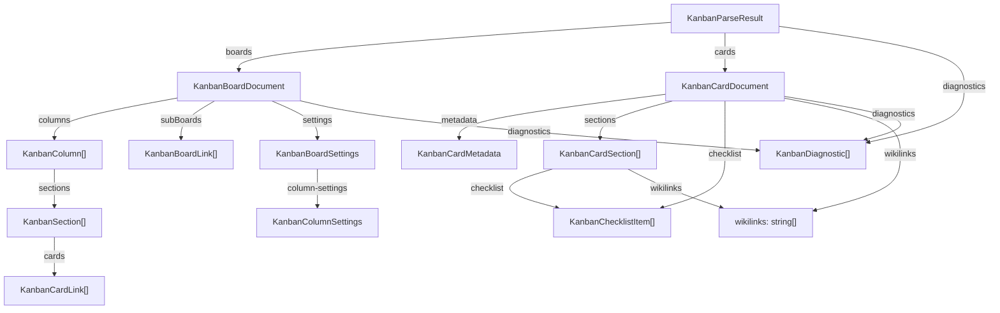
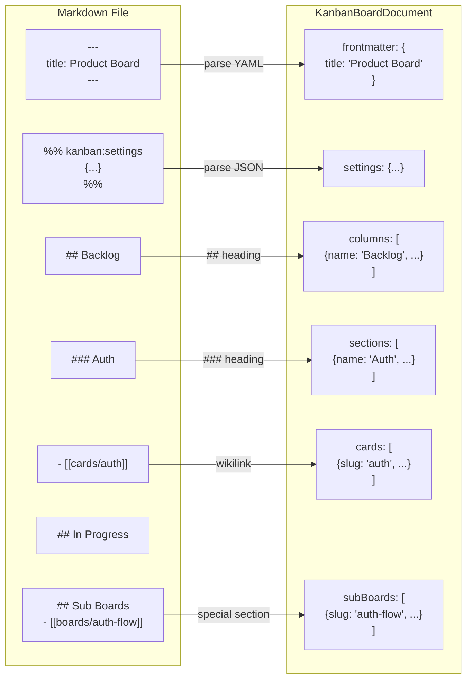
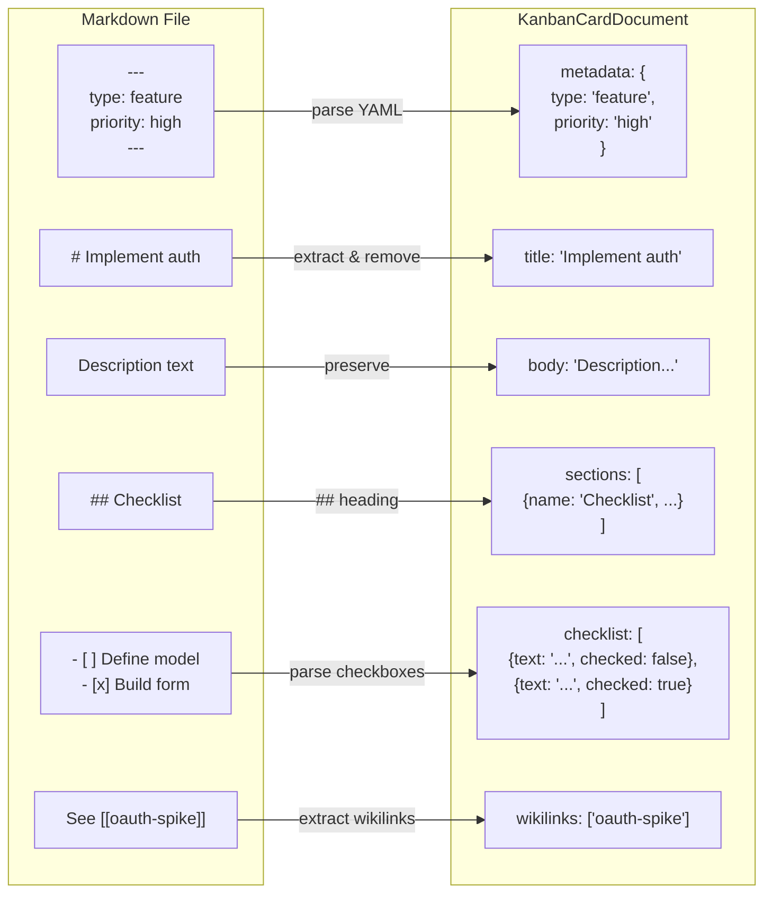

# Kanban Parser Schema

<details>
<summary>Relevant source files</summary>

The following files were used as context for generating this wiki page:

- [docs/plans/2026-03-10-markdown-kanban-parser-schema.md](../docs/plans/2026-03-10-markdown-kanban-parser-schema.md)
- [docs/schemas/kanban-parser-schema.ts](../docs/schemas/kanban-parser-schema.ts)

</details>


This document provides reference documentation for the TypeScript types that define the structured output of KanStack's markdown parser. These types represent the canonical schema that parsers must emit when processing markdown Kanban files.

For information about the markdown format conventions that map to these types, see [Markdown Format](4.4-markdown-format.md). For information about how the parser implementation works, see [Workspace Parsing](#5.4.1).

**Sources:** [docs/schemas/kanban-parser-schema.ts:1-127](../docs/schemas/kanban-parser-schema.ts)

---

## Overview

The Kanban Parser Schema defines the normalized data structures that result from parsing markdown files in a KanStack workspace. The schema is versioned (`kanban-parser/v1`) and includes types for boards, cards, structural elements, settings, and diagnostics.

The schema is defined in a canonical TypeScript file that serves as the source of truth for parser implementations. All parsers must emit data conforming to these types to ensure consistency across the application.

**Sources:** [docs/schemas/kanban-parser-schema.ts:12-17](../docs/schemas/kanban-parser-schema.ts), [docs/plans/2026-03-10-markdown-kanban-parser-schema.md:1-11](../docs/plans/2026-03-10-markdown-kanban-parser-schema.md)

---

## Type Hierarchy

**Type Hierarchy Overview**



**Sources:** [docs/schemas/kanban-parser-schema.ts:12-127](../docs/schemas/kanban-parser-schema.ts)

---

## Core Result Type

### KanbanParseResult

The top-level type returned by workspace parsing operations. Contains all parsed boards, cards, and any diagnostics encountered during parsing.

| Field | Type | Description |
|-------|------|-------------|
| `version` | `"kanban-parser/v1"` | Schema version identifier for compatibility checking |
| `boards` | `KanbanBoardDocument[]` | All parsed board documents from the workspace |
| `cards` | `KanbanCardDocument[]` | All parsed card documents from the workspace |
| `diagnostics` | `KanbanDiagnostic[]` | Workspace-level parsing errors and warnings |

**Example:**

```typescript
{
  version: "kanban-parser/v1",
  boards: [/* board documents */],
  cards: [/* card documents */],
  diagnostics: []
}
```

**Sources:** [docs/schemas/kanban-parser-schema.ts:12-17](../docs/schemas/kanban-parser-schema.ts)

---

## Board Document Types

### KanbanBoardDocument

Represents a parsed Kanban board file. Each board contains columns, optional sub-boards, settings, and its own diagnostics.

| Field | Type | Description |
|-------|------|-------------|
| `kind` | `"board"` | Type discriminator for union types |
| `slug` | `string` | Filename-derived identifier (without `.md`) |
| `path` | `string` | Relative path from workspace root (e.g., `TODO/todo.md`) |
| `title` | `string` | Board title from frontmatter or first `#` heading |
| `frontmatter` | `MarkdownRecord` | Parsed YAML frontmatter preserving all keys |
| `columns` | `KanbanColumn[]` | Board columns in document order |
| `subBoards` | `KanbanBoardLink[]` | Links to child boards from `## Sub Boards` section |
| `settings` | `KanbanBoardSettings \| null` | Parsed settings from `%% kanban:settings %%` block |
| `diagnostics` | `KanbanDiagnostic[]` | Board-specific parsing issues |

**Parsing Rules:**
- Slug derived from filename without extension
- Title uses frontmatter `title` field, falls back to first `#` heading
- Each `##` heading becomes a column (except `## Sub Boards`)
- Settings parsed from special comment block `%% kanban:settings { ... } %%`

**Sources:** [docs/schemas/kanban-parser-schema.ts:28-38](../docs/schemas/kanban-parser-schema.ts), [docs/plans/2026-03-10-markdown-kanban-parser-schema.md:15-26](../docs/plans/2026-03-10-markdown-kanban-parser-schema.md)

---

### KanbanColumn

Represents a column within a board (e.g., "Backlog", "In Progress", "Done"). Columns contain sections which contain cards.

| Field | Type | Description |
|-------|------|-------------|
| `name` | `string` | Column name from `##` heading text |
| `slug` | `string` | Slugified column name for stable references |
| `index` | `number` | Zero-based position in the board |
| `sections` | `KanbanSection[]` | Sections within this column |

**Sources:** [docs/schemas/kanban-parser-schema.ts:40-45](../docs/schemas/kanban-parser-schema.ts)

---

### KanbanSection

Represents a section within a column. Sections group cards under a `###` heading. If cards appear before any section heading, they are normalized into an implicit section with `name: null`.

| Field | Type | Description |
|-------|------|-------------|
| `name` | `string \| null` | Section name from `###` heading, or `null` for implicit sections |
| `slug` | `string \| null` | Slugified section name, or `null` for implicit sections |
| `index` | `number` | Zero-based position within the column |
| `cards` | `KanbanCardLink[]` | Card wikilinks in this section |

**Normalization:**
- Cards directly under a column (before any `###`) are placed in an implicit section with `name: null` and `slug: null`

**Sources:** [docs/schemas/kanban-parser-schema.ts:47-52](../docs/schemas/kanban-parser-schema.ts), [docs/plans/2026-03-10-markdown-kanban-parser-schema.md:22-23](../docs/plans/2026-03-10-markdown-kanban-parser-schema.md)

---

### KanbanCardLink

Represents a wikilink reference to a card within a board structure. Used in `KanbanSection.cards`.

| Field | Type | Description |
|-------|------|-------------|
| `slug` | `string` | Card identifier from wikilink (e.g., `auth` from `[[cards/auth]]`) |
| `target` | `string` | Normalized wikilink target without extension (e.g., `cards/auth`) |
| `title` | `string \| undefined` | Optional display title from wikilink alias syntax |

**Normalization:**
- Targets are extensionless: `cards/auth` not `cards/auth.md`
- Slug is the final path segment without directory

**Sources:** [docs/schemas/kanban-parser-schema.ts:54-58](../docs/schemas/kanban-parser-schema.ts), [docs/plans/2026-03-10-markdown-kanban-parser-schema.md:52](../docs/plans/2026-03-10-markdown-kanban-parser-schema.md)

---

### KanbanBoardLink

Represents a wikilink reference to a sub-board. Used in `KanbanBoardDocument.subBoards`.

| Field | Type | Description |
|-------|------|-------------|
| `slug` | `string` | Board identifier from wikilink |
| `target` | `string` | Normalized wikilink target without extension |
| `title` | `string \| undefined` | Optional display title from wikilink alias |

**Sources:** [docs/schemas/kanban-parser-schema.ts:60-64](../docs/schemas/kanban-parser-schema.ts), [docs/plans/2026-03-10-markdown-kanban-parser-schema.md:24](../docs/plans/2026-03-10-markdown-kanban-parser-schema.md)

---

### KanbanBoardSettings

Configuration settings for a board, parsed from the `%% kanban:settings { ... } %%` JSON block. Extends `MarkdownRecord` to preserve unknown settings keys for forward compatibility.

| Field | Type | Description |
|-------|------|-------------|
| `group-by` | `"none" \| "section" \| "assignee" \| "priority" \| "type" \| "due"` | How to group cards within columns |
| `show-empty-columns` | `boolean` | Whether to display columns with no cards |
| `show-sub-boards` | `boolean` | Whether to display the sub-boards section |
| `show-archive-column` | `boolean` | Whether to display archived cards column |
| `card-preview` | `"none" \| "metadata" \| "body"` | Card preview display mode |
| `list-collapse` | `boolean[]` | Collapse state for collapsible UI sections |
| `column-settings` | `Record<string, KanbanColumnSettings>` | Per-column configuration keyed by column slug |

All fields are optional and the settings object itself may be `null` if no settings block exists.

**Sources:** [docs/schemas/kanban-parser-schema.ts:66-74](../docs/schemas/kanban-parser-schema.ts)

---

### KanbanColumnSettings

Per-column configuration settings referenced by `KanbanBoardSettings.column-settings`. Also extends `MarkdownRecord` for extensibility.

| Field | Type | Description |
|-------|------|-------------|
| `wip-limit` | `number` | Work-in-progress limit for the column |
| `collapsed` | `boolean` | Whether the column is collapsed in the UI |
| `default-section` | `string` | Default section slug for new cards |
| `hidden` | `boolean` | Whether the column is hidden |

All fields are optional.

**Sources:** [docs/schemas/kanban-parser-schema.ts:76-81](../docs/schemas/kanban-parser-schema.ts)

---

## Card Document Types

### KanbanCardDocument

Represents a parsed card file. Cards contain metadata, content sections, checklists, and wikilink references.

| Field | Type | Description |
|-------|------|-------------|
| `kind` | `"card"` | Type discriminator |
| `slug` | `string` | Filename-derived identifier (without `.md`) |
| `path` | `string` | Relative path from workspace root (e.g., `cards/auth.md`) |
| `title` | `string` | Card title from frontmatter or first `#` heading |
| `metadata` | `KanbanCardMetadata` | Parsed frontmatter fields |
| `body` | `string` | Full markdown content with title heading removed |
| `sections` | `KanbanCardSection[]` | Parsed `##` sections from the card |
| `checklist` | `KanbanChecklistItem[]` | All checklist items collected from the card |
| `wikilinks` | `string[]` | All wikilink targets from the card body |
| `diagnostics` | `KanbanDiagnostic[]` | Card-specific parsing issues |

**Parsing Rules:**
- Title uses frontmatter `title`, falls back to first `#` heading
- Matching leading `# <title>` heading is removed from `body` before storage
- All `##` headings become sections
- Checklist items and wikilinks are collected from entire card content

**Sources:** [docs/schemas/kanban-parser-schema.ts:83-94](../docs/schemas/kanban-parser-schema.ts), [docs/plans/2026-03-10-markdown-kanban-parser-schema.md:27-36](../docs/plans/2026-03-10-markdown-kanban-parser-schema.md)

---

### KanbanCardMetadata

Card frontmatter metadata. Extends `MarkdownRecord` to preserve unknown metadata keys for round-trip compatibility.

| Field | Type | Description |
|-------|------|-------------|
| `title` | `string` | Card title (also stored at document level) |
| `type` | `"task" \| "bug" \| "feature" \| "research" \| "chore"` | Card work type |
| `priority` | `"low" \| "medium" \| "high"` | Priority level |
| `tags` | `string[]` | Arbitrary tags for categorization |
| `assignee` | `string` | Single assignee identifier |
| `owners` | `string[]` | Multiple owner identifiers |
| `due` | `string` | Due date (ISO format or natural language) |
| `estimate` | `number` | Time estimate (story points, hours, etc.) |
| `blocked_by` | `string[]` | Card slugs this card is blocked by |
| `blocks` | `string[]` | Card slugs this card blocks |
| `related` | `string[]` | Related card slugs |
| `scheduled` | `string` | Scheduled start date |
| `started` | `string` | Actual start date |
| `completed` | `string` | Completion date |
| `template` | `string` | Template identifier if card is from a template |

All fields are optional. Additional unknown keys are preserved in the base `MarkdownRecord` structure.

**Relationship Fields:**
- `blocked_by`, `blocks`, and `related` contain card slugs (not full paths)
- These enable dependency tracking between cards

**Sources:** [docs/schemas/kanban-parser-schema.ts:96-112](../docs/schemas/kanban-parser-schema.ts), [docs/plans/2026-03-10-markdown-kanban-parser-schema.md:49](../docs/plans/2026-03-10-markdown-kanban-parser-schema.md)

---

### KanbanCardSection

Represents a `##` section within a card. Sections organize card content and maintain their own checklist and wikilink collections.

| Field | Type | Description |
|-------|------|-------------|
| `name` | `string` | Section name from `##` heading |
| `slug` | `string` | Slugified section name |
| `index` | `number` | Zero-based position in the card |
| `markdown` | `string` | Raw markdown content of this section |
| `checklist` | `KanbanChecklistItem[]` | Checklist items found in this section |
| `wikilinks` | `string[]` | Wikilink targets found in this section |

**Sources:** [docs/schemas/kanban-parser-schema.ts:114-121](../docs/schemas/kanban-parser-schema.ts), [docs/plans/2026-03-10-markdown-kanban-parser-schema.md:34](../docs/plans/2026-03-10-markdown-kanban-parser-schema.md)

---

### KanbanChecklistItem

Represents a single checklist item (`- [ ]` or `- [x]`) found in card content.

| Field | Type | Description |
|-------|------|-------------|
| `text` | `string` | The checklist item text content |
| `checked` | `boolean` | Whether the item is checked (`[x]` vs `[ ]`) |

Checklist items are collected at two levels:
- `KanbanCardDocument.checklist` - all items from the entire card
- `KanbanCardSection.checklist` - items from that specific section

**Sources:** [docs/schemas/kanban-parser-schema.ts:123-126](../docs/schemas/kanban-parser-schema.ts), [docs/plans/2026-03-10-markdown-kanban-parser-schema.md:35](../docs/plans/2026-03-10-markdown-kanban-parser-schema.md)

---

## Shared Types

### KanbanDiagnostic

Represents parsing errors, warnings, and other diagnostic messages encountered during parsing.

| Field | Type | Description |
|-------|------|-------------|
| `level` | `"error" \| "warning"` | Severity level |
| `code` | `string` | Machine-readable diagnostic code |
| `message` | `string` | Human-readable description |
| `path` | `string` | File path where the issue occurred |
| `line` | `number \| undefined` | Optional line number |
| `column` | `number \| undefined` | Optional column number |

**Common Diagnostic Codes:**
- `frontmatter.unclosed` - Frontmatter starts with `---` but never closes
- `board.card-outside-column` - Card link appears before any `##` column
- `board.no-columns` - Board has no `##` columns defined
- `board.invalid-settings` - Settings JSON block cannot be parsed

**Sources:** [docs/schemas/kanban-parser-schema.ts:19-26](../docs/schemas/kanban-parser-schema.ts), [docs/plans/2026-03-10-markdown-kanban-parser-schema.md:38-43](../docs/plans/2026-03-10-markdown-kanban-parser-schema.md)

---

### MarkdownRecord and MarkdownValue

Flexible types for preserving arbitrary frontmatter and settings data.

**MarkdownValue:**
```typescript
type MarkdownValue =
  | MarkdownPrimitive
  | MarkdownValue[]
  | { [key: string]: MarkdownValue | undefined }

type MarkdownPrimitive = string | number | boolean | null
```

**MarkdownRecord:**
```typescript
interface MarkdownRecord {
  [key: string]: MarkdownValue | undefined
}
```

These types allow storing arbitrary YAML frontmatter and JSON settings while maintaining type safety. Unknown keys are preserved to ensure round-trip fidelity when serializing back to markdown.

**Sources:** [docs/schemas/kanban-parser-schema.ts:1-10](../docs/schemas/kanban-parser-schema.ts), [docs/plans/2026-03-10-markdown-kanban-parser-schema.md:50](../docs/plans/2026-03-10-markdown-kanban-parser-schema.md)

---

## Markdown to Schema Mapping

**Board Structure Mapping**



**Sources:** [docs/plans/2026-03-10-markdown-kanban-parser-schema.md:15-26](../docs/plans/2026-03-10-markdown-kanban-parser-schema.md)

---

**Card Structure Mapping**



**Sources:** [docs/plans/2026-03-10-markdown-kanban-parser-schema.md:27-36](../docs/plans/2026-03-10-markdown-kanban-parser-schema.md)

---

## Schema Example: Complete Board

This example shows a fully populated `KanbanBoardDocument` with all major features:

```typescript
const board: KanbanBoardDocument = {
  kind: "board",
  slug: "main",
  path: "TODO/todo.md",
  title: "Product Board",
  frontmatter: { 
    title: "Product Board" 
  },
  columns: [
    {
      name: "Backlog",
      slug: "backlog",
      index: 0,
      sections: [
        {
          name: "Auth",
          slug: "auth",
          index: 0,
          cards: [
            { slug: "session-model", target: "cards/session-model" },
            { slug: "auth", target: "cards/auth" }
          ]
        }
      ]
    },
    {
      name: "In Progress",
      slug: "in-progress",
      index: 1,
      sections: [
        {
          name: null,
          slug: null,
          index: 0,
          cards: [
            { slug: "ui-polish", target: "cards/ui-polish" }
          ]
        }
      ]
    }
  ],
  subBoards: [
    { slug: "auth-flow", target: "boards/auth-flow" }
  ],
  settings: {
    "sort-order": "manual",
    "group-by": "section",
    "column-settings": {
      "in-progress": { "wip-limit": 2 }
    }
  },
  diagnostics: []
}
```

**Sources:** [docs/plans/2026-03-10-markdown-kanban-parser-schema.md:55-92](../docs/plans/2026-03-10-markdown-kanban-parser-schema.md)

---

## Schema Example: Complete Card

This example shows a fully populated `KanbanCardDocument`:

```typescript
const card: KanbanCardDocument = {
  kind: "card",
  slug: "auth",
  path: "cards/auth.md",
  title: "Implement authentication",
  metadata: {
    type: "feature",
    priority: "high",
    assignee: "galen",
    blocked_by: ["session-model"],
    related: ["oauth-spike"],
    story_points: 8
  },
  body: "Add local-first email and password authentication for the desktop app.\n\n## Checklist\n\n- [ ] Define auth state model\n- [ ] Build login form",
  sections: [
    {
      name: "Checklist",
      slug: "checklist",
      index: 0,
      markdown: "- [ ] Define auth state model\n- [ ] Build login form",
      checklist: [
        { text: "Define auth state model", checked: false },
        { text: "Build login form", checked: false }
      ],
      wikilinks: []
    }
  ],
  checklist: [
    { text: "Define auth state model", checked: false },
    { text: "Build login form", checked: false }
  ],
  wikilinks: [],
  diagnostics: []
}
```

**Sources:** [docs/plans/2026-03-10-markdown-kanban-parser-schema.md:94-131](../docs/plans/2026-03-10-markdown-kanban-parser-schema.md)

---

## Normalization Rules

The schema enforces several normalization rules to ensure consistency:

| Rule | Description |
|------|-------------|
| **Slugs from filenames** | Both `board.slug` and `card.slug` are derived from filename without `.md` extension |
| **Title precedence** | Frontmatter `title` takes precedence over first `#` heading for both boards and cards |
| **Extensionless targets** | Wikilink targets are normalized without extensions: `cards/auth` not `cards/auth.md` |
| **Removed title headings** | For cards, matching leading `# <title>` heading is removed from `body` |
| **Implicit sections** | Cards appearing before any `###` heading are normalized into a section with `name: null` |
| **Sub-board separation** | The `## Sub Boards` section is parsed into `subBoards[]`, not included in `columns[]` |
| **Relationship field slugs** | Card relationship fields (`blocked_by`, `blocks`, `related`) contain slugs, not full paths |
| **Preserved unknown keys** | Unknown frontmatter and settings keys must survive round trips for forward compatibility |
| **Collected checklists** | Checklist items appear both in their source section and in the document-level `checklist[]` |
| **Collected wikilinks** | Wikilinks appear both in their source section and in the document-level `wikilinks[]` |

**Sources:** [docs/plans/2026-03-10-markdown-kanban-parser-schema.md:45-53](../docs/plans/2026-03-10-markdown-kanban-parser-schema.md)

---

## Schema Version

The schema uses a version identifier `"kanban-parser/v1"` in the `KanbanParseResult.version` field. This allows:

- **Version detection** - Parsers can check compatibility before processing
- **Schema evolution** - Future breaking changes can increment the version
- **Migration support** - Old data can be detected and upgraded

The version string follows the format `kanban-parser/v{major}` where major version changes indicate breaking schema changes.

**Sources:** [docs/schemas/kanban-parser-schema.ts:13](../docs/schemas/kanban-parser-schema.ts)

---

## Usage in the Codebase

The parser schema types are used throughout KanStack:

**Frontend Parsing:**
- src/util/parseWorkspace.ts - Implements the parser that produces `KanbanParseResult`
- src/util/slug.ts - Utilities for generating slugs from filenames
- src/composables/useWorkspace.ts - Consumes parsed board and card documents

**Backend:**
- src-tauri/src/backend/workspace/markdown.rs - Rust equivalent parsing for validation (includes tests)
- src-tauri/src/backend/models.rs - May define Rust types that mirror the TypeScript schema

**Type Guards and Validation:**
The schema types can be used with TypeScript's `satisfies` operator to validate literal objects match the schema, as shown in the example code in the plan document.

**Sources:** [docs/plans/2026-03-10-markdown-kanban-parser-schema.md:55-131](../docs/plans/2026-03-10-markdown-kanban-parser-schema.md)
