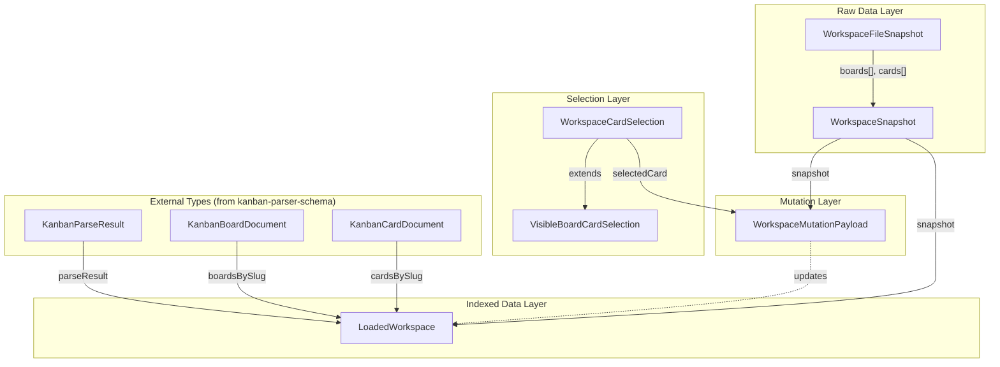

# Workspace Types

<details>
<summary>Relevant source files</summary>

The following files were used as context for generating this wiki page:

- [src/types/workspace.ts](../src/types/workspace.ts)
- [src/utils/boardMarkdown.test.ts](../src/utils/boardMarkdown.test.ts)
- [src/utils/kanbanPath.ts](../src/utils/kanbanPath.ts)
- [src/utils/workspaceSnapshot.ts](../src/utils/workspaceSnapshot.ts)

</details>


This page documents the TypeScript type definitions that represent workspace data at different stages of processing. These types form the data model layer between the Rust backend's file system operations and the Vue frontend's reactive state.

For information about the parsed board and card document types, see [Kanban Parser Schema](7.1-kanban-parser-schema.md). For information about how workspaces are loaded and managed in the frontend, see [useWorkspace](#5.2.1).

## Overview

The workspace type system is organized into three layers:

1. **Raw Data Layer**: `WorkspaceFileSnapshot` and `WorkspaceSnapshot` - represent unparsed file contents from the backend
2. **Selection Types**: `WorkspaceCardSelection` and `VisibleBoardCardSelection` - represent user selections in the UI
3. **Indexed Data Layer**: `LoadedWorkspace` - combines raw data, parsed results, and indexed lookups for efficient access
4. **Mutation Types**: `WorkspaceMutationPayload` - represent atomic state updates

All types are defined in src/types/workspace.ts.

**Sources:** [src/types/workspace.ts:1-41](../src/types/workspace.ts)

## Type Hierarchy

**Workspace Type Relationships**



**Sources:** [src/types/workspace.ts:1-41](../src/types/workspace.ts), [src/utils/workspaceSnapshot.ts:1-36](../src/utils/workspaceSnapshot.ts)

## Raw Data Layer

### WorkspaceFileSnapshot

Represents a single file's snapshot with its path and content.

| Field | Type | Description |
|-------|------|-------------|
| `path` | `string` | Relative path from workspace root (e.g., `TODO/todo.md`, `TODO/cards/task-1.md`) |
| `content` | `string` | Raw markdown file content |

**Definition:** [src/types/workspace.ts:3-6](../src/types/workspace.ts)

This type is used as the basic unit of file data. The Rust backend reads files from disk and creates these snapshots, which are then sent to the frontend.

**Sources:** [src/types/workspace.ts:3-6](../src/types/workspace.ts)

### WorkspaceSnapshot

Represents the complete raw workspace state returned from the backend.

| Field | Type | Description |
|-------|------|-------------|
| `rootPath` | `string` | Absolute file system path to workspace root directory |
| `rootBoardPath` | `string` | Relative path to the root board file (typically `TODO/todo.md`) |
| `boards` | `WorkspaceFileSnapshot[]` | Array of all board file snapshots in the workspace |
| `cards` | `WorkspaceFileSnapshot[]` | Array of all card file snapshots in the workspace |

**Definition:** [src/types/workspace.ts:8-13](../src/types/workspace.ts)

This is the primary data structure returned by the `load_workspace` Rust command (see [Backend Command Handlers](6.2-command-handlers.md)). It contains no parsed or indexed data - just raw file paths and contents.

**Example structure:**

```typescript
{
  rootPath: "/Users/name/projects/my-project",
  rootBoardPath: "TODO/todo.md",
  boards: [
    { path: "TODO/todo.md", content: "# Main Board\n\n## Todo\n..." },
    { path: "project-a/TODO/todo.md", content: "# Project A\n..." }
  ],
  cards: [
    { path: "TODO/cards/task-1.md", content: "---\ntitle: Task 1\n---\n..." },
    { path: "TODO/cards/task-2.md", content: "---\ntitle: Task 2\n---\n..." }
  ]
}
```

**Sources:** [src/types/workspace.ts:8-13](../src/types/workspace.ts), [src/utils/workspaceSnapshot.ts:5-6](../src/utils/workspaceSnapshot.ts), [src/utils/boardMarkdown.test.ts:198-203](../src/utils/boardMarkdown.test.ts)

## Selection Types

### WorkspaceCardSelection

Represents a card that is currently selected by the user.

| Field | Type | Description |
|-------|------|-------------|
| `slug` | `string` | Full card slug (e.g., `TODO/cards/task-1`) |
| `sourceBoardSlug` | `string` | Slug of the board containing this card (e.g., `TODO`) |

**Definition:** [src/types/workspace.ts:15-18](../src/types/workspace.ts)

This type identifies a selected card by its slug and the board it belongs to. The `sourceBoardSlug` is necessary because the same card might be visible on multiple boards through sub-board relationships.

**Sources:** [src/types/workspace.ts:15-18](../src/types/workspace.ts)

### VisibleBoardCardSelection

Extends `WorkspaceCardSelection` with positional information for cards visible on the current board.

| Field | Type | Description |
|-------|------|-------------|
| `slug` | `string` | Inherited from `WorkspaceCardSelection` |
| `sourceBoardSlug` | `string` | Inherited from `WorkspaceCardSelection` |
| `columnIndex` | `number` | Zero-based index of the column containing this card |
| `rowIndex` | `number` | Zero-based index of the card within its column |

**Definition:** [src/types/workspace.ts:20-23](../src/types/workspace.ts)

This extended type is used for keyboard navigation and multi-selection features (see [useBoardSelection](../5.2.3-usecardeditor.md)). The `columnIndex` and `rowIndex` fields enable arrow key navigation and range selection.

**Sources:** [src/types/workspace.ts:20-23](../src/types/workspace.ts)

## Mutation Layer

### WorkspaceMutationPayload

Represents an atomic workspace state update, typically resulting from a user action.

| Field | Type | Description |
|-------|------|-------------|
| `currentBoardSlug` | `string \| null \| undefined` | Optional: new current board slug to navigate to |
| `selectedCard` | `WorkspaceCardSelection \| null \| undefined` | Optional: new card selection state |
| `snapshot` | `WorkspaceSnapshot` | Required: updated workspace snapshot from backend |

**Definition:** [src/types/workspace.ts:25-29](../src/types/workspace.ts)

This type is used when backend operations complete and return updated workspace state. It bundles the new snapshot with optional navigation/selection updates. The `undefined` vs `null` distinction matters:
- `undefined`: don't change this aspect of state
- `null`: explicitly clear this aspect of state
- Non-null value: set to this value

**Usage pattern:**

```typescript
// After saving a card, update workspace and maintain selection
const payload: WorkspaceMutationPayload = {
  selectedCard: undefined,  // keep current selection
  snapshot: updatedSnapshot  // new workspace state
}

// After deleting a card, update workspace and clear selection
const payload: WorkspaceMutationPayload = {
  selectedCard: null,       // clear selection
  snapshot: updatedSnapshot
}

// After creating a board, navigate to it
const payload: WorkspaceMutationPayload = {
  currentBoardSlug: newBoardSlug,  // navigate to new board
  snapshot: updatedSnapshot
}
```

**Sources:** [src/types/workspace.ts:25-29](../src/types/workspace.ts)

## Indexed Data Layer

### LoadedWorkspace

Represents a fully processed workspace with parsed documents and indexed lookups.

| Field | Type | Description |
|-------|------|-------------|
| `rootPath` | `string` | Workspace root absolute path |
| `rootBoardSlug` | `string` | Slug of the root board (e.g., `TODO`) |
| `snapshot` | `WorkspaceSnapshot` | Original raw snapshot from backend |
| `parseResult` | `KanbanParseResult` | Parsed board and card documents with diagnostics |
| `boardsBySlug` | `Record<string, KanbanBoardDocument>` | Map for O(1) board lookup by slug |
| `boardFilesBySlug` | `Record<string, WorkspaceFileSnapshot>` | Map for O(1) board file lookup by slug |
| `cardsBySlug` | `Record<string, KanbanCardDocument>` | Map for O(1) card lookup by slug |
| `boardOrder` | `string[]` | Ordered array of board slugs for iteration |

**Definition:** [src/types/workspace.ts:31-40](../src/types/workspace.ts)

This is the primary data structure used by the frontend. It combines:
1. Raw snapshot data for reference and persistence
2. Parsed, typed documents from `KanbanParseResult` (see [Kanban Parser Schema](7.1-kanban-parser-schema.md))
3. Indexed maps for efficient lookups by slug
4. Ordered arrays for deterministic iteration

The `LoadedWorkspace` is constructed by the `buildLoadedWorkspace()` function, which takes a `WorkspaceSnapshot` and transforms it into this indexed structure.

**Sources:** [src/types/workspace.ts:31-40](../src/types/workspace.ts), [src/utils/workspaceSnapshot.ts:5-27](../src/utils/workspaceSnapshot.ts)

## Transformation Pipeline

**Data Flow from Backend to Frontend State**

```mermaid
graph LR
    subgraph Backend["Backend (Rust)"]
        FS["File System<br/>(TODO/*.md files)"]
        LoadCmd["load_workspace<br/>command"]
    end
    
    subgraph RawData["Raw Data"]
        WFS["WorkspaceFileSnapshot[]"]
        WS["WorkspaceSnapshot"]
    end
    
    subgraph ParsingLayer["Parsing Layer"]
        ParseFn["parseWorkspace()<br/>function"]
        KPR["KanbanParseResult"]
    end
    
    subgraph IndexingLayer["Indexing Layer"]
        BuildFn["buildLoadedWorkspace()<br/>function"]
        LW["LoadedWorkspace"]
    end
    
    subgraph FrontendState["Frontend State"]
        UseWS["useWorkspace()<br/>composable"]
        ReactiveState["Reactive<br/>Vue State"]
    end
    
    FS -->|"read files"| LoadCmd
    LoadCmd -->|"create"| WFS
    WFS -->|"collect into"| WS
    WS -->|"input to"| ParseFn
    ParseFn -->|"produces"| KPR
    WS -->|"input to"| BuildFn
    KPR -->|"input to"| BuildFn
    BuildFn -->|"produces"| LW
    LW -->|"stored in"| UseWS
    UseWS -->|"provides"| ReactiveState
```



**Sources:** [src/utils/workspaceSnapshot.ts:5-27](../src/utils/workspaceSnapshot.ts), src/utils/parseWorkspace.ts

## Helper Functions

### buildLoadedWorkspace

Transforms a `WorkspaceSnapshot` into a `LoadedWorkspace` by parsing and indexing the data.

**Signature:** `buildLoadedWorkspace(snapshot: WorkspaceSnapshot): LoadedWorkspace`

**Location:** [src/utils/workspaceSnapshot.ts:5-27](../src/utils/workspaceSnapshot.ts)

**Implementation overview:**

1. Parse snapshot using `parseWorkspace()` to get `KanbanParseResult`
2. Build `boardsBySlug` map from parsed boards
3. Build `boardFilesBySlug` map using `boardIdFromBoardPath()` helper
4. Build `cardsBySlug` map from parsed cards
5. Extract `boardOrder` array from parsed boards
6. Compute `rootBoardSlug` from `snapshot.rootBoardPath`

**Sources:** [src/utils/workspaceSnapshot.ts:5-27](../src/utils/workspaceSnapshot.ts), [src/utils/kanbanPath.ts:88-90](../src/utils/kanbanPath.ts)

### createWorkspaceSnapshotSignature

Creates a stable string signature for comparing workspace snapshots.

**Signature:** `createWorkspaceSnapshotSignature(snapshot: WorkspaceSnapshot): string`

**Location:** [src/utils/workspaceSnapshot.ts:29-35](../src/utils/workspaceSnapshot.ts)

This function serializes the snapshot to JSON for comparison purposes. It's used to detect when a workspace has changed and needs re-parsing. The signature includes `rootBoardPath`, `boards`, and `cards` arrays.

**Sources:** [src/utils/workspaceSnapshot.ts:29-35](../src/utils/workspaceSnapshot.ts)

## Usage Patterns

### Loading a Workspace

```typescript
// 1. Backend returns WorkspaceSnapshot
const snapshot: WorkspaceSnapshot = await invoke('load_workspace', { path })

// 2. Transform into LoadedWorkspace
const loaded = buildLoadedWorkspace(snapshot)

// 3. Access indexed data
const rootBoard = loaded.boardsBySlug[loaded.rootBoardSlug]
const card = loaded.cardsBySlug['TODO/cards/task-1']
```

**Sources:** [src/utils/workspaceSnapshot.ts:5-27](../src/utils/workspaceSnapshot.ts)

### Applying Mutations

```typescript
// After a backend operation that modifies files
const payload: WorkspaceMutationPayload = {
  currentBoardSlug: undefined,  // maintain navigation
  selectedCard: { 
    slug: 'TODO/cards/new-card',
    sourceBoardSlug: 'TODO'
  },
  snapshot: updatedSnapshot  // from backend
}

// Transform and apply to state
const newLoaded = buildLoadedWorkspace(payload.snapshot)
// Update reactive state with newLoaded and payload.selectedCard
```

**Sources:** [src/types/workspace.ts:25-29](../src/types/workspace.ts)

### Iterating Boards in Order

```typescript
// Use boardOrder for deterministic iteration
for (const boardSlug of loaded.boardOrder) {
  const board = loaded.boardsBySlug[boardSlug]
  const boardFile = loaded.boardFilesBySlug[boardSlug]
  // Process board...
}
```

**Sources:** [src/types/workspace.ts:39](../src/types/workspace.ts), [src/utils/workspaceSnapshot.ts:14](../src/utils/workspaceSnapshot.ts)

## Type Safety Benefits

The workspace type system provides several type safety guarantees:

1. **Separation of Concerns**: Raw data (`WorkspaceSnapshot`) is clearly separated from parsed data (`LoadedWorkspace`)
2. **Explicit Nullability**: The mutation payload uses `T | null | undefined` to distinguish between "keep", "clear", and "set" operations
3. **Indexed Access**: The `Record<string, T>` maps in `LoadedWorkspace` ensure type-safe lookups
4. **Immutability**: All types are interfaces with readonly semantics (no mutating methods)

**Sources:** [src/types/workspace.ts:1-41](../src/types/workspace.ts)

## Related Types

For types related to the parsed board and card documents stored in `LoadedWorkspace`, see:
- [KanbanParseResult](7.1-kanban-parser-schema.md) - The parsed output from `parseWorkspace()`
- [KanbanBoardDocument](7.1-kanban-parser-schema.md) - Typed board structure
- [KanbanCardDocument](7.1-kanban-parser-schema.md) - Typed card structure

For information about how these types are used in the application state, see:
- [useWorkspace composable](#5.2.1) - Manages `LoadedWorkspace` in reactive state
- [Workspace Operations](6.3-workspace-operations.md) - Backend functions that produce `WorkspaceSnapshot`

**Sources:** [src/types/workspace.ts:1](../src/types/workspace.ts)
