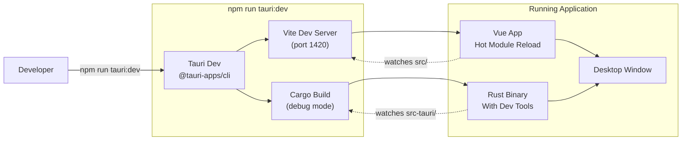
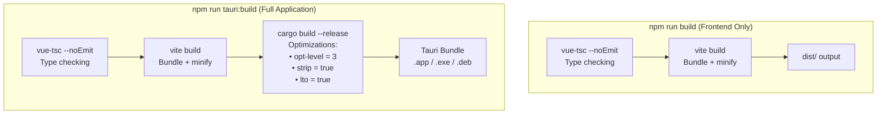
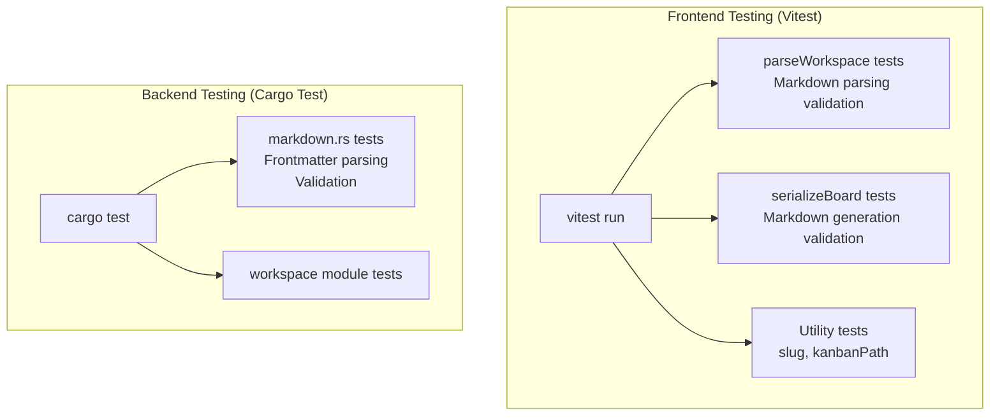
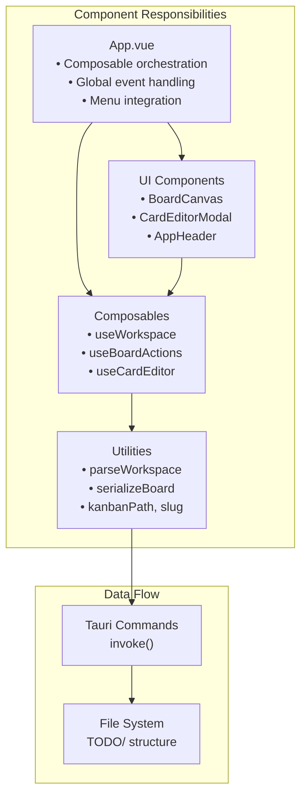
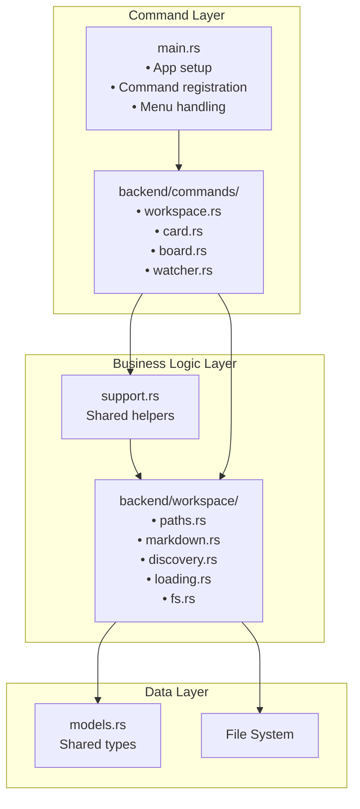

# Development Guide

<details>
<summary>Relevant source files</summary>

The following files were used as context for generating this wiki page:

- [README.md](../README.md)
- [package.json](../package.json)
- [src-tauri/Cargo.toml](../src-tauri/Cargo.toml)

</details>


This guide provides developers with the information needed to set up, build, test, and contribute to KanStack. It covers the development environment setup, build toolchain, testing strategies, and common development workflows.

For detailed architecture information, see [Architecture Overview](3-architecture-overview.md). For specific frontend development patterns, see [Frontend Guide](5-frontend-guide.md). For backend development details, see [Backend Guide](6-backend-guide.md).

---

## Prerequisites and Environment Setup

KanStack is built with Tauri 2, requiring both Node.js/npm tooling for the frontend and Rust tooling for the backend.

### Required Dependencies

| Dependency | Purpose | Version Requirement |
|------------|---------|---------------------|
| Node.js | Frontend build toolchain | Latest LTS recommended |
| npm | Package management | Comes with Node.js |
| Rust | Backend compilation | Latest stable |
| Tauri CLI | Desktop app framework | ^2 (installed via npm) |

### Platform-Specific Requirements

Tauri requires platform-specific system dependencies for building desktop applications:

- **macOS**: Xcode Command Line Tools
- **Linux**: WebKit2GTK, libssl-dev, and other system libraries
- **Windows**: Microsoft Visual Studio C++ Build Tools

Refer to the official Tauri documentation for complete platform-specific setup instructions.

### Verifying Your Environment

After installing dependencies, verify your environment:

```bash
# Check Node.js and npm
node --version
npm --version

# Check Rust
rustc --version
cargo --version
```

**Sources:** [README.md:17-28](../README.md)

---

## Project Structure and Organization

KanStack is organized into distinct frontend and backend codebases with clear separation of concerns:

```
KanStack/
├── src/                    # Vue.js frontend
│   ├── components/         # Vue components
│   ├── composables/        # State management composables
│   ├── lib/               # Utilities and helpers
│   └── App.vue            # Application orchestrator
├── src-tauri/             # Rust backend
│   ├── src/
│   │   ├── backend/       # Core backend logic
│   │   │   ├── commands/  # Tauri command handlers
│   │   │   └── workspace/ # Workspace operations
│   │   └── main.rs        # Entry point
│   └── Cargo.toml         # Rust dependencies
├── package.json           # Node.js dependencies
├── docs/                  # Documentation and schemas
└── TODO/                  # Self-hosted workspace
```

### Frontend Organization (`src/`)

The frontend follows a composable-based architecture pattern:

**Directory: `src/components/`**
- UI components organized by feature
- Modal dialogs, canvas views, and header components
- Each component handles presentation logic only

**Directory: `src/composables/`**
- `useWorkspace.ts` - Workspace state management
- `useBoardActions.ts` - Board and card mutations
- `useCardEditor.ts` - Card editing sessions
- `useBoardSelection.ts` - Multi-select UI state
- `useActionHistory.ts` - Undo/redo functionality

**Directory: `src/lib/`**
- `parseWorkspace.ts` - Markdown parsing
- `serializeBoard.ts` - Markdown serialization
- `kanbanPath.ts` - Path resolution utilities
- `slug.ts` - Slug generation

### Backend Organization (`src-tauri/src/`)

The backend is organized by functional domain:

**File: `main.rs`**
- Application bootstrap and setup
- Menu construction
- Command registration

**Directory: `backend/commands/`**
- `workspace.rs` - Workspace loading and saving
- `card.rs` - Card CRUD operations
- `board.rs` - Board CRUD operations
- `watcher.rs` - File system watching
- `support.rs` - Shared helper functions

**Directory: `backend/workspace/`**
- `paths.rs` - Path resolution logic
- `markdown.rs` - Markdown parsing with tests
- `discovery.rs` - Sub-board discovery
- `loading.rs` - Snapshot collection
- `fs.rs` - File write operations

**Sources:** [README.md:69-74](../README.md), [package.json:1-29](../package.json), [src-tauri/Cargo.toml:1-27](../src-tauri/Cargo.toml)

---

## Development Workflow

### Starting the Development Server

#### Development Workflow Diagram



The development server provides hot module reloading for the frontend and automatic recompilation for the backend:

```bash
npm run tauri:dev
```

This command ([package.json:12](../package.json)):
1. Starts Vite development server for the frontend
2. Compiles the Rust backend in debug mode
3. Launches the Tauri desktop application
4. Enables hot reload for Vue components
5. Enables automatic backend recompilation on changes

### Development Mode Features

| Feature | Description |
|---------|-------------|
| Hot Module Reload | Frontend changes reflect immediately without restart |
| Debug Symbols | Backend compiled with debug symbols for easier debugging |
| DevTools | Browser DevTools available for frontend debugging |
| Incremental Build | Rust incremental compilation enabled ([src-tauri/Cargo.toml:20-21](../src-tauri/Cargo.toml)) |

### Making Changes

**Frontend Changes:**
- Edit files in `src/`
- Changes apply automatically via HMR
- TypeScript compilation happens in-memory via Vite
- No manual refresh needed

**Backend Changes:**
- Edit files in `src-tauri/src/`
- Cargo recompiles automatically
- Application restarts with new backend
- State is lost on restart (reload workspace)

**Sources:** [package.json:7-13](../package.json), [src-tauri/Cargo.toml:20-21](../src-tauri/Cargo.toml)

---

## Build Process and Compilation

### Development Build vs Production Build

#### Build Pipeline Comparison



### Frontend Build Process

```bash
npm run build
```

This command ([package.json:8](../package.json)):
1. Runs `vue-tsc --noEmit` for type checking
2. Runs `vite build` to bundle and minify
3. Outputs to `dist/` directory

**Build Configuration:**
- Vite 5.4.14 handles bundling ([package.json:25](../package.json))
- TypeScript 5.7.2 for type checking ([package.json:24](../package.json))
- Vue 3.5.13 with template compilation ([package.json:18](../package.json))

### Full Application Build

```bash
npm run tauri:build
```

This command ([package.json:13](../package.json)):
1. Performs frontend build (type check + bundle)
2. Compiles Rust backend with release optimizations
3. Creates platform-specific application bundles

**Release Optimization Profile:**

| Setting | Value | Purpose |
|---------|-------|---------|
| `opt-level` | 3 | Maximum optimization ([src-tauri/Cargo.toml:24](../src-tauri/Cargo.toml)) |
| `strip` | true | Remove debug symbols ([src-tauri/Cargo.toml:25](../src-tauri/Cargo.toml)) |
| `lto` | true | Link-time optimization ([src-tauri/Cargo.toml:26](../src-tauri/Cargo.toml)) |

These settings are defined in [src-tauri/Cargo.toml:23-26](../src-tauri/Cargo.toml).

### Build Artifacts

| Platform | Output Format | Location |
|----------|--------------|----------|
| macOS | `.app` bundle | `src-tauri/target/release/bundle/macos/` |
| Windows | `.exe` installer | `src-tauri/target/release/bundle/msi/` |
| Linux | `.deb`, `.AppImage` | `src-tauri/target/release/bundle/deb/` |

**Sources:** package.json:8,13, [src-tauri/Cargo.toml:23-26](../src-tauri/Cargo.toml)

---

## Testing Strategy

### Running Tests

```bash
npm run test
```

This command ([package.json:9](../package.json)) runs the Vitest test suite.

### Test Configuration

KanStack uses Vitest 3.2.4 ([package.json:26](../package.json)) for testing:

- **Frontend Tests**: Tests for utilities and composables
- **Backend Tests**: Embedded in Rust modules using `#[cfg(test)]`

### Testing Architecture



### Frontend Test Locations

Tests are typically co-located with the code they test:
- Parsing tests alongside `parseWorkspace.ts`
- Serialization tests alongside `serializeBoard.ts`
- Utility tests in `src/lib/` test files

### Backend Test Locations

Rust tests use inline test modules:
- src-tauri/src/backend/workspace/markdown.rs contains extensive parsing tests
- Tests marked with `#[cfg(test)]` and `#[test]` attributes

### Running Backend Tests Only

```bash
cd src-tauri
cargo test
```

This runs all Rust unit tests, including markdown parsing validation and workspace operation tests.

**Sources:** package.json:9,26, [README.md:63](../README.md)

---

## Dependency Management

### Frontend Dependencies

#### Production Dependencies

| Package | Version | Purpose |
|---------|---------|---------|
| `vue` | ^3.5.13 | UI framework ([package.json:18](../package.json)) |
| `@tauri-apps/api` | ^2 | Tauri IPC bindings ([package.json:16](../package.json)) |
| `@tauri-apps/plugin-dialog` | ^2 | File dialogs ([package.json:17](../package.json)) |
| `yaml` | ^2.8.1 | YAML parsing ([package.json:19](../package.json)) |

#### Development Dependencies

| Package | Version | Purpose |
|---------|---------|---------|
| `@tauri-apps/cli` | ^2 | Build tooling ([package.json:22](../package.json)) |
| `@vitejs/plugin-vue` | ^5.2.1 | Vue plugin for Vite ([package.json:23](../package.json)) |
| `typescript` | ^5.7.2 | Type system ([package.json:24](../package.json)) |
| `vite` | ^5.4.14 | Build tool ([package.json:25](../package.json)) |
| `vitest` | ^3.2.4 | Test runner ([package.json:26](../package.json)) |
| `vue-tsc` | ^2.1.10 | Vue TypeScript compiler ([package.json:27](../package.json)) |

### Backend Dependencies

| Crate | Version | Purpose |
|-------|---------|---------|
| `tauri` | 2 | Desktop framework ([src-tauri/Cargo.toml:16](../src-tauri/Cargo.toml)) |
| `tauri-plugin-dialog` | 2 | File picker integration ([src-tauri/Cargo.toml:17](../src-tauri/Cargo.toml)) |
| `notify` | 6 | File system watching ([src-tauri/Cargo.toml:12](../src-tauri/Cargo.toml)) |
| `serde` | 1 | Serialization framework ([src-tauri/Cargo.toml:13](../src-tauri/Cargo.toml)) |
| `serde_json` | 1 | JSON support ([src-tauri/Cargo.toml:14](../src-tauri/Cargo.toml)) |
| `serde_yaml` | 0.9 | YAML support ([src-tauri/Cargo.toml:15](../src-tauri/Cargo.toml)) |
| `trash` | 5 | Safe file deletion ([src-tauri/Cargo.toml:18](../src-tauri/Cargo.toml)) |

### Updating Dependencies

**Frontend:**
```bash
npm update
```

**Backend:**
```bash
cd src-tauri
cargo update
```

**Sources:** [package.json:15-28](../package.json), [src-tauri/Cargo.toml:11-18](../src-tauri/Cargo.toml)

---

## Common Development Tasks

### Opening a Test Workspace

When developing, you'll often need a workspace to test against. The repository includes its own TODO workspace:

```bash
# Start dev server
npm run tauri:dev

# In the app, use File > Open Workspace
# Navigate to: KanStack/TODO/
```

This workspace ([README.md:74](../README.md)) contains real boards and cards used for tracking KanStack development.

### Adding a New Command Handler

To add a new Tauri command that the frontend can invoke:

1. **Define command in `src-tauri/src/backend/commands/`**
   - Create function with `#[tauri::command]` attribute
   - Use appropriate error types (return `Result`)

2. **Register command in `main.rs`**
   - Add to `.invoke_handler()` in the app builder
   - Reference: src-tauri/src/main.rs for registration pattern

3. **Add TypeScript types**
   - Define command signature in frontend code
   - Use `invoke<ReturnType>('command_name', { params })`

### Adding a New Composable

To add a new Vue composable for state management:

1. **Create file in `src/composables/`**
   - Export function that returns reactive state and methods
   - Follow pattern from existing composables like `useWorkspace`

2. **Integrate in `App.vue`**
   - Import and call composable in setup function
   - Pass to child components via props or provide/inject

### Modifying Markdown Format

When changing the markdown schema:

1. **Update parser** in `src/lib/parseWorkspace.ts`
2. **Update serializer** in `src/lib/serializeBoard.ts`
3. **Update backend parser** in `src-tauri/src/backend/workspace/markdown.rs`
4. **Update schema documentation** in `docs/schemas/kanban-parser-schema.ts`
5. **Add tests** for new format features

### Debugging

#### Frontend Debugging

With the dev server running:
- Right-click in app → Inspect Element
- Opens DevTools for Vue component inspection
- Console logs appear in DevTools
- Network tab shows IPC commands (when captured)

#### Backend Debugging

Add debug prints in Rust:
```rust
eprintln!("Debug: {:?}", some_variable);
```

Or use a proper debugger:
- VS Code with Rust Analyzer extension
- Set breakpoints in `src-tauri/src/` files
- Use "Debug" configuration in VS Code

### Performance Profiling

**Frontend:**
- Use Vue DevTools browser extension
- Vite has built-in performance metrics
- Chrome DevTools Performance tab

**Backend:**
- Use `cargo flamegraph` for profiling
- Add timing with `std::time::Instant`
- Check [src-tauri/Cargo.toml:23-26](../src-tauri/Cargo.toml) for optimization settings

**Sources:** [README.md:59-67](../README.md), [package.json:6-13](../package.json)

---

## Code Organization Best Practices

### Frontend Code Organization



**Key Principles:**
- **Components** handle presentation only
- **Composables** manage state and business logic
- **Utilities** provide pure functions for transformations
- **App.vue** orchestrates, doesn't implement

### Backend Code Organization



**Key Principles:**
- **Commands** are thin wrappers for IPC
- **Support** provides shared logic for commands
- **Workspace modules** contain focused implementations
- **Models** define shared data structures

**Sources:** [README.md:69-74](../README.md)

---

## Troubleshooting

### Common Issues

| Issue | Cause | Solution |
|-------|-------|----------|
| "Command not found" error | Command not registered in `main.rs` | Add to `.invoke_handler()` |
| TypeScript compilation errors | Version mismatch or type errors | Run `npm run build` to see errors |
| Rust compilation fails | Dependency issues or syntax errors | Check `cargo build` output |
| Hot reload not working | Vite server issue | Restart `npm run tauri:dev` |
| File watcher not detecting changes | File system permissions | Check workspace folder permissions |

### Build Issues

**Frontend build fails:**
```bash
# Clear cache and reinstall
rm -rf node_modules package-lock.json
npm install
```

**Backend build fails:**
```bash
# Clean Cargo build
cd src-tauri
cargo clean
cargo build
```

### Development Server Issues

**Port already in use:**
- Vite uses port 1420 by default
- Kill existing process or change port in `vite.config.ts`

**Application won't start:**
- Check console for errors
- Verify all dependencies installed
- Try `npm run tauri:dev` with verbose logging

**Sources:** [package.json:6-13](../package.json), [README.md:59-67](../README.md)

---

## Next Steps

For more specific information:

- **Setting up your first build**: See [Project Setup and Build](8.1-project-setup-and-build.md)
- **Understanding the architecture**: See [Architecture Overview](3-architecture-overview.md)
- **Frontend development patterns**: See [Frontend Guide](5-frontend-guide.md)
- **Backend development patterns**: See [Backend Guide](6-backend-guide.md)
- **Data structures and types**: See [Data Schemas and Types](7-data-schemas-and-types.md)
