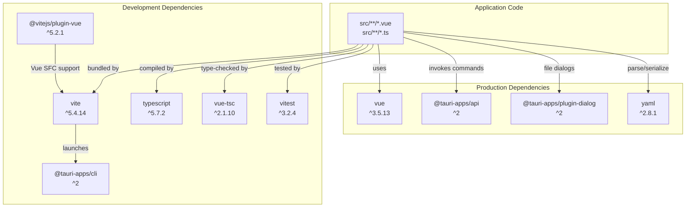
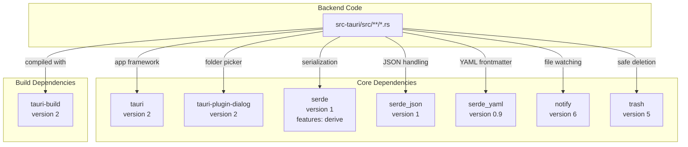
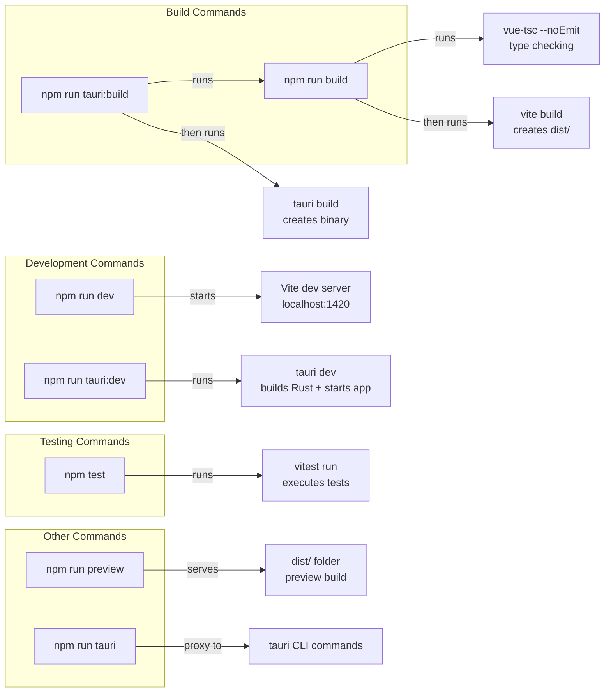
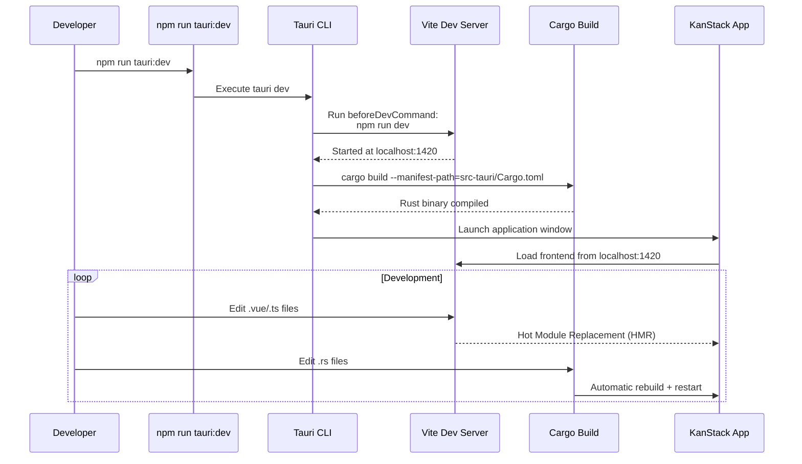
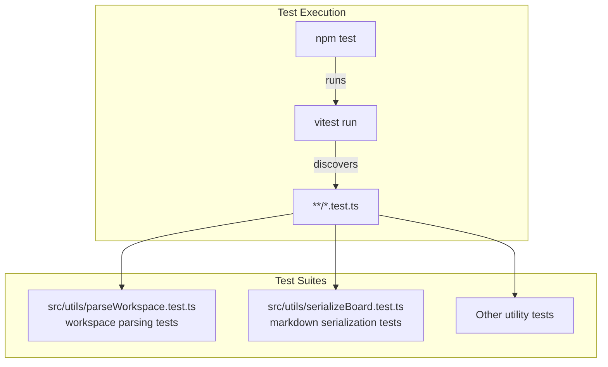
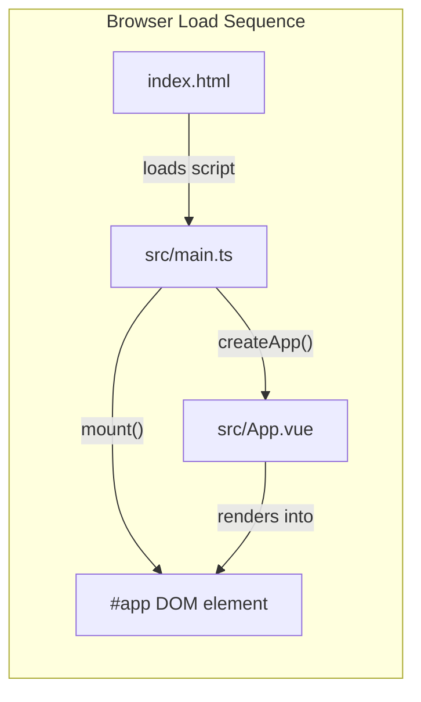
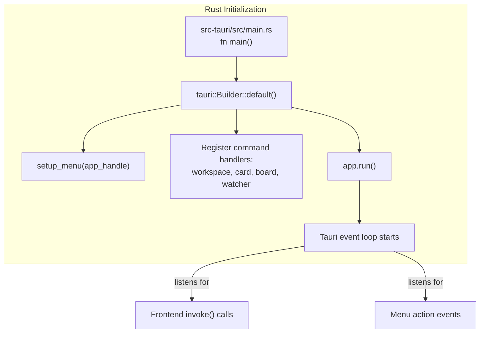

# Project Setup and Build

<details>
<summary>Relevant source files</summary>

The following files were used as context for generating this wiki page:

- [index.html](../index.html)
- [package.json](../package.json)
- [src-tauri/Cargo.toml](../src-tauri/Cargo.toml)
- [src-tauri/tauri.conf.json](../src-tauri/tauri.conf.json)
- [src/main.ts](../src/main.ts)

</details>


This page documents the development environment setup, dependency management, build configuration, and development workflow for KanStack. It covers installation of dependencies, running the application in development mode, building for production, and running tests.

For information about the overall architecture and how the build artifacts integrate, see [Architecture Overview](3-architecture-overview.md). For information about the main application entry points and initialization, see [Main Application Component](5.1-main-application-component.md) and [Main Entry Point and Menu System](6.1-main-entry-point-and-menu-system.md).

---

## Prerequisites

KanStack requires the following tools to be installed:

| Tool | Purpose | Minimum Version |
|------|---------|-----------------|
| **Node.js** | Frontend build tooling and package management | 18.x or higher |
| **npm** | JavaScript package manager | Included with Node.js |
| **Rust** | Backend compilation | 1.70+ |
| **Cargo** | Rust package manager and build tool | Included with Rust |

The project uses **Tauri 2** as the desktop application framework, which bridges the Vue.js frontend with the Rust backend. Tauri's prerequisites (system dependencies for native windowing) are automatically handled by the Tauri CLI during setup.

**Sources:** [package.json:1-29](../package.json), [src-tauri/Cargo.toml:1-27](../src-tauri/Cargo.toml)

---

## Dependency Structure

### Frontend Dependencies

The frontend is built with **Vue 3** and **TypeScript**, using **Vite** as the build tool. The dependency structure is defined in `package.json`.



**Key Frontend Dependencies:**

| Package | Version | Purpose |
|---------|---------|---------|
| `vue` | ^3.5.13 | Core UI framework, Composition API |
| `@tauri-apps/api` | ^2 | IPC bridge for invoking Rust commands |
| `@tauri-apps/plugin-dialog` | ^2 | Native file/folder picker dialogs |
| `yaml` | ^2.8.1 | YAML parsing for settings blocks |
| `vite` | ^5.4.14 | Fast development server and build tool |
| `typescript` | ^5.7.2 | Static type checking |
| `vue-tsc` | ^2.1.10 | Vue-aware TypeScript compiler |
| `vitest` | ^3.2.4 | Unit testing framework |

**Sources:** [package.json:15-28](../package.json)

---

### Backend Dependencies

The backend is written in Rust and uses the **Tauri 2** framework. Dependencies are managed by Cargo in `Cargo.toml`.



**Key Backend Dependencies:**

| Crate | Version | Purpose |
|-------|---------|---------|
| `tauri` | 2 | Desktop application framework |
| `tauri-plugin-dialog` | 2 | Native folder picker integration |
| `serde` | 1 | Serialization/deserialization framework |
| `serde_json` | 1 | JSON parsing for settings blocks |
| `serde_yaml` | 0.9 | YAML parsing for frontmatter |
| `notify` | 6 | File system change notifications |
| `trash` | 5 | Cross-platform file deletion to trash |
| `tauri-build` | 2 | Build-time code generation |

**Sources:** [src-tauri/Cargo.toml:8-18](../src-tauri/Cargo.toml)

---

## Build Scripts and Commands

KanStack provides several npm scripts for different development and build tasks. All commands are defined in `package.json` and should be executed from the project root.

### Available Commands



**Command Reference:**

| Command | Description | Use Case |
|---------|-------------|----------|
| `npm run dev` | Start Vite development server only | Frontend development without Tauri |
| `npm run tauri:dev` | Start full Tauri development environment | Full application development |
| `npm run build` | Type-check and build frontend to `dist/` | Frontend build only |
| `npm run tauri:build` | Build complete application binary | Production release |
| `npm test` | Run Vitest test suite | Execute unit tests |
| `npm run preview` | Preview production build locally | Test production build |
| `npm run tauri` | Direct access to Tauri CLI | Advanced Tauri operations |

**Sources:** [package.json:6-13](../package.json)

---

## Development Workflow

### Starting Development Mode

The primary development workflow uses the `tauri:dev` command:

```bash
npm run tauri:dev
```

This command orchestrates the following sequence:



**What Happens During `tauri:dev`:**

1. **Tauri CLI reads configuration** from `src-tauri/tauri.conf.json`
2. **Frontend dev server starts** via `beforeDevCommand` ([src-tauri/tauri.conf.json:7](../src-tauri/tauri.conf.json))
   - Vite starts at `http://localhost:1420` ([src-tauri/tauri.conf.json:9](../src-tauri/tauri.conf.json))
3. **Rust backend compiles** using development profile ([src-tauri/Cargo.toml:20-21](../src-tauri/Cargo.toml))
   - Incremental compilation enabled for faster rebuilds
4. **Application window launches** with dimensions from config ([src-tauri/tauri.conf.json:17-18](../src-tauri/tauri.conf.json))
5. **File watchers activate:**
   - Vite watches for frontend changes (HMR)
   - Cargo watches for backend changes (automatic rebuild)

**Sources:** [src-tauri/tauri.conf.json:6-11](../src-tauri/tauri.conf.json), [src-tauri/Cargo.toml:20-21](../src-tauri/Cargo.toml), [package.json:12](../package.json)

---

### Frontend-Only Development

For rapid frontend iteration without the Tauri backend:

```bash
npm run dev
```

This starts only the Vite development server. Tauri API calls will fail, but this is useful for:
- UI component development
- Layout adjustments
- CSS styling
- Testing mock data flows

The dev server runs at `http://localhost:1420` by default and provides:
- Hot Module Replacement (HMR)
- Fast refresh for Vue components
- Source maps for debugging
- TypeScript error reporting

**Sources:** [package.json:7](../package.json)

---

## Testing

KanStack uses **Vitest** for unit testing. Tests are primarily located in the frontend codebase for parsing and serialization utilities.

### Running Tests

```bash
npm test
```

This executes `vitest run`, which runs all test files matching the pattern `**/*.test.ts`.

**Test Organization:**



Vitest provides:
- Fast execution with intelligent test filtering
- TypeScript support without additional configuration
- Compatible API with Jest
- Watch mode available during development

For watch mode during development:

```bash
npx vitest
```

**Sources:** [package.json:9](../package.json), [package.json:26](../package.json)

---

## Production Build Pipeline

Building for production creates optimized, standalone application binaries for distribution.

### Building the Application

```bash
npm run tauri:build
```

This command executes a multi-stage build process:

```mermaid
graph TB
    subgraph "Build Process"
        START["npm run tauri:build"]
        
        subgraph "Frontend Build Stage"
            VUE_TSC["vue-tsc --noEmit<br/>Type checking"]
            VITE_BUILD["vite build<br/>Optimization + bundling"]
            DIST["dist/ folder<br/>Static assets"]
        end
        
        subgraph "Backend Build Stage"
            CARGO_BUILD["cargo build --release"]
            RUST_OPT["Release optimizations:<br/>opt-level=3<br/>lto=true<br/>strip=true"]
            BINARY["Compiled Rust binary"]
        end
        
        subgraph "Tauri Bundling"
            BUNDLE["tauri build<br/>Package application"]
            RESOURCES["Copy resources:<br/>Credits.html"]
            OUTPUT["Platform-specific bundles"]
        end
    end
    
    START --> VUE_TSC
    VUE_TSC -->|"passes"| VITE_BUILD
    VITE_BUILD --> DIST
    
    DIST --> CARGO_BUILD
    CARGO_BUILD --> RUST_OPT
    RUST_OPT --> BINARY
    
    BINARY --> BUNDLE
    DIST --> BUNDLE
    BUNDLE --> RESOURCES
    RESOURCES --> OUTPUT
```



**Build Pipeline Stages:**

1. **Frontend Type Checking**
   - `vue-tsc --noEmit` validates TypeScript types ([package.json:8](../package.json))
   - Build fails if type errors are found
   - No output generated (--noEmit flag)

2. **Frontend Build**
   - `vite build` creates optimized production bundle ([package.json:8](../package.json))
   - Output written to `dist/` directory ([src-tauri/tauri.conf.json:10](../src-tauri/tauri.conf.json))
   - Minification, tree-shaking, and code splitting applied

3. **Backend Compilation**
   - `cargo build --release` compiles Rust with optimizations ([src-tauri/Cargo.toml:23-26](../src-tauri/Cargo.toml))
   - **Optimization level 3**: Maximum performance optimization
   - **Link-Time Optimization (LTO)**: Cross-crate optimization
   - **Symbol stripping**: Reduces binary size

4. **Application Bundling**
   - Tauri packages the frontend and backend together
   - Platform-specific installers created (DMG for macOS, MSI for Windows, etc.)
   - Resources bundled according to config ([src-tauri/tauri.conf.json:32-34](../src-tauri/tauri.conf.json))

**Build Configuration:**

| Setting | Value | Purpose |
|---------|-------|---------|
| `beforeBuildCommand` | `npm run build` | Frontend build before bundling |
| `frontendDist` | `../dist` | Location of built frontend assets |
| `opt-level` | 3 | Maximum Rust optimization |
| `lto` | true | Link-time optimization enabled |
| `strip` | true | Remove debug symbols |

**Sources:** package.json:8,13, [src-tauri/tauri.conf.json:6-10](../src-tauri/tauri.conf.json), [src-tauri/Cargo.toml:23-26](../src-tauri/Cargo.toml)

---

## Project Entry Points

Understanding where execution begins helps navigate the codebase and debug issues.

### Frontend Entry Points



**Frontend Initialization Flow:**

1. **HTML Entry Point** ([index.html:1-12](../index.html))
   - Defines `<div id="app"></div>` mount target
   - Loads TypeScript module at `/src/main.ts`

2. **TypeScript Entry Point** ([src/main.ts:1-6](../src/main.ts))
   - Imports Vue's `createApp` function
   - Imports root `App.vue` component
   - Creates Vue application instance
   - Mounts to `#app` DOM element

3. **Root Component** (App.vue)
   - Initializes all composables (see [Composables Overview](../5.2.3-usecardeditor.md))
   - Sets up keyboard shortcuts and event handlers
   - Renders main application UI

**Sources:** [index.html:1-12](../index.html), [src/main.ts:1-6](../src/main.ts)

---

### Backend Entry Point



**Backend Initialization Flow:**

1. **Main Function** (src-tauri/src/main.rs)
   - Creates Tauri application builder
   - Registers command handlers for IPC
   - Sets up application menu
   - Starts event loop

2. **Command Registration**
   - Workspace commands: `load_workspace`, `save_board_file`, etc.
   - Card commands: `create_card`, `save_card_file`, etc.
   - Board commands: `create_board`, `delete_board`, etc.
   - Watcher commands: `watch_workspace`, `unwatch_workspace`

3. **Event Loop**
   - Handles IPC invoke calls from frontend
   - Processes menu action events
   - Manages window lifecycle

**Sources:** src-tauri/src/main.rs (referenced from context)

---

## Configuration Files

The project's behavior is controlled by several configuration files:

| File | Purpose | Key Settings |
|------|---------|--------------|
| `package.json` | Frontend dependencies and scripts | Scripts, dependency versions |
| `src-tauri/Cargo.toml` | Backend dependencies and build config | Rust dependencies, optimization profile |
| `src-tauri/tauri.conf.json` | Tauri application configuration | Window settings, build commands, bundle config |
| `vite.config.ts` | Vite build configuration | Build options, plugins (not shown in provided files) |
| `tsconfig.json` | TypeScript compiler options | Type checking rules (not shown in provided files) |

**Sources:** [package.json:1-29](../package.json), [src-tauri/Cargo.toml:1-27](../src-tauri/Cargo.toml), [src-tauri/tauri.conf.json:1-36](../src-tauri/tauri.conf.json)

---

## Common Development Tasks

### Adding a New Frontend Dependency

```bash
npm install <package-name>
npm install -D <dev-package-name>  # For dev dependencies
```

Dependencies are automatically added to `package.json`.

### Adding a New Backend Dependency

Edit `src-tauri/Cargo.toml` and add to the `[dependencies]` section:

```toml
[dependencies]
new-crate = "version"
```

Run `npm run tauri:dev` to fetch and compile the new dependency.

### Updating Dependencies

```bash
# Update frontend dependencies
npm update

# Update backend dependencies
cd src-tauri
cargo update
cd ..
```

### Clearing Build Cache

```bash
# Clear Vite cache
rm -rf node_modules/.vite

# Clear Rust build cache
rm -rf src-tauri/target

# Clear Node modules (full reinstall)
rm -rf node_modules
npm install
```

**Sources:** [package.json:1-29](../package.json), [src-tauri/Cargo.toml:1-27](../src-tauri/Cargo.toml)
